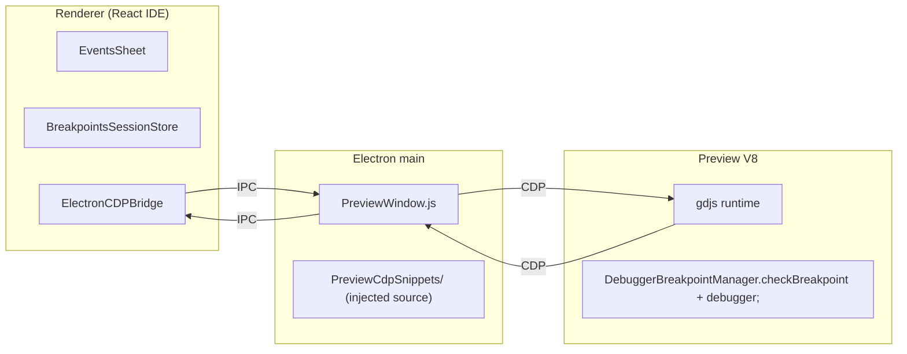

# Breakpoints — Implementation Reference

Final state of the breakpoints / pause / step feature on this branch.
Per-file roles, with the rationale behind non-obvious decisions.

## 1. Scope & constraint

- Pause / step / breakpoints work **only in local Electron preview**. Web
  and remote preview show a "use local preview" notification.
- Pausing uses V8's native `debugger;` statement, driven by the Chrome
  DevTools Protocol (CDP) attached from Electron main. The `Debugger`
  WebSocket channel is never used for pause — see [§6](#6-electron-main-previewwindowjs-mainjs).
- Breakpoint state is session-scoped (in-memory only, never persisted).

## 2. Architecture at a glance



**Outbound** (IDE → runtime): set breakpoints, resume, step,
schedule-pause. Each flows as an IPC message that Electron main turns
into a `Runtime.evaluate` whose body is a stringified function from
`newIDE/electron-app/app/PreviewCdpSnippets/`.

**Inbound** (runtime → IDE): the runtime never pushes on pause. On
`Debugger.paused`, Electron main **pulls** a snapshot
(`{ bp, dumpJson }`) via a single `Runtime.evaluate`, then forwards it
as `preview-debugger-paused` IPC to the owning renderer.

### Why CDP, not the `Debugger` WebSocket

CDP has two properties the WebSocket channel lacks, both essential
here:

- **It works while V8 is paused.** `Runtime.evaluate` executes even
  against a frozen isolate, so the IDE can read the pause payload and
  push resume / step / breakpoint updates without first releasing the
  `debugger;`. WebSocket frames sent from JS while V8 is paused are
  queued by Chromium and only flushed on resume — unusable for
  driving the pause itself.
- **It delivers V8's native pause/resume events** (`Debugger.paused`,
  `Debugger.resumed`) that the WebSocket channel does not expose.
  These are what gate the IDE's paused UI.

So every runtime-mutating breakpoint command (seed, update, resume,
step, schedule-pause) and every pause-time read flows over CDP.

## 3. C++ code generation

Files: `Core/GDCore/Events/CodeGeneration/EventsCodeGenerator.{h,cpp}`,
`GDJS/GDJS/Events/CodeGeneration/EventsCodeGenerator.{h,cpp}`,
`GDJS/GDJS/Events/CodeGeneration/MetadataDeclarationHelper.{h,cpp}`.

### What is emitted

For each executable, non-disabled event the generator assigns a
sequential **flat DFS index** and prepends:

```js
if (runtimeScene && runtimeScene.getBreakpointManager().checkBreakpoint("gdjs.LevelCode", 3, runtimeScene)) debugger;
```

Each generated events-function body is wrapped in a push/pop so the
runtime can track the currently executing namespace (used by the
stepping FSM):

```js
if (runtimeScene) runtimeScene.getBreakpointManager().pushBreakpointFunction("gdjs.LevelCode");
try { /* events */ } finally {
  if (runtimeScene) runtimeScene.getBreakpointManager().popBreakpointFunction();
}
```

`getBreakpointManager()` is defined on `RuntimeInstanceContainer` (the
base of both `RuntimeScene` and the custom-object sub-container), so the
same emitted call works whether `runtimeScene` is a scene or a
sub-container. It returns the game-level `DebuggerBreakpointManager`,
which records the right calling container from the passed argument.

The push is emitted **after** `functionPreEventsCode` because
object-method preludes declare `var runtimeScene = this._instanceContainer;`
there — pushing earlier would hit a var-hoisted `undefined`, silently
no-op, leave custom-object calls at the wrong depth, and break the
FSM's depth check.

The `runtimeScene &&` / `if (runtimeScene)` guard is required because
that local can still be `undefined` during custom-object construction —
same guard the profiler code uses.

### Design notes

- Flat index is stamped at the **top** of each event's loop iteration
  in `GenerateEventsListCode`, **before** the scope-begin brace and
  before any object-list declarations. Pausing mid-declaration would
  skip work that subsequent events rely on.
- Synthetic `AsyncEvent` wrappers inserted by `PreprocessAsyncActions`
  do **not** call `checkBreakpoint` — they don't appear in the
  user-authored tree, so the IDE's DFS walker naturally stays aligned.
- `MetadataDeclarationHelper` exposes the `functionId`-computing
  helpers to JS via Emscripten (`STATIC_*` shims in `Bindings.idl`):
  `GetSceneCodeNamespace`, `GetExtensionCodeNamespacePrefix`,
  `GetFreeFunctionCodeNamespace`, and
  `GetObjectEventsFunctionFullyQualifiedContextName` (custom / events-
  based object methods — `<objCodeNs>.<obj>.prototype.<mangledFn>Context`).
  The IDE uses them to compute `functionId` values that exactly match
  what the generator stamps.

### `compilationForRuntime` gate

Breakpoint/profiler code is skipped when `GenerateCodeForRuntime()` is
true. Flipped in
`newIDE/app/src/EventsFunctionsExtensionsLoader/index.js`.

| Code kind                | Runtime mode | Breakpoints?                                                                                         |
| ------------------------ | ------------ | ---------------------------------------------------------------------------------------------------- |
| Scene layouts            | `false`      | yes                                                                                                  |
| Free extension functions | `false`      | yes                                                                                                  |
| Custom object methods    | `false`      | yes (via the sub-container's `getBreakpointManager()`)                                               |
| Behavior methods         | `true`       | **no** — lifecycle hooks may not have `runtimeScene` in scope, and behaviors ship to the marketplace |

## 4. Runtime (GDJS / TypeScript)

Files: `GDJS/Runtime/runtimegame.ts`, `runtimescene.ts`,
`RuntimeInstanceContainer.ts`, `oncetriggers.ts`,
`breakpointDebugSupport.ts`, `types/global-preview-debug.d.ts`,
`debugger-client/abstract-debugger-client.ts`.

### Debug surface — one class for everything

All pause/step/breakpoint state lives on a single game-level
`gdjs.DebuggerBreakpointManager` (`breakpointDebugSupport.ts`), reached
via `runtimeScene.getBreakpointManager()`. It is created lazily by
`RuntimeGame.getBreakpointManager()` and held on `RuntimeGame._breakpointManager`
(null until first use). The generated breakpoint calls only exist in
preview, so exported games never create one.

Manager state (all private fields):

```ts
{
  _cdpAttached: boolean,            // from RuntimeGameOptions.cdpDebuggerEnabled
  _breakpointIndices: Map<functionId, Set<flatIndex>> | null,
  _stepNextEvent: boolean,
  _stepPassedCurrentEvent: boolean,
  _stepCurrentEventIndex: number,
  _stepCurrentFunctionId: string,
  _stepStartDepth: number,
  _functionStack: string[],         // active namespaces, for stepping depth
  _lastBreakpoint: { functionId, eventIndex, sceneName } | null,
  _lastBpCallingContainer: RuntimeInstanceContainer | RuntimeScene | null,
}
```

The preview-facing API surfaces under the `gdjs.BreakpointDebugger` namespace
(also in `breakpointDebugSupport.ts`): `game`, `buildDumpJson`,
`setBreakpoints`, `programStepping`, `schedulePauseAtNextEvent`,
`readPauseState`. The Electron CDP snippets are thin wrappers that call
these — the debug logic lives in the runtime, callable straight from
the Chrome debugger.

The only remaining true global is `window.__gdjsInitialBreakpoints`,
declared in `GDJS/Runtime/types/global-preview-debug.d.ts`:

| Symbol                            | Set by               | Read by                                          |
| --------------------------------- | -------------------- | ------------------------------------------------ |
| `window.__gdjsInitialBreakpoints` | CDP bootstrap script | `DebuggerBreakpointManager.consumeInitialBreakpoints()` |

`window` is used here because the bootstrap script runs (via
`addScriptToEvaluateOnNewDocument`) **before** `gdjs` is defined — it is
the only carrier available that early. CDP-attached state, which used to
be the `gdjs.__cdpAttached` global, now travels typed through
`RuntimeGameOptions.cdpDebuggerEnabled` and is cached on the manager's
`_cdpAttached`.

### `installBreakpointDebugSupport` (`breakpointDebugSupport.ts`)

A free function, not a method — to keep the install logic off the
`RuntimeGame` interface. Called once from the `RuntimeGame` constructor,
gated on `_isPreview`. Does two things:

1. Publishes `gdjs.BreakpointDebugger.game = this` and installs
   `gdjs.BreakpointDebugger.buildDumpJson` — a compact dump builder used by
   Electron main on `Debugger.paused`.
2. Calls `getBreakpointManager().consumeInitialBreakpoints()`, which
   applies `window.__gdjsInitialBreakpoints` (if the CDP bootstrap
   script ran before this constructor) synchronously — so frame-0 events
   (`At beginning of scene`, `TriggerOnce` fan-outs) already honour
   breakpoints — then deletes the entry so a reload cannot double-apply
   it.

The dump builder serialises only what the IDE tooltip path consumes —
see [§5](#5-ide-renderer-integration) — and uses a `JSON.stringify` replacer that converts `Map` to a
plain object (the extension-variables containers are `Map`s).

### `checkBreakpoint(functionId, eventIndex, container)` on the manager

Hot path. Returns `true` ⇔ V8 should `debugger;`. Arms on either:

1. **Breakpoints** — membership test in `_breakpointIndices`.
2. **Stepping FSM** — when `_stepNextEvent` is set, matches the
   currently-focused event/function (immediate step) or any event at
   the same call-stack depth after the focus has been "passed".

Early-returns `false` when `_cdpAttached` is false — no CDP means
`debugger;` is a no-op, so walking the FSM is wasted work.

### `pushBreakpointFunction` / `popBreakpointFunction`

Maintain `_functionStack` — the list of namespaces currently executing
events. The stepping FSM uses it to detect scope changes. Generated code
for scenes and custom objects calls them uniformly via
`getBreakpointManager()`.

### `_triggerBreakpoint(functionId, eventIndex, container)` (private)

The **only** work done on the hot path before returning `true`:

- Stashes `{ functionId, eventIndex, sceneName }` (scene name read from
  `container.getScene().getName()`) on `_lastBreakpoint`.
- Stashes the passed `container` on `_lastBpCallingContainer`.

Building the runtime dump here would block the `debugger;` that
follows and add hundreds of milliseconds to press-key-to-pause
latency. The dump is built lazily by Electron main after V8 freezes —
see [§6](#6-electron-main-previewwindowjs-mainjs).

### Calling container capture

Scene events execute on the scene directly. Custom-object methods run
inside the object's own `RuntimeInstanceContainer`; generated code calls
`this._instanceContainer.getBreakpointManager().checkBreakpoint(..., this._instanceContainer)`.
Because the executing container is passed as the third argument,
`_triggerBreakpoint` records it directly as `_lastBpCallingContainer` —
the scene for scene events, the sub-container for custom-object methods.
No post-hoc override and no overhead on the vast majority of calls that
return `false`.

### End-of-frame stepping cleanup (`renderAndStep` → `manager.onFrameEnd()`)

After a scene's events run, `renderAndStep` calls
`_breakpointManager.onFrameEnd()` (if a manager exists). If the frame
finished with `_stepNextEvent` still armed (target function never ran,
or events ended early):

- **Extension scope** — disarm and let the game keep running.
- **Scene scope** — reset focus to "stop at first event" so stepping
  carries into the next frame.

When a breakpoint actually fires, `checkBreakpoint` already cleared
`_stepNextEvent` before returning `true`, so this branch only handles
misses.

### `abstract-debugger-client.ts`

No breakpoint-related handlers. The only breakpoint-adjacent change is
that the `play` WS handler toggles `runtimeGame.pause` only — it does
not touch the stepping FSM.

## 5. IDE (renderer) integration

### `BreakpointsSessionStore.js`

Module-level `Map<eventsListPtr, { events, functionId, breakpoints }>`:

- Survives EventsSheet remounts (tab close/reopen, scope switch) for
  the lifetime of the editor process.
- Entries keep a live `gdEventsList` + the scope's `functionId` so the
  store can rebuild the flat-index payload for **every** sheet that has
  breakpoints — not just the currently mounted one.
- Exports the shared DFS walker `walkEventsInGeneratorOrder` (matches
  the C++ generator order: skip disabled / non-executable events).
  EventsSheet imports the same walker so IDE flat indices cannot drift
  from runtime ones.

### `EventsSheet/index.js`

- Toggling a breakpoint updates the session store and pushes the full
  session payload to the runtime via `setPreviewBreakpointsViaCdp`.
  The payload is session-wide (authoritative replacement) and is sent
  **even when empty** — otherwise removing the last breakpoint would
  not propagate, and the runtime would keep stopping on stale entries.
- Initial breakpoints at preview launch are seeded via CDP ([§6](#6-electron-main-previewwindowjs-mainjs)); there
  is no WS-based bootstrap and EventsSheet never subscribes to the WS
  `PreviewDebuggerServer` — breakpoints don't need it.
- Pause-UI state (red frame, variable tooltips) is driven exclusively
  by `onPreviewDebuggerPauseChange`. WS `breakpoint.hit` / `dump` are
  not sent by the runtime.
- Resume / step / schedule-pause buttons call the `ElectronCDPBridge`
  APIs directly. They assume CDP is attached, which is guaranteed by
  the UI only offering them in local Electron preview.
- The "Paused in debugger" toast is draggable. Drag state is kept
  outside React state to avoid re-rendering the whole sheet on every
  mousemove, committing only the final position.
  `pausedToastPosition` is **persisted across pauses and resumes**
  within the same preview session — neither `_applyBreakpointHit` nor
  `_clearPausedState` touches it — so once the user places the toast,
  it stays there for every subsequent hit. Reset in two cases:
  - the sheet unmounts (tab close / project switch);
  - the preview window is closed, via the new `preview-debugger-closed`
    IPC (below). This covers the "user resumes manually, then closes
    the preview" flow: without the reset, the dragged position would
    bleed into the next preview session where the underlying layout
    may have shifted.

### `EventsTree/index.js`

Renders the red breakpoint dot and the paused-on-event frame. Styles
are consolidated in the module-level `styles` object under a shared
`BREAKPOINT_ACCENT_COLOR` constant.

### `Debugger/RuntimeVariablesContext.js` + `EventsSheet/ParameterFields/VariableField.js`

On each `preview-debugger-paused` IPC, `EventsSheet` parses the inline
`dumpJson` and extracts a structured runtime variables map:

- **Global / scene variables** — from `runtimeGame._variables` /
  `sceneStack[top]._variables`.
- **Extension-scoped variables** — from
  `runtimeGame._variablesByExtensionName` and the per-scene equivalent.
  These are `Map`s, which don't serialize to JSON natively — the dump
  builder's replacer converts them to plain objects.
- **Scene-level locals** — from the top-level `activeLocalVariables`
  field that the dump builder adds alongside `payload`. It walks every
  `gdjs[key]` whose value has a non-empty `.localVariables` push/pop
  stack (populated by generated `Declare local variable` code) and
  records it under the key `"gdjs." + key`. The IDE picks the stack
  matching the sheet's code namespace (computed via
  `MetadataDeclarationHelper.getSceneCodeNamespace` for scene sheets)
  and walks it **top-down** so inner `Declare local` scopes shadow
  outer ones — mirroring runtime resolution.
- **Object variables** — from the paused scene's `objectVariablesByName`
  field. The dump builder walks the **calling container's**
  `_instances.items` (picked up from the manager's
  `getLastBpCallingContainer()` — the scene for scene events, the owning
  custom object for
  custom-object methods) and records the first live instance's
  `_variables` per object name.

  The `objectvar` parameter value only carries the variable path
  (`objnumber`, `objnumber.child`), not the object name.
  `EventsTree/Instruction.js` pre-computes `lastObjectNamePerParameter`
  for each instruction — for every parameter it records the most
  recent preceding `object`-typed parameter value, detected via
  `gd.ParameterMetadata.isObject` — and passes it to
  `ParameterRenderingService.renderInlineParameter` as `lastObjectName`.
  `VariableField.renderVariableWithIcon` forwards that to
  `lookupRuntimeVariable(scope='object', …, objectName)`, which resolves the
  root against `map.object[objectName]` and walks any trailing
  `.<child>` segments as structure access.

- **Extension-function locals** are intentionally not surfaced — their
  container lives on the per-call `eventsFunctionContext` and is not
  reachable from globals. The tooltip falls back to the generic
  "variable" label.

The dump is **minimal** — only the fields above, mirroring the shape
`extractVariablesFromDump` consumes. No renderer internals, no scene
stack beyond the top, at most one live instance per object. That keeps
the payload in the tens of KB instead of the tens of MB a full
`sendRuntimeGameDump` produces — critical because the dump round-trip
gates the IDE's paused UI. The Debugger panel's `refresh` WS command
still uses the full `sendRuntimeGameDump` when explicitly requested.

### `ElectronCDPBridge.js`

Thin renderer-side wrapper over `ipcRenderer.invoke`/`on`:

- `resumePausedPreview()` → `preview-debugger-resume` IPC.
- `stepPausedPreview({ currentEventIndex, currentFunctionId })` →
  `preview-debugger-step` IPC.
- `schedulePauseAtNextEvent()` → `preview-debugger-schedule-pause` IPC
  (F10 while the preview is running but not yet paused).
- `setPreviewBreakpointsViaCdp(breakpoints)` →
  `preview-debugger-set-breakpoints` IPC — the single authoritative
  push channel for breakpoint state.
- `onPreviewDebuggerPauseChange(listener)` — subscribes to both
  `preview-debugger-paused` and `-resumed` IPC events with one
  callback `(isPaused, payload?)`. `payload` carries
  `{ breakpoint, dumpJson }` where `breakpoint` is the manager's
  `_lastBreakpoint` and `dumpJson` is the dump string — both produced by
  `gdjs.BreakpointDebugger.readPauseState()` in one `Runtime.evaluate` on
  `Debugger.paused`.

  A module-level cache of the latest `{ isPaused, payload }` replays
  it on the next microtask to any subscriber that attaches while the
  preview is already paused. This covers the case where `EventsSheet`
  is mounted as a *side effect* of breakpoint navigation (MainFrame
  opens the target extension-function tab in response to
  `preview-debugger-paused`): without the replay, the sheet would
  subscribe strictly after the IPC was delivered and never paint the
  red frame or tooltips.

- `onPreviewDebuggerClosed(listener)` — subscribes to
  `preview-debugger-closed` IPC, emitted once by Electron main when
  the preview window's CDP session detaches (preview closed, renderer
  gone, explicit detach). Unlike `-resumed`, this fires regardless of
  whether the session was paused at close time, so the IDE can reset
  per-session ephemeral UI (currently `pausedToastPosition`).

- `isElectronCDPBridgeAvailable()` — `true` iff `ipcRenderer` is
  present. UIs that expose pause/step gate on this and surface a "use
  local preview" alert otherwise.

### Toolbar / shortcuts / commands

- `F9` — toggle breakpoint
- `F10` — resume / pause
- `Shift+F10` — step next event

Wired through `DefaultShortcuts`, `ToolbarCommands`, `MainFrameCommands`,
and `CommandPalette/CommandsList`.

## 6. Electron main (`PreviewWindow.js`, `main.js`)

### Injected source lives in `PreviewCdpSnippets/`

Each chunk of code shipped into the preview V8 is a plain `.js` file —
lintable, testable, and free of template-string escape hell:

Except for `cdpEval.js`, each snippet is now a **thin wrapper** over a
`gdjs.BreakpointDebugger.*` runtime method — the logic lives in
`breakpointDebugSupport.ts` and the snippet just guards on `gdjs` /
`gdjs.BreakpointDebugger` and forwards the call:

| File                                   | Purpose                                                                                                                                         |
| -------------------------------------- | ----------------------------------------------------------------------------------------------------------------------------------------------- |
| `cdpEval.js`                           | `serializeFunctionForCdp(fn, args)` — turns a function + JSON args into a `Runtime.evaluate` expression.                                         |
| `bootstrapPreviewCdp.js`               | Runs before the game script: seeds `window.__gdjsInitialBreakpoints` (early path) and calls `gdjs.BreakpointDebugger.setBreakpoints` if the game is already running (late path). |
| `readBreakpointPauseState.js`          | Evaluated on `Debugger.paused`; calls `gdjs.BreakpointDebugger.readPauseState()` → `{ bp, dump }` JSON.                                                    |
| `setBreakpointsInPreview.js`           | Calls `gdjs.BreakpointDebugger.setBreakpoints(entries)` for every session-breakpoints push.                                                               |
| `programSteppingInPreview.js`          | Calls `gdjs.BreakpointDebugger.programStepping(...)` before `Debugger.resume`.                                                                             |
| `schedulePauseAtNextEventInPreview.js` | Calls `gdjs.BreakpointDebugger.schedulePauseAtNextEvent()` on a *running* preview.                                                                         |

`PreviewWindow.js` imports these and uses `serializeFunctionForCdp` to
inject them; the file itself carries no inline JS source.

### CDP attach flow

On preview window creation:

1. `wc.debugger.attach('1.3')` — synchronous; puts the inspector in
   place before `loadURL` starts page parsing.
2. `loadURL` fires **immediately** (fire-and-forget, *not* awaiting
   the CDP setup chain below). `Page.addScriptToEvaluateOnNewDocument`
   can hang silently (Electron debugger quirks / target state), so
   awaiting it would risk leaving the preview window black forever
   with no error surfaced.
3. In parallel, async CDP setup:
   - `Runtime.enable` — so `Runtime.executionContextCreated` is
     delivered.
   - `Debugger.enable`.
   - `Page.addScriptToEvaluateOnNewDocument` with the bootstrap source
     (fast path: future documents get the script before their first
     JS runs).
4. Debugger message listener — a `switch (method)` dispatcher:
   - `Runtime.executionContextCreated`: push the bootstrap via
     `Runtime.evaluate` in that context (late path: covers the race
     where the context is created before `addScript` registers).
   - `Debugger.paused`: run `readBreakpointPauseState`, forward as
     `preview-debugger-paused` IPC.
   - `Debugger.resumed`: forward as `preview-debugger-resumed` IPC.

### Building the pause dump lazily

```js
// readBreakpointPauseState.js, evaluated on Debugger.paused
if (typeof gdjs === 'undefined' || !gdjs.BreakpointDebugger) return '';
return gdjs.BreakpointDebugger.readPauseState();
// gdjs.BreakpointDebugger.readPauseState (runtime):
//   bp   = manager.getLastBreakpoint()
//   dump = gdjs.BreakpointDebugger.buildDumpJson()  (guarded; '' on throw)
//   → JSON.stringify({ bp, dump })
```

Executing the dump *here* (after V8 is paused) instead of inside
`_triggerBreakpoint` (before `debugger;` runs) is the critical
press-key-to-pause optimisation: the hot-path work is just setting
one pointer on the manager, and the multi-hundred-ms serialization
happens off-the-critical-path while the CDP round-trip is already
in flight.

### Step semantics

V8 pauses on `debugger;` which sits **after** `checkBreakpoint(N)` —
event `N` has been "passed" by the FSM but its body has not run yet.
For a step originating from a known `currentEventIndex`, the bridge
pre-flips `_stepPassedCurrentEvent = true` via `Runtime.evaluate`
(executing `programSteppingInPreview` → `gdjs.BreakpointDebugger.programStepping`)
before issuing `Debugger.resume`, so the next `checkBreakpoint` trips at
depth `N+1` (a sub-event of `N`) or at sibling `N+1`.

A raw pause (F10 with no current event) leaves `_stepPassedCurrentEvent`
as `false` so the `_stepCurrentEventIndex < 0` branch inside
`checkBreakpoint` stops on the next visited event.

### Resume

Plain `Debugger.resume`. The step-FSM fields were programmed by the
caller before pausing (step) or are irrelevant for a plain resume;
`renderAndStep`'s end-of-frame wrap-around clears leftovers on the next
frame if nothing trips them.

### Schedule pause at next event

Invoked by F10 while the preview is not paused. Calls
`gdjs.BreakpointDebugger.schedulePauseAtNextEvent()` (→ manager) in the *running*
V8 via `Runtime.evaluate` — no `Debugger.resume` is issued because V8 is
not paused. It arms the step-FSM (`_stepNextEvent = true`, raw-pause
payload) and calls `game.pause(false)` so a Debugger-panel-Pause held
from an earlier interaction does not keep the render loop dormant.

### Detach = synthetic `-resumed` + `-closed`

CDP itself does not emit `Debugger.resumed` on `wc.debugger.detach`, so
`PreviewWindow.js` emits:

- `preview-debugger-resumed` IPC — so a paused `EventsSheet` clears
  its red frame and tooltips when the preview window dies mid-pause.
- `preview-debugger-closed` IPC — fired regardless of pause state, so
  the IDE can reset per-session ephemeral UI (see [§5](#5-ide-renderer-integration), toast position).

## 7. `MainFrame/index.js` & `LocalPreviewLauncher/index.js`

- Renderer ↔ preview-window routing is handled **in Electron main**
  (`cdpSessions` keyed by preview `windowId`, each entry carrying
  `parentWindowId`; `sendToParent` forwards
  `preview-debugger-paused` / `-resumed` IPC to the owning renderer's
  `webContents`). `MainFrame` does not track preview windows.
- `MainFrame` subscribes once to `onPreviewDebuggerPauseChange` and
  keeps `previewPausedRef`, `lastHitEventIndexRef`,
  `lastHitFunctionIdRef` in sync. The `TOGGLE_PAUSE_EXECUTION` (F10)
  and `STEP_NEXT_EVENT` (Shift+F10) commands read these refs to
  dispatch between `resumePausedPreview`, `schedulePauseAtNextEvent`
  and `stepPausedPreview`. When `!isElectronCDPBridgeAvailable()` both
  commands surface a "use local preview" alert instead.
- On a breakpoint hit, `MainFrame` routes the user to the correct
  editor: scene layouts open via `openLayout`; extension-scoped hits
  (`functionId.startsWith('gdjs.evtsExt__')`) are matched against
  every free function (`getFreeFunctionCodeNamespace`) and every
  custom-object method
  (`getObjectEventsFunctionFullyQualifiedContextName`) until a
  namespace matches, then focused via `focusOnExtensionFunction` —
  which either switches to the already-open tab via
  `selectEventsFunctionByName` or calls `openEventsFunctionsExtension`.
  Behavior methods are never matched (they're compiled with
  `compilationForRuntime: true` and emit no breakpoint checks).
- Safety net: `MainFrame` also subscribes to
  `previewDebuggerServer.registerCallbacks` and resets the pause refs
  on `onConnectionClosed` / `onConnectionOpened`. The Electron-main
  detach handler already emits the synthetic `-resumed` IPC for the
  same scenario, so this is a belt-and-braces fallback.
- `LocalPreviewLauncher` calls `buildAllBreakpointsPayload()` right
  before `ipcRenderer.invoke('preview-open', ...)` and passes the
  result as the `initialBreakpoints` option so Electron main can
  inject it via `Page.addScriptToEvaluateOnNewDocument`.

## 8. Known limitations

- **No breakpoints in behavior methods.** By design — see [§3](#3-c-code-generation).
- **Extension function local variables are not resolved in tooltips.**
  Their container lives on the per-call `eventsFunctionContext` and
  isn't reachable from globals, so the dump cannot surface them. The
  tooltip falls back to the generic "variable" label.
- **Object-variable tooltips show the first live instance only.** With
  more than one instance in the calling container, the tooltip shows
  `items[0]` only. Per-picked-instance resolution would require
  walking the current function's
  `prototype.<fn>Context.GD<Object>ObjectsN` picked lists. Out of
  scope for the current MVP; the Debugger panel remains the place to
  inspect all instances.
- **Object variables inside expression parameters are not resolved.**
  Only the `objectvar` parameter kind goes through
  `VariableField.renderVariableWithIcon`. References of the form
  `Object.variable` inside string/number **expression** parameters
  (e.g. the value side of `SetNumberVariable`) are rendered by
  `ExpressionField` as tokens and do not hit the runtime-variables
  lookup path.
- **External preview modes** (web / remote browser) show pause UI
  stubs that lead to a "use local preview" notification. Implementing
  them would require a matching CDP-equivalent transport.
