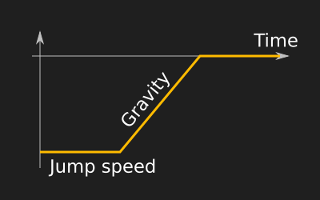
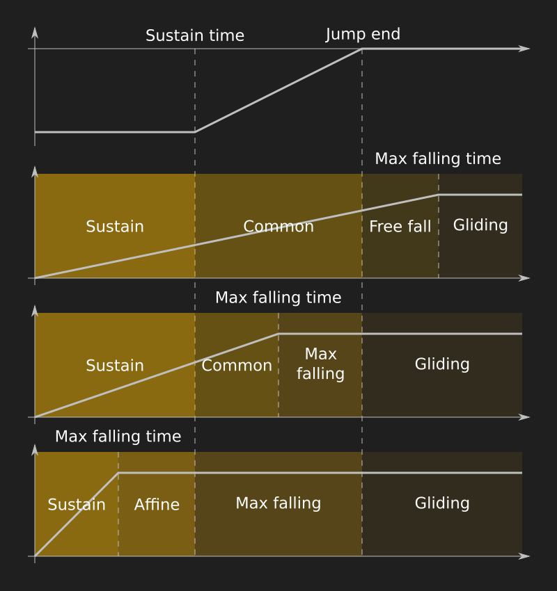

# Platformer Extension technical documentation

## Floor following

### Horizontal search

When the character walks on a platform, he must follow its slope.
The `slopeMaxAngle` property is used to calculate how much the character can move vertically to follow it.
If the platform is too high, the platform is considered to be an obstacle and the character will stop before it.

When there is no obstacle detected by the horizontal search, the movement is done in 1 step and the vertical search is done at the new `x` position.

[](./diagrams/SlopeFollowingRequestedDeltaX.svgz)

Otherwise, when there is a junction, 2 vertical searches are done:

- one before a potential obstacle (in pink)
- one at the end of the movement

[](./diagrams/SlopeFollowingClimbFactor.svgz)

This allows to calculate the right slope angle. Indeed, in one step, the angle could appear lower (the dotted line).
Which means that the character could climb it during 1 frame and then stop.

[](./diagrams/SlopeFollowingClimbFactorMean.svgz)

For further details on the implementation, please take a look at the comments in:

- the function `gdjs.PlatformerObjectRuntimeBehavior._moveX`
- the function `gdjs.PlatformerObjectRuntimeBehavior.OnFloor.beforeMovingY`

### Vertical search

The aim of the vertical search is to find the highest platform where the character can land.
There are 2 constraints:

- `allowedMinDeltaY` how much the character can go upward
- `allowedMaxDeltaY` how much the character can go downward

During the search, these 2 constraints can tighten around the character.
If they become incompatible, it means that the character can't go through the hole,
it will go back to its original position and lose its speed.

There are also more obvious obstacles that cover the character in the middle and end the search directly.

[](./diagrams/SlopeFollowingResult.svgz)

Obstacles can eventually encompass the character. So, platforms edges don't have any collision with character.
To detect such cases, 2 flags are used:

- `foundOverHead` when an edge is over `headMaxY`
- `foundUnderHead` when an edge is under `floorMinY`

[](./diagrams/SlopeFollowingContext.svgz)

For further details on the implementation, please take a look at the comments in:

- the function `gdjs.PlatformerObjectRuntimeBehavior._findHighestFloorAndMoveOnTop`
- the class `gdjs.PlatformerObjectRuntimeBehavior.FollowConstraintContext`

## Jump trajectory

### Sequential calculus of the engine

The engine uses the previous speeds and positions to evaluate the new ones (with Verlet integrations). This is fast for sequential access and it's a good fit for what the engine does.

The model doesn't follow the laws of physics and this is fine because more realism doesn't mean more fun. Internally, it uses 2 independent speeds:

- the current jumping speed `currentJumpSpeed`
- the current falling speed `currentFallSpeed`

Note that in the engine `currentJumpSpeed` is actually an absolute speed but it's easier to visualize as a negative value as it is subtracted to `currentFallSpeed`.

The jump speed stays at its initial value while the jump is sustained. Then, it decreases (in absolute) according to the gravity until it reaches 0 and stays constant until the end.
The falling speed starts at 0 and increase according to the gravity, as soon as the jump start. Until, it reaches the maximum falling speed and stays constant until the end too.

[](./diagrams/JumpSpeed.svgz) [](./diagrams/FallingSpeed.svgz)

### Requests solving and random access

#### Why a continuous model?

A function allows to get a position for any given time without calculating every previous positions.

#### Polynomial piece-wise function

The character trajectory during a jump looks like a quadratic function, but it's actually a piece-wise function.

On this first trajectory example, the curve almost follows the quadratic function in white, but it actually follows the grey ones at the start and the end of the jump. There is also an affine part at the end of the jump. It's not shown on this plot because it happens later on.


This example of trajectory shows the 4 functions. It has an affine part in the middle instead of a quadratic one like in the previous example. In practice, this jump trajectory will seem off, but a tiny affine part can happen in some configurations.


The piece-wise function has 3 borders:

- at the end of the jump sustaining (jumpSustainTime)
- when the maximum falling speed is reached (maxFallingTime)
- when the jump speed reach 0 (jumpEndTime)

Depending on the when the maximum falling speed is reached, there can be 3 piece-wise functions:

- after the jump end
  - sustain case
  - common case
  - free fall case
  - gliding case
- before the jump end and after the sustaining
  - sustain case
  - common case
  - max falling case
  - gliding case
- during the sustaining
  - sustain case
  - affine case
  - max falling case
  - gliding case

[](./diagrams/JumpCases.svgz)

#### SageMath model

The following model is written for [SageMath](https://www.sagemath.org/), an open-source mathematics software system.

```Python
# First define the jump and falling functions #

currentFallingSpeed(t, gravity) = gravity * t
fallingX(t, gravity) = integral(currentFallingSpeed(t, gravity), t)
maxFallingTime(gravity, maxFallingSpeed) = solve([currentFallingSpeed(t, gravity)==maxFallingSpeed],t)[0].rhs()
fallEndedX(t, gravity) = fallingX(maxFallingTime(gravity, maxFallingSpeed), gravity) + maxFallingSpeed * (t - maxFallingTime(gravity, maxFallingSpeed))

currentJumpSpeed(t, gravity, jumpSpeed, jumpSustainTime) = -jumpSpeed + gravity * (t - jumpSustainTime)
sustainedX(t, jumpSpeed) = -jumpSpeed * t
jumpingX(t, gravity, jumpSpeed, jumpSustainTime) = sustainedX(jumpSustainTime, jumpSpeed) + integral(currentJumpSpeed(t, gravity, jumpSpeed, jumpSustainTime), t, jumpSustainTime, t)
jumpEndTime(gravity, jumpSpeed, jumpSustainTime) = jumpSustainTime + jumpSpeed / gravity
jumpEndedX(t, gravity, jumpSpeed, jumpSustainTime) = jumpingX(jumpEndTime(gravity, jumpSpeed, jumpSustainTime), gravity, jumpSpeed, jumpSustainTime)


# t < jumpSustainTime && t < maxFallingTime #

sustainCaseSpeed(t, gravity, jumpSpeed) = -jumpSpeed + currentFallingSpeed(t, gravity)
sustainCaseHeight(t, gravity, jumpSpeed) = sustainedX(t, jumpSpeed) + fallingX(t, gravity)
sustainCasePeakTime(gravity, jumpSpeed, jumpSustainTime) = solve([sustainCaseSpeed(t, gravity, jumpSpeed)==0], t)[0].rhs()
sustainCasePeakHeight(gravity, jumpSpeed, jumpSustainTime) = sustainCaseHeight(sustainCasePeakTime(gravity, jumpSpeed, jumpSustainTime), gravity, jumpSpeed, jumpSustainTime)


# jumpSustainTime < t && t < maxFallingTime && t < jumpEndTime #

commonCaseSpeed(t, gravity, jumpSpeed, jumpSustainTime) = currentJumpSpeed(t, gravity, jumpSpeed, jumpSustainTime) + currentFallingSpeed(t, gravity)
commonCaseHeight(t, gravity, jumpSpeed, jumpSustainTime) = jumpingX(t, gravity, jumpSpeed, jumpSustainTime) + fallingX(t, gravity)
commonCasePeakTime(gravity, jumpSpeed, jumpSustainTime) = solve([commonCaseSpeed(t, gravity, jumpSpeed, jumpSustainTime)==0], t)[0].rhs()
commonCasePeakHeight(gravity, jumpSpeed, jumpSustainTime) = commonCaseHeight(commonCasePeakTime(gravity, jumpSpeed, jumpSustainTime), gravity, jumpSpeed, jumpSustainTime)


# jumpSustainTime < t && maxFallingTime < t && t < jumpEndTime #

maxFallingCaseSpeed(t, gravity, jumpSpeed, jumpSustainTime, maxFallingSpeed) = currentJumpSpeed(t, gravity, jumpSpeed, jumpSustainTime) + maxFallingSpeed
maxFallingCaseHeight(t, gravity, jumpSpeed, jumpSustainTime, maxFallingSpeed) = jumpingX(t, gravity, jumpSpeed, jumpSustainTime) + fallEndedX(t, gravity)
maxFallingCasePeakTime(gravity, jumpSpeed, jumpSustainTime, maxFallingSpeed) = solve([maxFallingCaseSpeed(t, gravity, jumpSpeed, jumpSustainTime, maxFallingSpeed)==0], t)[0].rhs()
maxFallingCasePeakHeight(gravity, jumpSpeed, jumpSustainTime, maxFallingSpeed) = maxFallingCaseHeight(maxFallingCasePeakTime(gravity, jumpSpeed, jumpSustainTime, maxFallingSpeed), gravity, jumpSpeed, jumpSustainTime, maxFallingSpeed)

# maxFallingTime < t && t < jumpSustainTime #
# in this case the speed is constant (-jumpSpeed + maxFallingSpeed) there is no strict maximum. #

affineCaseSpeed(t, jumpSpeed, maxFallingSpeed) = -jumpSpeed + maxFallingSpeed
affineCaseHeight(t, gravity, jumpSpeed, maxFallingSpeed) = sustainedX(t, jumpSpeed) + fallEndedX(t, gravity)


# jumpEndTime < t && maxFallingTime < t #
# This is a strictly descending phase, the peak can't happen here #

glidingCaseSpeed(t, maxFallingSpeed) = maxFallingSpeed
glidingCaseHeight(t, gravity, jumpSpeed, jumpSustainTime, maxFallingSpeed) = jumpEndedX(t, gravity, jumpSpeed, jumpSustainTime) + fallEndedX(t, gravity)


# jumpEndTime < t && t < maxFallingTime #
# This is a strictly descending phase, the peak can't happen here #

freeFallCaseSpeed(t, gravity) = currentFallingSpeed(t, gravity)
freeFallCaseHeight(t, gravity, jumpSpeed, jumpSustainTime, maxFallingSpeed) = jumpEndedX(t, gravity, jumpSpeed, jumpSustainTime) + fallingX(t, gravity)
```

#### Find the initial jump speed for a given jump height

The great thing about quadratic functions is that it's easy to find solutions to a constraint. For instance, to find which initial jump speed to choose to jump a given height, the formula can be extracted like this:

```Python
var('givenHeight')
solve([sustainCasePeakHeight(gravity, jumpSpeed, jumpSustainTime)==givenHeight], jumpSpeed)[1].rhs()
solve([commonCasePeakHeight(gravity, jumpSpeed, jumpSustainTime)==givenHeight], jumpSpeed)[1].rhs()
solve([maxFallingCasePeakHeight(gravity, jumpSpeed, jumpSustainTime)==givenHeight], jumpSpeed)[1].rhs()
```

The program will have to determine which formula to use. As the initial jump speed is unknown, it's not possible to know where the peak will happen, but jump speed solutions of each formula can be used to check if the peak actually happens during the right interval of time.

```JavaScript
if (maxFallingSpeedReachedTime > jumpSustainTime) {
    // common case
    jumpSpeed = commonCaseJumpSpeed(jumpHeight);
    peakTime = commonCasePeakTime(jumpSpeed);

    if (peakTime < jumpSustainTime) {
        // sustain case
        jumpSpeed = sustainCaseJumpSpeed(jumpHeight);
    }
    else if (peakTime > maxFallingSpeedReachedTime) {
        // max falling case
        jumpSpeed = maxFallingCaseJumpSpeed(jumpHeight);
    }
}
else {
    // affine case can't have a maximum

    // sustain case
    jumpSpeed = sustainCaseJumpSpeed(jumpHeight);
    peakTime = jumpSpeed / gravity;

    if (peakTime > maxFallingSpeedReachedTime) {
        // max falling case
        jumpSpeed = maxFallingCaseJumpSpeed(jumpHeight);
    }
}
```

#### Find the time for a given Y displacement

The same kind of logic from the previous section can be used to evaluate at which time a character will be at a given ordinate when going up or going down.

```Python
sustainCaseUpTime(y, gravity, jumpSpeed) = solve([sustainCaseHeight(t, gravity, jumpSpeed)==y], t)[0].rhs()
commonCaseUpTime(y, gravity, jumpSpeed, jumpSustainTime) = solve([height(t, gravity, jumpSpeed, jumpSustainTime)==y], t)[0].rhs()
maxFallingCaseCaseUpTime(y, gravity, jumpSpeed, jumpSustainTime, maxFallingSpeed) = solve([maxFallingCaseHeight(t, gravity, jumpSpeed, jumpSustainTime, maxFallingSpeed)==y], t)[0].rhs()

sustainCaseDownTime(y, gravity, jumpSpeed) = solve([sustainCaseHeight(t, gravity, jumpSpeed)==y], t)[1].rhs()
commonCaseDownTime(y, gravity, jumpSpeed, jumpSustainTime) = solve([height(t, gravity, jumpSpeed, jumpSustainTime)==y], t)[1].rhs()
maxFallingCaseCaseDownTime(y, gravity, jumpSpeed, jumpSustainTime, maxFallingSpeed) = solve([maxFallingCaseHeight(t, gravity, jumpSpeed, jumpSustainTime, maxFallingSpeed)==y], t)[1].rhs()
glidingCaseDownTime(t, gravity, jumpSpeed, jumpSustainTime, maxFallingSpeed) = solve([glidingCaseHeight(t, gravity, jumpSpeed, jumpSustainTime, maxFallingSpeed)==y], t)[0].rhs() # only one solution (it's affine) #
freeFallCaseDownTime(t, gravity, jumpSpeed, jumpSustainTime, maxFallingSpeed) = solve([freeFallCaseHeight(t, gravity, jumpSpeed, jumpSustainTime, maxFallingSpeed)==y], t)[1].rhs()

affineCaseTime(y, jumpSpeed, maxFallingSpeed) = solve([affineCaseHeight(t, jumpSpeed, maxFallingSpeed)==y], t)[0].rhs()
```

The root conditions are the 3 piece-wise functions described at the end of the [Polynomial piece-wise function](#polynomial-piece-wise-function) section.
Note that quadratic functions have a maximum or a minimum value which means there won't always be a solution. That's why there are "not a number" checks.

```JavaScript
if (maxFallingSpeedReachedTime > jumpEndTime) {
    time = sustainCase(y);
    if (time > jumpSustainTime || Number.isNaN(time)) {
        time = commonCase(y);
        if (time > jumpEndTime || Number.isNaN(time)) {
            time = freeFallCase(y);
            if (time > maxFallingSpeedReachedTime || Number.isNaN(time)) {
                time = glidingCase(y);
            }
        }
    }
}
else if (maxFallingSpeedReachedTime > jumpSustainTime) {
    time = sustainCase(y);
    if (time > jumpSustainTime || Number.isNaN(time)) {
        time = commonCase(y);
        if (time > maxFallingSpeedReachedTime || Number.isNaN(time)) {
            time = maxFallingCase(y);
            if (time > jumpEndTime || Number.isNaN(time)) {
                time = glidingCase(y);
            }
        }
    }
}
else {
    time = sustainCase(y);
    if (time > maxFallingSpeedReachedTime || Number.isNaN(time)) {
        time = maxFallingSpeed >= jumpSpeed ? affineCase(y) : time = Number.MAX_VALUE;
        if (time > jumpSustainTime || Number.isNaN(time)) {
            time = maxFallingCase(y);
            if (time > jumpEndTime || Number.isNaN(time)) {
                time = glidingCase(y);
            }
        }
    }
}
```

#### Plotting trajectories

This is the code used to plot the first graphic of the [Polynomial piece-wise function](#polynomial-piece-wise-function) section.

```Python
# The trajectory of the default jump settings
#
# gravity: 1000
# maxFallingSpeed: 700
# jumpSustainTime: 0.2
# jumpSpeed: 600
#
# n(maxFallingTime(1000, 700))
# 0.7

(
  plot(-sustainCaseHeight(t, 1000, 600), 0, 0.8, ymin=0, color='grey')
+ plot(-commonCaseHeight(t, 1000, 600, 0.2), 0, 0.8, ymin=0, color='black')
+ plot(-maxFallingCaseHeight(t, 1000, 600, 0.2, 700), 0, 0.8, ymin=0, color='grey')
+ plot(-piecewise([
    ((0, 0.2), sustainCaseHeight(t, 1000, 600)),
    ((0.2, maxFallingTime(1000, 700)), commonCaseHeight(t, 1000, 600, 0.2)),
    ((maxFallingTime(1000, 700), 2), maxFallingCaseHeight(t, 1000, 600, 0.2, 700))
  ]), 0, 0.8, ymin=0, color='cyan')
)
```
