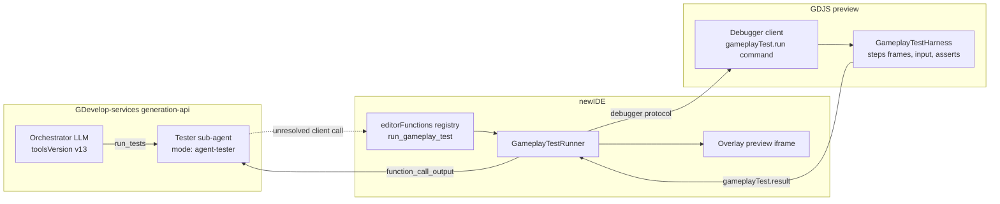

# Gameplay Tests — Implementation Plan (v1)

Status: PLAN — to be implemented on branch `claude/gdevelop-ai-game-tests-yb6sqs` across
`4ian/GDevelop`, `GDevelopApp/GDevelop-services`, `GDevelopApp/GDevelop-ai-prompts`,
`GDevelopApp/GDevelop-examples`.

Goal: give the GDevelop AI agent (and game creators) the ability to **run the game and
observe it** — pass/fail gameplay tests, authored as pure JS scripts against a small
harness over the GDJS runtime, stored in the project or in events-based extensions,
runnable from the editor UI, from the AI agent, and from the CLI.

This plan builds on two bodies of prior art that were fully analyzed:

- The abandoned `test_gameplay` experiment (services branch `new-gameplay-tester`,
  64 commits, March 2026): a client-side tool whose ~750-line description documented a
  battle-tested harness API. **All its lessons are folded in below** (§4.4, §10).
- The current production architecture (orchestrator v12 + `run_script` + sub-agents +
  EventScript), whose patterns we reuse everywhere instead of inventing new ones.

---

## 1. Product summary

- A **gameplay test** is a named, described, pure-JS async script `async (harness) => {…}`
  running inside a real game preview, with easy access to the GDJS runtime: step frames,
  simulate input, inspect objects/variables, assert, take screenshots, profile.
- Tests live **in the project** (`project.tests`) or **in an events-based
  extension** (`extension.tests`). Serialized with the project. New C++ Core
  classes + GDevelop.js bindings. The model is deliberately generic (`gd::Test` with a
  `type` attribute, `"gameplay"` in v1) to leave room for future test types; the UI
  labels the v1 feature "Gameplay tests".
- Tests are visible/authorable in the **Project Manager** (new "Tests" section), in the
  **extension editor** (new "Tests" section), open in a **new editor tab** (Monaco code
  editor + properties panel), runnable from the **toolbar**, the **command palette**, and
  the **CLI** (`--run-command RUN_ALL_TESTS`).
- While a test runs, the game shows in a **small overlay iframe** (bottom-left) with
  stop/hide controls.
- Result of a run: `passed/failed/error`, duration, frames executed, assertions,
  console logs, auto-recorded event log (spawn/remove/stuck), optional screenshots,
  optional performance report. A compact summary (`status`, `launchedAt`, `durationMs`)
  is persisted on the test; logs/screenshots are ephemeral (kept in editor memory,
  returned to the AI).
- The **orchestrator gets exactly one new tool**: `run_tests`. It runs existing
  tests by name, or persists + runs a new test from provided code. Under the hood it is a
  **tester sub-agent** with a zero-LLM fast path (same pattern as `run_edit_agent`'s
  `initial_script`): if the orchestrator's test code executes cleanly, no extra LLM call
  happens; if the script itself is broken, a bounded tester agent fixes it.

Non-goals for v1 (explicitly deferred, see §11):
- Automatic test runs after every AI change (the orchestrator decides when to test).
- Storing screenshots/videos in the project.
- Input recording ("record my play as a test").
- Multiplayer/networked test scenarios.
- Headless server-side test execution in the generation-api backend.

---

## 2. Architecture overview



Execution path of one AI-triggered test run:

1. Orchestrator calls `run_tests({scope, tests | new_test})` (server-side tool).
2. Backend creates a tester sub-agent AiRequest with a synthetic unresolved
   client-side `run_gameplay_test` call (the `initial_script` pattern —
   `llm-gdevelop-server-side-tools.js:1106`); the parent Lambda exits.
3. The editor sees the unresolved call, persists the test (if new), exports a fresh
   preview, boots it in the overlay iframe, sends the test source over the debugger
   channel (`gameplayTest.run`), and collects streamed progress + the final result.
4. The editor posts the result as `function_call_output` to the sub-agent.
   - Script executed (test passed OR failed on assertions) → child wraps up with
     **zero LLM calls**, result forwarded to the orchestrator.
   - Script itself errored (bad harness call, syntax error, timeout without result) →
     the tester LLM iterates (re-run, read events, fix), bounded like
     `ai-generated-event/handle.js` loop guards, then wraps up.
5. The orchestrator receives a compact result and decides: continue, fix the game, or
   report to the user.

Key principle carried from the prior attempt: **the test source never travels inside the
exported game**. It is sent over the debugger channel at run time, so tests are stripped
from exports (ProjectStripper) and editing/running unsaved test code is natural.

---

## 3. Part A — Core (C++) model

Follow the exact recipe below (all patterns verified in the codebase).

### 3.1 New classes

- `Core/GDCore/Project/Test.h/.cpp` — model on `gd::ExternalEvents`
  (`Core/GDCore/Project/ExternalEvents.h:31-101`): `GetName/SetName`, `Clone()`,
  `SerializeTo`, `UnserializeFrom`, private `Init()`.
  Fields:
  - `gd::String name;`
  - `gd::String type;` — `"gameplay"` in v1; serialized so future test types can share
    the container/UI without a format change. Unserialize defaults missing/empty to
    `"gameplay"`.
  - `gd::String description;`
  - `gd::String source;` — the JS body. Serialize with
    `element.AddChild("source").SetMultilineStringValue(source)` (same as
    `JsCodeEvent`, `GDJS/GDJS/Events/Builtin/JsCodeEvent.cpp:43-53`) so project diffs stay
    readable.
  - Last-run summary (attributes, all optional): `lastRunStatus` (`""|"passed"|"failed"|"error"`),
    `lastRunAt` (unix ms as double), `lastRunDurationMs`, `lastRunFramesExecuted`.
    DECIDED: persisted in the project JSON — dirties the project on each run; the editor
    must mark unsaved changes accordingly. Console logs/screenshots are NOT persisted.
- `Core/GDCore/Project/TestsContainer.h` — thin wrapper over
  `gd::SerializableWithNameList<gd::Test>` exactly like
  `EventsBasedObjectVariantsContainer`
  (`Core/GDCore/Project/EventsBasedObjectVariantsContainer.h:26`): private inheritance +
  renamed accessors (`HasTestNamed`, `GetTest(name)`, `GetTest(index)`, `GetTestsCount`,
  `InsertNewTest`, `RemoveTest`, `MoveTest`, `GetInternalVector`) + `SerializeElementsTo` /
  `UnserializeElementsFrom` pass-throughs. Use the **project-free** unserialize overload
  (`SerializableWithNameList.inl:164`) — a test needs no `gd::Project&`.

### 3.2 Attach to `gd::Project` and `gd::EventsFunctionsExtension`

- `Project.h`: member `gd::TestsContainer tests;` near line 1195;
  `GetTests()` const/non-const accessors near line 762.
- `Project.cpp`:
  - `SerializeTo` (~line 1172): `tests.SerializeElementsTo("test", element.AddChild("tests"));`
  - `UnserializeFrom` (~line 919): `tests.UnserializeElementsFrom("test", element.GetChild("tests"));`
    (`ConsiderAsArrayOf` on a missing child yields zero children → old projects load fine,
    no migration needed).
  - **`Init` (~line 1295): `tests = game.tests;`** — forgetting this is
    the classic bug; add the copy-operator test (§3.5).
- `EventsFunctionsExtension.h`: member near line 429, `GetTests()` near line 186.
- `EventsFunctionsExtension.cpp`:
  - `SerializeTo` (~line 124) — also covers the standalone extension `.json` format.
  - `UnserializeExtensionImplementationFrom` (~line 249) — tests are content, not a
    declaration other things reference.
  - **`Init` (~line 56): `tests = other.tests;`**
- `Core/GDCore/IDE/ProjectStripper.cpp` (`StripProjectForExport`, line 19): clear
  project-level and per-extension gameplay tests. Tests never ship in exports or preview
  `projectData` (source travels via debugger message).
- No changes needed to `WholeProjectRefactorer` / `ResourceExposer` /
  `ProjectBrowser` for v1 (tests are opaque JS + metadata; they don't hold events,
  objects, or resources). If a test wants to survive scene/object renames, that's the
  test author's (or AI's) job — document it.

### 3.3 GDevelop.js bindings

- `GDevelop.js/Bindings/Bindings.idl`:
  - `interface Test` (SetName/GetName, SetType/GetType, SetDescription/GetDescription,
    SetSource/GetSource, last-run getters/setters, SerializeTo/UnserializeFrom) — model on
    `interface ExternalEvents` (Bindings.idl:1072).
  - `interface TestsContainer` — model on `EventsBasedBehaviorsList`
    (Bindings.idl:3483): `InsertNew`, `Insert`, `Has`, `Get`, `GetAt`, `Remove`, `Move`,
    `GetCount`, `GetPosition`, `size`, `at`.
  - `[Ref] TestsContainer GetTests();` in `interface Project` and
    `interface EventsFunctionsExtension`.
- `GDevelop.js/Bindings/Wrapper.cpp`: `#include` the two new headers (block at lines
  70-95). `#define GetAt Get` already exists — no new define needed if the container
  exposes `GetAt`.
- Rebuild bindings: regenerate and **commit** `types/gdtest.js`,
  `types/gdtestscontainer.js`, updated `types/gdproject.js`,
  `types/gdeventsfunctionsextension.js`, `types/libgdevelop.js`, `types.d.ts`.
- Tests: `GDevelop.js/__tests__/Core.js` — mirror the ExternalEvents assertions
  (lines 90-99); `Core/tests/` — copy-operator + serialization round-trip test
  (model: `Core/tests/EventsFunctionsExtension.cpp:11`).

### 3.4 JSON shape (for reference)

```json
"tests": [
  {
    "name": "PlayerCanCollectCoin",
    "type": "gameplay",
    "description": "Player walks right and collects the first coin; Score increments.",
    "source": ["await harness.goToScene('Level1');", "…"],
    "lastRunStatus": "passed",
    "lastRunAt": 1769700000000,
    "lastRunDurationMs": 5400,
    "lastRunFramesExecuted": 320
  }
]
```

### 3.5 Acceptance criteria (Part A)

- Round-trip: unserialize → serialize preserves tests at project and extension level.
- Copy ctor / assignment of Project and EventsFunctionsExtension preserves tests.
- Old projects (no `tests` key) load without warnings.
- Exported/preview projectData contains no `tests`.

---

## 4. Part B — GDJS harness

### 4.1 Placement & loading

- New file `GDJS/Runtime/gameplay-tests/gameplay-test-harness.ts` (+ optional
  `gameplay-test-tools.ts` for nav/geometry helpers). Included in **preview exports
  whenever a debugger client is included** (add alongside the debugger-client includes in
  `GDJS/GDJS/IDE/ExporterHelper.cpp:1224`). Never included in real exports.
- Entry point: a new debugger command. In
  `GDJS/Runtime/debugger-client/abstract-debugger-client.ts` `handleCommand` (line 239):

```ts
} else if (data.command === 'gameplayTest.run') {
  // payload: { testName, source, timeoutMs, maxFrames, speedFactor, screenshots }
  gdjs.gameplayTestRunner.run(this, data.messageId, data.payload);
} else if (data.command === 'gameplayTest.stop') {
  gdjs.gameplayTestRunner.stopCurrent();
}
```

- Outbound messages (mirror the `getSelectionAABB`/`selectionAABB` messageId pattern,
  and DO NOT use `sendMessageWithResponse`'s 1 s timeout — stream instead):
  - `{ command: 'gameplayTest.progress', messageId, payload: { frame, note? } }` (throttled, ~1/s)
  - `{ command: 'gameplayTest.result', messageId, payload: GameplayTestResult }`
  - Result is ALWAYS sent, including on exception/timeout/stop.

### 4.2 Execution model (deterministic stepping)

- The script body is compiled with `new Function('harness', 'console', source)` wrapped
  in an async function. (Check preview CSP allows this — service-worker-served preview and
  Electron `file://` both allow `new Function` today; verify for the in-app iframe.)
- On `run`:
  1. `runtimeGame.pause(true)` — the rAF loop keeps rendering (`renderWithoutStep`) but
     stops stepping. The harness owns stepping from now on.
  2. Harness steps frames manually: `sceneStack.step(dtMs)` then
     `inputManager.onFrameEnded()` (CRITICAL — this is what resets just-pressed keys,
     wheel deltas, mouse movement; it normally runs in `RuntimeGame.startGameLoop`,
     `runtimegame.ts:1388`).
  3. Steps are batched per rAF tick: `speedFactor` steps per tick (default 2, max ~10).
     This runs game-time **faster than wall-clock** — a 30 s gameplay scenario completes
     in seconds. `dtMs` fixed at `1000/60` for determinism (clamped anyway by
     `TimeManager.update` min-FPS logic).
  4. Guards: `maxFrames` (default 20 000), `timeoutMs` wall-clock (default 30 000),
     auto-release of all keys/buttons on completion, all failures caught.
  5. On completion, the result is sent and the game stays paused; the editor-side runner
     tears the preview down (or lets the user keep playing via the overlay controls).
- `goToScene(name)` uses `sceneStack.replace({sceneName, clear: true})` and must await
  `runtimeGame.areSceneAssetsReady(sceneName)` first (`SceneStack.push` returns null and
  loads async otherwise — `scenestack.ts:147`).
- Scenario injection ("jump into the middle of a game"):
  - `goToScene(name, { skipCreatingInstances: true })` → maps to the existing
    `PushSceneOptions.skipCreatingInstances` (`scenestack.ts` interface).
  - `loadExternalLayout(name, x?, y?, z?)` → wraps
    `gdjs.evtTools.runtimeScene.createObjectsFromExternalLayout`
    (`events-tools/runtimescenetools.ts:287`).

### 4.3 Result format

```ts
type GameplayTestResult = {
  status: 'passed' | 'failed' | 'error' | 'stopped' | 'timeout';
  framesExecuted: number;
  durationMs: number;               // wall-clock
  gameTimeMs: number;               // frames * dt
  assertions: Array<{ message: string, passed: boolean }>;
  errors: string[];                 // runtime errors / harness.fail messages / timeout note
  consoleLogs: Array<{ level: 'log'|'warn'|'error', message: string }>;  // capped
  eventLog: Array<{ frame: number, event: 'spawned'|'removed'|'stuck'|'sceneChanged', object?: string }>;
  finalState: {
    sceneName: string;
    objectCounts: { [objectName: string]: number };       // counts, NOT full dumps
    watchedObjects: { [objectName: string]: Array<ObjectSnapshot> }; // only via harness.watch()
    sceneVariables: VariableNetworkSyncData[];             // top-level only
  };
  screenshots: Array<{ label: string, frame: number, jpegBase64: string }>; // capped, downscaled
  performance?: { framesAverageMeasures: FrameMeasure, stats: { framesCount: number },
                  avgStepMs: number, worstStepMs: number };
};
```

Deliberate change vs the prior branch: `objectStates` dumped EVERY live instance of EVERY
object at the end — the engineer's "context spam" fear #1. Replace with `objectCounts`
plus an explicit `harness.watch('ObjectName')` opt-in for full end-state snapshots.
Console logs capped in the runtime (100 lines / 8 000 chars) and again at the wrap-up
level (40 / 4 000) like `run_script` today.

### 4.4 Harness API surface (v1)

Keep the prior branch's names verbatim — 60 commits of prompt-engineering learned them;
the documentation content is reusable as-is. Marked ✚ = new in this plan.

Navigation / stepping:
- `await harness.goToScene(sceneName, options?: { skipCreatingInstances? })` ✚options
- `await harness.stepFrames(count, { dtMs?, onFrame? })`
- `await harness.stepUntil(condition, { maxFrames, onFrame?, stuckDetection? }): boolean`
- ✚ `harness.getSceneName(): string`, `harness.getSceneStack(): string[]`

Input (all state-store level on `gdjs.InputManager` — no DOM events):
- `harness.setKeyPressed(keyName, pressed)` — accepts Web API names AND GDevelop event
  sheet names; implement over `gdjs.evtTools.input.keysNameToCode`
  (`events-tools/inputtools.ts:22`); handle location-aware codes
  (value ≥ 1000 → `onKeyPressed(value % 1000, Math.floor(value / 1000))`).
- `harness.setMousePosition(x, y, layerName = '', z = 0)` (world-space, inverts camera),
  `setMousePositionScreen(x, y)`, `setMouseDelta(dx, dy)` (pointer-lock FPS),
  `setMouseButtonPressed(pressed, button?)`.
- ✚ `harness.touchStart/Move/End(id, x, y)` — thin wrappers over InputManager touch API
  (needed for mobile-first games; joystick simulation stays out — lesson from the branch).
- Pointer-lock shim: the harness patches `requestPointerLock` to a no-op and makes the
  "mouse is locked" condition return true (carried over from the branch).

Inspection (read-only):
- `harness.getObjects(objectName): ObjectSnapshot[]` — same field set as the branch
  (position, angle/rotation, size, layer, hidden, points incl. Center, variables,
  behavior states for Platformer/TopDown/Pathfinding/Physics, sprite/text/3D fields,
  children for custom objects).
- `harness.getNearby(objectName, referenceObjectName, radius)`
- `harness.hasLineOfSight(reference, target, blockerObjectNames)`
- `harness.getLayer(name): { visible } | null`
- `harness.getSceneVariable(name)` / `harness.getGlobalVariable(name)` (raw sync-data
  entries — keep the branch's hard-won typing warnings in the docs)
- ✚ `harness.watch(objectName)` — include full snapshots of this object in
  `finalState.watchedObjects`.

Navigation intent (hints, not actions — keep branch semantics):
- `harness.getNavigationHint(reference, target, options?)`
- `await harness.lookToward(reference, target, { yawOnly? })`

Scenario setup (✚ new category — addresses "big game, must play from the start" fear #4;
docs must say: use for ARRANGE, never to fake an ASSERT):
- ✚ `harness.spawn(objectName, x, y, z?, layerName?): ObjectSnapshot` — wraps
  `RuntimeInstanceContainer.createObject` + position.
- ✚ `harness.removeObject(id)`
- ✚ `harness.setObjectPosition(id, x, y, z?)`
- ✚ `harness.setSceneVariable(name, value)` / `setGlobalVariable(name, value)`
- ✚ `harness.loadExternalLayout(name, x?, y?, z?)`

Verdicts and evidence:
- `harness.assert(condition, message)` — throws immediately on failure (branch lesson:
  fail-fast; try/catch is the escape hatch).
- `harness.fail(message)` — throws immediately.
- ✚ `await harness.takeScreenshot(label?)` — `renderer.getCanvas().toDataURL()`
  (`preserveDrawingBuffer` is already `true` on every renderer path —
  `runtimegame-pixi-renderers.ts:114,136,149`), downscaled to ≤ 512 px longest side,
  JPEG ~q0.7, max 5 per run. Note in docs: DOM overlays (TextInput objects) don't appear
  in canvas snapshots.
- ✚ `harness.startProfiling()` / `await harness.stopProfiling()` — wraps
  `runtimeGame.startCurrentSceneProfiler` / `stopCurrentSceneProfiler`
  (`runtimegame.ts:1668`); fills `result.performance`. This is the "make my game fast"
  hook: section times per frame (events, physics via behaviors sections, render).

Auto-instrumentation (no API, always on):
- `eventLog` records object spawn/remove (diffing instance counts per frame), stuck
  detections, and scene changes.
- Console capture: chain `gdjs.Logger.setLoggerOutput` (don't replace — the debugger
  client already chains, `abstract-debugger-client.ts:218`), and note the debugger client
  already monkey-patches `window.console`, so don't double-patch.

### 4.5 Harness unit tests

- New Karma suite `GDJS/tests/tests/gameplaytestharness.js` using the existing
  `gdjs.getPixiRuntimeGame()` / `TestRuntimeScene` helpers: stepping determinism, input
  mapping (incl. location-aware keys), stuck detection, assert/fail semantics, result
  shape, caps. Add `gameplay-tests/*.js` to the ordered file list in
  `GDJS/tests/karma.conf.js`.

### 4.6 Acceptance criteria (Part B)

- A hardcoded platformer test (arrow-right + jump to collect a coin on
  `starting-platformer`) passes when driven purely through the debugger command from a
  dev console, at speedFactor 1 and 5, with identical assertion outcomes.
- Timeout, script error, and user-stop all still produce a `gameplayTest.result`.
- A run at speedFactor 5 of 3 000 frames finishes in < 15 s wall-clock on a dev laptop.

---

## 5. Part C — Editor (newIDE)

### 5.1 Test editor tab

Follow the checklist derived from `ExternalEventsEditorContainer` (the smallest complete
example):

1. `MainFrame/EditorTabs/EditorTabsHandler.js:34` — add `'gameplay-test'` to `EditorKind`;
   add the container to the `EditorRef` union (line 21); add `closeGameplayTestTabs` and
   extend `renameEditorTabs` (line 555).
2. New `MainFrame/EditorContainers/GameplayTestEditorContainer.js` — class component per
   the pattern (inactive-tab `shouldComponentUpdate` early-out, `updateToolbar`,
   `on*ModifiedOutsideEditor` no-ops, resolve `gd.Test` from
   `project`/`extension` + `projectItemName`).
3. `MainFrame/index.js:283` — register in `editorKindToRenderer`;
   `getEditorOpeningOptions` (line 752): label/icon, add `'gameplay-test'` to the
   name-keyed `key` list (line 793); `openGameplayTest` callback next to
   `openExternalEvents` (line 2998); wire into close/rename/delete project paths.
   For extension-scoped tests, `projectItemName` = `extensionName::testName`.
4. Editor content: `EditorMosaic` (`UI/EditorMosaic/index.js`) with
   `{ direction: 'row', first: 'test-code', second: 'test-properties', splitPercentage: 70 }`.
   On small screens, fall back to `EditorMosaic/EditorNavigator.js` (tabs shown at the
   bottom), exactly like the scene editor and the extension editor do — pattern at
   `EventsFunctionsExtensionEditor/index.js:1801`.
   - `test-code`: `CodeEditor` (`newIDE/app/src/CodeEditor/index.js`, Monaco lazy-loaded;
     GDJS-aware autocompletion exists). ✚ Register a `harness.d.ts` in the Monaco setup
     so test authors get harness IntelliSense (add to
     `BrowserCodeEditorAutocompletions.js` / `LocalCodeEditorAutocompletions.js`).
   - `test-properties`: name, description, last run status + time + duration, a **Run**
     button, and an **"Edit with AI"** button → opens the Ask-AI tab with a pre-filled
     prompt `Edit the gameplay test "X" in [project|extension Y] to <cursor>` (use
     `OpenAskAiOptions`, `AiGeneration/Utils.js:1401`).
5. Toolbar: Run (like preview), Stop when running. `updateToolbar` per the pattern.

### 5.2 Project manager & extension editor lists

- `ProjectManager/index.js`: new root `testsRootFolderId` after External layouts
  (pattern at lines 1161-1198), `addGameplayTest` helper modeled on `addExternalEvents`
  (line 754), and a new `ProjectManager/GameplayTestTreeViewItemContent.js` copied from
  `ExternalEventsTreeViewItemContent.js` (228 lines: rename/delete/copy/cut/paste/
  duplicate + `onClick` → `openGameplayTest`). Add a ▶ run affordance via
  `renderRightComponent` and a pass/fail dot from `lastRunStatus`.
- `EventsFunctionsList/index.js`: new `extensionTestsRootFolderId` section (copy the
  Behaviors block, ~150 lines) + `GameplayTestTreeViewItemContent` reuse.

### 5.3 Command palette

- `CommandPalette/CommandsList.js`: `OPEN_GAMEPLAY_TEST` (with options, enumerating
  project + extension tests), `RUN_GAMEPLAY_TEST` (with options), `RUN_ALL_GAMEPLAY_TESTS`.
- Register via `useCommandWithOptions` in `MainFrame/MainFrameCommands.js` (pattern at
  line 214) using a new `enumerateGameplayTests(project)` in
  `ProjectManager/EnumerateProjectItems.js`.

### 5.4 The runner — `newIDE/app/src/GameplayTests/GameplayTestRunner.js`

The load-bearing module, shared by UI, AI tool, and CLI.

```js
runGameplayTests({
  project, tests /* [{scope: 'project'|extensionName, name}] */,
  previewLauncher, previewDebuggerServer,
  options: { speedFactor, timeoutMs, screenshots: 'off'|'on-failure'|'explicit', onProgress },
}): Promise<Array<GameplayTestRunResult>>
```

1. Serialize runs (MainFrame refuses concurrent preview loads —
   `MainFrame/index.js:2572` `previewLoadingRef` — and one debugger channel is simpler).
2. Export a fresh preview of the live in-memory project (`launchPreview` with
   `fullLoadingScreen: false`); target the **overlay iframe**, not a popup window.
3. Register `previewDebuggerServer.registerCallbacks({ onHandleParsedMessage })`,
   filter `gameplayTest.*` commands. Never use `sendMessageWithResponse` (1 s timeout,
   `BrowserPreviewDebuggerServer.js:156`).
4. Send `gameplayTest.run` with the test source; await `gameplayTest.result` with an
   editor-side watchdog = `timeoutMs + margin`.
5. Update `gd.Test` last-run fields; fire unsaved-changes; notify listeners
   (test editor tab, project manager badges).
6. Tear down (or keep the frame alive between tests of the same batch — re-send
   `gameplayTest.run` sequentially; re-export only when the project changed since the
   last export, which the AI loop does every time anyway).

### 5.5 Overlay preview frame

- New `GameplayTests/GameplayTestFrame.js`, modeled on
  `EmbeddedGame/EmbeddedGameFrame.js` (iframe + `registerEmbeddedGameFrame`), but:
  - rendered as a small fixed overlay, bottom-left (~320×180), with hover controls:
    Stop (sends `gameplayTest.stop`) and Hide (keeps running).
  - **Prerequisite fix**: `BrowserPreviewDebuggerServer.js:20` holds a single
    `embbededGameFrameWindow`; generalize to a map of registered embedded frames with
    ids (`'embedded-game-frame'`, `'gameplay-test-frame'`). Iframes have no `.closed`
    (the 1 s polling at line 71 never fires) → unregister explicitly on unmount.
  - Do NOT hide with `display:none` while running (rAF throttling); 1×1 or offscreen
    positioning keeps rAF alive; harness stepping is rAF-driven.
- Electron: same iframe approach works (LocalPreviewLauncher already supports the
  embedded frame path via postMessage). Do not add a hidden BrowserWindow path in v1.

### 5.6 CLI

- `MainFrame/LocalCliCommandRunner.js` `runners` map (line 83): add

```js
RUN_ALL_TESTS: async (project, i18n, { commandArgs, gameplayTestRunnerDeps }) => {
  const results = await runAllGameplayTests({ project, filter: commandArgs, ...gameplayTestRunnerDeps });
  console.info(`[CLI] ${results.passedCount}/${results.totalCount} gameplay tests passed.`);
  if (results.failedCount > 0) throw new Error(`${results.failedCount} gameplay test(s) failed.`);
},
```

- Extend `RunCliCommandOptions` (line 189) and the MainFrame call site to pass
  `previewLauncher` + `previewDebuggerServer` (they are not in the context bag today).
- Result: `gdevelop --no-sandbox --disable-update-check --run-command RUN_ALL_TESTS game.json`
  exits non-zero on failure — CI-usable exactly like `test-portable-cli-export.js`.
- Note: CLI windows are created hidden (`main.js:214`); the overlay iframe lives in the
  hidden window — verify rAF still fires in a hidden Electron window
  (`backgroundThrottling: false` is already the preview default; set
  `webPreferences.backgroundThrottling: false` on the CLI main window too if needed).

### 5.7 AI client side

- New module `newIDE/app/src/EditorFunctions/GameplayTestTools.js` (do NOT grow the
  8 700-line `EditorFunctions/index.js`; only add registry entries there):
  - `run_gameplay_test` — client-side executor used by the tester sub-agent's synthetic
    call. Args `{ scope, test_name, source?, description?, persist?, timeout_ms?,
    screenshots? }`. If `source` provided: create/update the `gd.Test`
    (persist = default true), then run via the shared runner. Returns the
    `GameplayTestResult` (capped — reuse `CapScriptOutput.js` patterns), plus a
    `renderForEditor` row ("Running gameplay test …" with live status).
    Approval semantics (decided): running an existing test needs NO approval (akin to
    explorer reads); persisting a new/changed test IS a project modification and gets
    the edit-approval row when auto-edit is off. The registry's `modifiesProject` flag
    is a static boolean today — extend it to also accept `(args) => boolean` (evaluated
    in `AiGeneration/Utils.js:421` before `requestEditApproval`) so approval only
    triggers when `source` is provided.
  - Add it to `NON_SCRIPTABLE_FUNCTION_NAMES` for v1 (a preview launch inside a
    `run_script` blocks the whole script for seconds and complicates approval UX;
    revisit later).
- `SimplifiedProject.js` (type at line 59, builder at line 412): add
  `tests: [{ name, type, description, lastRunStatus?, lastRunAt? }]` at project level
  and inside each extension summary. Source is NOT in the simplified project.
- The backend reader (`gdevelop-simplified-project.js` / `-reader.js`) mirrors this, and
  `read_game_project_json` path examples gain `tests[*]` — including `source`
  under the reader (full project JSON has it), so the orchestrator can inspect test code
  through the existing tool, per the product intent.
- Bump `AI_ORCHESTRATOR_TOOLS_VERSION` to `'v13'` (`AiGeneration/Utils.js:104`) in the
  same release train as the backend (§6).
- Add the tool's output schema to `ScriptExecution/TypedOutputsSchemas.fixture.json`
  (checked by `TypedOutputsConformance.spec.js`).

### 5.8 Acceptance criteria (Part C)

- Create/rename/delete/duplicate a test from the Project Manager; open in a tab; edit
  code with Monaco (harness autocompletion working); Run from toolbar shows the overlay
  frame and a result; last-run badge updates; project marked unsaved.
- Same flows inside an events-based extension.
- `RUN_ALL_TESTS` CLI run on a project with 1 passing + 1 failing test exits 1 and prints
  a summary.
- Web editor (browser) and Electron both run tests.

---

## 6. Part D — Backend (GDevelop-services, generation-api)

### 6.1 New tools version `v13`

- `src/lib/llm-gdevelop-tools.js`: new orchestrator list entry for `v13` = the v12 list +
  `runTestsV1`. (Resolve the stale `// TODO: Add testGameplayV1` comment at
  line 5346.)
- `handle.js` `choosePrompts` (line 1119): map v13 →
  `ai-request/orchestrator/compact-system-prompt-v13.md`. Nothing else — `>= v10`
  already resolves `/latest`.

### 6.2 Orchestrator tool: `run_tests` (server-side)

```js
{
  name: 'run_tests',
  description: 'Run gameplay test(s) on the game and get pass/fail results with evidence.
    Either run existing tests by name, or provide a new test (name + code) which is saved
    into the project/extension and run. …(failure-triage protocol, see §6.5)',
  parameters: {
    scope:      { type: 'string', description: "'project' or the name of an events-based extension." },
    test_names: { type: 'array', items: {type: 'string'}, description: 'Existing tests to run.' },
    new_test:   { type: 'object', properties: {
                    name: {type:'string'}, description: {type:'string'},
                    code: {type:'string', description: 'JS body run as `async (harness) => {…}`. API: see <gameplay-test-harness> in your instructions.'} } },
    timeout_ms: { type: 'number' },
    screenshots:{ type: 'string', enum: ['off', 'on-failure'] },
  },
  required: ['scope'],
}
```

- Handler in `llm-gdevelop-server-side-tools.js`, modeled 1:1 on `run_edit_agent`'s
  `initial_script` path (line 1106): create a sub-agent AiRequest
  (`mode: 'agent-tester'`, `parentAiRequestId`, inherited config) with a synthetic
  unresolved client-side `run_gameplay_test` call (`call_id` prefix `initial-test-`),
  do NOT invoke the child's handle Lambda, return `{ subAgentAiRequestId }`.
- On the child's `add-message` (`detectInitialScriptResolution` pattern,
  `add-message.js:108`):
  - Result has `status ∈ {passed, failed}` → the test *script executed*; wrap up with
    zero LLM calls; forward a compact result to the parent.
  - Result has `status ∈ {error, timeout}` → set child to `working`; the tester LLM
    takes over with the source + error.
- Tester agent (`agent-tester`):
  - Tools: `run_gameplay_test` (client-side), `read_events_source`, `read_full_docs`,
    `report_fulfilment_problem`.
  - Loop guards mirroring `ai-generated-event/handle.js:487`: hard cap ~5 test runs /
    ~14 messages; reminder injection; then give up with a structured "could not get the
    test to execute" wrap-up. **The tester fixes the TEST, never the game** (prompt rule
    + it has no edit tools — structurally enforced).
  - Wrap-up payload to the parent (extend `wrap-up.js`): `{ testName, scope, status,
    durationMs, framesExecuted, assertions, errors (capped), consoleLogs (capped 40/4000),
    eventLogSummary, screenshots?, agentIdIfNeedToContinueLater }`.
- Yup schema `src/lib/gameplay-test/run-output.js` next to `run-script-output.js`;
  best-effort validation in `add-message.js` mirroring `validateIncomingRunScriptOutputs`.
- **Do not add a backend checker that whitelists harness methods** — explicitly reverted
  in the prior attempt (`44bf6640`). Validate only `timeout_ms` and shape.
- `findRepeatedToolCallLoop` (6 identical calls → kill): acceptable backstop; the tester's
  own run cap triggers first.
- Message trimming (`utils/messages-trimming.js`): superseded `run_tests` outputs
  for the SAME test name are redacted down to `status` + one line (opposite of the
  `read_events_source` exemption) — keeps repeated test-fix loops from bloating context.
- `suspend.js`: adopt the branch's wording ("…update the plan if necessary and only
  continue with the plan if it still makes sense…") — tests are the long-running calls
  users actually interrupt.

### 6.3 Pricing

`price-in-credits.js` `ORCHESTRATOR_V3_TOOL_CALL_CREDITS` (line 108): add
`run_tests: 0.5` (decided — same as `run_edit_agent`) + count `new_test.code`
characters into `SCRIPT_CREDITS_PER_CHARACTER`. Ensure `countToolCallUsage` rolls up the
tester's `run_gameplay_test` calls into the parent bill (same as edit agent).

### 6.4 Screenshots to the model (v1: plumbing behind a flag)

`function_call_output` is a JSON string today. To let the model SEE screenshots:
- The editor puts `screenshots: [{label, jpegBase64}]` in the output (already capped &
  downscaled client-side).
- `formatCompletionMessagesFromAiRequestOutput` (`handle.js:154`): when the model
  supports vision (flag in `llm-models.js`), extract screenshots from gameplay-test
  outputs into image content parts on the tool-result message; otherwise replace with
  `[screenshot omitted]`. Strip base64 from persisted DynamoDB output (store to R2 via
  the existing ai-user-content presigned flow if we want the chat UI to show them; v1
  can keep them ephemeral: image goes to the model once, record keeps the label only).
- Ship v1 with `screenshots: 'on-failure'` default OFF in prompts, ON in benchmarks; turn
  on for users after cost/latency measurement. Structural state (positions, variables,
  eventLog) is the primary signal; screenshots are the tiebreaker for "it runs but looks
  wrong" (z-order, wrong animation, invisible object) — a class of bug that is otherwise
  invisible to the agent.

### 6.5 Failure-triage protocol (goes in tool description + prompt)

Carried from the prior branch (commit `60ca168a`), updated for the sub-agent split:

1. `status: 'error'` (script problem) → the tester sub-agent already tried to fix the
   test; if it gave up, do not thrash: report to the user.
2. `status: 'failed'` (assertions failed) → form a hypothesis from assertions +
   eventLog + logs; decide test-bug vs game-bug; a test bug may be silently fixed and
   re-run (the tool call edits the stored test); a game bug → fix the game via the normal
   edit flow, then re-run the SAME test by name.
3. At most 3 game-fix + re-run cycles per user request; then stop, summarize what was
   tried, ask the user.
4. When building a game feature: write the test AFTER the feature events exist, run it,
   and treat "passed" as the definition of done for the plan task.

---

## 7. Part E — Prompts (GDevelop-ai-prompts)

### 7.1 Harness documentation: single source of truth in the engine repo

- Author `GDJS/Runtime/gameplay-tests/harness-api.d.ts` (typed surface; also feeds Monaco)
  and `GDJS/Runtime/gameplay-tests/HARNESS_GUIDE.md` (the rules/lessons doc — port the
  ~700-line battle-tested content from the `new-gameplay-tester` tool description:
  control-map-first discovery, key tables, Trigger-once press/release rules, drag recipe,
  coordinate spaces, FPS aim/walk loop + pointer lock, stuck/oscillation DON'T/DO,
  variable typing traps, custom-object property caveat — plus new sections for setup
  helpers, watch(), screenshots, profiling).
- `scripts/generate-llm-prompts.js` (which already loads the GDevelop checkout) reads
  both and produces two build-time placeholders:
  - `GAMEPLAY_HARNESS_DEFINITION` — full doc → tester agent prompt.
  - `GAMEPLAY_HARNESS_DEFINITION_ULTRA_COMPACT` — ~60-line cheat sheet → orchestrator
    prompt (method signatures + the 6 most load-bearing rules). This answers "how does
    the orchestrator have enough context to write tests": the compact API rides the
    cacheable system prompt, exactly like `GDEVELOP_SCRIPT_API_DEFINITION` does for
    `run_script`; the full doc only exists in the tester sub-agent's context.
- Versioned artifacts as usual (`writeVersionedFile`); post-build guard: v13 prompts must
  contain the placeholder.

### 7.2 New/updated prompts

- `ai-request/orchestrator/system-prompt-template-v13.md` (copy v12 +):
  - `<gameplay-testing>` section: what the tool does, WHEN to test (after completing a
    milestone/plan task with new logic; before declaring done; when the user reports a
    bug — reproduce first, fix, re-run; when asked "make my game fast" — run with
    profiling), the failure-triage protocol (§6.5), and the ultra-compact harness API.
  - Planning guidance: for build requests, include a final "verify with a gameplay test"
    step in plans; reuse existing tests when names match the feature.
  - Instruction: derive the control map BEFORE writing test input (explorer /
    `read_events_source` / behavior properties — the pr-33 lesson).
- `ai-request/agent-tester/system-prompt-template.md` (new, modeled on agent-edit v12):
  role = "make the test EXECUTE correctly; never modify the game; the test's assertions
  may legitimately fail — that is a valid final result"; full harness doc; loop budget;
  wrap-up format.
- Deprecate/ignore `pr-33` (it targets the legacy v1 prompt; its 2 useful lines are
  subsumed by the v13 section).
- e2e: add orchestrator benchmark cases where the mock editor returns canned
  `run_tests` outputs (pass, assertion-fail, script-error) and assert the
  orchestrator's next action matches the protocol.

### 7.3 Examples/starters (GDevelop-examples)

- Add 1–2 canonical gameplay tests to each `starting-*` project (start with the 7
  promoted starters, then the rest). Double value:
  1. **Few-shot examples in-context**: the AI sees real tests in `read_game_project_json`
     for the very project it's editing.
  2. **Harness regression suite**: `RUN_ALL_TESTS` over all starters in CI (GDevelop
     repo CI or examples CI with a downloaded editor build) is the benchmark the
     engineer proposed — "a successful script per starter, recorded".
- The Notion "Starters prompts" page (platformer/top-down/physics/… "play the game and
  achieve X") becomes the acceptance suite: for each starter, the stored test encodes
  that exact scenario. The currently-orange/pink ones (physics drag-throw, Flappy Bird,
  RTS selection, card placement, FPS horror) are the hard set — get the green ones
  passing first, treat the hard set as harness-improvement drivers.

---

## 8. Delivery phases

Each phase is shippable/testable on its own; later phases depend on earlier ones.

- **P0 — Harness core (GDevelop: GDJS + debugger)**: §4 minus screenshots/profiling.
  Exit: acceptance criteria §4.6, driven manually via debugger console. ~No UI.
- **P1 — Core model + bindings (GDevelop: C++/IDL)**: §3. Exit: §3.5.
- **P2 — Editor UI + runner + CLI (GDevelop: newIDE)**: §5. Exit: §5.8.
- **P3 — AI integration (services + prompts + editor v13 bump)**: §6 + §7.1–7.2 minus
  screenshots-to-model. Exit: on `starting-platformer`, the prompt "Add a double jump
  and verify it works" produces: events edit → new test persisted → run → pass, within
  one conversation, on dev stage.
- **P4 — Evidence upgrades**: screenshots-to-model (§6.4), profiling assertions,
  `suspend.js` wording, trimming rule tuning.
- **P5 — Starters + benchmark loop (examples + ai-prompts)**: §7.3; long-running
  harness-hardening loop over all ~46 starters with the Notion scenarios; record passing
  scripts into the examples repo; wire CI.

Suggested first implementation order inside this branch: P0 → P1 → P2 → P3 (P0 can be
validated against a manually exported preview before any Core work lands).

---

## 9. Cross-cutting risks & mitigations

1. **Context spam** (engineer fear #1): counts-not-dumps final state, explicit `watch()`,
   log caps at runtime AND wrap-up, sub-agent isolation, trimming of superseded results.
2. **Harness can't express some inputs** (fear #2 — FPS, drag, joystick): pointer-lock
   shim + `setMouseDelta`, drag recipe, touch API; virtual joysticks stay unsupported
   (documented; prefer keyboard paths). Accept partial genre coverage in v1; the starter
   suite measures it honestly.
3. **Doom loop on false failures** (fear #3): script-error vs assertion-fail vs game-bug
   separation is structural (sub-agent fixes scripts, orchestrator handles game bugs),
   run caps are enforced server-side, protocol caps game-fix cycles at 3, screenshots
   disambiguate "test wrong" from "game wrong".
4. **Long games** (fear #4): setup helpers (`spawn`, `setSceneVariable`,
   `loadExternalLayout`, `skipCreatingInstances`) + `speedFactor` acceleration.
5. **Determinism/flakiness**: fixed dt; but `Math.random` in events, physics island
   ordering and tween timing remain nondeterministic. v1: document "assert on outcomes
   robust to randomness (ranges, counts), not exact positions"; offer
   `stuckDetection`; consider a seeded-RNG harness option later.
6. **Wall-clock cost in the user's editor**: tests run client-side and occupy the (one)
   preview slot. speedFactor + batch reuse of the exported preview mitigate; the runner
   queues runs.
7. **Security**: tests are stored JS executed only on explicit run (user click or
   AI-tool call with the same approval surface as `run_script`). Community extensions
   already ship JS (JsCodeEvent); tests add no new class of risk, but never auto-run
   tests on project open.
8. **CSP/eval in preview iframe**: verify `new Function` works in the SW-served preview
   origin and Electron; fall back to a `<script>` blob injection if not.
9. **Browser throttling of background frames**: keep the overlay visible-but-small; do
   not `display:none` a running test.
10. **Backend/editor version skew**: everything rides `toolsVersion v13` — old editors
    keep v12 behavior untouched (the exact mechanism that exists for this).

## 10. Lessons from the prior attempt (checklist for the implementer)

- Static control-map discovery (read behaviors/events) — never brute-force keys at
  runtime (`discoverControls` was deleted for a reason).
- Fail-fast `assert`/`fail` (throw immediately).
- No backend whitelist of harness methods; no regex `await` auto-fix.
- Keyboard preferred; GDevelop event-sheet key names accepted directly.
- Trigger-once semantics: release + step ≥ 1 frame between presses.
- `points.Center`, never `x + width/2`; pass the object's layer to `setMousePosition`;
  never set mouse position in pointer-lock FPS.
- Navigation hints are hints; gate car throttle on `angleDiff`; `lookToward` never
  inside `onFrame`.
- Variables come back as raw sync data (booleans are real booleans); custom-object
  editor properties are NOT exposed — derive from events.
- The doc is the product: ~60 of 64 commits were prompt iterations. Keeping the API
  names identical lets us keep the iterated documentation.

## 11. Future directions (explicitly out of v1)

- Auto-run relevant tests when the AI completes a plan task; surface regressions.
- Input recording → test scaffold ("record this play session as a test").
- Seeded RNG / full determinism mode; golden-screenshot visual regression.
- Server-side headless execution (exported preview + headless Chromium) for the
  ai-prompts benchmark and for running tests without an open editor.
- Test fixtures as external layouts authored specifically for tests.
- Community-extension test conventions in GDevelop-extensions CI.

## 12. Resolved product decisions

1. **Last-run persistence**: in the project JSON (dirties the project on each run; the
   editor marks unsaved changes accordingly).
2. **Naming**: UI label is "Gameplay tests". The model and serialization stay generic —
   `gd::Test`, JSON key `tests`, `type: "gameplay"` — to leave room for future test
   types sharing the same container/UI.
3. **Tool name & credits**: the orchestrator tool is `run_tests`, priced **0.5 credits**
   per call + per-character pricing on new test code.
4. **Approval UX**: running an existing test requires NO approval (akin to the explorer
   agent). Persisting a new/changed test is a project modification → edit-approval row
   when auto-edit is off.
5. **Extension-scoped tests**: v1 runs them against a synthetic empty scene + `spawn()`
   of the extension's objects.

Remaining open question: **screenshots default** — proposed off for users /
`on-failure` for benchmarks in v1; confirm appetite for vision-capable models in
`llm-models.js` when P4 lands.
