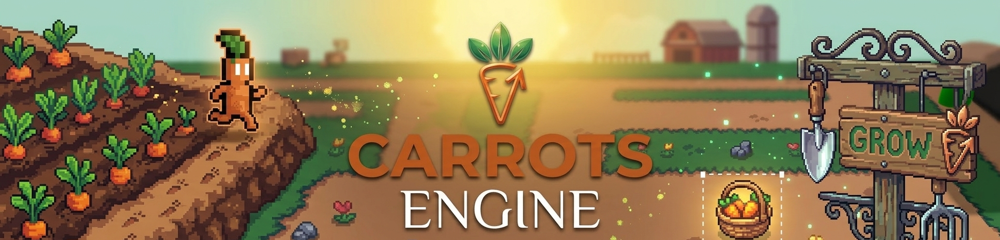

Carrots Engine is a full-featured, no-code, open-source game development engine. Build 2D, 3D, and multiplayer games for mobile (iOS, Android), desktop, and the web. Carrots Engine is designed to be fast and intuitive with an event-based system, modular behaviors, and tools that help you ship.

## Screenshots

  

---

  

---

  

---

  

---

  

---

  

---

  

---

  

---

  

---

  

---

  

---

  

---

  

---

  

---

  

---

  

---

  

---

  

---

  

---

  

---

  

---

  

---

  

---

  

## Key Features (Latest Engine Highlights)

- 2D, 3D, and multiplayer game creation with a no-code event system and modular behaviors.
- Scene3D extension with base 3D behavior, 3D model objects, and level-of-detail (LOD) management.
- Advanced 3D lighting pipeline with professional shader upgrades and adaptive lighting.
- Spot, Point, and Directional lights with improved shadow stability and performance.
- Shadow system controls for cascaded shadows and high-resolution shadow maps (up to 4096).
- Post-processing stack: Screen Space Reflections (SSR), Screen Space Ambient Occlusion (SSAO), Depth of Field, Bloom, Volumetric Fog, Vignette, and Tone Mapping.
- Post-processing quality presets and adaptive 3D quality targeting stable 60 FPS.
- PBR material behavior with AO/albedo support and SSR roughness integration.
- Runtime lightmap system integrated with ambient lighting and tone mapping.
- 3D physics with Jolt Physics, including rigid bodies, joints, and ragdoll support.
- Lighting effects and behaviors including RimLight and enhanced FlickeringLight controls.
- Editor workflow improvements for 3D transforms and snapping.

## Getting Started

- Download the app: https://carrots.odoo.com/
- Contribute to the editor or engine: newIDE/README.md
- Read the architecture overview: Core/GDevelop-Architecture-Overview.md

## Technical Architecture

Carrots Engine is composed of an editor, a game engine, and a set of extensions.

| Directory     | Description |
| ------------- | ----------- |
| `Core`        | Core classes describing the game structure and tools used by the editor and the engine. |
| `GDJS`        | The game engine, written in TypeScript, using PixiJS and Three.js for 2D and 3D rendering (WebGL). |
| `GDevelop.js` | Bindings of `Core`, `GDJS`, and `Extensions` to JavaScript (with WebAssembly), used by the IDE. |
| `newIDE`      | The game editor, written in JavaScript with React, Electron, PixiJS, and Three.js. |
| `Extensions`  | Built-in extensions providing objects, behaviors, and new features, including physics engines running in WebAssembly (Box2D or Jolt for 3D). |

## Links

- Website: https://carrots.odoo.com/
- GitHub: https://github.com/Carrotstudio0/Carrots-Engine
- Issues: https://github.com/Carrotstudio0/Carrots-Engine/issues
- Discussions: https://github.com/Carrotstudio0/Carrots-Engine/discussions

## License

- The Core library, the native and HTML5 game engines, the IDE, and all extensions (respectively `Core`, `GDJS`, `newIDE` and `Extensions` folders) are under the MIT license.
- The name, Carrots Engine, and its logo are the exclusive property of Carrots Team.

Games exported with Carrots Engine are based on the Carrots Engine game engine (see `Core` and `GDJS` folders): this engine is distributed under the MIT license so that you can distribute, sell or do anything with the games you create. In particular, you are not forced to make your game open-source.

Help us spread the word about Carrots Engine by starring the repository on GitHub.

