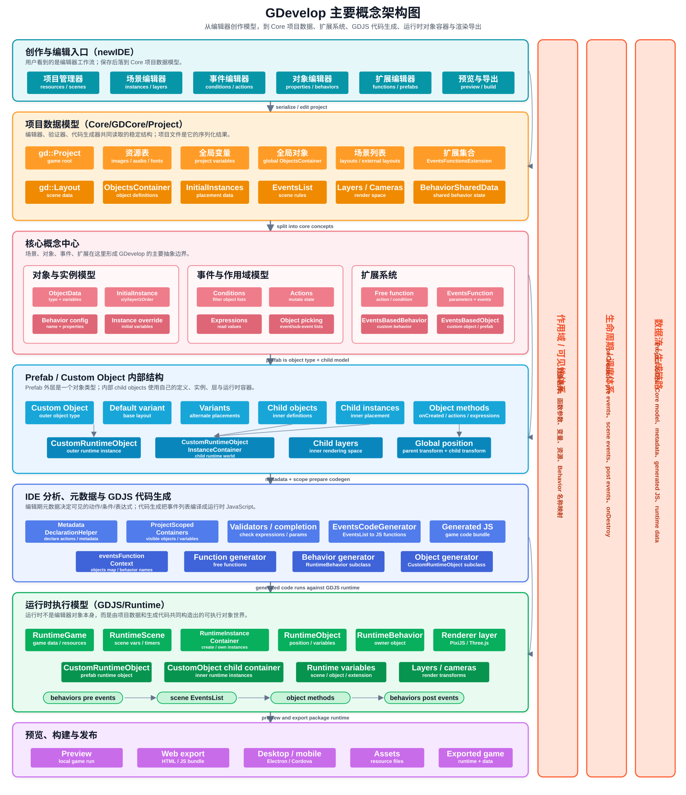
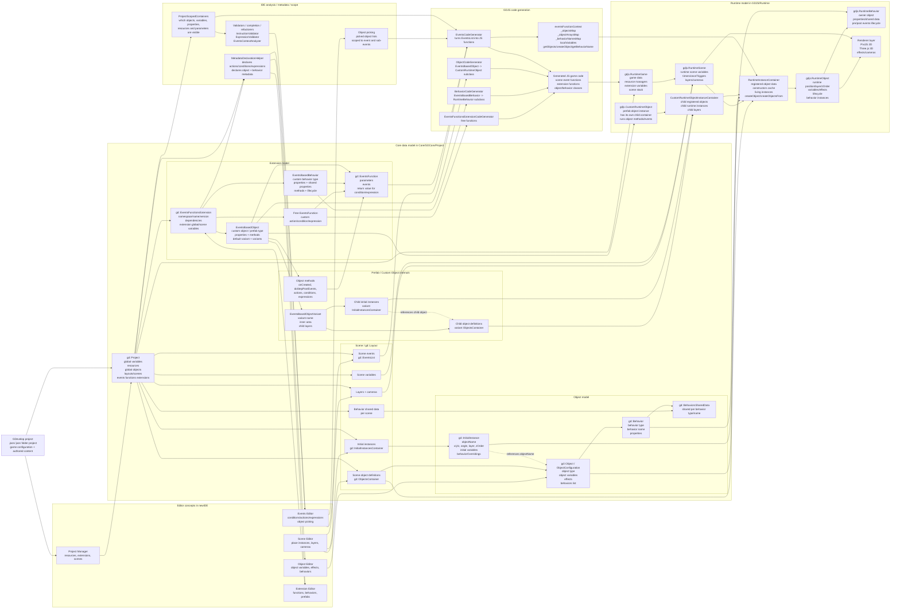
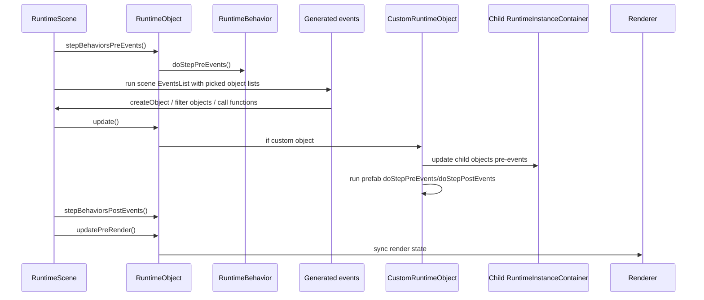
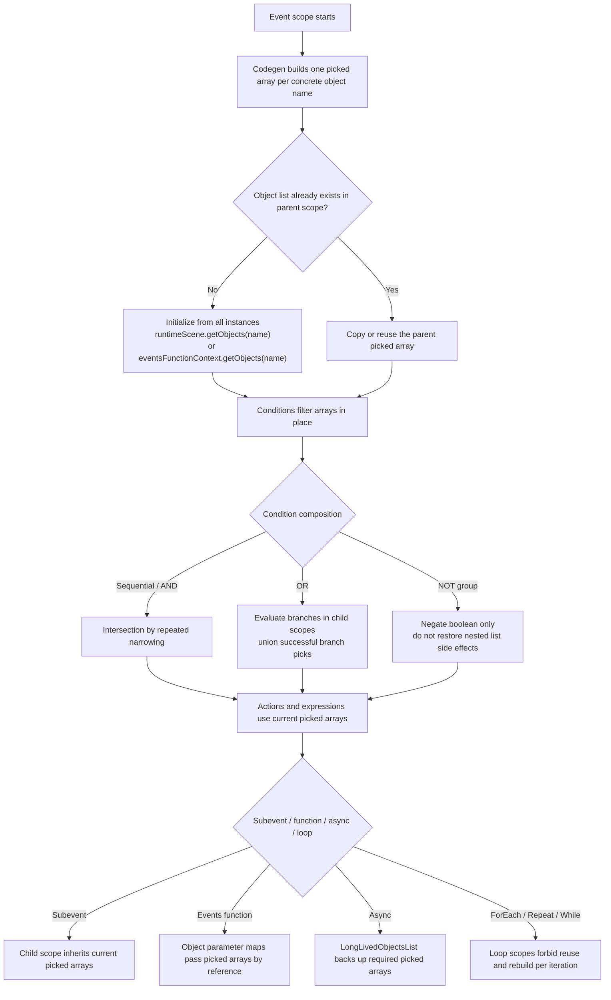
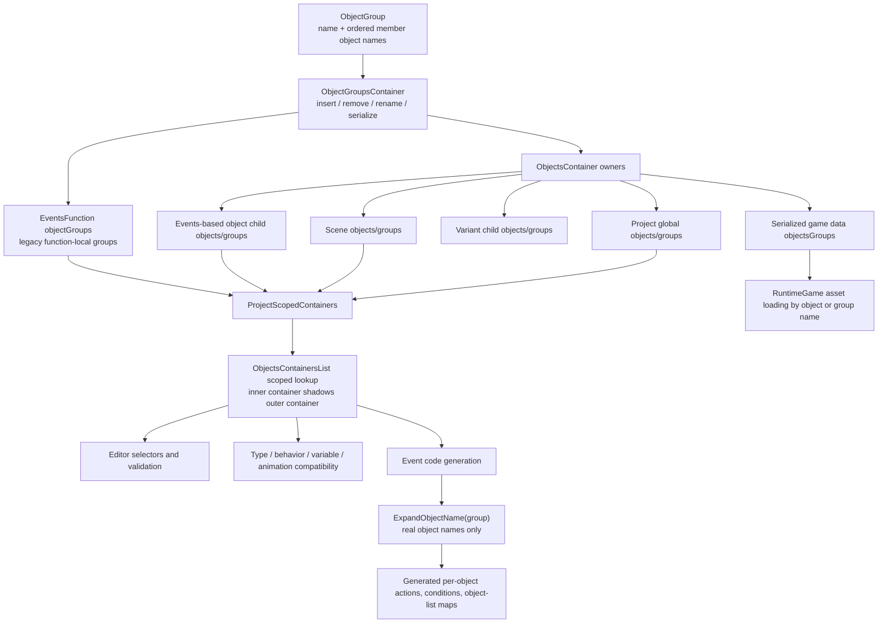

## GDevelop 架构设计图（源码与官方文档对照）

这部分从源码中的 `Core/GDCore/Project`、`GDJS/Runtime`、`GDJS/GDJS/Events/CodeGeneration`
以及官方文档中的 [Scene Editor](https://wiki.gdevelop.io/gdevelop5/interface/scene-editor/)、
[Objects](https://wiki.gdevelop.io/gdevelop5/objects/)、[Behaviors](https://wiki.gdevelop.io/gdevelop5/behaviors/)、
[Custom Objects ("Prefabs")](https://wiki.gdevelop.io/gdevelop5/objects/custom-objects-prefab-template/)、
[Functions](https://wiki.gdevelop.io/gdevelop5/events/functions/) 和
[Object Picking](https://wiki.gdevelop.io/gdevelop5/events/object-picking/) 整理而来。核心分层是：
**编辑期数据模型 -> IDE/元数据/作用域 -> GDJS code generation -> Runtime 执行模型**。

上图按照“产品架构图”的方式组织主要概念：上层是用户直接接触的编辑器入口，中间是 Core 项目数据、对象/事件/扩展/prefab 的抽象模型，下层是 GDJS 代码生成、Runtime 执行模型和最终导出。右侧三列表示贯穿所有层的作用域体系、生命周期体系和数据生成链路。

补充：源码关系图（Mermaid）

```mermaid
flowchart LR
  APP["GDevelop project<br/>.json/.json folder project<br/>game configuration + authored content"]

  subgraph IDE["Editor concepts in newIDE"]
    PM["Project Manager<br/>resources, extensions, scenes"]
    SE["Scene Editor<br/>place instances, layers, cameras"]
    EE["Events Editor<br/>conditions/actions/expressions<br/>object picking"]
    OE["Object Editor<br/>object variables, effects, behaviors"]
    EXTE["Extension Editor<br/>functions, behaviors, prefabs"]
  end

  subgraph CORE["Core data model in Core/GDCore/Project"]
    PROJ["gd::Project<br/>global variables<br/>resources<br/>global objects<br/>layouts/scenes<br/>events functions extensions"]

    subgraph SCENE["Scene / gd::Layout"]
      LAY["Layers + cameras"]
      SV["Scene variables"]
      SO["Scene object definitions<br/>gd::ObjectsContainer"]
      SI["Initial instances<br/>gd::InitialInstancesContainer"]
      EVL["Scene events<br/>gd::EventsList"]
      BSD["Behavior shared data<br/>per scene"]
    end

    subgraph OBJMODEL["Object model"]
      OBJ["gd::Object / ObjectConfiguration<br/>object type<br/>object variables<br/>effects<br/>behaviors list"]
      INST["gd::InitialInstance<br/>objectName<br/>x/y/z, angle, layer, zOrder<br/>initial variables<br/>behaviorOverridings"]
      BEHCFG["gd::Behavior<br/>behavior type<br/>behavior name<br/>properties"]
      SHARED["gd::BehaviorsSharedData<br/>shared per behavior type/name"]
    end

    subgraph EXTMODEL["Extension model"]
      EXT["gd::EventsFunctionsExtension<br/>namespace/name/version<br/>dependencies<br/>extension global/scene variables"]
      FREEFN["Free EventsFunction<br/>custom action/condition/expression"]
      EBB["EventsBasedBehavior<br/>custom behavior type<br/>properties + shared properties<br/>methods + lifecycle"]
      EBO["EventsBasedObject<br/>custom object / prefab type<br/>properties + methods<br/>default variant + variants"]
      FN["gd::EventsFunction<br/>parameters<br/>events<br/>return value for condition/expression"]
    end

    subgraph PREFAB["Prefab / Custom Object internals"]
      VAR["EventsBasedObjectVariant<br/>variant name<br/>inner area<br/>child layers"]
      CHOBJ["Child object definitions<br/>variant ObjectsContainer"]
      CHINST["Child initial instances<br/>variant InitialInstancesContainer"]
      OBJMETHOD["Object methods<br/>onCreated, doStepPostEvents,<br/>actions, conditions, expressions"]
    end
  end

  subgraph IDECORE["IDE analysis / metadata / scope"]
    META["MetadataDeclarationHelper<br/>declares actions/conditions/expressions<br/>declares object + behavior metadata"]
    PSC["ProjectScopedContainers<br/>which objects, variables, properties,<br/>resources and parameters are visible"]
    PICK["Object picking<br/>picked object lists<br/>scoped to event and sub-events"]
    VALID["Validators / completion / refactorers<br/>InstructionValidator<br/>ExpressionValidator<br/>EventsContextAnalyzer"]
  end

  subgraph CODEGEN["GDJS code generation"]
    ECG["EventsCodeGenerator<br/>turns EventsList into JS functions"]
    FCTX["eventsFunctionContext<br/>_objectsMap<br/>_objectArraysMap<br/>_behaviorNamesMap<br/>localVariables<br/>getObjects/createObject/getBehaviorName"]
    FCG["EventsFunctionsExtensionCodeGenerator<br/>free functions"]
    BCG["BehaviorCodeGenerator<br/>EventsBasedBehavior -> RuntimeBehavior subclass"]
    OCG["ObjectCodeGenerator<br/>EventsBasedObject -> CustomRuntimeObject subclass"]
    OUT["Generated JS game code<br/>scene event functions<br/>extension functions<br/>object/behavior classes"]
  end

  subgraph RUNTIME["Runtime model in GDJS/Runtime"]
    RG["gdjs.RuntimeGame<br/>game data<br/>resource managers<br/>extension variables<br/>scene stack"]
    RS["gdjs.RuntimeScene<br/>runtime scene variables<br/>timers/onceTriggers<br/>layers/cameras"]
    RIC["RuntimeInstanceContainer<br/>registered object data<br/>constructors cache<br/>living instances<br/>createObject/createObjectsFrom"]
    RO["gdjs.RuntimeObject<br/>runtime position/layer/zOrder<br/>variables/effects<br/>lifecycle<br/>behavior instances"]
    RB["gdjs.RuntimeBehavior<br/>owner object<br/>properties/shared data<br/>pre/post events lifecycle"]
    CRO["gdjs.CustomRuntimeObject<br/>prefab object instance<br/>has its own child container<br/>runs object methods/events"]
    CC["CustomRuntimeObjectInstanceContainer<br/>child registered objects<br/>child runtime instances<br/>child layers"]
    REN["Renderer layer<br/>PixiJS 2D<br/>Three.js 3D<br/>effects/cameras"]
  end

  APP --> PM
  APP --> PROJ
  PM --> PROJ
  SE --> SO
  SE --> SI
  SE --> LAY
  EE --> EVL
  OE --> OBJ
  EXTE --> EXT

  PROJ --> SO
  PROJ --> SI
  PROJ --> SV
  PROJ --> LAY
  PROJ --> EVL
  PROJ --> BSD
  PROJ --> EXT
  LAY --> RS
  SV --> RS
  SO --> OBJ
  SO --> RIC
  SI --> INST
  INST -.->|references objectName| OBJ
  OBJ --> BEHCFG
  BSD --> SHARED
  BEHCFG --> SHARED

  EXT --> FREEFN
  EXT --> EBB
  EXT --> EBO
  FREEFN --> FN
  EBB --> FN
  EBO --> FN
  EBO --> VAR
  EBO --> OBJMETHOD
  OBJMETHOD --> FN
  VAR --> CHOBJ
  VAR --> CHINST
  CHINST -.->|references child object| CHOBJ

  PROJ --> META
  EXT --> META
  PROJ --> PSC
  META --> EE
  META --> OE
  META --> EXTE
  PSC --> VALID
  EE --> PICK
  PICK --> ECG
  VALID --> EE

  EVL --> ECG
  FN --> ECG
  PSC --> ECG
  ECG --> FCTX
  FREEFN --> FCG
  EBB --> BCG
  EBO --> OCG
  FCG --> OUT
  BCG --> OUT
  OCG --> OUT
  ECG --> OUT

  PROJ --> RG
  OUT --> RG
  RG --> RS
  RS --> RIC
  RIC --> RO
  OBJ --> RIC
  INST --> RIC
  RO --> RB
  BEHCFG --> RB
  EBO --> CRO
  CRO --> CC
  CC --> RIC
  CHOBJ --> CC
  CHINST --> CC
  FCTX --> RIC
  RO --> REN
  RS --> REN
```

运行时一帧的高层执行路径：

```mermaid
sequenceDiagram
  participant Scene as RuntimeScene
  participant Obj as RuntimeObject
  participant Beh as RuntimeBehavior
  participant Events as Generated events
  participant Prefab as CustomRuntimeObject
  participant Child as Child RuntimeInstanceContainer
  participant Renderer as Renderer

  Scene->>Obj: stepBehaviorsPreEvents()
  Obj->>Beh: doStepPreEvents()
  Scene->>Events: run scene EventsList with picked object lists
  Events->>Scene: createObject / filter objects / call functions
  Scene->>Obj: update()
  Obj->>Prefab: if custom object
  Prefab->>Child: update child objects pre-events
  Prefab->>Prefab: run prefab doStepPreEvents/doStepPostEvents
  Scene->>Obj: stepBehaviorsPostEvents()
  Scene->>Obj: updatePreRender()
  Obj->>Renderer: sync render state
```

关键边界：

- **Object vs Instance**: behavior 列表属于 `ObjectData/ObjectConfiguration`；实例只保存位置、初始变量和 `behaviorOverridings`。官方文档也把对象描述为蓝图，把放进场景的对象称为实例。
- **Scene vs RuntimeScene**: `gd::Layout` 是编辑期场景数据；`gdjs.RuntimeScene` 是运行时场景容器，继承 `RuntimeInstanceContainer` 并负责创建、缓存、删除和遍历运行时对象。
- **Function scope**: 普通函数事件只能看到函数参数里的对象；如果要在函数里使用对象行为，需要在 object 参数后增加 behavior 参数。
- **Behavior scope**: events-based behavior 的事件上下文有约定参数 `Object` 和 `Behavior`；Behavior 类型属性可以表达“这个行为还需要宿主对象上的另一个行为”。
- **Prefab scope**: events-based object/custom object 的事件上下文能看到 `Object` 自身和 prefab child objects。Prefab 自己是一个 `RuntimeObject`，内部再持有 `CustomRuntimeObjectInstanceContainer` 来管理 child object definitions 和 child instances。
- **Variant constraint**: 所有 variants 共享同一组 child object definitions，因为它们共享同一套 events；variant 主要改变 child instances、布局、属性和视觉配置。
- **Object picking**: 事件并不是直接操作全部对象，而是操作当前 event/sub-event 的 picked object lists；条件会过滤后续 actions 可见的对象列表。

源码入口：

- 编辑期场景模型: [`Core/GDCore/Project/Layout.h`](Core/GDCore/Project/Layout.h)
- 扩展/函数/behavior/prefab 容器: [`Core/GDCore/Project/EventsFunctionsExtension.h`](Core/GDCore/Project/EventsFunctionsExtension.h)
- Prefab 数据模型: [`Core/GDCore/Project/EventsBasedObject.h`](Core/GDCore/Project/EventsBasedObject.h)
- 事件作用域: [`Core/GDCore/Project/ProjectScopedContainers.cpp`](Core/GDCore/Project/ProjectScopedContainers.cpp)
- 函数对象上下文构造: [`Core/GDCore/IDE/EventsFunctionTools.cpp`](Core/GDCore/IDE/EventsFunctionTools.cpp)
- 事件代码生成: [`GDJS/GDJS/Events/CodeGeneration/EventsCodeGenerator.cpp`](GDJS/GDJS/Events/CodeGeneration/EventsCodeGenerator.cpp)
- Object/Behavior 代码生成: [`GDJS/GDJS/Events/CodeGeneration/ObjectCodeGenerator.cpp`](GDJS/GDJS/Events/CodeGeneration/ObjectCodeGenerator.cpp),
  [`GDJS/GDJS/Events/CodeGeneration/BehaviorCodeGenerator.cpp`](GDJS/GDJS/Events/CodeGeneration/BehaviorCodeGenerator.cpp)
- 运行时实例容器: [`GDJS/Runtime/RuntimeInstanceContainer.ts`](GDJS/Runtime/RuntimeInstanceContainer.ts)
- 运行时对象/行为: [`GDJS/Runtime/runtimeobject.ts`](GDJS/Runtime/runtimeobject.ts),
  [`GDJS/Runtime/runtimebehavior.ts`](GDJS/Runtime/runtimebehavior.ts)
- Prefab 运行时: [`GDJS/Runtime/CustomRuntimeObject.ts`](GDJS/Runtime/CustomRuntimeObject.ts),
  [`GDJS/Runtime/CustomRuntimeObjectInstanceContainer.ts`](GDJS/Runtime/CustomRuntimeObjectInstanceContainer.ts)

GDevelop is a **full-featured, no-code, open-source** game development software. You can build **2D, 3D and multiplayer games** for mobile (iOS, Android), desktop and the web. GDevelop is designed to be fast and incredibly intuitive: make games using an easy-to-understand yet powerful event-based system and modular behaviors. Create with AI that assists or builds alongside you.

## Getting started

| ❔ I want to...                                   | 🚀 What to do                                                                                                                                                     |
| ------------------------------------------------- | ----------------------------------------------------------------------------------------------------------------------------------------------------------------- |
| 🎮 Use GDevelop to make games                     | Go to [GDevelop homepage](https://gdevelop.io) to download the app!                                                                                               |
| ⚙️ Create/improve an extension                    | Read about [creating an extension](https://wiki.gdevelop.io/gdevelop5/extensions/create), with no-code or code.                                                   |
| 🧑‍💻 Contribute to the editor or game engine        | Follow this [README](newIDE/README.md).                                                                                                                           |
| 👾 Create or sell a game template                 | Submit a [free example or a paid template on the Asset Store](https://wiki.gdevelop.io/gdevelop5/community/guide-for-submitting-an-example/).                     |
| 🎨 Share or sell an asset pack                    | Submit a [free or paid asset pack on the Asset Store](https://wiki.gdevelop.io/gdevelop5/community/sell-asset-pack-store).                                        |
| 🌐 Help translate GDevelop                        | Go on the [GDevelop project on Crowdin](https://crowdin.com/project/gdevelop) or translate [in-app tutorials](https://github.com/GDevelopApp/GDevelop-tutorials). |
| 👥 Get online game services or commercial support | See offers for [professionals, teams or individual creators](https://gdevelop.io/pricing).                                                                        |

> Are you interested in contributing to GDevelop for the first time? Take a look at the list of **[good first issues](https://github.com/4ian/GDevelop/issues?q=is%3Aissue+is%3Aopen+label%3A%22%F0%9F%91%8Cgood+first+issue%22)**, **[good first contributions](https://github.com/4ian/GDevelop/discussions/categories/good-first-contribution)** or the **["🏐 not too hard" cards](https://trello.com/b/qf0lM7k8/gdevelop-roadmap?menu=filter&filter=label:Not%20too%20hard%20%E2%9A%BD%EF%B8%8F)** on the Roadmap.

## Games made with GDevelop

- Find GDevelop games on [gd.games](https://gd.games), the gaming platform for games powered by GDevelop.
- See the [showcase of games](https://gdevelop.io/games) created with GDevelop and published on Steam, iOS (App Store), Android (Google Play), Itch.io, Newgrounds, CrazyGames, Poki...
  - Suggest your game to be [added to the showcase here](https://docs.google.com/forms/d/e/1FAIpQLSfjiOnkbODuPifSGuzxYY61vB5kyMWdTZSSqkJsv3H6ePRTQA/viewform).

## Technical architecture

GDevelop is composed of an **editor**, a **game engine**, an **ecosystem** of extensions as well as **online services** and commercial support.

| Directory     | ℹ️ Description                                                                                                                                                                                                                                                                                           |
| ------------- | -------------------------------------------------------------------------------------------------------------------------------------------------------------------------------------------------------------------------------------------------------------------------------------------------------- |
| `Core`        | Core classes, describing the structure of a game and tools to implement the IDE and work with GDevelop games.                                                                                                                                                                                            |
| `GDJS`        | The game engine, written in TypeScript, using PixiJS and Three.js for 2D and 3D rendering (WebGL), powering all GDevelop games.                                                                                                                                                                          |
| `GDevelop.js` | Bindings of `Core`, `GDJS` and `Extensions` to JavaScript (with WebAssembly), used by the IDE.                                                                                                                                                                                                           |
| `newIDE`      | The game editor, written in JavaScript with React, Electron, PixiJS and Three.js.                                                                                                                                                                                                                        |
| `Extensions`  | Built-in extensions for the game engine, providing objects, behaviors and new features. For example, this includes the physics engines running in WebAssembly (Box2D or Jolt Physics for 3D). All the [official and experimental extensions are on this repository](https://github.com/GDevelopApp/GDevelop-extensions). [Community extensions are available here](https://github.com/GDevelopApp/GDevelop-community-list). |
| `docs`        | Repository documentation and implementation notes. Script and third-party integration documentation lives in `docs/scripts`.                                                                                                                                                                              |
| `scripts`     | Executable helper scripts for build, release, development, and packaging tasks. Non-executable documentation should live in `docs`.                                                                                                                                                                       |
| `thirdParties` | Git submodules for external upstream tools integrated into the editor, including `ai_game_workbench`, `image-extender`, `gorest-2d-animation-spritesheet-generator`, and `AdvancedTweenEditor`. These are source checkouts for maintenance; Electron uses compiled ASAR artifacts from `newIDE/electron-app/app/external`.                                                   |

To learn more about GDevelop Architecture, read the [architecture overview here](Core/GDevelop-Architecture-Overview.md).

Pre-generated documentation of the game engine is [available here](https://docs.gdevelop.io).

### Local third-party tools

The Resource Working Desk integrates selected third-party tools through
Electron-packaged ASAR files:

- `thirdParties/ai_game_workbench`, `thirdParties/image-extender`,
  `thirdParties/gorest-2d-animation-spritesheet-generator`, and
  `thirdParties/AdvancedTweenEditor` are git submodules that track upstream
  source.
- `scripts/build-third-party-asars.py` builds the runtime ASAR files from those
  submodules.
- `newIDE/electron-app/app/external` contains the packaged artifacts loaded by
  the Electron app.
- `docs/scripts` contains the operational notes for submodules and ASAR
  packaging.

For AI agents and AI models working in this repository: unless the user
explicitly asks to inspect or modify upstream third-party source, do not scan or
read files under `thirdParties/`. Treat those folders as external submodules and
use the docs, scripts, and integration code outside `thirdParties/` first. This
saves context and token budget.

### Object picking strategy

This section describes event object picking at the code generation/runtime
boundary. It is about the objects affected by events, not editor selection.
The main source anchors are
`Core/GDCore/Events/CodeGeneration/EventsCodeGenerationContext.*`,
`Core/GDCore/Events/CodeGeneration/EventsCodeGenerator.cpp`,
`GDJS/GDJS/Events/CodeGeneration/EventsCodeGenerator.cpp`,
`GDJS/GDJS/Extensions/Builtin/CommonInstructionsExtension.cpp`,
`GDJS/GDJS/Extensions/Builtin/BaseObjectExtension.cpp`,
`GDJS/GDJS/Extensions/Builtin/AsyncExtension.cpp`, and
`GDJS/Runtime/events-tools/objecttools.ts`.

```mermaid
flowchart TD
  A["Event scope starts"] --> B["Codegen builds one picked array per concrete object name"]
  B --> C{"Object list already exists in parent scope?"}
  C -->|No| D["Initialize from all instances\nruntimeScene.getObjects(name)\nor eventsFunctionContext.getObjects(name)"]
  C -->|Yes| E["Copy or reuse the parent picked array"]
  D --> F["Conditions filter arrays in place"]
  E --> F
  F --> G{"Condition composition"}
  G -->|Sequential / AND| H["Intersection by repeated narrowing"]
  G -->|OR| I["Evaluate branches in child scopes\nunion successful branch picks"]
  G -->|NOT group| J["Negate boolean only\ndo not restore nested list side effects"]
  H --> K["Actions and expressions use current picked arrays"]
  I --> K
  J --> K
  K --> L{"Subevent / function / async / loop"}
  L -->|Subevent| M["Child scope inherits current picked arrays"]
  L -->|Events function| N["Object parameter maps pass picked arrays by reference"]
  L -->|Async| O["LongLivedObjectsList backs up required picked arrays"]
  L -->|ForEach / Repeat / While| P["Loop scopes forbid reuse and rebuild per iteration"]
```

The core rule is: a picked object list is a generated JavaScript array keyed by
the real object name. Object groups are expanded during code generation to their
concrete object names, so a group parameter becomes a map of several real
object lists. Generated event-list functions can be split for JavaScript engine
performance, but picking still works because these lists are stored as static
variables shared by the generated code namespace.

The first instruction in a scope that needs an object, whether it is a condition,
an action, or an expression, asks the `EventsCodeGenerationContext` for that
object list. If no parent scope already declared it, the list is initialized with
all current instances from the scene or from `eventsFunctionContext`. If a parent
scope already has a filtered list, the child scope copies or reuses that parent
list. Special parameter types such as `objectListOrEmptyIfJustDeclared` and
`objectListOrEmptyWithoutPicking` intentionally create empty lists when the code
must pass a list without implicitly picking every instance.

Most object and behavior conditions narrow the current list in place. Generated
object/behavior conditions loop over the current list, compact matching objects
to the front, then truncate the array. Runtime pair tests such as collision and
distance mark object pairs with the temporary `pick` flag and then trim one or
both lists. Consecutive conditions therefore behave like an intersection:
condition 2 only sees what condition 1 left picked. Inverted object conditions
invert the per-object predicate and keep the nonmatching objects; this is
different from a grouped `NOT`, which only flips the final boolean after its
nested conditions have already run.

Actions do not normally widen picking. Object and behavior actions run on the
objects that are currently in the picked arrays. Object expressions use the
current object inside an object loop when one exists; otherwise they use the
first picked instance and fall back to a bad object/default result when the list
is empty. The explicit picking instructions are the widening or replacement
operations: "Pick all" copies all instances back into the current lists, "Pick
random" and "Pick nearest" reduce the lists to one instance, and creation
instructions append the newly created instance to the active list. In GDJS,
creation also calls `onPlacedInScene()` after position, layer, and z-order are
set, so following actions/conditions in the same scope see the new object as
picked.

Subevents inherit the parent event's current picked lists, so they operate on
the subset left by the parent conditions. `AND` is just sequential condition
generation. `OR` is special: every branch runs in its own child context, and
successful branch results are merged into final arrays with duplicate removal.
Loop events deliberately avoid reusing parent arrays. `Repeat`, `While`, and
child-variable loops rebuild their local declarations each iteration. `ForEach`
starts from the parent picked list, then pushes exactly one object into an empty
child list for each iteration; ordered/limited `ForEach` first builds and sorts
a working list, then still runs the body with one picked object per iteration.

Events functions, custom behaviors, and events-based objects/prefabs use the
same mechanism with an indirection layer. Object parameters are passed as
`Hashtable` maps of real object names to picked arrays, and
`eventsFunctionContext` also stores flattened arrays for `getObjects(name)`.
Behavior parameters are name mappings, not a separate picking system. Creating
an object inside an events function goes through the context so the correct
parent or scoped instance container creates it, and the created object is pushed
back into both the mapped list and the flattened array. Async events preserve
the same semantics by backing up required already-declared picked lists in a
`LongLivedObjectsList`; destroyed objects are removed from these backed-up
lists before callbacks resume.

Practical mental model:

- If an event references an object with no previous filtering, it starts from
  all current instances of that object.
- Conditions narrow lists; actions consume the current narrowed lists.
- Subevents inherit the narrowed result from their parent.
- Use explicit pick actions to reset or replace the picked set.
- Creating an object immediately makes that new instance picked for the
  following instructions in the same scope.

### Object group architecture

Object groups are a compile-time/editor abstraction used to address several
object types through one name. They are not runtime instances, do not own
objects, and cannot contain other groups. The main source anchors are
`Core/GDCore/Project/ObjectGroup.*`,
`Core/GDCore/Project/ObjectGroupsContainer.*`,
`Core/GDCore/Project/ObjectsContainer.*`,
`Core/GDCore/Project/ObjectsContainersList.*`,
`Core/GDCore/Project/Layout.*`,
`Core/GDCore/Project/ProjectScopedContainers.*`,
`Core/GDCore/IDE/ObjectVariableHelper.*`,
`Core/GDCore/IDE/WholeProjectRefactorer.cpp`,
`Core/GDCore/IDE/EventsFunctionTools.cpp`,
`Core/GDCore/Events/CodeGeneration/EventsCodeGenerator.cpp`,
`GDJS/GDJS/Events/CodeGeneration/EventsCodeGenerator.cpp`, and the editor
views under `newIDE/app/src/ObjectGroupEditor`,
`newIDE/app/src/ObjectGroupsList`, and `newIDE/app/src/ObjectsList`.

```mermaid
flowchart TD
  A["ObjectGroup\nname + ordered member object names"] --> B["ObjectGroupsContainer\ninsert / remove / rename / serialize"]
  B --> C["ObjectsContainer owners"]
  C --> C1["Project global objects/groups"]
  C --> C2["Scene objects/groups"]
  C --> C3["Events-based object child objects/groups"]
  C --> C4["Variant child objects/groups"]
  B --> D["EventsFunction objectGroups\nlegacy function-local groups"]
  C1 --> E["ProjectScopedContainers"]
  C2 --> E
  C3 --> E
  D --> E
  E --> F["ObjectsContainersList scoped lookup\ninner container shadows outer container"]
  F --> G["Editor selectors and validation"]
  F --> H["Type / behavior / variable / animation compatibility"]
  F --> I["Event code generation"]
  I --> J["ExpandObjectName(group)\nreal object names only"]
  J --> K["Generated per-object actions, conditions, object-list maps"]
  C --> L["Serialized game data objectsGroups"]
  L --> M["RuntimeGame asset loading by object or group name"]
```

At the data-model level, `ObjectGroup` stores only the group name and a vector of
member object names. `AddObject` prevents duplicates, `RemoveObject` and
`RenameObject` rewrite names in that vector, and serialization writes a `group`
with an `objects` array of `{ name }` entries. `ObjectGroupsContainer` owns
groups with `unique_ptr`, preserves list order, and exposes the same vector-like
API used by the editor and bindings. `ObjectsContainer` embeds an
`ObjectGroupsContainer`, so any object scope can own groups alongside objects.
The important consequence is that removing an object from an `ObjectsContainer`
does not by itself clean every group reference; that cleanup is handled by
refactoring helpers.

Group scope follows object scope. For normal scene events,
`ProjectScopedContainers` builds an `ObjectsContainersList` with project/global
objects first and scene objects second; lookups iterate from the end, so scene
groups/objects shadow global groups/objects. Events-based object event scopes
combine child-object containers with generated parameter containers. Free
events functions build a temporary objects container from object parameters and
copy `EventsFunction::objectGroups` into it; the source comments note that
function-local groups are legacy and being phased out in the UI. Within a single
container, object names are checked before group names, and the editor normally
keeps objects and groups in the same name namespace to avoid ambiguity.

Membership is symbolic and deliberately shallow. A group member is an object
name, not an object pointer. If a group stores a stale name, it can remain in the
serialized group, but `ObjectsContainersList::ExpandObjectName` filters out
names that no longer resolve to real objects before code generation uses them.
Because groups cannot be nested, a group name accidentally stored as a member is
not recursively expanded; it is ignored unless there is also an object with that
name. The editor enforces this by using `ObjectSelector` with `noGroups` when
adding members. Global groups are further restricted: the editor only allows
global objects in them, and "set as global group" refuses a scene group that
contains scene-local objects.

The compatibility contract is intersection-based: a group exposes only the
capabilities that all resolvable member objects can safely support.
`GetTypeOfObject` returns a concrete object type only when all members have the
same type; otherwise it returns an empty type, so only generic object
instructions are valid. Behavior lookup follows the same rule:
`HasBehaviorInObjectOrGroup` requires every member to have the behavior,
`GetTypeOfBehaviorInObjectOrGroup` requires the behavior type to match across
members, and `GetBehaviorNamesInObjectOrGroup` returns common behavior names.
Animation-name lookup also intersects member animation names.

Variables are similar but have extra editor support. A group is considered to
have a declared variable only when every member object has it; empty groups are
reported distinctly, and partially shared variables are tracked as "exists only
on some objects". For editing group variables, `ObjectVariableHelper` builds a
merged variables container from all members: variables missing from any member
are removed from the merged view, different types become `MixedTypes`, and
different values become mixed values. Applying group-variable edits propagates
the changes back to all member objects and their initial instances, then
`WholeProjectRefactorer` renames/switches affected event expressions for both
the individual objects and the group name.

Event code generation erases the group abstraction. Whenever an object parameter
can reference a group, codegen calls `ExpandObjectName` and emits code for the
real object names. Object and behavior instructions generate one branch per
member object, set that member as the current object, validate required
behaviors, and operate on that object's picked list. For function calls and
object-list parameters, GDJS builds a `Hashtable` from each real object name to
its picked array; inside an events function, `eventsFunctionContext` also keeps
a flattened array for `getObjects(name)`. The "current object" shortcut matters
when a group instruction is nested inside per-object generation: if the current
object is one of the group members, `ExpandObjectName` can reduce the group to
that single object.

Runtime support is intentionally limited. GDJS gameplay code does not create a
`RuntimeObjectGroup`; event groups have already been expanded to object names
and picked arrays. The exported scene data still contains `objectsGroups`
entries (`ObjectGroupData` with `name` and `objects`) for features that need a
group name at runtime without event codegen, notably object-or-group asset
loading. `RuntimeGame::loadObjectOrGroupAssets`,
`areObjectOrGroupAssetsLoaded`, and `unloadObjectOrGroupAssets` look up the
serialized group in the scene data and then process each member object's
resources.

Refactoring keeps group references coherent across scopes. When an object is
removed, `WholeProjectRefactorer` removes that object name from scene, global,
events-based object, and function groups in the relevant scope. When an object
is renamed, member names are rewritten and initial instances are renamed. When a
group itself is renamed, event references are renamed, but there are no member
references or instances to update because groups cannot be inside groups and
cannot have instances. Events-based object variants copy groups from the default
variant, and variant group names/member names are updated when the default
object or group is renamed.

Practical mental model:

- A group is a named alias for several object names, not a shared base class and
  not an ECS archetype.
- Scope resolution is the same as objects: local/inner groups shadow global
  groups.
- At authoring time, a group exposes the intersection of member capabilities.
- At codegen time, the group disappears and becomes one or more concrete object
  lists.
- At runtime, group data remains only where name-based systems need it, such as
  asset loading.

Status of the tests and builds:    

## Links

### Community

- [GDevelop forums](https://forum.gdevelop.io) and [Discord chat](https://discord.gg/gdevelop).
- [GDevelop homepage](https://gdevelop.io).
- [GDevelop wiki (documentation)](https://wiki.gdevelop.io/gdevelop5/start).
- Help translate GDevelop in your language: [GDevelop project on Crowdin](https://crowdin.com/project/gdevelop).
- Open-source [extensions (official or experimental)](https://github.com/GDevelopApp/GDevelop-extensions), [community extensions](https://github.com/GDevelopApp/GDevelop-community-list), [examples](https://github.com/GDevelopApp/GDevelop-examples), [tutorials](https://github.com/GDevelopApp/GDevelop-tutorials) are on GitHub.

### Development Roadmap

- [GDevelop Roadmap on Trello.com](https://trello.com/b/qf0lM7k8/gdevelop-roadmap), for a global view of the features that could be added. Please vote and comment here for new features/requests.
- [GitHub issue page](https://github.com/4ian/GDevelop/issues), for technical issues and bugs.
- [Github discussions](https://github.com/4ian/GDevelop/discussions) to talk about new features and ideas.

## License

- The Core library, the native and HTML5 game engines, the IDE, and all extensions (respectively `Core`, `GDJS`, `newIDE` and `Extensions` folders) are under the **MIT license**.
- The name, GDevelop, and its logo are the exclusive property of Florian Rival.

Games exported with GDevelop are based on the GDevelop game engine (see `Core` and `GDJS` folders): this engine is distributed under the MIT license so that you can **distribute, sell or do anything** with the games you created with GDevelop. In particular, you are not forced to make your game open-source.

[node.js]: https://nodejs.org

## Star History

Help us spread the word about GDevelop by starring the repository on GitHub!

