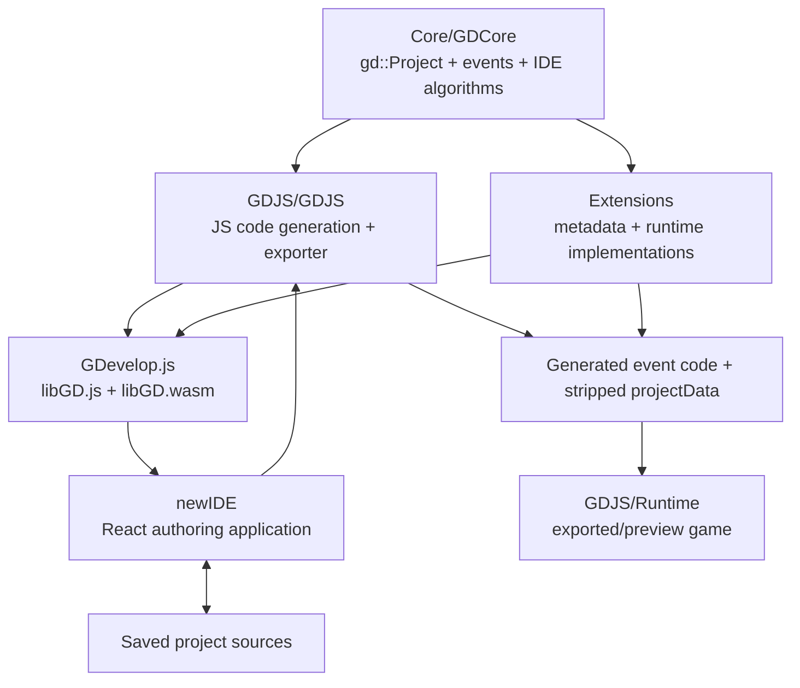

# GDevelop Architecture — Engineering Reference

Status: descriptive reference for contributors. This document explains the
architecture implemented by this checkout: the editor-time model, event
compiler, GDJS runtime, extension system, WebAssembly bridge, project formats,
editor, preview/export pipeline, and the branch-specific contracts layered on
top of upstream GDevelop.

Last code audit: 2026-07-19 at commit `c705809fd9` on branch `new-format`.
Paths are relative to the repository root. Symbols are named instead of tied to
line numbers because this codebase changes quickly.

Read `Core/GDevelop-Architecture-Overview.md` first for the short upstream
overview. Related focused references include:

- `docs/Constants.md` — project Constants and placeholder replacement.
- `docs/SignalSystem.md` — queued scene and direct-instance signals.
- `newIDE/docs/How-are-exporters-and-platforms-working.md` — exporters.
- `newIDE/docs/Properties-schema-and-PropertiesEditor-explanations.md` — property schemas.
- `newIDE/docs/Supported-JavaScript-features-and-coding-style.md` — editor/runtime JavaScript constraints.

> This branch differs materially from stock GDevelop. In particular, local
> projects default to a Git-oriented `project.gdevelop` source tree, Constants
> is compiled out of exports, preview/export applies additional validation, and
> the runtime contains a queued signal bus. Those behaviors are called out
> explicitly below.

## Table of contents

1. [System map and dependency boundaries](#1-system-map-and-dependency-boundaries)
2. [Core project model and scopes](#2-core-project-model-and-scopes)
3. [Events, instructions, and expressions](#3-events-instructions-and-expressions)
4. [Code generation and object picking](#4-code-generation-and-object-picking)
5. [GDJS runtime](#5-gdjs-runtime)
6. [Extensions, metadata, and platforms](#6-extensions-metadata-and-platforms)
7. [GDevelop.js: the C++/JavaScript bridge](#7-gdevelopjs-the-cjavascript-bridge)
8. [Serialization and project storage](#8-serialization-and-project-storage)
9. [Editor, preview, export, and hot reload](#9-editor-preview-export-and-hot-reload)
10. [Cross-cutting invariants](#10-cross-cutting-invariants)
11. [Build and test seams](#11-build-and-test-seams)
12. [End-to-end data flow](#12-end-to-end-data-flow)

---

## 1. System map and dependency boundaries

GDevelop is not one application with one object model. It is an authoring
system that compiles a C++ editor model into JavaScript data and code consumed
by a separate TypeScript runtime.

| Area                          | Primary directories                                                            | Language                       | Responsibility                                                                                                                                    |
| ----------------------------- | ------------------------------------------------------------------------------ | ------------------------------ | ------------------------------------------------------------------------------------------------------------------------------------------------- |
| Core model and IDE algorithms | `Core/GDCore`                                                                  | C++                            | Project tree, events AST, serialization, validation, refactoring, platform-neutral code-generation framework.                                     |
| GDJS platform                 | `GDJS/GDJS`                                                                    | C++                            | JavaScript-specific code generation, preview/export, and runtime function wiring.                                                                 |
| Game runtime                  | `GDJS/Runtime`                                                                 | TypeScript                     | Game loop, scenes, objects, behaviors, rendering, input, audio, resources, debugger, and runtime utilities.                                       |
| Feature extensions            | `Extensions`, `Core/GDCore/Extensions/Builtin`, `GDJS/GDJS/Extensions/Builtin` | C++, JS, TS                    | Object/behavior types and the actions, conditions, expressions, effects, dependencies, editor renderers, and runtime implementations they expose. |
| C++ bindings                  | `GDevelop.js`                                                                  | C++, WebIDL, JS                | Compiles Core, the GDJS platform, and C++ extensions to `libGD.js` plus `libGD.wasm`.                                                             |
| Editor                        | `newIDE`                                                                       | Flow-typed JS, React, Electron | Owns authoring workflows, UI state, storage providers, preview/export orchestration, and renderers for the scene editor.                          |
| Dependencies and build inputs | `ExtLibs`, `SharedLibs`, `ThirdParties`                                        | Mixed                          | Vendored C++ libraries, browser/runtime libraries, and separately packaged maintenance sources.                                                   |
| Generated outputs and tooling | `Binaries`, `scripts`                                                          | Mixed                          | Native/WASM build products and repository development/release scripts.                                                                            |



### The primary boundary: editor time versus runtime

Editor-time code describes a game. Runtime code executes a game.

- `gd::Project`, metadata, events, editor properties, refactoring, and exporters
  exist in C++ and are used through the WASM bridge by the editor.
- `gdjs.RuntimeGame`, `gdjs.RuntimeScene`, `gdjs.RuntimeObject`, and
  `gdjs.RuntimeBehavior` exist in the exported game.
- Events and metadata do not survive as executable runtime objects. Code
  generation turns them into plain JavaScript functions.
- The two sides meet at serialized data contracts and generated function names.

The duplicated variable model is the simplest example:

- `gd::Variable` in `Core/GDCore/Project/Variable.*` is authorable,
  serializable, refactorable, and undoable.
- `gdjs.Variable` in `GDJS/Runtime/variable.ts` is allocation-conscious runtime
  state initialized from exported data.

The same editor/runtime pairing exists for projects/games, layouts/scenes,
object definitions/runtime objects, behaviors, variables, and initial/runtime
instances.

### Two other boundaries to keep explicit

1. **Declaration versus implementation.** Metadata declares that a feature
   exists and how the editor presents it. A runtime function implements it.
   `SetFunctionName`/`setFunctionName` and include files join the two.
2. **Authoritative versus derived data.** `gd::Project` is authoritative while
   the editor is open. Saved project sources are authoritative on disk.
   generated `.gdevelop` catalogs, `data.js`, event code, and runtime bundles
   are projections and should be regenerated rather than hand-edited.

---

## 2. Core project model and scopes

The authoring model is a tree rooted at `gd::Project` in
`Core/GDCore/Project/Project.*`. Most model classes are ordinary C++ value types
or containers with `SerializeTo`/`UnserializeFrom` methods.

### Project ownership tree

```text
gd::Project
├── properties
│   ├── name, version, package, authors, categories
│   ├── resolution, FPS, scaling, orientation, loading screen
│   ├── projectUuid, platform selection, extension properties
│   └── folder-project and editor/export settings
├── resourcesContainer                       global resource definitions
├── objectsContainer                         global objects and object groups
├── variables                                global variables
├── constantsJson                           authoring-time structured constants
├── layouts[] : gd::Layout                   scenes
│   ├── objectsContainer                     scene objects and groups
│   ├── variables                            scene variables
│   ├── initialInstances                     placed instances
│   ├── layers, editor settings, effects
│   ├── events : gd::EventsList
│   └── behaviorsSharedData
├── externalLayouts[]
├── externalEvents[]
└── eventsFunctionsExtensions[]
    ├── eventsFunctions                      free functions
    ├── eventsBasedBehaviors                 custom behaviors
    ├── eventsBasedObjects                   custom objects/prefabs + variants
    ├── globalVariables / sceneVariables     extension-owned scopes
    └── folder and property metadata
```

Containers carry ownership and often a `SourceType`. `gd::ObjectsContainer`,
`gd::VariablesContainer`, `gd::ResourcesContainer`, and the various
`*Container`/`*List` helpers are central architectural primitives, not merely
convenience wrappers.

### Objects, configurations, and instances

`gd::Object` is a named definition with:

- a polymorphic `gd::ObjectConfiguration` for type-specific data;
- a `gd::BehaviorsContainer`;
- object variables;
- effects;
- identity and editor metadata.

Sprite animations, text settings, 3D model data, and custom-object
configuration therefore live behind the same object-definition API. Platform
metadata/factories create the correct configuration subtype during load.

An object definition is not an instance. A `gd::InitialInstance` references an
object definition by name and adds placement, layer, z-order, per-instance
properties, and a persistent UUID. At runtime it becomes a concrete
`gdjs.RuntimeObject` owned by a `RuntimeInstanceContainer`.

Custom objects use `gd::CustomObjectConfiguration` on the editor side and a
`gdjs.CustomRuntimeObject` with a nested
`CustomRuntimeObjectInstanceContainer` at runtime. The outer prefab is one
runtime object; its children live in an internal instance container.

### Variables, parameters, properties, and resources are scoped

`gd::VariablesContainer::SourceType` distinguishes global, scene, object,
local, extension-global, extension-scene, parameter, and property scopes.
`gd::Variable` is recursive: primitive, structure, or array.

Function parameters and events-based properties are projected into synthetic
variable/resource/object containers. This allows the same expression parser,
validator, autocompleter, and code generator to resolve an identifier without
hard-coding every authoring context.

`gd::ProjectScopedContainers` is the scope authority. Its factory methods build
the visible lists for:

- a project or scene;
- free extension functions;
- behavior functions;
- object/prefab functions;
- a custom-object definition;
- nested event-local variables.

It aggregates `ObjectsContainersList`, `VariablesContainersList`,
`PropertiesContainersList`, `ResourcesContainersList`, and parameter metadata.
For reusable events-based extensions it exposes extension-owned variables
rather than silently binding the function to a host project's globals.

### Properties are editor schemas, not general variables

`gd::PropertyDescriptor` and `gd::NamedPropertyDescriptor` carry values plus UI
and validation metadata such as label, description, type, unit, choices,
visibility, and quick-customization behavior. Object, behavior, shared,
instance, and events-based entity properties all use this abstraction.

Properties can generate actions, conditions, and expressions for events-based
entities. Their serialized keys are also used by this branch's multi-file
property catalogs to decide which attached behavior fields are authorable and
which hidden/internal fields must be excluded from source files.

### Names and identities

- Names are the authored join keys used by events, object groups, layout links,
  resources, behaviors, and function parameters. Project-wide renames must go
  through refactoring tools.
- `persistentUuid` identifies the same model element or initial instance across
  serialization, hot reload, source decomposition, and editor reconciliation.
  Some model types create it lazily; initial instances require stable UUIDs.
- `projectUuid` identifies the game/project and is surfaced as the storage
  `gameId`. Old projects missing it receive one while loading.
- Runtime objects have a numeric runtime unique ID. It is scene-lifetime state,
  distinct from an authoring `persistentUuid`, and is used by direct signals
  and debugger APIs.

---

## 3. Events, instructions, and expressions

Events are the source language compiled by GDevelop. Their model lives in
`Core/GDCore/Events`.

### Event and instruction model

`gd::BaseEvent` is the abstract block/scope. Concrete event types under
`Core/GDCore/Events/Builtin` include standard, while, repeat, for-each, link,
group, comment, and variable-child iteration events. Depending on type, an
event can own subevents, local variables, conditions, and actions.

`gd::EventsList` is an ordered list of shared event pointers. Layouts, external
events, and events-based functions all ultimately contain event lists.

Conditions and actions use the same `gd::Instruction` class. An instruction is
essentially:

```text
type string
+ ordered gd::Expression parameters
+ flags (inverted, disabled, awaited)
+ optional subinstructions (And/Or/Not structures)
```

The containing list and metadata lookup determine whether it is a condition or
an action. Its `type` string is resolved against condition/action metadata
registered by extensions.

### Expressions are parsed source, not opaque strings

`gd::Expression` retains the original text and lazily caches an AST created by
`gd::ExpressionParser2`. Nodes in `ExpressionParser2Node.h` cover literals,
operators, identifiers, variable accessors, function calls, object and behavior
calls, subexpressions, and error placeholders.

AST visitors are reused by:

- syntax/semantic validation;
- syntax coloring and diagnostics;
- autocompletion and identifier discovery;
- refactoring;
- `gd::ExpressionCodeGenerator`.

Source positions remain attached to nodes so editor diagnostics can identify a
precise parameter region instead of treating the whole instruction as invalid.

### Validation and refactoring are model operations

Core validators use `ProjectScopedContainers` plus extension metadata to check
instruction existence, parameter types, expressions, object/behavior
compatibility, and resource references. The editor adds a serialized event
scanner in `newIDE/app/src/Utils/EventsValidationScanner.js` for branch-specific
launch gates.

Renaming or deleting a referenced entity is not a string replacement in React.
`gd::WholeProjectRefactorer`, `ObjectRefactorer`, expression visitors, and
events workers update references across scenes, external events, extensions,
object groups, and properties.

---

## 4. Code generation and object picking

The compiler has a platform-neutral traversal in
`Core/GDCore/Events/CodeGeneration` and a JavaScript specialization in
`GDJS/GDJS/Events/CodeGeneration`.

### Compiler inputs and outputs

The compiler consumes:

- an events list;
- `ProjectScopedContainers`;
- extension metadata;
- an `EventsCodeGenerationContext` tracking scope, picked lists, local
  variables, async state, includes, and diagnostics.

It emits JavaScript plus a set of required runtime include files. Scene events
become a namespace with a `.func(runtimeScene)` entry. Events-based free
functions, behaviors, and objects become generated functions/classes whose
object, behavior, property, resource, and variable parameters are mapped
through an `eventsFunctionContext`.

### Metadata connects an instruction to code

`gd::MetadataProvider` resolves an instruction's type to
`gd::InstructionMetadata`. Its code information can supply:

- a synchronous and/or asynchronous function name;
- include files;
- getter/mutator/operator behavior;
- custom code-generation callbacks;
- static-versus-instance call information.

The ordinary path converts parameter types to JavaScript arguments, then emits
a free function call, object method call, or behavior method call. Custom code
generators are escape hatches and must maintain picking, async, diagnostics,
and include-file invariants themselves.

### Object picking is scoped list state

An object name in an event denotes a list of currently picked runtime
instances. Object groups expand to one list per concrete object name.

The normal sequence is:

1. `ObjectsListNeeded` records the list at the current scope depth.
2. A root list is filled from `runtimeScene.getObjects(name)` (or from an
   events-function context). A child scope copies or safely reuses its parent's
   list.
3. Object/behavior conditions compact the list in place and truncate it to the
   matching instances.
4. Subevents inherit the filtered selection. Independent sibling events have
   separate contexts. Loop events forbid unsafe list reuse.
5. Object and behavior actions iterate the picked list.

The characteristic condition loop is an allocation-free compaction:

```js
for (var i = 0, k = 0, l = objects.length; i < l; ++i) {
  if (objects[i].condition(args)) {
    objects[k++] = objects[i];
  }
}
objects.length = k;
```

An object action still uses list semantics:

```js
for (var i = 0, len = objects.length; i < len; ++i) {
  objects[i].action(args);
}
```

### Object picking and single-instance consumption

Picked object lists keep classic GDevelop runtime behavior:

- Scalar object/behavior expressions, object-variable access, and object
  pointers use the first picked instance when evaluated outside a current
  object loop.
- Runtime, editor, and MCP validation do not reject a picked list because it
  contains multiple instances.
- Conditions may consume multi-instance candidate lists because filtering them
  is their job.
- Normal object/behavior actions still intentionally iterate all picked
  instances. They are not globally converted into single-target operations.

Event authors can narrow scalar targets with picking conditions such as `Pick random` or `Pick nearest`, or use `For each object` when every instance needs
an isolated selection context. Without that narrowing, scalar consumers use
the first picked instance.

`GDJS/GDJS/Events/CodeGeneration/EventsCodeGenerator.cpp`, `GDJS/Runtime/gd.ts`,
and
`newIDE/app/src/Utils/EventsValidationScanner.js` are the implementation
authority for the current checkout.

The editor also blocks preview/export for enabled actions in a standard event
with no enabled condition, invalid constant placeholders, and unsafe
conditionless external-layout creation. These are authoring policy gates in
`newIDE/app/src/MainFrame` and the event scanner; they are not fundamental
upstream event AST rules. Enabled conditions on parent events, including
`For each object`, gate their nested standard events and do not need to be
duplicated locally.

### Parameters and expressions

`GenerateParametersCodes` maps metadata types to generated values:

- numeric/string expressions are parsed and generated from their AST;
- object/object-list parameters become maps of picked arrays;
- object pointers become one object or a bad-object fallback;
- variable/property/resource parameters resolve through scoped containers;
- operators and booleans become literals;
- code-only parameters inject runtime scene/context values;
- inline code is emitted verbatim only for the dedicated metadata type.

Text literals and supported instruction parameter strings can contain Static
Data placeholders. Replacement is enabled only when generation has a project
context; reusable metadata-only passes leave the source intact.

### Async actions

An awaited action selects `asyncFunctionCallName` when available. Generated
code uses `gdjs.TaskGroup` and `RuntimeScene`'s `AsyncTasksManager` to resume
subevents/callbacks later. Picked lists required after the async boundary are
copied into long-lived storage because the module-level scratch arrays are
reset and reused every frame.

### Generated code shape is performance-sensitive

Scene code is split into named subfunctions rather than one enormous closure.
Picked arrays, condition flags, and other scratch state are declared on the
generated namespace and reset for reuse. Function-mode generation keeps the
same algorithms but maps names through `eventsFunctionContext` instead of
directly querying the scene.

---

## 5. GDJS runtime

`GDJS/Runtime` is the game engine shipped to previews and exports. It consumes
`gdjs.projectData`, `gdjs.runtimeGameOptions`, generated event functions, and
extension/runtime include files.

### Boot and scene lifecycle

`gdjs.RuntimeGame` owns project data, global/extension variables, resource
loaders, input, renderer, scene stack, debugger clients, and game-loop policy.
`startGameLoop` chooses the initial scene, loads it through `SceneStack`, and
registers a frame callback with the Pixi renderer. The renderer schedules the
next `requestAnimationFrame`, calculates elapsed time, and invokes the runtime
callback; `RuntimeGame` handles FPS capping, pause/resume, crashes, and scene
stack stepping.

`gdjs.RuntimeScene` extends `gdjs.RuntimeInstanceContainer`. Its
`renderAndStep` order is a contract:

1. update time and process async tasks;
2. update objects, forces, timers, and behavior pre-events;
3. run registered pre-events callbacks (the signal bus dispatches here);
4. run generated scene events;
5. run behavior post-events;
6. run registered post-events callbacks;
7. render and emit debugger diagnostics;
8. let `SceneStack` apply a requested push, pop, replace, clear, or stop.

`RuntimeScene.loadFromScene` builds layers and variables, registers global then
scene object definitions, restores behavior shared data, creates initial
instances, assigns generated scene code, and fires scene-loaded callbacks.

### Instance containers, objects, and behaviors

`RuntimeInstanceContainer` owns:

- object definitions and cached constructors;
- live instances grouped by object name;
- a lazily rebuilt flat instance list;
- layers and behavior shared data;
- object recycle pools;
- a queue of removed instances awaiting safe destruction/reuse.

`createObject` reinitializes a cached instance when its constructor supports
recycling; otherwise it allocates a new runtime object. `deleteFromScene`
removes an object from live lookup immediately but defers destruction/recycling.
Generated code from the same frame may still hold the old object reference, so
freeing it synchronously would be unsafe.

`gdjs.RuntimeObject` owns transform, layer/z-order, variables, forces, hitboxes,
effects, lifecycle state, and attached behaviors. It keeps a lifecycle list for
behaviors that need per-frame calls and a table for all behavior lookups.

`gdjs.RuntimeBehavior` gates pre/post steps on activation and exposes lifecycle
hooks including `onCreated`, `onDestroy`, and this branch's `onSignal`.

### Capabilities and custom objects

Cross-object capabilities such as opacity, scaling, size, flipping, animation,
effects, and text are represented by interfaces plus default capability
behaviors under `GDJS/Runtime/object-capabilities`. Capability behaviors report
that they do not use lifecycle functions, avoiding a per-frame cost when they
only forward API calls to the owner.

`gdjs.CustomRuntimeObject` is both a runtime object and an owner of an internal
`CustomRuntimeObjectInstanceContainer`. Generated prefab lifecycle code steps
the nested children and generated object events. Variants choose different
serialized child layouts while preserving the public object type.

### Queued signal bus (branch-specific)

`GDJS/Runtime/events-tools/signaltools.ts` installs one lazy `SignalBus` per
runtime scene. It has exactly two destinations:

- a scene broadcast;
- one runtime object instance ID.

Signal actions enqueue only. At the next frame's pre-events callback the bus
swaps the pending queue into a fixed delivery batch, preserving FIFO order.
Signals emitted by a handler go into the new pending queue and therefore wait
for another frame; delivery is never recursively re-entrant.

Scene signals are visible to generated scene-event conditions and to explicitly
subscribed prefab/behavior receivers. Direct signals invoke only the targeted
custom object's `onSignal`; they do not broadcast and do not notify its
behaviors. Subscriptions are receiver-instance-specific, checked at delivery
time, and removed when the receiver is destroyed.

The bus throttles oversized delivery batches, retains the tail in FIFO order,
and produces debugger/animation records. Runtime signal IDs and target object
IDs are transient scene state, not saved project identity.

### Runtime performance conventions

Hot paths deliberately favor predictable allocation and hidden-class behavior:

- reuse picked arrays, forces, variables, and eligible runtime objects;
- defer deletion to safe drain points;
- cache flattened lists, constructors, hitboxes, AABBs, and renderer data;
- invalidate caches only when a mutation requires it;
- intern frequently compared names;
- separate lifecycle-bearing behaviors from lookup-only behaviors;
- use bad-object/bad-variable no-op sentinels to avoid repeated null branches;
- cull rendering against camera bounds.

These constraints apply to `GDJS/Runtime` and extension runtime code. They do
not imply that React editor code must use the same low-allocation style.

---

## 6. Extensions, metadata, and platforms

Most user-facing features are registered by extensions. Core supplies the
model and compiler framework; extensions supply vocabulary and implementations.

### Platform registry and factories

`gd::Platform` owns loaded `gd::PlatformExtension` objects and factories for
object configurations, behaviors, events, and related polymorphic model types.
The concrete `gdjs::JsPlatform` singleton loads builtins and receives JavaScript
and events-based extensions from the editor.

`gd::PlatformExtension` is a fluent metadata builder. It declares:

- actions and conditions (`InstructionMetadata`);
- number/string expressions (`ExpressionMetadata`);
- object types (`ObjectMetadata`);
- behavior types (`BehaviorMetadata`);
- effects, dependencies, extension properties, groups, and icons.

Instruction/expression type strings are namespaced by extension and are the
serialized API. Renaming one is a project-format migration, not a UI-only
change.

### Metadata is used by several subsystems

Metadata drives more than the instruction picker:

- editor sentences and parameter fields;
- type checking and expression return types;
- scope/resource discovery;
- code generation and include collection;
- object/behavior factories;
- refactoring and diagnostics;
- this branch's generated instruction/settings catalogs.

`ValueTypeMetadata` and `ParameterMetadata` classify number, string, boolean,
operator, object, behavior, variable/property, resource, layer/camera, and
specialized editor fields. Adding a type often requires coordinated changes in
Core classification, code generation, and
`newIDE/app/src/EventsSheet/ParameterRenderingService.js`.

### Three extension implementation paths

1. **Builtin C++ declarations.** Core builtin extensions declare portable
   vocabulary. GDJS builtin subclasses attach JavaScript function names and
   strip unsupported entries.
2. **Repository JavaScript extensions.** `Extensions/<Name>/JsExtension.js`
   constructs a `gd.PlatformExtension` in the editor and references TS/JS
   runtime files with include paths. It may also register an editor properties
   configuration and scene-editor instance renderer.
3. **Events-based extensions.** The project stores functions, behaviors, and
   objects as `gd::EventsFunctionsExtension` data. The editor's
   `EventsFunctionsExtensionsLoader` first registers metadata for every
   extension, then performs full code generation so cross-extension references
   can resolve. Generated extensions are copied into `JsPlatform` and temporary
   WASM wrappers are deleted.

Runtime include collection is demand-driven: using an instruction, object,
behavior, or effect adds its declared files. Exporters then copy/build only the
required engine/extension surface plus mandatory runtime libraries.

---

## 7. GDevelop.js: the C++/JavaScript bridge

The React editor does not reimplement the C++ project model. `GDevelop.js`
builds it into `libGD.js` and `libGD.wasm` with Emscripten.

### Binding pipeline

1. `GDevelop.js/Bindings/Bindings.idl` declares exposed interfaces, methods,
   enums, and inheritance.
2. `GDevelop.js/update-bindings.js` runs Emscripten's WebIDL binder and patches
   generated `GDevelop.js/Bindings/glue.cpp` and
   `GDevelop.js/Bindings/glue.js`.
3. `GDevelop.js/Bindings/Wrapper.cpp` includes C++ headers and generated glue.
   Prefix
   conventions such as `WRAPPED_`, `STATIC_`, `MAP_`, `FREE_`, and `CLONE_`
   adapt C++ ownership and signatures to WebIDL limitations.
4. `GDevelop.js/Bindings/postjs.js` normalizes method names, installs helper
   wrappers, tracks selected object lifetimes, and detects use after free.
5. The build copies `libGD.*` to the editor and regenerates Flow declarations
   under `GDevelop.js/types` plus `GDevelop.js/types.d.ts`.

The root CMake graph builds `GDCore`, the C++ `GDJS` platform, selected C++
extensions, and finally the Emscripten executable target. `GDevelop.js/Gruntfile.js`
orchestrates CMake, Ninja/Make, binding generation, copying, and type generation.

### Ownership is manual across the bridge

A JS wrapper contains a pointer into the WASM heap. JavaScript garbage
collection does not destroy the C++ object.

- Delete an object created with `new gd.X()` or returned as an owned clone.
- Do not delete a borrowed child owned by a project/container.
- If an API copies a temporary (for example `JsPlatform.addNewExtension`),
  delete the temporary wrapper after the call.
- Never retain a borrowed wrapper beyond the lifetime of its parent.

`GDevelop.js/Bindings/postjs.js` caches wrappers and raises
`UseAfterFreeError` for tracked invalid accesses. This improves diagnostics but
does not replace correct ownership.

### Changing an exposed C++ API

A typical binding change touches the C++ declaration/implementation,
`Bindings.idl`, regenerated glue, generated Flow/TypeScript declarations, and
bridge tests under `GDevelop.js/__tests__`. Hand edits to generated glue or type
files will be overwritten.

---

## 8. Serialization and project storage

There are two separate concerns:

1. Core serializes the in-memory project to one logical tree.
2. Storage providers decide how that tree is represented on disk or in cloud
   storage.

### Logical serialization tree

`gd::SerializerElement` is a recursive value/dictionary/array representation.
`gd::Serializer` converts it to/from JSON using RapidJSON. Model types follow a
duck-typed convention:

```cpp
void SerializeTo(gd::SerializerElement& element) const;
void UnserializeFrom([gd::Project& project,]
                     const gd::SerializerElement& element);
```

A project argument is supplied when load requires extension metadata or model
factories. There is no universal `Serializable` base class.

Backward compatibility is decentralized. `Get*Attribute` can fall back from a
current key to a deprecated attribute/child name, and individual
`UnserializeFrom` implementations normalize older shapes. `gdVersion` warns
about newer producers but is not a central schema migration engine.

This branch adds `gd::Serializer` canonical mode. It stabilizes key order and
emits selected default event fields for source-friendly diffs. The editor
temporarily enables it through `newIDE/app/src/Utils/Serializer.js` when
requested.

### Local project representations

| Representation            | Entry                                           | Status in this checkout                                                                                            |
| ------------------------- | ----------------------------------------------- | ------------------------------------------------------------------------------------------------------------------ |
| Single JSON               | arbitrary `*.json`                              | Legacy input/output path supported by the serializer/storage layer.                                                |
| Split JSON folder project | a JSON entry plus referenced `*.json` fragments | Legacy format using `ObjectSplitter` and `__REFERENCE_TO_SPLIT_OBJECT`. Still readable; not the new source format. |
| Multi-file source project | `project.gdevelop`                              | Primary local authoring format; version 5 TOML settings with embedded layout subtrees plus IfDo event files.       |

Opening a legacy single-JSON project normalizes it through the current libGD
serializer, decomposes it directly to version 5 next to the source, verifies a
compose round trip, and redirects the open file metadata to
`project.gdevelop`. Production does not read version 3 or 4 folder projects.

Packaged desktop builds associate `.gdevelop` with GDevelop. Windows and Linux
open the selected document through the positional project argument; macOS
queues Finder `open-file` events received before application readiness and
routes later events immediately. Launch arguments are retained per editor
window so simultaneous document requests cannot select the wrong project.
Only the exact canonical basename `project.gdevelop` is a valid multi-file
entry.

### Multi-file source tree

`newIDE/app/src/ProjectsStorage/MultiFileProjectFormat/index.js` owns the pure
logical projection between the legacy-shaped JS object and source documents.
`newIDE/app/src/ProjectsStorage/LocalFileStorageProvider/LocalMultiFileProject.js`
owns filesystem discovery, URI/path safety, transactions, and migration.

A representative source tree is:

```text
project.gdevelop
resources.settings
constants.toml
objects/<encoded-name>.settings
scenes/<encoded-name>/
  scene.settings
  objects/<encoded-name>.settings
  functions/<lifecycle>.settings
  functions/<lifecycle>.events
  external-events/<encoded-name>/
    external-events.settings
    functions/<lifecycle>.settings
    functions/<lifecycle>.events
  external-layout/<encoded-name>.settings
extensions/<encoded-name>/extension.settings
extensions/<encoded-name>/functions/<encoded-name>.settings|.events
extensions/<encoded-name>/behaviors/<encoded-name>/
  behavior.settings
  functions/<encoded-name>.settings|.events
extensions/<encoded-name>/prefabs/<encoded-name>/
  prefab.settings
  objects/<encoded-name>.settings
  functions/<encoded-name>.settings|.events
  variants/<encoded-name>/
    variant.settings
    objects/<encoded-name>.settings
```

- `*.settings` and `constants.toml` use TOML. Layout-bearing owners embed the
  strict layout schema below `[layout]`; there are no managed `.layout` files.
- `*.events` uses the IfDo DSL in
  `newIDE/app/src/EventsSheet/IfDoEventsDsl`.
- Physical owner paths derive component association. Same-stem function event
  bodies and embedded layouts do not use URI fields.
- Every managed `.events` file is a function body and has a same-stem
  `.settings` file in the same `functions/` directory.
- Display names are encoded into portable, case-safe physical segments.
- Objects remain first-class sources below a dedicated `objects/` directory in
  every object-owning scope, including named prefab variants.
- Logical function/object grouping is stored as a `folder` value inside each
  first-class component, not as redundant nested function directories.

The converter rejects unknown ownership, duplicate references, path escapes,
non-canonical URIs, malformed namespaces, unsupported versions, and values that
cannot round-trip. Every save decomposes the current project, recomposes it in
memory, and compares normalized projects before touching authoring sources.

### Transactional local writes

`writeMultiFileSourceTree` serializes concurrent writes per project root and
only writes changed managed URIs. A transaction is staged under
`.gdevelop/transactions/<id>` with flushed files, backups, and a journal.
Managed files are committed in dependency order, with `project.gdevelop` last.
Failures restore backups; opening a project recovers any interrupted staged or
committed transaction. Obsolete managed files and now-empty owned directories
are removed without deleting user-owned files.

Reader safety limits bound ordinary sources to 16 MiB, layout-bearing composite
owner settings to 32 MiB, total composed size, and managed file count. URI
resolution checks lexical containment and existing real paths so symlinks
cannot escape the project root.

### Generated `.gdevelop` artifacts

A multi-file save also regenerates editor/tooling projections:

- `.gdevelop/instructions-catalog.json` and the deprecated instruction catalog;
- `.gdevelop/settings-catalog.json`, including settings and embedded-layout
  authoring schemas and owner contexts;
- `.gdevelop/runtime-api.d.ts` and `project-api.d.ts`;
- `.gdevelop/game.json`, a legacy-shaped compatibility projection without
  Constants;
- autosave and transaction state in dedicated subdirectories.

These files support IfDo name resolution, AI/MCP authoring, validation,
JavaScript blocks, compatibility consumers, and recovery. They are derived from
the project plus loaded metadata. Do not make them the only home of authored
state.

### Constants is compile-time project data

Core stores arbitrary Constants as a JSON string on `gd::Project`, but project
serialization omits it. Every storage provider persists the values in the
unwrapped TOML root of `constants.toml`.

`{{path.to.value}}`, numeric array segments, and quoted bracket segments are
resolved by `Project::ResolveConstantPlaceholders`. Validation, event code
generation, generated object/behavior property code, and export-time serialized
project traversal all use the same resolver. Missing paths produce diagnostics
and block preview/export.

The map never enters exported project data. Constants is therefore
authoring/compile-time configuration, not a runtime database or mutable
`gdjs.RuntimeGame` subsystem.

### Runtime project data is a stripped projection

`GDJS/GDJS/IDE/ExporterHelper.cpp` clones/strips editor-only content, determines
project/scene resources, resolves Constants, and serializes the runtime shape.
`data.js` assigns `gdjs.projectData` and `gdjs.runtimeGameOptions`. Runtime
interfaces in `GDJS/Runtime/types/project-data.d.ts` describe this projection;
they are not a promise that every editor JSON field is shipped.

Resource definitions store paths relative to the project and are referenced by
name from objects/scenes. Export copies or transforms the actual files and adds
used-resource lists rather than embedding resource binaries in the authoring
tree.

---

## 9. Editor, preview, export, and hot reload

The editor is a React 18 application under `newIDE/app/src`, typed primarily
with Flow. It runs in browser and Electron shells.

### Startup and application shell

`newIDE/app/src/index.js` loads `libGD.js`, initializes the WASM module, assigns
`global.gd`, then renders the selected local/browser application. `LocalApp.js`
and `BrowserApp.js` inject environment-specific storage, preview, authentication,
resource, and export services into `MainFrame`.

`newIDE/app/src/MainFrame/index.js` is a large functional
component/orchestrator. It owns the current `gdProject`, editor tabs/panes,
open/save/autosave, project manager, preview/export state, diagnostics,
extension reloads, hot reload, preferences, and version-history integration.

Tabs are represented by editor-container classes in
`newIDE/app/src/MainFrame/EditorContainers`. Containers adapt a domain editor
to common tab lifecycle, selection, undo, navigation, and project services.
Major domain areas include:

| Area                            | Primary directories                                                                       |
| ------------------------------- | ----------------------------------------------------------------------------------------- |
| Scene and instance placement    | `SceneEditor`, `InstancesEditor`, `LayersList`, `ObjectsList`                             |
| Events and expressions          | `EventsSheet`, `InstructionOrExpression`, `ExpressionAutocompletion`                      |
| Objects and behaviors           | `ObjectEditor`, `BehaviorsEditor`, `CompactPropertiesEditor`                              |
| Events-based extensions/prefabs | `EventsFunctionsExtensionEditor`, `PrefabDetailEditor`, `EventsFunctionsExtensionsLoader` |
| Resources and project files     | `ResourcesEditor`, `ResourcesList`, `ProjectsStorage`                                     |
| Constants                       | `Constants`, `ConstantsEditorContainer`                                                   |
| Preview/debug/in-game editing   | `ExportAndShare`, `EmbeddedGame`, `Debugger`, `HotReload`                                 |

### The editor works on C++ objects through wrappers

Files commonly bind `const gd: libGDevelop = global.gd`. React components may
read or mutate model children through borrowed wrappers, but ownership rules
from section 7 apply. Long-lived/cancelable dialogs use
`newIDE/app/src/Utils/SerializableObjectCancelableEditor.js` to clone, restore,
and dispose temporary model objects safely.

`newIDE/app/src/Utils/Serializer.js` is the primary bridge between a WASM model
object and a plain JS snapshot. Undo/redo in
`newIDE/app/src/Utils/History.js` stores serialized before/after snapshots and
restores through unserialization rather than maintaining an inverse command
for every mutation.

### Editor rendering is separate from game rendering

The scene editor uses PixiJS/Three.js renderers registered through
`ObjectsRenderingService`. A `RenderedInstance` visualizes an initial instance
and exposes editor handles. The exported game uses a runtime object renderer.
An object type can therefore require:

- an editor model configuration;
- an editor instance renderer/properties editor;
- a runtime object and runtime renderer.

Keeping these separate prevents editor selection handles, previews, and
property affordances from leaking into exported runtime code.

### Preview and export pipeline

Before preview/export, `MainFrame` runs the serialized event scanner and native
diagnostic generation. Branch-specific hard errors include invalid Constants,
ambiguous single-target object parameters, conditionless actions, and unsafe
external-layout creation.

The local/browser preview launchers then call the WASM `gd.Exporter`/
`ExporterHelper` surface to:

1. generate extension and scene event code;
2. collect required includes and resources;
3. strip and serialize runtime project/options data;
4. write/patch `data.js`, scripts, assets, and `index.html`;
5. launch the game with debugger/preview options.

Local and service-worker/S3 preview paths use different filesystem transports
but the C++ generation contracts are shared. Preview launchers may patch
preview-only data (for example global object-group data) that the normal
project stripper excludes.

The debugger client and hot reloader update a running preview when compatible
project or generated-code changes occur. Persistent instance UUIDs support
reconciliation; structural changes can still require a scene/game reload.

---

## 10. Cross-cutting invariants

1. **Editor and runtime models are different systems.** Connect them through
   serialized contracts and generated code, never by making runtime code depend
   on `gd::Project`.
2. **Metadata type strings and serialized names are APIs.** Changing them needs
   migration/refactoring and compatibility tests.
3. **Names select; UUIDs reconcile.** Events usually refer to names. Persistent
   UUIDs preserve identity across saves, source projections, and hot reload.
4. **Scopes come from `ProjectScopedContainers`.** Do not reconstruct partial
   scope rules ad hoc in a UI component or code generator.
5. **Picking is inherited list state.** Conditions narrow, subevents inherit,
   actions iterate, and scalar/single-target consumers use the first picked
   instance outside a current-object loop.
6. **WASM wrappers have manual ownership.** Delete owned temporaries, never
   borrowed children, and do not outlive parents.
7. **Project compatibility is read-time normalization.** Keep old-key fallbacks
   and localized compatibility branches when changing the logical schema.
8. **The multi-file tree must round-trip before commit.** Preserve ownership,
   canonical URIs, deterministic names, transaction recovery, and generated
   catalog regeneration.
9. **Constants disappears at runtime.** Resolve placeholders everywhere an
   authored string/property enters generated or exported data, then remove the
   source tree.
10. **Signals cross a frame boundary.** Emission is queued; delivery is FIFO in
    pre-events; handler emissions wait another frame; destroyed receivers are
    not called.
11. **Deletion is deferred in runtime containers.** A removed object can remain
    referenced by generated code until a safe drain point.
12. **Runtime performance is deliberate.** Reuse arrays and instances, cache
    derived data, and avoid allocations in per-frame extension code.
13. **Flow and TypeScript coexist.** The editor is primarily Flow; runtime and
    extension implementations are TypeScript. Binding declarations are
    generated for both ecosystems.

---

## 11. Build and test seams

The repository has several build systems because it produces native C++
libraries, a WASM authoring library, a TypeScript runtime, a React web app, and
Electron packages.

| Change area                    | Main build/check                                                        | Tests that exercise the seam                                                                        |
| ------------------------------ | ----------------------------------------------------------------------- | --------------------------------------------------------------------------------------------------- |
| Core model, parser, refactorer | Root CMake; `GDCore_tests` target                                       | `Core/tests` (Catch2)                                                                               |
| JS code generation or bindings | `cd GDevelop.js && npm run build`                                       | `GDevelop.js/__tests__` via Jest                                                                    |
| Runtime or TS extension        | `cd GDJS && npm run check-types` and `npm run build`                    | `cd GDJS/tests && npm test` (Karma/Mocha, headless browser) plus extension specs                    |
| Editor/UI/storage              | `cd newIDE/app && npm run flow`, `npm run lint`, `npm run check-format` | `npm test` / targeted `*.spec.js`; Storybook for visual states                                      |
| Electron integration           | `newIDE/electron-app` package scripts                                   | `newIDE/electron-app/test`                                                                          |
| Multi-file format              | Editor Jest suite                                                       | `MultiFileProjectFormat`, `LayoutToml`, `IfDoEventsDsl`, `LocalMultiFileProject`, and catalog specs |

`newIDE/app`'s install/import scripts copy or build the GDJS runtime, extensions,
themes, editor resources, and `libGD` into the app's public resources. A runtime
or JS extension edit can often be rebuilt by the development watcher; a C++ or
IDL edit requires rebuilding GDevelop.js.

### Change-impact checklist

When a logical project field changes, audit all of these rather than stopping
at the declaring class:

1. C++ copy/assignment, `SerializeTo`, and `UnserializeFrom`.
2. Compatibility behavior for old projects.
3. `Bindings.idl` and generated Flow/TypeScript bindings if exposed.
4. Editor property/schema UI, refactoring, undo, and storage behavior.
5. Multi-file decompose/compose ownership and round-trip tests.
6. Export stripping/placeholder/resource behavior.
7. `project-data.d.ts` and runtime loader if the field survives export.
8. Preview/hot-reload/debugger handling.

When an instruction parameter type changes, audit metadata classification,
parameter rendering, validation/autocompletion, code generation, source
catalogs/IfDo formatting, runtime signature, and extension tests.

---

## 12. End-to-end data flow

Consider a scene event: “when `Player` is on the floor, set its Y position to
100.”

1. **Authoring.** `EventsSheet` creates a standard event containing condition
   and action `gd::Instruction` values. Parameters are `gd::Expression` source.
   `ProjectScopedContainers` supplies visible objects, variables, properties,
   and resources. The placed `Player` is a `gd::InitialInstance`.
2. **In-memory model.** The event belongs to the layout's `gd::EventsList`
   inside the current WASM `gd::Project`. React holds UI state and borrowed
   wrappers; the C++ model is authoritative.
3. **Save.** Core serializes one logical project tree. For a
   `project.gdevelop` project, the editor decomposes it into TOML/layout/IfDo
   sources, recomposes and compares it, transactionally commits changed files,
   and regenerates `.gdevelop` catalogs and declarations.
4. **Preflight.** Preview/export scans serialized events and runs native code
   generation diagnostics. Invalid branch-specific contracts stop the launch
   and open a navigable diagnostic report.
5. **Compilation.** `JsPlatform` resolves instruction metadata.
   `gdjs::EventsCodeGenerator` creates a picked `Player` array, emits a
   filtering loop for the floor condition, then emits an action loop calling
   `setY(100)` for every remaining picked player. If the event instead evaluated
   scalar `Player.X()` outside a current-object loop, generated code would read
   the first picked instance.
6. **Runtime projection.** `ExporterHelper` resolves Constants, strips editor
   content, computes used resources, writes generated scene/extension code, and
   produces `data.js` with `gdjs.projectData` and runtime options.
7. **Boot.** `RuntimeGame` loads the first scene through `SceneStack`.
   `RuntimeScene.loadFromScene` registers definitions, creates runtime objects
   from initial instances, and attaches the generated events function.
8. **Frame.** The renderer drives `RuntimeScene.renderAndStep`: async tasks and
   object pre-events run, queued signals dispatch, generated events filter and
   act on the picked list, behavior post-events run, then PixiJS/Three.js render.
9. **Mutation and cleanup.** Runtime state changes do not mutate the authoring
   `gd::Project`. Deleted runtime objects leave live lookup immediately but are
   destroyed or recycled only at a safe cleanup point.

The architectural essence is the collapse from a rich, serializable,
metadata-driven authoring tree into stripped data plus specialized imperative
JavaScript loops. The exported game contains the result of authoring—not the
authoring system itself.

### Scene lifecycle event functions

Each `gd::Layout` and `gd::ExternalEvents` owns four fixed, real
`gd::EventsFunction` bodies: `sceneLoad`, `sceneSignal`, `sceneUpdate`, and
`sceneUnload`. `Layout::GetEvents()` and `ExternalEvents::GetEvents()` remain
compatibility aliases for `sceneUpdate`. Project walkers, refactorers, search,
validation, code generation, and source tooling traverse all four functions
with `(owner, lifecycle role)` identity.

At runtime, load executes once before the first logical update; queued scene
signals invoke signal once per delivered broadcast before update; update runs
once per logical frame; unload runs once, synchronously, before scene-owned
state is destroyed. Links preserve the caller lifecycle role when resolving a
scene or External Events target. The normative design and migration contract is
in `docs/scene-event-phases-spec.md`.

---

## Source map

| Concern                         | Primary locations                                                                                                                                                                                                                                                         |
| ------------------------------- | ------------------------------------------------------------------------------------------------------------------------------------------------------------------------------------------------------------------------------------------------------------------------- |
| High-level vocabulary           | `Core/GDevelop-Architecture-Overview.md`                                                                                                                                                                                                                                  |
| Project model and scopes        | `Core/GDCore/Project`, especially `Project`, `Layout`, `Object`, `InitialInstance`, `ProjectScopedContainers`                                                                                                                                                             |
| Events and expressions          | `Core/GDCore/Events`, `Core/GDCore/IDE`                                                                                                                                                                                                                                   |
| Base and JS code generation     | `Core/GDCore/Events/CodeGeneration`, `GDJS/GDJS/Events/CodeGeneration`                                                                                                                                                                                                    |
| Picking assertions              | `GDJS/GDJS/Events/CodeGeneration/EventsCodeGenerator.*`, `GDJS/Runtime/gd.ts`, `newIDE/app/src/Utils/EventsValidationScanner.js`                                                                                                                                          |
| Runtime lifecycle               | `GDJS/Runtime/runtimegame.ts`, `GDJS/Runtime/runtimescene.ts`, `GDJS/Runtime/scenestack.ts`, `GDJS/Runtime/RuntimeInstanceContainer.ts`, `GDJS/Runtime/runtimeobject.ts`, `GDJS/Runtime/runtimebehavior.ts`                                                               |
| Custom objects and capabilities | `GDJS/Runtime/CustomRuntimeObject*`, `GDJS/Runtime/object-capabilities`                                                                                                                                                                                                   |
| Signal system                   | `GDJS/Runtime/events-tools/signaltools.ts`, `docs/SignalSystem.md`                                                                                                                                                                                                        |
| Extensions and metadata         | `Core/GDCore/Extensions`, `GDJS/GDJS/Extensions`, `Extensions`, `newIDE/app/src/EventsFunctionsExtensionsLoader`                                                                                                                                                          |
| WASM bindings                   | `GDevelop.js/Bindings`, `GDevelop.js/Gruntfile.js`, `GDevelop.js/types`, `GDevelop.js/types.d.ts`                                                                                                                                                                         |
| Logical serialization           | `Core/GDCore/Serialization`, model `SerializeTo`/`UnserializeFrom` methods                                                                                                                                                                                                |
| Multi-file source format        | `newIDE/app/src/ProjectsStorage/MultiFileProjectFormat`, `newIDE/app/src/ProjectsStorage/LayoutToml`, `newIDE/app/src/ProjectsStorage/LocalFileStorageProvider/LocalMultiFileProject.js`, `newIDE/app/src/ProjectsStorage/LocalFileStorageProvider/LocalProjectWriter.js` |
| Source catalogs/APIs            | `newIDE/app/src/ProjectsStorage/ProjectSourceCatalog.js`, `newIDE/app/src/ProjectsStorage/JavaScriptAuthoringApi.js`, `newIDE/app/src/EventsSheet/IfDoEventsDsl/ProjectInstructionCatalog.js`                                                                             |
| Constants                       | `Core/GDCore/Project/Project.*`, `newIDE/app/src/Constants`, `docs/Constants.md`                                                                                                                                                                                          |
| Preview and export              | `GDJS/GDJS/IDE/Exporter*`, `newIDE/app/src/ExportAndShare`, `newIDE/app/src/HotReload`, `newIDE/app/src/EmbeddedGame`                                                                                                                                                     |
| Editor shell                    | `newIDE/app/src/index.js`, `newIDE/app/src/LocalApp.js`, `newIDE/app/src/BrowserApp.js`, `newIDE/app/src/MainFrame`, domain editor directories                                                                                                                            |
