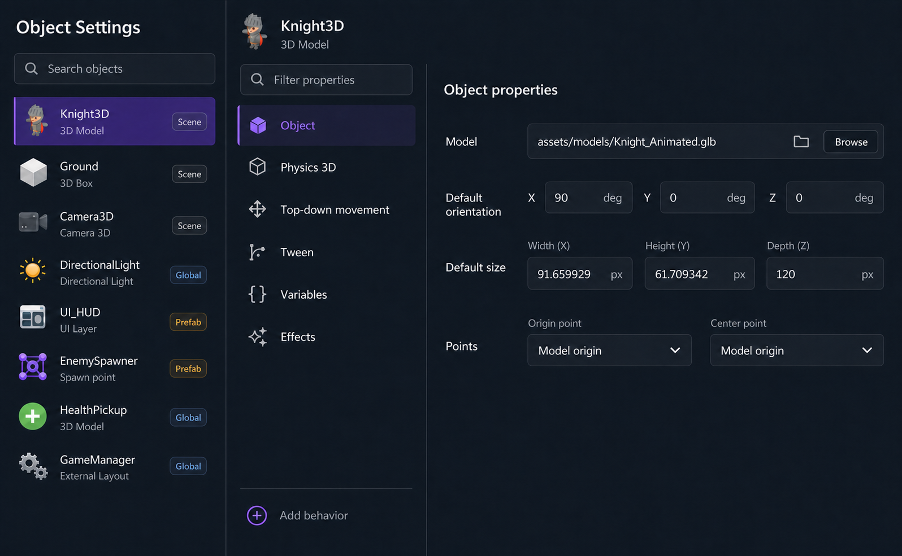
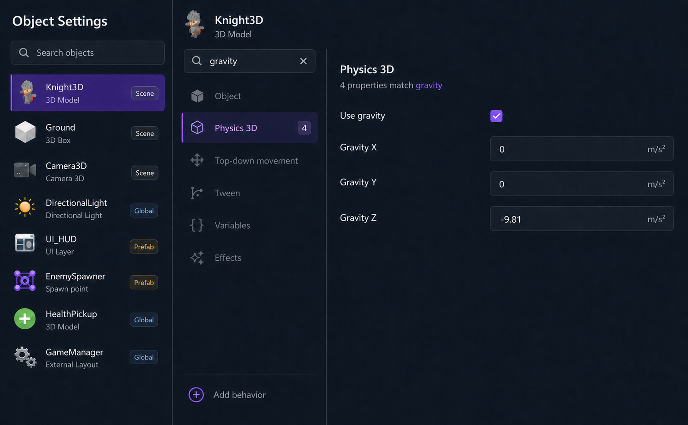

# Object Settings: three-area editor redesign

**Status:** focused UX/UI specification  
**Audience:** GDevelop product, design, IDE, extension, and QA teams  
**Primary surface:** desktop scene editor  
**Scope:** object properties, behaviors, variables, and effects

## Decision

Make Object Settings a persistent main screen with three functional areas:

1. **Objects:** a unified searchable object list with an origin badge on every
   row on the far left.
2. **Property sources:** a property filter followed by `Object`, every attached
   behavior, `Variables`, and `Effects` in a vertical middle list.
3. **Details:** the selected source's editable form on the right.

This moves the former horizontal `Object / Behavior / Variables / Effects`
navigation into the middle column. Behaviors are independent peer rows, so an
object with several behaviors never creates nested tabs or accordions.



## Core interaction

```text
+----------------------+-----------------------------------------------+
| Object Settings      | Knight3D - 3D Model                           |
| [ Search objects   ] +----------------------+------------------------+
|                      | [ Filter properties ]| Object properties      |
| > Knight3D [Scene]   |                      |                        |
|   Ground   [Scene]   | > Object             | Model        [ ... ]  |
|   Camera3D [Scene]   |   Physics 3D         | Orientation  [X Y Z]  |
|   Light    [Global]  |   Top-down movement  | Size         [W H D]  |
|   HUD      [Prefab]  |   Tween              | Points       [ ... ]  |
|   Spawner  [Prefab]  |   Variables          |                        |
|   Pickup   [Global]  |   Effects            |                        |
|   Manager  [Global]  |                      |                        |
|                      | + Add behavior       |                        |
+----------------------+----------------------+------------------------+
```

The screen answers three questions from left to right:

- **Which object?**
- **Which property source?**
- **Which values?**

Changing any selection updates the adjacent area without opening a modal. Only
one detail form is visible at a time.

## Why this fixes the current workflow

The current full editor requires users to open one object, switch category
tabs, expand one behavior accordion at a time, scroll, then close the editor to
find another object. Large objects and objects with several behaviors multiply
those hidden states.

The proposed screen removes them:

| Current pattern | Proposed pattern |
| --- | --- |
| One modal per object | Persistent object list |
| Scene and Global views | One badged effective object list |
| Horizontal category tabs | Vertical property-source list |
| One Behaviors container | One row per attached behavior |
| Behavior accordions | One selected behavior form |
| Long unfiltered forms | Cross-source property filter |
| Apply or cancel the modal | Direct editing with Undo/Redo and Save |

## Information architecture

### Area A: unified object list

The far-left column is the existing object-selection concept promoted into the
main Object Settings screen.

It contains:

- Heading `Object Settings`.
- Search input `Search objects`.
- Scrollable object rows with icon, name, muted type label, and origin badge.
- One selected object at a time.

Scene, global, and prefab-owned objects are presented as one effective
collection:

- Do not show Scene/Global tabs.
- Do not group rows by scope.
- Add exactly one origin badge to every object row: `Scene`, `Global`, or
  `Prefab`.
- If a global object is shadowed by a same-named scene object, show only the
  effective scene object, consistent with scene resolution.
- Preserve the user's object-list order. Search matches name, type, origin
  label, and prefab owner name when available.

#### Object origin badges

The badge communicates where the object definition is owned without splitting
the list into separate views:

| Badge | Meaning |
| --- | --- |
| `Scene` | Defined directly by the current scene/layout |
| `Global` | Defined in the project's global object collection |
| `Prefab` | Defined inside the prefab/custom-object definition being edited |

Badge rules:

- Show one badge at the far-right edge of every row, aligned with the object
  name. Keep the muted object type on the second line.
- Use exact title-case labels: `Scene`, `Global`, and `Prefab`.
- Use ownership metadata, not the currently selected object instance, to
  determine the label. A child defined inside a prefab remains `Prefab` when
  that prefab is used by a scene.
- Badges are informational and not clickable. They do not receive a separate
  keyboard stop.
- A badge tooltip may add context: `Defined in this scene`, `Defined globally`,
  or `Defined in prefab {name}`.
- Do not sort, group, or filter objects automatically by badge.
- Searching for `scene`, `global`, or `prefab` filters to that origin.

Selecting an object updates the workspace header, source list, and detail pane
in place. The screen must not close, navigate away, or show an intermediate
loading page.

Recommended width: 300 to 340 px. It scrolls independently from the other two
areas.

### Workspace header

The selected object's icon, name, and type appear above Areas B and C. The
header remains visible when either list or form scrolls.

The header is informational, not another object picker. All object switching
happens in Area A.

### Area B: property filter and source list

The middle column is 250 to 290 px wide. Its first control is always the
`Filter properties` input. The input belongs to this column and must not span
the detail pane.

Below the filter, render a flat source list in this order:

1. `Object`
2. Every behavior attached to the selected object, in stored order
3. `Variables`
4. `Effects`
5. `Add behavior`

For example:

```text
Object
Physics 3D
Top-down movement
Tween
Variables
Effects
----------------
+ Add behavior
```

There is no parent `Behaviors` row. `Physics 3D`, `Top-down movement`, `Tween`,
and extension-provided behaviors are peers. The list supports any number of
behaviors and scrolls independently when it exceeds the available height.

Each row contains an icon and display name. The active row uses the existing
purple selection treatment. A behavior may expose a trailing overflow menu on
hover or keyboard focus for rename and delete; permanent action buttons would
make a long list noisy.

`Add behavior` is pinned to the bottom when space permits. Adding a behavior
inserts it into the list, selects it, and focuses its first editable property.

### Area C: selected-source detail

The right area uses the remaining width. It contains:

- The selected source name as a heading.
- Optional muted supporting text, such as filter-match count or behavior type.
- Only that source's editable form.

Do not repeat the property filter in this area. Do not render properties from
unselected sources below the active form.

Recommended geometry:

- Content maximum width: 1120 px.
- Form label column: 190 to 230 px.
- Vertical row gap: 16 px.
- Related vectors share one row at wide widths and wrap as a unit.
- Units remain inside the field suffix area.
- Detail scrolling does not move the workspace header or other areas.

## Multiple-behavior support

Multiple behaviors are a primary state, not an edge case.

- Every attached behavior receives its own row in Area B.
- Rows use the behavior instance's display name, not only its type name.
- Two behaviors of the same type remain distinct and retain stored order.
- Selecting a behavior renders only that instance's editor in Area C.
- Reordering behaviors uses drag-and-drop plus keyboard-accessible Move up and
  Move down actions in the overflow menu.
- Rename and delete operate on the selected behavior instance and preserve
  existing whole-project refactoring and confirmation behavior.
- No behavior is opened, closed, expanded, or collapsed.

When there are more rows than fit, Area B scrolls while `Filter properties`
stays pinned at the top. `Add behavior` may remain pinned at the bottom.

## Property filtering

The middle-column filter searches all editable sources of the selected object,
not just the currently visible form. This placement makes it useful even when
the user does not know which behavior owns a property.

Match against:

- Visible property labels.
- Group and section labels.
- Descriptor/internal property names.
- Help text and enum labels.
- Variable names and paths.
- Effect and behavior display names.

### Filtered behavior

As the user types:

1. Compute match counts for `Object`, each behavior, `Variables`, and `Effects`.
2. Keep every source row visible to preserve orientation.
3. Dim sources with zero matches.
4. Show a small count badge only on sources with matches.
5. Keep the current source selected if it has matches; otherwise select the
   first matching source.
6. In Area C, preserve the normal form layout and hide nonmatching fields.

The result is still a property editor, not a search-results table.



Additional rules:

- Preserve source order, group order, and field order.
- Keep a group heading when at least one child matches.
- Reveal an advanced property when it matches, with an `Advanced` indicator.
- Highlight matching label text, never the current value.
- `Escape` clears the query and restores the unfiltered source selection.
- An empty state reads `No properties match "{query}"` and offers
  `Clear filter`.
- Update within 100 ms for 500 descriptor-backed fields.

Search is scoped to the selected object. Cross-object property search and
comparison are deliberately deferred.

## Source-specific detail behavior

### Object

Render the registered object editor in Area C. Descriptor-backed objects use
the shared property schema and fields. Rich editors such as Sprite or 3D Model
may include animations, points, collision masks, or resource controls below
their basic fields, but remain in the right area.

If a specialized collection needs more room, replace only Area C with that
collection and provide `Back to Object properties`. Keep Areas A and B visible.

### Individual behavior

Render only the selected behavior instance. Its display name is the detail
heading; its behavior type may appear as muted supporting text.

Do not place the behavior editor inside an accordion. Advanced properties may
use one `Show advanced properties` control when existing metadata marks them as
advanced.

### Variables

Render the selected object's variable editor in Area C. Variable rows,
structures, children, and refactoring keep their current semantics.

### Effects

Render the object's effects editor in Area C. Adding, reordering, enabling, and
removing effects happen there. Avoid recreating an accordion stack for effect
properties.

## Editing semantics

Changes apply directly to the project model and participate in normal editor
history:

- A committed field change creates one undoable command.
- Continuous numeric gestures coalesce into one undo step.
- The normal project dirty indicator and Save command communicate persistence.
- There is no Apply, Revert, Cancel, or unsaved-change tray.
- Object and behavior renames use the existing whole-project refactoring path.
- Removing a behavior or effect uses the existing confirmation and is
  undoable.

When switching object or source, commit a valid focused field. If invalid, keep
focus and show inline validation instead of discarding the edit.

## Add, rename, and remove behavior

`Add behavior` opens the existing behavior chooser as a lightweight dialog or
popover. After creation:

1. Insert the new behavior row in Area B.
2. Select it immediately.
3. Focus the first editable field in Area C.

The behavior row's overflow menu contains Rename, Duplicate, Move up, Move
down, and Delete when supported. Destructive actions use the existing
confirmation language.

## Keyboard and accessibility

- `Search objects` and `Filter properties` are correctly labeled search
  inputs with clear buttons.
- The object list and source list are independent single-selection navigation
  lists.
- Up/Down moves focus within a list; Enter or Space selects.
- `Ctrl/Cmd+F` focuses `Filter properties` while Object Settings is active.
- `Escape` clears a property query before moving focus back to Area B.
- Every row and field has a visible focus ring and minimum 40 px target.
- Selection is conveyed by shape and contrast, not purple alone.
- Each object row's accessible name includes its origin, such as
  `Knight3D, Scene object`; the visual badge itself is hidden from duplicate
  screen-reader announcement.
- Match badges expose an accessible label such as `4 matching properties`.
- Field errors are announced and programmatically associated with controls.
- Reading and focus order remain Objects, Sources, Details at 200% zoom.

## Empty and exceptional states

- **No object selected:** Areas B and C show one prompt to select an object.
- **No behaviors:** show `Object`, `Variables`, `Effects`, and `Add behavior`;
  do not show an empty Behaviors group.
- **No filter matches:** keep source rows visible but dimmed and show the empty
  message in Area C.
- **Deleted selected behavior:** select the nearest remaining source and move
  focus to it.
- **Object deleted elsewhere:** select the nearest remaining object.
- **Read-only/inherited source:** keep fields visible, disable editing, and
  explain why with one inline notice.
- **Unknown extension editor:** use the generic descriptor-backed editor and
  retain every serializable field.

## Responsive behavior

This is a desktop editing surface.

- **1200 px and wider:** 320 px objects, 270 px sources, flexible details.
- **900-1199 px:** 260 px objects, 220 px sources, flexible details; vectors
  may wrap.
- **Below 900 px:** the object list becomes a temporary drawer. Sources and
  Details remain left-right.
- **Below 680 px:** Sources also become a temporary drawer opened from the
  detail header. Do not convert either list into horizontal tabs.

## Visual language

Use existing GDevelop components and dark-theme tokens.

- One background plane per area; avoid cards around every group.
- Purple is reserved for selection, focus, and primary actions.
- Subtle dividers separate Objects, Sources, and Details.
- Icons clarify type but never replace labels.
- Object-origin badges use 11-12 px semibold text and a 20-24 px height. Use a
  neutral treatment for `Scene`, muted blue for `Global`, and muted amber for
  `Prefab`; the text label, not color, carries meaning.
- Badges remain legible on selected rows and never compete with the object
  name.
- Fields follow current compact-editor density.
- Do not add glass effects, dashboards, counters unrelated to filtering,
  gradients, or decorative preview art.

## Mapping to the current code

This redesign changes editor composition, not project serialization.

### Reuse

- `newIDE/app/src/ObjectsList/` for object rows, icons, object ordering, and
  selection behavior.
- `newIDE/app/src/ObjectEditor/ObjectPropertiesEditor.js` and
  `ObjectsEditorService.js` for object-type editor registration and fallback.
- `newIDE/app/src/CompactPropertiesEditor/PropertiesMapToSchema.js`,
  `PropertiesEditorSchema.js`, and `PropertiesEditor/` for descriptor-backed
  schemas, groups, units, visibility, validation, and fields.
- `newIDE/app/src/BehaviorsEditor/index.js` for behavior ordering, add/remove,
  and editor selection after extracting a reusable single-behavior host.
- Existing Variables and Effects editors for Area C.
- `WholeProjectRefactorer` for object and behavior rename propagation.
- Existing scene-editor undo/cancelable infrastructure for command history.

### New composition components

Suggested names are descriptive, not API requirements:

```text
ObjectSettingsEditor
|-- UnifiedObjectList
`-- SelectedObjectWorkspace
    |-- SelectedObjectHeader
    |-- PropertySourcePane
    |   |-- PropertyFilter
    |   `-- PropertySourceList
    `-- PropertyDetailHost
        |-- RegisteredObjectEditorHost
        |-- SingleBehaviorEditorHost
        |-- ObjectVariablesEditorHost
        `-- ObjectEffectsEditorHost
```

The source list derives from the selected `gdObject` and stores no new project
data. The detail host delegates to the same registries as the current modal so
built-in, extension-provided, and events-based objects retain specialized UI.

The filter index can be derived from the same property schemas already used to
render fields. Specialized editors should optionally expose searchable field
metadata; until they do, their source row remains selectable and matches its
source name.

### Migration

1. Extract a reusable single-behavior editor host from the accordion-oriented
   behavior editor.
2. Compose the existing object list with the new source pane and detail host.
3. Add schema-derived property filtering and match counts.
4. Open Object Settings as an editor tab or docked scene-editor surface.
5. Route existing `Edit object` actions to this screen with the target object
   and source selected.
6. Keep the current modal behind a temporary compatibility flag for editors
   not yet embeddable.
7. Remove the fallback after coverage and no-op serialization tests pass.

## Acceptance criteria

The redesign is ready when:

- The unified object list is the persistent main screen and has no Scene/Global
  tabs or grouping.
- Every object row has exactly one correct `Scene`, `Global`, or `Prefab`
  origin badge.
- Origin badges remain readable on selected and unselected rows, are included
  in the row's accessible name, and can be matched by object search.
- Selecting an object updates Sources and Details without opening a modal.
- The property filter appears at the top of the middle source column.
- `Object`, every attached behavior, `Variables`, and `Effects` are direct peer
  rows.
- An object with 20 behaviors remains navigable without any accordion.
- Only the selected source's detail appears on the right.
- Filtering finds fields across all sources, shows per-source counts, and keeps
  the normal detail form.
- Editing, Undo/Redo, Save, rename refactoring, resources, and validation behave
  consistently with the IDE.
- Registered custom object and behavior editors render without data loss.
- The screen is keyboard-operable and usable at 200% zoom.
- Existing projects need no migration and serialize identically after a no-op
  open/close cycle.

## Deliberately deferred

The first release does not include:

- Horizontal source tabs or an `All` page.
- Scene/Global/Prefab object separation into tabs or groups.
- Behavior accordions or a Behaviors parent row.
- Multi-object comparison or bulk editing.
- Cross-object property search.
- A staged Apply/Revert workflow.
- A permanent preview panel.
