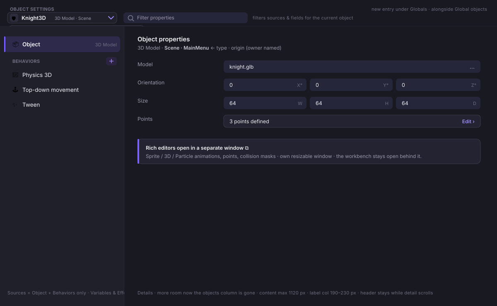
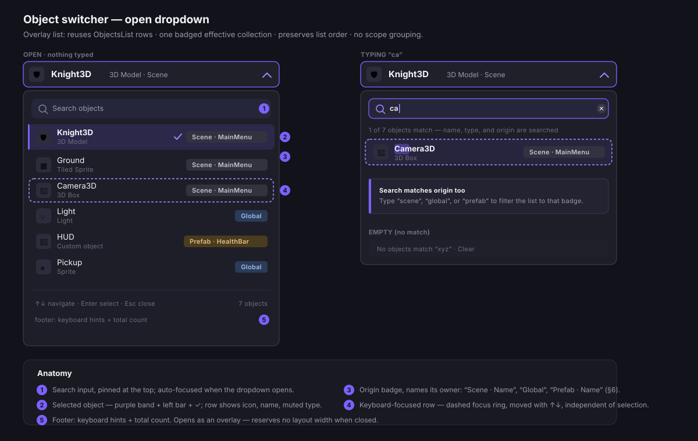
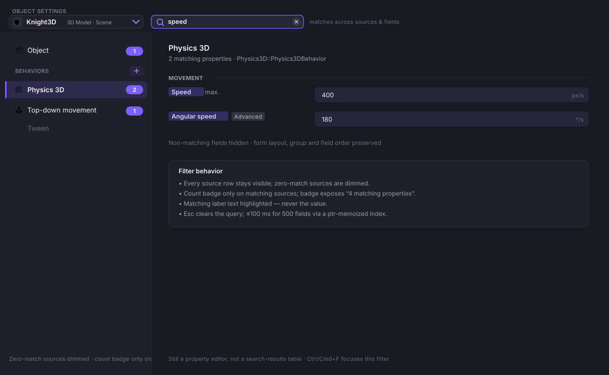

# Object Settings Workbench: two-area editor redesign (v2)

**Status:** implementation-oriented specification
**Audience:** GDevelop product, design, IDE, extension, and QA teams
**Primary surface:** desktop scene editor
**Scope:** object properties and behaviors (object variables and effects keep
their existing editors — see §Variables and Effects)
**Supersedes:** `ObjectPropertiesWorkbenchRedesign.md` (kept for reference). This
version reconciles the design with the code that already exists in the fork and
re-sequences the work by risk.

> **Why a v2.** The original spec describes the *current* UI as "one modal per
> object" with horizontal tabs and behavior accordions. That describes
> `ObjectEditor/ObjectEditorDialog.js` accurately, but the repo now ships a
> second, newer object editor — the **compact contextual panel**
> (`ObjectEditor/CompactObjectPropertiesEditor/`, added in commit
> "design new object settings page") — which the original never mentions. That
> panel *also* uses accordions and folded behaviors. Before this becomes an
> implementation plan we must state how the three surfaces relate, or the fork
> ends up with three overlapping object editors instead of "one place." §0 is
> the new, load-bearing section. The rest carries forward the original UX
> intent with corrections where the code contradicts it.

## 0. Surface reconciliation (new — read first)

The workbench is **purely additive**. It is a new surface that must not remove
or change any existing editor. There are three places an object's properties can
be edited, and all three remain:

| Surface | File | Role | Fate |
| --- | --- | --- | --- |
| Legacy modal | `ObjectEditor/ObjectEditorDialog.js` | Full editor: horizontal `Properties/Behaviors/Variables/Effects` tabs (`:316`), Apply/Cancel (`:289`) | **Stays** — unchanged, still reachable |
| Compact panel | `ObjectEditor/CompactObjectPropertiesEditor/` | Contextual quick-edit docked in the scene editor right rail (`SceneEditor/InstanceOrObjectPropertiesEditorContainer.js:279`) | **Stays** — the fast inline surface |
| **Workbench** (this doc) | new | A new full editor: object switcher + two persistent areas (Sources, Details) | **New** — additive "one place" |

End state:

- **Compact panel = contextual quick edit.** Selecting an object/instance in the
  scene shows it in the right rail. It keeps its collapsible sections
  (`TopLevelCollapsibleSection`, `CollapsibleSubPanel`) and its per-section
  "open full editor" icon button (`onEditObject(object, 'properties')`,
  `index.js:409`) — unchanged, still opening the current editor. Re-pointing it
  at the workbench is optional and out of scope for the initial addition.
- **Workbench = a new full editor.** Everything the modal does, offered in a
  persistent two-area screen (Sources + Details) with an object switcher in the
  header and no Apply/Cancel — as an **additional** entry point (§Entry point),
  not a replacement.
- **Modal = stays.** The legacy `ObjectEditorDialog` is not deleted. It remains
  a working editor and a fallback for any editor not yet embeddable in the
  workbench. Removing it is explicitly out of scope for this work.

### Non-regression guarantee

Introducing the workbench (and the separate rich-editor window, §7) **must not
break any existing function.** Concretely:

- No existing entry point, dialog, or editor is removed or repurposed —
  `ObjectEditorDialog`, `ProjectGlobalsDialog`, the compact panel, and the
  scene editor's inline "Edit object" all keep working exactly as they do today.
- The workbench reuses the same registries, refactoring paths, and section
  components (§4); it changes editor **composition**, never project
  serialization. A project opened and closed through the workbench serializes
  identically (§13).
- The separate window that hosts rich editors (§7) is a hosting change only: the
  registered `EditorProps` editors (`SpriteEditor`, `Model3DEditor`, …) run
  unchanged, with the same props, callbacks, and undo/refactoring behavior they
  have inside the modal. Moving them into a window must not alter their
  functionality.
- If any editor cannot yet be embedded or hosted in a window without behavior
  change, it continues to open in the existing modal — the workbench degrades to
  the current path rather than dropping a capability.

This split is deliberate: the panel answers "tweak this one thing without losing
my place in the scene," the workbench answers "manage everything about this
object," and the modal remains available. They **share the same section
components** (§4) so a behavior, variable, or effect editor is written once and
rendered in each.

**In one line: don't break any entry — just add a new item under the `Globals`
menu.** The workbench ships as a single new `Globals → Object Settings` entry
(§Entry point). Every existing entry point, dialog, and editor is left exactly as
it is; nothing is re-pointed, repurposed, or removed.

## 1. Decision

Make Object Settings a persistent main screen with an **object switcher in the
header** and **two functional areas**:

1. **Object switcher (header):** a click-to-search dropdown listing every object
   with an origin badge. This replaces a permanent objects column — the list is
   only present when you are switching objects, not occupying width the whole
   time.
2. **Property sources (left area):** a property filter followed by `Object` and
   a `BEHAVIORS` section, in a vertical list.
3. **Details (right area):** the selected source's editable form.

This moves the modal's horizontal `Object / Behaviors` navigation into the left
area, and the object list into the header dropdown. Behaviors are independent
peer rows, so an object with several behaviors never creates nested tabs or
accordions **in the workbench**. (The compact panel is free to keep accordions;
the two surfaces have different jobs.)

> **Two changes from earlier drafts:**
> 1. The far-left persistent objects column ("Area A") is removed. Because the
>    header is a searchable, badged object switcher, a second always-on list was
>    redundant and cost 300-340 px of width. The two remaining areas are Sources
>    and Details.
> 2. `Variables` and `Effects` are **not** workbench source rows. They keep
>    their existing dedicated editors (`VariablesEditorDialog`, `EffectsList`)
>    and remain reachable from the compact scene-editor panel's contextual
>    sections (`CompactObjectPropertiesEditor`, which already embeds
>    `VariablesList` and `CompactEffectsListEditor`). The workbench Sources list
>    is therefore `Object` + behaviors only. See §Variables and Effects.



### Entry point: Globals → Object Settings (new)

The workbench is launched from a **new `Object Settings` entry added under the
`Globals`** section of the Project Manager tree. It is added alongside the
existing entries — it does **not** replace `Global objects`.

- The `Globals` root folder (`ProjectManager/index.js:1844`) today lists
  `Static Data`, `Global variables`, and `Global objects` (`:1850-1876`). Add a
  new `Object Settings` leaf (a new `ActionTreeViewItemContent` with its own
  item id and icon) whose action opens the workbench. The existing
  `Global objects` leaf (`openProjectGlobalsDialog`, `:1872`, →
  `ProjectGlobalsDialog`) is left untouched.
- The two coexist by design: `Global objects` remains the card-grid overview of
  global objects and groups (`ProjectGlobalsDialog.js`), while `Object Settings`
  is the new full editor whose object switcher lists **every** object with a
  `Scene`/`Global`/`Prefab` badge (§5). Opening `Object Settings` defaults the
  switcher's selection to the first object (or the last-edited object if that
  state is kept).
- When the workbench edits a **global** object it must call the same
  `WholeProjectRefactorer` paths `ProjectGlobalsDialog` uses —
  `globalObjectOrGroupRenamed` (`ProjectGlobalsDialog.js:850`),
  `behaviorsAddedToGlobalObject` (`:870`), `updateBehaviorsSharedData`
  (`:874`) — so global-object semantics are preserved regardless of which entry
  opened it.
- Because `Object Settings` is a new entry, nothing is removed: the legacy
  `ObjectEditorDialog` modal, `Global objects`, and `ProjectGlobalsDialog` are
  all unaffected by this work and keep working (§Non-regression guarantee).

`Globals → Object Settings` is the **only** new entry this work adds. The scene
editor's inline "Edit object" affordances and the compact panel's "open full
editor" keep their current targets and are not touched. Pointing them at the
workbench later is an optional follow-up, deliberately out of scope here so the
initial change cannot break any existing entry.

## 2. Core interaction

```text
+-------------------------------------------------------------------+
| [🛡 Knight3D  3D Model·Scene ▾]  [ Filter properties  🔍 ]        |
|   ^ object switcher (click ▾ opens searchable list)  ^ filter     |
+----------------------+--------------------------------------------+
| > Object   3D Model  | Object properties                          |
| BEHAVIORS         +  |                                            |
|   Physics 3D         | Model        [ knight.glb          ... ]  |
|   Top-down movement  | Orientation  [ 0 X ][ 0 Y ][ 0 Z ]        |
|   Tween              | Size         [ 64 W ][ 64 H ][ 64 D ]     |
|                      | Points       [ 3 points defined   Edit ›] |
+----------------------+--------------------------------------------+
      Sources                         Details
```

Both the **object switcher** and the **`Filter properties`** input live in the
header row: the switcher on the left (click ▾ opens the searchable, badged object
list), the filter to its right. `Variables` and `Effects` are not rows here —
they use their own editors (§1). The `Object` row shows the object's type
(`3D Model`) as muted trailing text.

The header (`🛡 Knight3D … ▾`) is a click-to-search **object switcher** that
holds the badged object list (§Workspace header). `BEHAVIORS` is a section label
with a trailing `+` add button; there is no bottom-pinned `Add behavior` row.

The screen answers three questions top-to-then-left-to-right: **Which object?**
(header) **Which property source?** (left) **Which values?** (right). Changing
any selection updates the adjacent area without opening a modal. Only one detail
form is visible at a time.

## 3. Why this fixes the current workflow

The legacy modal requires opening one object, switching category tabs, expanding
one behavior accordion at a time, scrolling, then closing to find another
object. Large objects and multi-behavior objects multiply those hidden states.

| Current pattern (modal) | Proposed pattern (workbench) |
| --- | --- |
| One modal per object | Searchable object switcher in the header |
| Scene and Global views | One badged effective object list (in the switcher) |
| Horizontal category tabs | Vertical property-source list |
| One Behaviors container | One row per attached behavior |
| Behavior accordions | One selected behavior form |
| Long unfiltered forms | Cross-source property filter |
| Apply or cancel the modal | Direct editing with Undo/Redo and Save |

The last row is the highest-risk claim. It is **not** free reuse — see §8.

## 4. Component composition and reuse

```text
ObjectSettingsWorkbench
`-- SelectedObjectWorkspace
    |-- ObjectSwitcherHeader        (header combobox; dropdown reuses ObjectsList/)
    |-- PropertySourcePane          (Sources area)
    |   |-- PropertyFilter
    |   `-- PropertySourceList       (Object · BEHAVIORS +)
    `-- PropertyDetailHost          (Details area)
        |-- ObjectDetail          (registered editor OR compact object schema)
        `-- SingleBehaviorHost     (NEW — extracted from BehaviorsEditor)
```

There is no top-level `UnifiedObjectList` sibling — the object list lives inside
`ObjectSwitcherHeader`'s dropdown. `Variables` and `Effects` are not detail
hosts here; they keep their existing editors (§Variables and Effects).

Reuse, verified against the code:

- `ObjectsList/` for the switcher dropdown's rows, icons, ordering, selection.
  Note it already carries a scope flag — `ObjectWithContext = { object, global:
  boolean }` (`EnumerateObjects.js:25-30`) — but only a boolean, not a
  three-state origin (§6).
- `ObjectEditor/ObjectsEditorService.js` for per-type registered editors
  (`SpriteEditor`, `Model3DEditor`, `PanelSpriteEditor`, …) and the fallback.
- `PropertiesEditor/PropertiesMapToSchema.js` for descriptor-backed schemas. It
  already exposes everything the filter index needs: label, `getGroup()`
  (`:790`), help text, enum choices, and visibility via
  `isAdvanced`/`isDeprecated`/`isHidden` (`:89-91`, `:549`).
- `BehaviorsEditor/index.js` for add/remove and `useManageObjectBehaviors` —
  **already imported by the compact panel** (`CompactObjectPropertiesEditor/index.js:32`).
  A single-behavior host must be extracted from its accordion
  (`Accordion/AccordionHeader/AccordionBody`, `BehaviorsEditor/index.js:249-286`).
- `VariablesList/VariablesList` and `EffectsList` remain the editors for object
  variables and effects — reached from the compact scene panel (which already
  embeds `VariablesList` single-object, `index.js:741`, and
  `CompactEffectsListEditor`, `index.js:786`) and their standalone dialogs. The
  workbench does **not** host them (§Variables and Effects); this keeps those
  editors untouched by the workbench work.
- `WholeProjectRefactorer` for rename propagation and the object-variable
  changeset (`ObjectEditorDialog.js:206-227`).

**The detail host and the compact panel must render the same section components.**
That is the mechanism that keeps "one place" true: write `SingleBehaviorHost`
once, mount it inside `CollapsibleSubPanel` in the panel and bare in the details
area.

## 5. Object switcher (header) and property filter

The header row holds two controls side by side: the **object switcher** on the
left and the **`Filter properties`** input to its right.

The switcher shows the selected object's icon, name, type, and origin badge, and
**is the object picker** — there is no permanent objects column. Clicking it (or
its chevron) opens a searchable dropdown containing the full object list; picking
a row switches the workbench to that object. The header stays visible while the
Sources or Details areas scroll.

`Filter properties` sits in the same header row (not atop the Sources column, and
not spanning the Details pane). Placing it in the header keeps the Sources column
starting directly with the source list, and makes the filter available regardless
of which area is scrolled. Its behavior is specified in §9.

The dropdown contains a `Search objects` input and scrollable rows (icon, name,
muted type, origin badge), single selection. Scene, global, and prefab-owned
objects appear as one effective collection:

- No Scene/Global tabs; no grouping by scope.
- Exactly one origin badge per row, naming its owner: `Scene · {SceneName}`,
  `Global`, or `Prefab · {PrefabName}` (§6).
- **Shadowing:** if a global object is shadowed by a same-named scene object,
  show only the scene object. Verify this against `EnumerateObjects` before
  relying on it — the enumerator merges scene + global with a
  global-container guard (`EnumerateObjects.js:111-127`) but confirm it dedups
  by name; do not assert dedup the code does not do.
- Preserve list order. Search matches name, type, origin label, and prefab owner
  name.

Behavior:

- The dropdown reuses the existing `ObjectsList/` row model (rows, icons,
  `scope` badges, search) — the list is built once and shown on demand, not
  parked in a permanent column.
- Selecting a row updates the header, Sources, and Details together and closes
  the dropdown.
- Recommended dropdown width 300-340 px; it scrolls internally and is capped in
  height (e.g. ~60% of the viewport) with the search input pinned at its top.
- Keyboard: the header is a combobox — Enter/Space opens it, typing filters,
  Up/Down + Enter selects, `Escape` closes without changing selection.
- The dropdown opens over the Sources/Details areas (an overlay); it never
  reserves layout width when closed. This is the whole reason the former
  far-left column was removed.

### Dropdown anatomy and states



Anatomy, top to bottom:

1. **Search input** — pinned at the top of the panel, auto-focused on open, with
   a clear (`✕`) button once text is entered.
2. **Object rows** — one per object, showing icon, name, and muted type on a
   second line. The current object is marked with the purple selection band, a
   left accent bar, and a check.
3. **Origin badge** — right-aligned per row: neutral `Scene`, blue `Global`,
   amber `Prefab` (§6).
4. **Keyboard-focused row** — a dashed focus ring that moves with Up/Down,
   tracked independently of the current selection so arrowing never changes the
   workbench until `Enter`.
5. **Footer** — keyboard hints (`↑↓ navigate · Enter select · Esc close`) and
   the total object count.

States:

- **Open (nothing typed):** full list in stored order, current object selected
  and scrolled into view, focus in the search input.
- **Typing:** the list filters live; match count shows as `N of M objects
  match`; the matched substring is highlighted in the name (never in the type or
  badge). Search covers name, type, and origin — typing `scene`/`global`/`prefab`
  filters to that badge.
- **Empty:** `No objects match "{query}"` with a `Clear` affordance; the trigger
  keeps the previously selected object.
- **Close:** picking a row (or `Enter`) selects and closes; `Escape` or an
  outside click closes with the previous selection intact.

## 6. Object origin badges (net-new model work)

The badge shows where the definition is owned, and **names the owner** so the
origin is unambiguous:

| Badge label | Meaning | Available today? |
| --- | --- | --- |
| `Scene · {SceneName}` | Defined by that scene/layout | scope derivable (`global === false`); scene name = current layout name |
| `Global` | Defined in the project's global object collection (project-wide, no owner name) | derivable (`global === true`) |
| `Prefab · {PrefabName}` | Defined inside that prefab/custom-object definition | **new** |

- `Scene`/`Global` scope comes from the existing boolean; the **scene name** is
  the owning layout's name. `Prefab` does not exist as a concept in the row UI
  and requires the `eventsBasedObject` context that only exists **while the
  workbench is opened on that prefab's definition** — the prefab name is that
  events-based object's display name. In a normal scene, a prefab's children are
  not in the list at all.
- Replace the boolean with a `scope: 'scene' | 'global' | 'prefab'` enum **plus
  an `ownerName` string** on the row's view model (do not overload `global`).
  Editor-only view model; changes no serialization.
- `Global` shows **no** owner name — global objects belong to the whole project,
  not a named container.
- Determine the label from ownership metadata, not the selected instance. A
  child defined inside a prefab stays `Prefab · {PrefabName}` when that prefab is
  used by a scene.
- Truncate a long owner name with an ellipsis; the full label is in the tooltip
  (`Defined in scene {name}` / `Defined globally` / `Defined in prefab {name}`).
- Badges are informational, not clickable, no separate keyboard stop.
- Do not auto-sort/group/filter by badge. Searching `scene`/`global`/`prefab`,
  or a scene/prefab **name**, filters to that origin.

Visual: 11-12 px semibold, 20-24 px height; neutral `Scene · …`, muted blue
`Global`, muted amber `Prefab · …`; the **label**, not color, carries meaning;
the owner name is same-weight, slightly muted, after a `·` separator; must stay
legible on selected rows.

### Origin in the Details subtitle

The same origin also appears in the Details area's **"Object properties"
subtitle**, so it is visible while editing without opening the switcher. Today
that subtitle reads `{type} · descriptor-backed fields` (e.g. `3D Model ·
descriptor-backed fields`); append the origin:

```text
Object properties
3D Model · Scene · MainMenu          ← {type} · {origin label}
```

- Use the same label as the badge: `Scene · {SceneName}`, `Prefab ·
  {PrefabName}`, or `Global`.
- Drop the internal `descriptor-backed fields` phrase from the user-facing
  subtitle — `{type} · {origin}` is more useful and matches the badge wording.
- The switcher trigger (collapsed header) keeps its shorter `{type} · Scene`
  form for space; the full named origin lives in the badge and the subtitle.

## 7. Sources area and Details area

### Sources area: filter + source list (250-290 px)

The left of the two areas. The `Filter properties` input is **not** in this
column — it lives in the header row, right of the object switcher (§Workspace
header), so the Sources column starts directly with the source list in stored
order:

```text
Object                     3D Model   ← type shown as muted trailing text
BEHAVIORS                    +        ← section label + inline add button
  Physics 3D
  Top-down movement
  Tween
```

- `Object` is a standalone top row that shows the object's type (e.g. `3D
  Model`, `Sprite`) as muted trailing text, so the type is visible without
  selecting the row.
- A muted **`BEHAVIORS` section header** groups the attached behaviors and
  carries a trailing **`+` inline add button** — this is the only add-behavior
  affordance. The header is a label, not a selectable source, and stays whether
  or not any behavior is attached (with zero behaviors it reads `BEHAVIORS` over
  a one-line "No behaviors yet" hint).
- Behaviors under it are still peers — any count, independently scrollable, no
  accordion. Each row: icon + display name; active row uses the existing purple
  selection; a trailing overflow menu appears on hover/focus (§10).
- **No `Variables` or `Effects` rows** — the Sources list is `Object` +
  behaviors only. Object variables and effects are edited in their own editors
  (§Variables and Effects).
- **There is no bottom-pinned `Add behavior` row.** Add lives in the section
  header so it sits with the behaviors it creates and never drifts to the bottom
  of a long, scrolling list.

The `BEHAVIORS` header may stay pinned while its behavior rows scroll, so the
`+` is always reachable.

### Details area: selected-source detail (remaining width)

- Selected source name as heading; optional muted supporting text (filter count
  or behavior type); only that source's form.
- Do not repeat the filter here or render unselected sources below.
- Content max width 1120 px; label column 190-230 px; row gap 16 px; related
  vectors share a row and wrap as a unit; units in the field suffix.
- Detail scrolling does not move the header or the Sources area.

**Specialized editors open in a separate window, not inside the Details area.**
Registered editors (`SpriteEditor`, `Model3DEditor`, `ParticleEmitterEditor`, …)
are full-width `EditorProps` components built for the modal; Sprite alone owns
animations + points + collision masks. Rather than cram them into the Details
column or swap the column out in-place, the `Object` source shows the basic
descriptor fields, and an **`Edit {type}` control opens the rich editor in its
own window** (a resizable dialog/OS window):

- The workbench stays open behind it; closing the window returns focus to the
  `Object` source with no navigation state to restore.
- The window gets the full real estate these editors need (Sprite animations,
  3D model preview, point/collision-mask canvases) instead of a ~600-900 px
  column.
- Edits in the window commit to the same project model and undo history as the
  workbench (§8) — it is a window boundary, not an editing-model boundary.
- This reuses the registered editors' existing full-size layouts unchanged; they
  were written for a full dialog, so a window fits them without a responsive
  rewrite.

Descriptor-only objects render their fields inline in the Details area with no
window. There is no in-place "full-bleed / Back to Object properties" mode — the
window replaces it.

### Variables and Effects (out of the workbench Sources list)

Object variables and effects are **not** workbench source rows. They keep their
existing surfaces:

- **Variables** — edited with `VariablesEditorDialog` / `VariablesList` (see the
  companion `VariablesEditorRedesign.md`), and shown contextually in the compact
  scene panel's Object Variables section (`CompactObjectPropertiesEditor`
  embeds `VariablesList`, `index.js:741`).
- **Effects** — edited with `EffectsList`, and shown contextually in the compact
  panel's Effects section (`CompactEffectsListEditor`, `index.js:786`).

Rationale: the workbench's job is object configuration and behaviors — the
properties that vary by object *type*. Variables and effects are uniform,
list-shaped editors that already work well in their own surfaces and in the
contextual panel; folding them in as extra source rows added length without
adding clarity. Entry points to those editors (e.g. from the compact panel's
"open full editor" affordance, or a header action) still land the user on the
right variables/effects surface. This keeps the workbench focused and leaves the
variables/effects editors free to evolve independently.

If a future need arises to reach them from the workbench, add a small secondary
action in the header (not a Sources row) rather than reintroducing the divider
and two rows.

## 8. Editing semantics (net-new subsystem — do not treat as reuse)

The original doc says edits are "consistent with the IDE." They are not yet:

- The compact panel's object-property write path is **not undoable** —
  `CompactObjectPropertiesEditor/index.js:574` reads `// TODO: undo/redo?`.
- Variable rename propagation in the compact panel is deferred to a
  snapshot-on-select / apply-on-deselect hook (`useVariablesContainerRefactoring`,
  `index.js:415`), not a per-commit command.
- The modal's correctness depends on Apply-time refactoring
  (`computeChangesetForVariablesContainer` + `applyRefactoringForObjectVariablesContainer`,
  `ObjectEditorDialog.js:206-227`) and a variable-UUID lifecycle (reset on open
  `:138-141`, cleared on cancel/apply `:155,231`).

Therefore, for the workbench:

- A committed field change creates one undoable command; continuous numeric
  gestures coalesce into one step. **This is new work**, built on the scene
  editor's history infrastructure.
- Object/behavior renames use the existing whole-project refactoring path.
- Object-variable renames must still run the changeset refactoring **on commit
  or on source/object switch**, not only on unmount — and must preserve the
  UUID lifecycle so a no-op open/close serializes identically (§13).
- No Apply/Revert/Cancel/unsaved-change tray; the normal dirty indicator and
  Save communicate persistence.
- When switching object or source, commit a valid focused field; if invalid,
  keep focus and show inline validation instead of discarding.

Treat this section as its own workstream with its own tests, sequenced **last**
(§12).

## 9. Property filtering (feasible, but forces eager schema build)

The filter searches the workbench's sources — the object properties and every
behavior — not just the visible form. (Variables and effects are edited
elsewhere, §Variables and Effects, so they are out of scope for this filter.)
All the metadata is reachable (§4), so this is feasible — but the current
architecture builds each source's schema lazily, only when its accordion
renders. A cross-source index requires eagerly instantiating the object schema +
every behavior schema up front.

- Build a per-object filter index, **memoized on the object ptr** (and
  invalidated on extension refresh, mirroring the compact panel's
  `useForceRecompute`, `index.js:427`).
- Match against: visible labels, group/section labels, descriptor names, help
  text, enum labels, and behavior display names.
- As the user types: compute per-source counts; keep all source rows visible;
  dim zero-match sources; show a count badge only on matching sources; keep the
  current source if it matches else select the first match; in the Details area
  preserve the normal layout and hide nonmatching fields.
- Preserve source/group/field order; keep a group heading if any child matches;
  reveal a matching advanced property with an `Advanced` indicator; highlight
  matching **label** text, never the value.
- `Escape` clears the query and restores the unfiltered selection. Empty state:
  `No properties match "{query}"` + `Clear filter`.
- Budget: update within 100 ms for 500 descriptor-backed fields. Achievable
  *only* with the memoized index above; state that dependency explicitly.



Search is scoped to the selected object. Cross-object search is deferred.

## 10. Add, rename, remove, reorder behavior (partly new)

- Add is triggered by the **`+` button in the `BEHAVIORS` section header**
  (§7), not a bottom-pinned row. It reuses `NewBehaviorDialog` +
  `useManageObjectBehaviors` (`CompactObjectPropertiesEditor/index.js:32,360`)
  as a lightweight dialog/popover anchored to that button. After creation:
  insert the row under the header, select it, focus its first field.
- Overflow menu: Rename, Duplicate, Move up, Move down, Delete when supported.
  **Reality check:** today reorder is drag inside the accordion
  (`BehaviorsEditor/index.js`), and there is **no per-behavior Rename or
  Duplicate in the UI**. Mark Rename/Duplicate/keyboard Move up/down as new;
  reorder logic can be reused, its trigger is new.
- Rename/delete operate on the selected instance and preserve existing
  whole-project refactoring and confirmation.

## 11. Keyboard and accessibility

- `Search objects` (inside the header switcher dropdown) and `Filter properties`
  are labeled search inputs with clear buttons.
- The header object switcher is a combobox; the source list is a single-
  selection list. Up/Down moves focus, Enter/Space selects.
- `Ctrl/Cmd+F` focuses `Filter properties` while the workbench is active;
  `Escape` clears the query before returning focus to the source list. A
  separate shortcut (e.g. `Ctrl/Cmd+P`) opens the object switcher.
- Visible focus ring and ≥40 px targets everywhere; selection conveyed by shape
  and contrast, not purple alone.
- Each switcher row's accessible name includes the named origin (`Knight3D,
  Scene MainMenu` / `Pickup, Global object` / `HUD, Prefab HealthBar`); the
  visual badge is hidden from duplicate announcement. Match badges expose
  `4 matching properties`.
- Field errors announced and programmatically associated. Reading/focus order
  stays Header → Sources → Details at 200% zoom.

## 12. Migration sequence (re-ordered by risk)

The original list put filtering before the editing-semantics rework, which is
inverted from the actual risk. The workbench is added alongside the existing
editors — no step removes or repurposes the modal, `ProjectGlobalsDialog`, or the
compact panel (§Non-regression guarantee). Corrected order:

1. **Reconcile surfaces (§0).** Document the panel/workbench/modal roles; the
   compact panel's "open full editor" can point at the workbench while the modal
   remains available.
2. **Extract `SingleBehaviorHost`** from `BehaviorsEditor`'s accordion — the
   unblocking, low-risk prerequisite. Prove it renders standalone and inside
   `CollapsibleSubPanel` unchanged.
3. **Build the two-area shell** (Sources + Details) plus the header object
   switcher whose dropdown reuses `ObjectsList`, mounting the shared section
   components. Read-only where editing semantics aren't ready.
4. **Add the `scope` origin enum** and badges (§6).
5. **Wire specialized editors to open in their own window** (§7): the `Object`
   source renders descriptor fields inline and exposes `Edit {type}`, which
   opens the registered `EditorProps` editor (`SpriteEditor`, `Model3DEditor`, …)
   in a resizable window that commits to the same undo history. Low-risk: the
   editors are reused unchanged, only their host changes from dialog-tab to
   window.
6. **Add the memoized cross-source filter index** and match counts (§9).
7. **Migrate editing semantics** (§8): per-commit undoable writes + object-
   variable refactoring on commit/switch + UUID lifecycle, scoped to the
   workbench (the modal keeps its own Apply/Cancel path unchanged).
8. **Add the new `Globals → Object Settings` entry** (a new leaf next to
   `Global objects` at `ProjectManager/index.js:1850-1876`) that opens the
   workbench — the single new entry this work introduces. When it edits a global
   object it calls the same global-object refactoring paths `ProjectGlobalsDialog`
   uses (§Entry point). **Do not** re-point `Global objects`, the in-scene
   `Edit object` actions, or the compact panel's "open full editor"; they keep
   their current targets. Routing them to the workbench is a later, optional,
   opt-in step — not part of the initial addition.
9. **Verify non-regression** (§0): the modal, `ProjectGlobalsDialog`, the compact
   panel, and every registered/rich editor still open and behave as before; a
   no-op open/close through the workbench serializes identically. Removing the
   modal is **not** part of this work — it stays as a fallback.

## 13. Acceptance criteria

- The workbench has no permanent objects column; the object list lives in the
  header switcher dropdown, with no Scene/Global tabs or grouping, and reserves
  no layout width when closed.
- Every switcher row has exactly one correct origin badge naming its owner
  (`Scene · {SceneName}`, `Global`, `Prefab · {PrefabName}`), driven by a
  `scope` enum + `ownerName` (not the old boolean), included in the accessible
  name, and matchable by search (including by scene/prefab name). The same
  origin label appears in the Details "Object properties" subtitle.
- Selecting an object from the header switcher updates Sources and Details
  without a modal; the header label stays in sync with the selection.
- The `Filter properties` input sits in the header row (right of the object
  switcher), not in the Sources column; the sources are `Object` plus each
  behavior (no `Variables`/`Effects` rows); behaviors sit under a `BEHAVIORS`
  section header whose inline `+` is the only add-behavior affordance (no
  bottom-pinned row); the `Object` row shows the object type; an object with 20
  behaviors is navigable with no accordion.
- Only the selected source's detail shows on the right; specialized editors
  (Sprite/3D/Particle/Tilemap) open in a separate window without data loss, and
  the workbench remains open behind them.
- Filtering finds fields across all sources, shows per-source counts, keeps the
  normal detail form, and updates within 100 ms for 500 fields via a memoized
  index.
- Editing produces one undoable command per commit, coalesces numeric gestures,
  runs object-variable rename refactoring on commit/switch, and preserves the
  variable-UUID lifecycle so a no-op open/close **serializes identically**.
- The compact panel and the workbench render the **same** behavior section
  components (no duplicated behavior editors); variables/effects reuse their
  existing editors.
- Keyboard-operable and usable at 200% zoom.
- Existing projects need no migration.
- **No regression:** the legacy modal, `ProjectGlobalsDialog`, the compact
  panel, and the scene editor's inline "Edit object" all still open and behave
  exactly as before; registered rich editors (Sprite/3D/Particle/Tilemap) run
  unchanged whether opened from the modal or the workbench's separate window.

## 14. Empty and exceptional states

- **No object selected:** the header prompts `Select an object` and the Sources
  and Details areas show one prompt to open the switcher.
- **No behaviors:** show `Object` and the `BEHAVIORS` header with its `+` and a
  one-line "No behaviors yet" hint.
- **No filter matches:** source rows stay visible but dimmed; empty message in
  the Details area.
- **Deleted selected behavior:** select the nearest remaining source, move focus.
- **Object deleted elsewhere:** select the nearest remaining object.
- **Read-only/inherited source:** keep fields visible, disable editing, one
  inline notice explaining why.
- **Unknown extension editor:** use the generic descriptor-backed editor and
  retain every serializable field.

## 15. Responsive behavior

Desktop editing surface. The object switcher is an overlay dropdown at every
width, so only two areas need to flex.

- **≥1200 px:** 270 px sources, flexible details. Removing the objects column
  gives ~300 px more to details than earlier three-column drafts.
- **900-1199 px:** 220 px sources, flexible details; vectors may wrap.
- **<900 px:** the Sources area stays; details flex tighter. Specialized editors
  are unaffected by this squeeze — they open in their own window (§7), sized
  independently of the workbench column.
- **<680 px:** Sources become a temporary drawer opened from the detail header;
  Details fills the width. Never convert the source list into horizontal tabs.
  The header switcher already works at every width, so object switching needs no
  responsive special-casing.

## 16. Visual language

Use existing GDevelop components and dark-theme tokens; reuse the compact-panel
family's look so Details-area sections match the right-rail sections.

- One background plane per area; avoid cards around every group.
- Purple reserved for selection, focus, primary actions.
- Subtle divider between the Sources and Details areas; the header sits above
  both with its own divider.
- Icons clarify type but never replace labels.
- Origin badges per §6.
- Fields follow current compact-editor density.
- No glass effects, unrelated counters, gradients, or decorative preview art.

## 17. Deliberately deferred

- Horizontal source tabs or an `All` page.
- Scene/Global/Prefab separation into tabs or groups.
- Behavior accordions or a Behaviors parent row **in the workbench** (the
  compact panel keeps its accordions by design).
- `Variables`/`Effects` as workbench source rows — they use their own editors
  (§Variables and Effects); revisit only via a header action if ever needed.
- Multi-object comparison or bulk editing.
- Cross-object property search.
- A staged Apply/Revert workflow.
- A permanent preview panel.
- **Removing the legacy modal or `ProjectGlobalsDialog`.** They stay; the
  workbench is additive and must not break existing functions (§0).

## Appendix: code map (verified references)

| Concern | File:line |
| --- | --- |
| Legacy modal, tabs | `ObjectEditor/ObjectEditorDialog.js:316` |
| Modal Apply/Cancel | `ObjectEditor/ObjectEditorDialog.js:289-301` |
| Modal variable refactoring on Apply | `ObjectEditor/ObjectEditorDialog.js:206-227` |
| Variable-UUID lifecycle | `ObjectEditor/ObjectEditorDialog.js:138-141,155,231` |
| Compact panel (stays) | `ObjectEditor/CompactObjectPropertiesEditor/index.js` |
| Panel "open full editor" hook | `ObjectEditor/CompactObjectPropertiesEditor/index.js:409` |
| Panel undo/redo TODO | `ObjectEditor/CompactObjectPropertiesEditor/index.js:574` |
| Panel variable-refactoring hook | `ObjectEditor/CompactObjectPropertiesEditor/index.js:415` |
| Panel mounted in scene rail | `SceneEditor/InstanceOrObjectPropertiesEditorContainer.js:279` |
| Behaviors accordion to extract | `BehaviorsEditor/index.js:249-286` |
| `useManageObjectBehaviors` | `BehaviorsEditor` (imported at panel `index.js:32,360`) |
| Schema visibility flags | `PropertiesEditor/PropertiesMapToSchema.js:89-91,549` |
| Schema group labels | `PropertiesEditor/PropertiesMapToSchema.js:790` |
| Object scope boolean (to become enum) | `ObjectsList/EnumerateObjects.js:25-30,111-127` |
| Registered per-type editors | `ObjectEditor/ObjectsEditorService.js`, `ObjectEditor/Editors/` |
| Effects list (already non-accordion) | `LayersList/CompactLayerPropertiesEditor/CompactEffectsListEditor.js` |
| `Globals` menu root + children (add new leaf here) | `ProjectManager/index.js:1844-1876` |
| Existing `Global objects` leaf (kept, not changed) | `ProjectManager/index.js:1868-1875` (`openProjectGlobalsDialog`) |
| `Global objects` overview surface (kept as-is) | `ProjectManager/ProjectGlobalsDialog.js` |
| Global-object refactoring hooks to reuse | `ProjectGlobalsDialog.js:850, 870, 874` |
