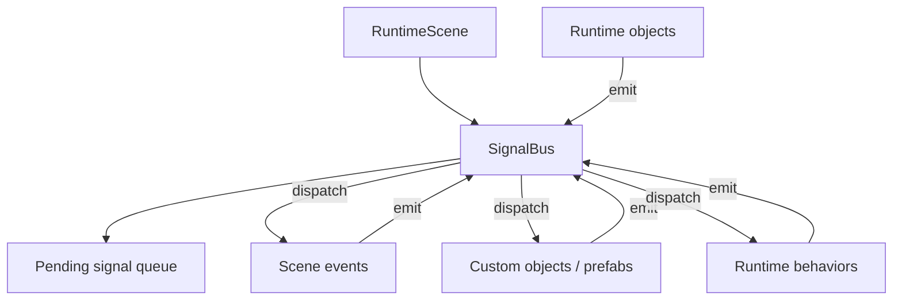

# Signal System

Status: design proposal. This document describes a possible engine-level signal
notification system for GDevelop. It is not an implementation record.

The goal is to add a first-class way for scene events, custom objects, prefabs
and behaviors to notify each other without turning GDevelop's event system into
hidden re-entrant event execution.

This document assumes familiarity with:

- `docs/Architecture.md` for the editor/runtime split and event code generation.
- `docs/GameStateMachineDesign.md` for event-driven state organization.
- `docs/GlobalConfig.md` for a recent cross-layer feature shape.

## Table of contents

1. [Problem](#1-problem)
2. [Design principles](#2-design-principles)
3. [Core model](#3-core-model)
4. [Dispatch semantics](#4-dispatch-semantics)
5. [Targets and receivers](#5-targets-and-receivers)
6. [Payload model](#6-payload-model)
7. [Event-system compatibility](#7-event-system-compatibility)
8. [Lifecycle functions](#8-lifecycle-functions)
9. [Editor UX](#9-editor-ux)
10. [Runtime architecture](#10-runtime-architecture)
11. [Code generation](#11-code-generation)
12. [Debugging and tooling](#12-debugging-and-tooling)
13. [Performance and safety](#13-performance-and-safety)
14. [Open questions](#14-open-questions)
15. [Recommended first implementation](#15-recommended-first-implementation)

---

## 1. Problem

GDevelop events are excellent for visible, top-to-bottom game logic. They are
less ergonomic for engine-level notifications between isolated systems:

- A prefab wants to notify its parent scene that it was selected.
- A health behavior wants to notify other logic that damage was taken.
- A card UI wants to notify a board controller that placement started.
- A custom object wants to notify its child objects that a state changed.
- A scene system wants to broadcast `Game.Paused` to many objects.

Today, authors usually solve this with one of these patterns:

- Scene variables as flags.
- Object variables as flags.
- Timers and "trigger once" guards.
- Direct function calls.
- Object picking plus actions.

These work, but they have drawbacks:

- Flags are easy to forget to reset.
- Direct function calls couple systems tightly.
- Object picking has implicit state and can surprise authors.
- Prefabs and behaviors cannot cleanly subscribe to domain events.
- Debugging "who told this object to change?" is hard.

A signal system should provide explicit message passing:

```text
Emit signal "Health.Damaged" with payload { amount: 10 }
Receive signal "Health.Damaged" in interested scene/custom-object/behavior logic
```

The important constraint is that this must not break GDevelop's existing event
mental model.

---

## 2. Design principles

### 2.1 Signals are notifications, not hidden function calls

A signal says "something happened". It should not behave like an immediate,
deep call stack into arbitrary event sheets by default.

Bad model:

```text
Action emits signal
Signal immediately runs arbitrary receivers
Receivers mutate picked objects
Original action resumes with changed hidden state
```

Good model:

```text
Action emits signal
Signal is queued
Engine dispatches it at a documented phase
Each receiver runs with an isolated context
```

### 2.2 Queued by default

Signals emitted during event execution should normally be queued and dispatched
at a deterministic phase. This avoids re-entrant event execution, stale picking
lists and hard-to-debug deletion problems.

### 2.3 Explicit target, explicit payload

Every signal should have:

- a name,
- a target scope,
- an optional sender,
- an optional payload.

Nothing should depend on the current picked objects unless the action explicitly
says it emits to the picked objects.

### 2.4 Object picking must not leak

Signal receivers must not reuse the caller's object-picking lists. A receiver
gets its own event context. This is the key compatibility rule with GDevelop.

### 2.5 Deterministic and inspectable

For the same frame and the same emitted signals, dispatch order must be stable.
The editor/debugger should be able to show which signals were emitted and which
receivers handled them.

---

## 3. Core model

The signal system is a scene-local message bus owned by the runtime scene.



Conceptual runtime data:

```ts
type SignalName = string;

type SignalTarget =
  | { kind: 'scene' }
  | { kind: 'object'; objectName: string; instanceId?: number }
  | { kind: 'objectGroup'; groupName: string }
  | { kind: 'customObject'; instanceId: number }
  | { kind: 'behavior'; objectName: string; behaviorName: string };

type SignalPayloadData = Array<RootVariableData>;

type RuntimeSignal = {
  id: number;
  name: SignalName;
  target: SignalTarget;
  sender?: {
    objectName?: string;
    instanceId?: number;
    behaviorName?: string;
  };
  payload?: SignalPayloadData;
  frameId: number;
};
```

The exact serialized shape can change, but these concepts should remain.

---

## 4. Dispatch semantics

### 4.1 Frame phases

GDevelop already has a strong frame model. Signals should fit into it.

Recommended default:

```text
Frame N
  1. Runtime scene pre-events callbacks
  2. Scene events run top-to-bottom
       - actions may enqueue signals
  3. Dispatch queued signals
       - onSignal handlers run
       - signal-received scene events run, if supported
       - handlers may enqueue more signals for this dispatch cycle
  4. Runtime scene post-events callbacks / behavior steps
  5. Rendering
```

Alternative dispatch phases may be useful later:

```text
Before scene events
After scene events
After behavior update
Next frame
Immediate
```

Only one phase should be the default. The default should be "after scene events"
because it avoids re-entrant execution inside a running event sheet.

### 4.2 FIFO order

Signals should be dispatched in FIFO order:

```text
emit A
emit B
dispatch A
dispatch B
```

If a receiver emits C while A is being handled:

```text
emit A
emit B
dispatch A
  receiver emits C
dispatch B
dispatch C
```

This is simple and predictable.

### 4.3 Dispatch limit

A signal loop must not freeze the game:

```text
A receiver emits B
B receiver emits A
repeat forever
```

Runtime should enforce a per-frame or per-dispatch-cycle limit:

```text
maxSignalsPerFrame = 10000
```

When the limit is exceeded:

- stop dispatching more signals this frame,
- log a clear warning,
- expose diagnostics in the debugger.

### 4.4 Immediate dispatch is advanced-only

Immediate signals are powerful and dangerous. They can be useful for low-level
engine code, but should not be the default authoring model.

If immediate dispatch exists, it should be clearly marked:

```text
Emit signal immediately (advanced)
```

Immediate dispatch must still isolate picking contexts.

---

## 5. Targets and receivers

## 5.1 Scene signal

A scene signal is broadcast within one runtime scene.

Example:

```text
Emit scene signal "Game.Paused"
```

Receivers:

- scene events that listen for `Game.Paused`,
- custom objects subscribed to `Game.Paused`,
- behaviors subscribed to `Game.Paused`.

Scene signals should not cross scene boundaries.

## 5.2 Object signal

An object signal targets instances of an object.

Example:

```text
Emit signal "Health.Damaged" to Enemy
```

If the action is run on picked `Enemy` instances, the UI should make the target
explicit:

```text
Emit signal "Health.Damaged" to picked Enemy instances
```

This is the only place where current picking should matter: when the instruction
explicitly says "picked instances".

## 5.3 Object group signal

Object group signals target objects in a group:

```text
Emit signal "Actor.Freeze" to ActorGroup
```

At runtime this expands to the instances of all object names in the group.

Important: this should use the group definition, not the current picked list of
some unrelated event. If picked group dispatch is needed, it should be a separate
explicit action.

## 5.4 Custom object / prefab signal

Custom objects should be able to receive signals internally:

```text
Custom object function: onSignal(signalName, payload, sender)
```

This gives prefabs a private notification surface without forcing scene events
to call prefab functions manually.

Example:

```text
CardSlot prefab receives "Card.DragStarted"
  if payload.cardId == AcceptedCardId
    highlight slot
```

## 5.5 Behavior signal

Behaviors should be able to receive signals for their owner:

```text
Behavior function: onSignal(owner, signalName, payload, sender)
```

Example:

```text
Health behavior receives "Damage.Apply"
  subtract payload.amount
  emit "Health.Damaged"
  if hp <= 0 emit "Health.Depleted"
```

This is a natural home for reusable gameplay systems.

---

## 6. Payload model

Signals need payloads, but payloads must be simple enough for GDevelop users and
safe enough for runtime dispatch.

Recommended payload shape:

- internally: a `gdjs.VariablesContainer`,
- in project data: serialized variables,
- in event UI: a variable editor-like payload builder.

Example payload:

```json
{
  "amount": 10,
  "damageType": "Fire",
  "sourceObjectId": 123
}
```

Event expression examples:

```text
SignalPayload("amount")
SignalPayloadString("damageType")
SignalSenderObjectName()
```

Or, if exposed as a variable container in signal events:

```text
Payload.amount
Payload.damageType
Sender.ObjectName
```

### Copy semantics

Payload should be copied when emitted. Receivers should not share mutable
payload data with the emitter.

Reason:

```text
Emitter changes payload variable after emitting
Receiver should still see the emitted value, not a later mutation
```

### Payload size

Payloads should be small. They are notifications, not data stores.

Good:

```text
{ amount: 10, damageType: "Fire" }
```

Bad:

```text
entire level state
huge inventory database
large arrays every frame
```

---

## 7. Event-system compatibility

This is the most important section.

Signals are compatible with GDevelop only if they respect the event system's
rules:

1. Events run in a deterministic order.
2. Conditions create object picking lists.
3. Actions operate on picked objects.
4. Events should be readable from top to bottom.
5. Runtime event code should avoid hidden side effects that mutate the current
   event context.

### 7.1 The main risk

The dangerous design is immediate re-entrant dispatch:

```text
Scene event:
  condition picks Enemy A
  action emits "Damage"
    onSignal runs immediately
    onSignal deletes Enemy A
  next action still assumes Enemy A is picked
```

This breaks the author's mental model.

### 7.2 Compatibility contract

The signal system must obey:

```text
Signal dispatch never mutates the caller's current object picking lists.
Signal receivers run in their own isolated event context.
Queued dispatch is the default.
Dispatch order is documented and stable.
```

### 7.3 Signal received conditions

If scene events support signal receiving, the safest model is a dedicated event
or condition evaluated during the signal dispatch phase:

```text
Signal received "Health.Damaged"
  Do something with Payload.amount
```

This should not mean "the last event somewhere emitted this signal". It should
mean "the signal dispatcher is currently delivering this signal".

### 7.4 No hidden picking inheritance

This should be invalid or unsupported:

```text
Inside signal receiver:
  use whatever Enemy objects were picked by the emitter
```

This should be supported:

```text
Inside signal receiver:
  target object is explicitly provided by the signal
  or receiver picks objects normally with its own conditions
```

---

## 8. Lifecycle functions

Signals are not a replacement for lifecycle hooks.

Recommended separation:

```text
onCreated
  Runs once when the instance is created.

onUpdate / onStep
  Runs every frame if enabled.

onSignal
  Runs when a matching signal is dispatched to this receiver.

onDeletedFromScene
  Runs when the instance is removed.
```

`onSignal` should be event-driven, not per-frame.

### Custom object function shape

For events-based objects:

```text
Function name: onSignal
Function type: lifecycle / signal handler
Parameters:
  SignalName: string
  Payload: variable container
  SenderObjectName: string
  SenderInstanceId: number
```

The exact parameter list should match existing event-function parameter
capabilities. If variable-container parameters are not practical, payload can be
accessed through special expressions during signal handling.

### Behavior function shape

For events-based behaviors:

```text
Function name: onSignal
Parameters:
  Object: owner object
  SignalName: string
  Payload: variable container
  SenderObjectName: string
  SenderInstanceId: number
```

---

## 9. Editor UX

The feature must remain visible and understandable for non-programmers.

### 9.1 Actions

Suggested action names:

```text
Emit scene signal
Emit signal to object
Emit signal to picked objects
Emit signal to object group
Emit signal to behavior
```

Avoid vague names:

```text
Trigger event
Call event
Send message
```

"Signal" should consistently mean a queued notification.

### 9.2 Conditions/events

Suggested condition:

```text
Signal received
```

Parameters:

```text
Signal name
Sender filter (optional)
Target filter (optional)
```

### 9.3 Custom object editor

Prefab/custom object settings could show:

```text
Lifecycle
  onCreated
  onSignal
  onDeletedFromScene
```

If `onSignal` exists, it should be searchable in the events sheet and visible in
the custom object function list.

### 9.4 Behavior editor

Behavior events should expose `onSignal` as a special behavior lifecycle
function.

### 9.5 Signal catalog

For mature projects, signals should be discoverable. A project-level signal
catalog would help:

```text
Signal name          Payload schema        Description
Game.Paused          none                  Game entered pause state
Health.Damaged       amount, type          Health was reduced
Card.Selected        cardId, slotIndex     Player selected a card
```

The first implementation can work without a catalog, but the architecture
should not prevent one.

---

## 10. Runtime architecture

### 10.1 RuntimeScene owns the bus

Suggested runtime ownership:

```text
gdjs.RuntimeScene
  _signalBus: gdjs.SignalBus
```

Why scene-local:

- GDevelop scenes already own runtime instances.
- Signals should not accidentally cross scene boundaries.
- Scene reload naturally clears queued signals.
- Debugging is easier.

### 10.2 SignalBus responsibilities

```ts
class SignalBus {
  emit(signal: RuntimeSignal): void;
  dispatchQueuedSignals(runtimeScene: gdjs.RuntimeScene): void;
  clear(): void;
  getPendingSignalsCount(): number;
}
```

Responsibilities:

- store pending signals,
- assign signal IDs,
- copy payloads,
- resolve target instances,
- invoke receivers,
- protect against infinite loops,
- collect debug records.

### 10.3 Receiver registry

The first implementation can avoid a complex subscription registry and dispatch
by scanning target instances:

```text
for each targeted runtime object:
  if object has onSignal generated method:
    call it
  for each behavior on object:
    if behavior has onSignal generated method:
      call it
```

This is simple but can be expensive for scene broadcasts. Later, add a registry:

```text
signal name -> receivers
```

### 10.4 Generated method calls

Custom objects:

```ts
if (runtimeObject.onSignal) {
  runtimeObject.onSignal(signal.name, payload, sender);
}
```

Behaviors:

```ts
if (behavior.onSignal) {
  behavior.onSignal(signal.name, payload, sender);
}
```

The actual generated names may need mangling to avoid collisions.

---

## 11. Code generation

Signal handling touches both editor-time code generation and runtime data.

### 11.1 Editor model

Potential Core additions:

- signal lifecycle function kind for events-based objects,
- signal lifecycle function kind for events-based behaviors,
- metadata for signal-related actions/conditions/expressions,
- optional project-level signal catalog model.

### 11.2 Runtime event tools

Potential runtime helpers:

```ts
gdjs.evtTools.signal.emitSceneSignal(runtimeScene, name, payload)
gdjs.evtTools.signal.emitSignalToObjects(runtimeScene, objectsLists, name, payload)
gdjs.evtTools.signal.getCurrentSignalName(runtimeScene)
gdjs.evtTools.signal.getCurrentSignalPayload(runtimeScene)
gdjs.evtTools.signal.getCurrentSignalSender(runtimeScene)
```

### 11.3 Codegen for "Signal received"

The signal dispatch phase can set a current signal context:

```ts
runtimeScene._currentSignal = signal;
```

Then generated event conditions can check it:

```ts
gdjs.evtTools.signal.isSignalReceived(runtimeScene, "Health.Damaged")
```

After dispatch:

```ts
runtimeScene._currentSignal = null;
```

### 11.4 Codegen for object/behavior onSignal

Events-based object code generation would generate a method similar to existing
custom object functions:

```ts
MyCustomObject.prototype.onSignal = function(signalName, payload, sender) {
  // generated events
};
```

Behavior code generation would do the same for behavior classes.

---

## 12. Debugging and tooling

A signal system without tooling becomes hidden control flow. Tooling is not
optional for a mature implementation.

Recommended debugger panel:

```text
Signals this frame
  #102 Health.Damaged
    sender: Zombie#17
    target: PeaShooter#4
    payload: { amount: 10 }
    receivers:
      PeaShooter.Health.onSignal
      PeaShooter prefab onSignal
```

Useful diagnostics:

- pending signal count,
- dispatched signal count,
- dropped signals due to max limit,
- receiver errors,
- signal loop warnings,
- large payload warnings.

Editor search should find:

- emit sites for a signal name,
- receive sites for a signal name,
- custom object/behavior `onSignal` handlers.

---

## 13. Performance and safety

### 13.1 Avoid broadcast scans when possible

Scene-wide broadcasts can be expensive in games with many instances.

First implementation can scan because it is simpler. Later optimization:

```text
signalName -> receiver list
objectName -> receiver list
behaviorType -> receiver list
```

### 13.2 Avoid per-frame signal spam

Signals are for discrete events, not continuous state.

Bad:

```text
Every frame: emit "Player.PositionChanged"
```

Better:

```text
Store position in object state.
Emit signal only for meaningful transitions.
```

### 13.3 Payload copy cost

Copying payloads is safer but costs memory/time. Keep payloads small.

### 13.4 Deletion safety

If a target object is deleted before the signal dispatches:

- skip it,
- do not throw,
- optionally log in verbose debug mode.

If a receiver deletes itself during signal dispatch:

- allow it,
- continue safely,
- avoid iterating over a mutable array without defensive copying or index care.

---

## 14. Open questions

These should be answered before implementation:

1. Should signal dispatch happen before or after behavior `doStepPostEvents`?
2. Should custom object `onSignal` run before behavior `onSignal`, or the other
   way around?
3. Should signal names be free strings first, or backed by a project-level
   catalog from day one?
4. How should payloads be edited in the events sheet?
5. Should signal payloads support nested structures in the first version?
6. Should immediate dispatch exist at all?
7. Should signals be save/load persisted? Recommended answer: no.
8. How should multiplayer/network synchronization interact with signals?
9. Should signals be allowed during scene unload?
10. How should async events interact with current signal context?

---

## 15. Recommended first implementation

Start small and strict.

### 15.1 Include

- Scene-local `SignalBus`.
- Queued dispatch after scene events.
- FIFO order.
- Per-frame dispatch limit.
- Emit scene signal.
- Emit signal to picked object instances.
- Custom object `onSignal`.
- Behavior `onSignal`.
- Payload as a copied variables container.
- Basic expressions for current signal name and payload values.
- Debug logging for emitted/dispatched signals.

### 15.2 Exclude initially

- Immediate dispatch.
- Cross-scene/global signals.
- Networked signals.
- Persisted signals.
- Complex subscription editor.
- Project-level signal catalog.
- Signal priorities.

### 15.3 Minimal runtime flow

```text
Scene event action:
  gdjs.evtTools.signal.emitSceneSignal(runtimeScene, "Game.Paused", payload)

RuntimeScene end-of-events phase:
  runtimeScene.getSignalBus().dispatchQueuedSignals(runtimeScene)

SignalBus:
  pop signal
  set current signal context
  call matching custom object onSignal handlers
  call matching behavior onSignal handlers
  run scene signal-received events if supported
  clear current signal context
```

### 15.4 Success criteria

The first implementation is successful only if all these are true:

- Existing events behave the same when no signals are used.
- Emitting a signal does not mutate the current picked objects.
- Signal dispatch order is deterministic.
- A receiver can emit another signal without re-entering the original event.
- Infinite loops are detected and stopped.
- Debugging can show at least the signal name, sender, target and receiver.

---

## Final recommendation

Add `onSignal`, but keep it as a queued notification handler. Do not use it as a
generic `onEvent` lifecycle or as immediate hidden event execution.

The clean conceptual model is:

```text
Events decide what happened.
Signals announce what happened.
Receivers react later in a deterministic isolated phase.
```

That preserves GDevelop's event-system design while giving prefabs, custom
objects and behaviors a much stronger communication primitive.
