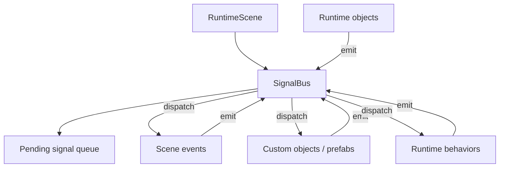

# Signal System

An engine-level signal notification system for GDevelop. It adds a first-class,
queued message-passing primitive so that scene events, custom objects, prefabs
and behaviors can notify each other without turning GDevelop's event system into
hidden, re-entrant event execution.

This document is the complete design. Every part described here — the runtime
signal bus, the `onSignal` lifecycle handlers on events-based objects and
behaviors, and the scene-level "Signal received" condition — is a single system,
delivered together. All design decisions are settled; there are no open options.

Design and code references are grounded in the current runtime and code
generators (for example `GDJS/Runtime/runtimescene.ts`,
`Extensions/TweenBehavior/`,
`GDJS/GDJS/Events/CodeGeneration/MetadataDeclarationHelper.cpp`).

## Table of contents

1. [Problem](#1-problem)
2. [Design principles](#2-design-principles)
3. [Core model](#3-core-model)
4. [Dispatch semantics](#4-dispatch-semantics)
5. [Targets and receivers](#5-targets-and-receivers)
6. [Payload model](#6-payload-model)
7. [Event-system compatibility](#7-event-system-compatibility)
8. [Lifecycle handler: onSignal](#8-lifecycle-handler-onsignal)
9. [Editor UX](#9-editor-ux)
10. [Runtime architecture](#10-runtime-architecture)
11. [Code generation](#11-code-generation)
12. [Debugging and tooling](#12-debugging-and-tooling)
13. [Performance and safety](#13-performance-and-safety)
14. [Design decisions](#14-design-decisions)
15. [Implementation](#15-implementation)

---

## 1. Problem

GDevelop events are excellent for visible, top-to-bottom game logic. They are
less ergonomic for engine-level notifications between isolated systems:

- A prefab wants to notify its parent scene that it was selected.
- A health behavior wants to notify other logic that damage was taken.
- A card UI wants to notify a board controller that placement started.
- A custom object wants to notify its child objects that a state changed.
- A scene system wants to broadcast `Game.Paused` to many objects.

Today, authors solve this with one of these patterns:

- Scene variables as flags.
- Object variables as flags.
- Timers and "trigger once" guards.
- Direct function calls.
- Object picking plus actions.

These work, but they have drawbacks:

- Flags are easy to forget to reset.
- Direct function calls couple systems tightly.
- Object picking has implicit state and can surprise authors.
- Prefabs and behaviors cannot cleanly subscribe to domain events.
- Debugging "who told this object to change?" is hard.

The signal system provides explicit message passing:

```text
Emit signal "Health.Damaged" with payload "10"
Receive signal "Health.Damaged" in interested scene / custom-object / behavior logic
```

The hard constraint is that this must not break GDevelop's existing event mental
model.

---

## 2. Design principles

### 2.1 Signals are notifications, not hidden function calls

A signal says "something happened". It does not behave like an immediate, deep
call stack into arbitrary event sheets.

Bad model:

```text
Action emits signal
Signal immediately runs arbitrary receivers
Receivers mutate picked objects
Original action resumes with changed hidden state
```

Good model:

```text
Action emits signal
Signal is queued
Engine dispatches it at a documented phase
Each receiver runs with an isolated context
```

### 2.2 Queued, never re-entrant

Signals emitted during event execution are queued and dispatched at a
deterministic phase. This avoids re-entrant event execution, stale picking lists
and hard-to-debug deletion problems. There is no synchronous "run now" mode.

### 2.3 Explicit target, explicit payload

Every signal has:

- a name,
- a target scope,
- an optional sender,
- an optional payload.

Nothing depends on the current picked objects unless the action explicitly says
it emits to the picked objects.

### 2.4 Object picking must not leak

Signal receivers never reuse the caller's object-picking lists. A receiver gets
its own event context. This is the key compatibility rule with GDevelop.

### 2.5 Deterministic and inspectable

For the same frame and the same emitted signals, dispatch order is stable. The
debugger shows which signals were emitted and which receivers handled them.

---

## 3. Core model

The signal system is a scene-local message bus owned by the runtime scene.



Runtime data model:

```ts
type SignalName = string;

type SignalTarget =
  | { kind: 'scene' }
  | { kind: 'object'; objectName: string }
  | { kind: 'objectInstance'; objectNames: string[]; objectId: number }
  | { kind: 'objectGroup'; objectGroupName: string }
  | { kind: 'pickedObjects'; pickedObjects: gdjs.LongLivedObjectsList }
  | { kind: 'behavior'; objectName: string; behaviorName: string };

type RuntimeSignal = {
  id: number;
  name: SignalName;
  target: SignalTarget;
  sender: {
    objectName?: string;
    objectId?: number;
  } | null;
  payload: string; // empty when omitted
  emittedFrameId: number;
  deliveredFrameId: number | null;
};
```

---

## 4. Dispatch semantics

### 4.1 Frame model and dispatch phase

Signals fit into the real per-frame flow of `RuntimeScene.renderAndStep`
(`GDJS/Runtime/runtimescene.ts:388`), whose order is fixed:

```text
Frame N  (RuntimeScene.renderAndStep)
  1. timeManager.update
  2. asyncTasksManager.processTasks       // async event continuations resume here
  3. _updateObjectsPreEvents              // object.update + behavior doStepPreEvents
  4. callbacksRuntimeScenePreEvents       // signal dispatch runs HERE
  5. _eventsFunction(this)                // generated scene events, ONCE, top-to-bottom
                                          //   - actions may enqueue signals
  6. _stepBehaviorsPostEvents             // behavior doStepPostEvents
  7. callbacksRuntimeScenePostEvents      // extension post-events hook
  8. render
```

Two runtime facts fix where dispatch must go:

- The generated scene sheet `_eventsFunction` is a single function invoked
  exactly once per frame (`runtimescene.ts:423`). It cannot be re-entered during
  a later phase, so a scene-level "Signal received" condition can only observe a
  context that was set *before* the sheet ran.
- The only per-frame seams an extension can register into are
  `gdjs.registerRuntimeScenePreEventsCallback` (step 4) and
  `registerRuntimeScenePostEventsCallback` (step 7), declared in
  `GDJS/Runtime/gd.ts`.

**Dispatch runs at the pre-events seam (step 4).** This is the same phase
`TweenBehavior` uses to step its per-scene manager
(`Extensions/TweenBehavior/tweentools.ts:140`). Consequences:

- A signal emitted in frame N is dispatched at the start of frame N+1, before
  that frame's scene events (step 5).
- Because the sheet runs *after* the dispatcher, the scene-level "Signal
  received" condition (§7.3) reads a context the dispatcher already set — no
  re-entrancy.
- Object and behavior `onSignal` handlers are plain method calls invoked in the
  same dispatch pass.

The cost is one frame of latency between emit and delivery. This is the correct
trade: a signal models "something happened", and a discrete notification observed
on the next frame is indistinguishable from one observed the same frame for every
real gameplay case, while buying full compatibility with the event model.

### 4.2 FIFO order

Signals are dispatched first-in, first-out:

```text
emit A
emit B
dispatch A
dispatch B
```

If a receiver emits C while A is being handled, C joins the tail of the queue:

```text
emit A
emit B
dispatch A
  receiver emits C
dispatch B
dispatch C
```

### 4.3 Dispatch limit

A signal loop must not freeze the game:

```text
A receiver emits B
B receiver emits A
repeat forever
```

The bus enforces a per-dispatch-cycle limit:

```text
maxSignalsPerFrame = 10000
```

When the limit is exceeded:

- stop dispatching more signals this cycle,
- log a clear warning naming the last few signals dispatched,
- expose the drop count in the debugger (§12).

---

## 5. Targets and receivers

A signal is delivered to two kinds of receiver, always in the same pass:

- **`onSignal` handlers** on custom objects and behaviors (per-instance method
  calls).
- **Scene "Signal received" conditions** in the scene event sheet (§7.3).

The target scope decides which `onSignal` handlers are invoked.

### 5.1 Scene signal

A scene signal is broadcast within one runtime scene.

```text
Emit scene signal "Game.Paused"
```

Receivers:

- scene events matching "Signal received" `Game.Paused`,
- custom objects whose class defines `onSignal`,
- behaviors whose class defines `onSignal`.

Scene signals never cross scene boundaries.

### 5.2 Object signal

An object signal targets instances of an object.

```text
Emit signal "Health.Damaged" to Enemy
```

If the action emits to picked instances, the UI states it explicitly:

```text
Emit signal "Health.Damaged" to picked Enemy instances
```

This is the only place current picking matters: when the instruction explicitly
says "picked instances". The captured instances are held safely across the
one-frame dispatch gap.

An object instance signal targets one concrete instance by its unique instance
id. The target object parameter resolves to one or more object names, but the
runtime dispatches only to the live instance whose `getUniqueId()` matches:

```text
Emit signal "Health.Damaged" to instance Enemy.UniqueId() of Enemy
```


### 5.3 Object group signal

Object group signals target objects in a group:

```text
Emit signal "Actor.Freeze" to ActorGroup
```

At runtime this expands to instances of all object names in the group, using the
group definition — not the current picked list of some unrelated event.

### 5.4 Custom object / prefab signal

A custom object receives signals through its `onSignal` handler:

```text
CardSlot prefab, onSignal:
  if SignalName = "Card.DragStarted"
    if Payload = AcceptedCardId
      highlight slot
```

This gives prefabs a private notification surface without forcing scene events to
call prefab functions manually.

### 5.5 Behavior signal

A behavior receives signals for its owner through its `onSignal` handler:

```text
Health behavior, onSignal:
  if SignalName = "Damage.Apply"
    subtract SignalPayload() from Object health
    emit "Health.Damaged"
    if health <= 0 emit "Health.Depleted"
```

This is the home for reusable gameplay systems.

---

## 6. Payload model

Payloads are simple enough for GDevelop users and safe enough for deferred
dispatch.

Payload shape:

- at runtime: a string,
- in event actions: an optional `string` parameter named "Payload" and an
  optional sender object parameter named "Emitter object",
- in generated/runtime code: a string is passed to the runtime helper. Legacy
  variable inputs are converted to their string value for compatibility.

Example payload:

```text
"10"
"Fire"
"cardId=7"
```

The payload is read through expressions, resolved against the current-signal
context during any handler or matching scene condition:

```text
SignalName()             -> "Health.Damaged"
SignalPayload()          -> 10
SignalPayloadString()    -> "Fire"
SignalSenderObjectName() -> "Zombie"
SignalSenderInstanceId() -> 17
```

Inside `onSignal`, the same payload is also available as the visible string
`Payload` function parameter. When no payload was emitted, `Payload` is `""` and
the `SignalPayload...` expressions return neutral values.

### Copy semantics

Payloads are immutable strings. The bus stores the emitted string value, so
receivers do not share mutable payload state with the emitter or with each other.

### Structured data

Nested payloads are not modeled by the signal system. Authors who need
structured payloads can encode them as text, for example with a compact
delimiter format or JSON text handled by project-specific JavaScript.

### Payload size

Payloads are notifications, not data stores.

Good:

```text
"10"
"Fire"
"cardId=7"
```

Bad:

```text
entire level state
huge inventory database
large arrays every frame
```

---

## 7. Event-system compatibility

Signals are compatible with GDevelop only if they respect the event system's
rules:

1. Events run in a deterministic order.
2. Conditions create object picking lists.
3. Actions operate on picked objects.
4. Events read top to bottom.
5. Event code avoids hidden side effects that mutate the current event context.

### 7.1 The risk this design avoids

The dangerous shape is immediate re-entrant dispatch:

```text
Scene event:
  condition picks Enemy A
  action emits "Damage"
    onSignal runs immediately
    onSignal deletes Enemy A
  next action still assumes Enemy A is picked
```

This breaks the author's mental model. Queued dispatch (§4.1) makes it
impossible: the emit only enqueues, and delivery happens on the next frame in an
isolated context.

### 7.2 Compatibility contract

The signal system obeys:

```text
Signal dispatch never mutates the caller's current object picking lists.
Signal receivers run in their own isolated event context.
Dispatch is always queued.
Dispatch order is deterministic and documented.
```

### 7.3 The "Signal received" scene condition

Scene events receive signals through a dedicated condition evaluated against the
signal dispatch context:

```text
Signal received "Health.Damaged"
  Do something with SignalPayload()
```

This means "the dispatcher is currently delivering this signal" — not "the last
event somewhere emitted this signal".

The mechanism follows from the pre-events dispatch phase (§4.1). The dispatcher
publishes the frame's delivered signals to a scene-level context *before*
`_eventsFunction` runs. The condition then reads that context top-to-bottom in
the normal way, with no re-entrancy.

Because several distinct signals can be delivered in one frame, the context is
the frame's delivered-signal list, not a single scalar pointer. A "Signal
received" condition matches an entry in that list and, while its sub-events run,
`SignalName()` / `SignalPayload(...)` / sender resolve to the matched entry.

### 7.4 No hidden picking inheritance

Invalid:

```text
Inside a signal receiver:
  use whatever Enemy objects were picked by the emitter
```

Valid:

```text
Inside a signal receiver:
  the target object is explicitly provided by the signal
  or the receiver picks objects normally with its own conditions
```

---

## 8. Lifecycle handler: onSignal

`onSignal` is a reserved lifecycle function on events-based objects and
events-based behaviors, alongside the existing lifecycle functions:

```text
onCreated            Runs once when the instance is created.
doStepPreEvents      Runs every frame, before scene events.
doStepPostEvents     Runs every frame, after scene events.
onSignal             Runs when a signal is dispatched to this receiver.
onDestroy            Runs when the instance is removed.
```

`onSignal` is event-driven, not per-frame. It is invoked only during signal
dispatch, once per delivered signal that targets the receiver.

### 8.1 Fixed signal parameters plus context expressions

`onSignal` has a fixed lifecycle signature. The owner `Object` parameter for
custom objects, and the owner `Object` plus `Behavior` parameters for behaviors,
remain internal lifecycle parameters. The editor shows the signal data
parameters:

```text
SignalName          signalName  The delivered signal name.
Payload             string      The delivered payload text.
EmitterObjectName   string      The sender object name, or "" when none is set.
EmitterInstanceId   expression  The sender unique id, or -1 when none is set.
```

The runtime also sets the current-signal context while the handler runs, so the
existing `SignalName()`, `SignalPayload(...)`, `SignalPayloadString(...)` and
sender expressions remain valid. The direct parameters are the primary
lifecycle API; the expressions are useful when the same events are shared with a
scene "Signal received" condition or when an instruction expects an expression
instead of a function parameter.

### 8.2 Custom object handler

```text
Function name: onSignal
Function kind: lifecycle / signal handler
Internal parameters:
  Object

Visible signal parameters:
  SignalName
  Payload
  EmitterObjectName
  EmitterInstanceId

Also readable via expressions while the handler runs:
  SignalName()              -> string
  SignalPayload()           -> number
  SignalPayloadString()     -> string
  SignalSenderObjectName()  -> string
  SignalSenderInstanceId()  -> number
```

### 8.3 Behavior handler

```text
Function name: onSignal
Internal parameters:
  Object
  Behavior

Visible signal parameters:
  SignalName
  Payload
  EmitterObjectName
  EmitterInstanceId

Reads the same current-signal expressions listed above.
```

---

## 9. Editor UX

The feature stays visible and understandable for non-programmers.

### 9.1 Actions

Action names are explicit and always use the word "signal":

```text
Emit scene signal
Emit signal to object
Emit signal to object instance
Emit signal to picked objects
Emit signal to object group
Emit signal to behavior
```

Each action takes an optional string "Payload" parameter. Each action also takes
an optional "Emitter object" parameter. When it is set, the first object in the
picked emitter list becomes the sender exposed by `EmitterObjectName`,
`EmitterInstanceId`, `SignalSenderObjectName()` and `SignalSenderInstanceId()`.
Vague names (`Trigger event`, `Call event`, `Send message`) are avoided.

The object-instance action's instance id can come from an object's `UniqueId()`
expression or from `SignalSenderInstanceId()` when replying to a sender.

### 9.2 Condition

```text
Signal received
```

Parameters:

```text
Signal name
```

### 9.3 Expressions

```text
SignalName()
SignalPayload()
SignalPayloadString()
SignalSenderObjectName()
SignalSenderInstanceId()
```

These resolve during an `onSignal` handler or the sub-events of a matching
"Signal received" condition, and return neutral empty values outside a dispatch.

### 9.4 Custom object editor

The custom object function list shows `onSignal` in the lifecycle group:

```text
Lifecycle
  onCreated
  onSignal
  onDestroy
```

`onSignal` is searchable in the events sheet and appears in the function list.

### 9.5 Behavior editor

Behavior events expose `onSignal` as a behavior lifecycle function, in the same
lifecycle group as `doStepPreEvents` / `doStepPostEvents`.

### 9.6 Signal name input

Signal names are entered through a single dedicated `signalName` parameter type,
shared by every emit action, the "Signal received" condition, and the
`SignalName()` expression. Routing all names through one type gives consistent
autocomplete across the project and a single point that a discovery UI attaches
to.

---

## 10. Runtime architecture

### 10.1 RuntimeScene owns the bus

```text
gdjs.RuntimeScene
  _signalBus: gdjs.SignalBus
```

Scene-local ownership because:

- GDevelop scenes already own runtime instances.
- Signals must not cross scene boundaries.
- Scene reload naturally clears queued signals.
- Debugging is scoped to a scene.

This reuses an established runtime pattern. Two precedents:

- **Core field** (`AsyncTasksManager`): `runtimescene.ts:34` declares
  `private _asyncTasksManager = new gdjs.AsyncTasksManager();`, exposed via
  `getAsyncTasksManager()` and stepped each frame at `runtimescene.ts:400`.
- **Attached manager** (`TweenBehavior`): declares `_tweens` on `RuntimeScene`
  through TypeScript declaration merging
  (`Extensions/TweenBehavior/tweentools.ts:6`), lazily constructs it on first
  access (`tweentools.ts:134`), and steps it via
  `gdjs.registerRuntimeScenePreEventsCallback` (`tweentools.ts:140`).

`SignalBus` follows the second pattern: declared on `RuntimeScene`, constructed
lazily, stepped from a pre-events callback (§4.1), cleared on unload (§14.9).

### 10.2 SignalBus responsibilities

```ts
class SignalBus {
  emitSignal(name: string, target: SignalTarget, payload?: ..., sender?: ...): void;
  dispatchQueuedSignals(runtimeScene: gdjs.RuntimeScene): void;
  getCurrentSignal(): RuntimeSignal | null;
  getDeliveredSignalsThisFrame(): RuntimeSignal[];
  getDeliveredSignals(signalName: string): RuntimeSignal[];
  getDebugInfo(): SignalDebugInfo;
  clear(): void;
}
```

Responsibilities:

- store pending signals and assign signal IDs,
- store payload text,
- resolve target instances,
- set the current-signal context, invoke `onSignal` receivers, publish the
  frame's delivered list for scene conditions, clear the context,
- enforce the dispatch limit,
- collect debug records.

### 10.3 Receiver resolution

Receiver resolution never scans every instance in the scene. It relies on one
runtime fact:

> Whether a class handles signals is known at code-generation time, not per
> instance. `onSignal` is a prototype method on the generated object/behavior
> class (like `doStepPostEvents`), so `SomeClass.prototype.onSignal` either
> exists for the whole class or does not.

Two targeted paths:

**Targeted signals (object, object instance, group, picked, behavior).** Resolve through the
scene's existing per-name instance lists (the lists `getObjects(name)` / picking
already use). Only addressed instances are iterated. A group expands to its
member object names via the group definition (§5.3), then the same per-name
lists. An object-instance target additionally checks the requested unique
instance id before dispatching.

**Scene broadcasts.** At scene load, build a receiver index once:

```text
receiverObjectNames: string[]                 // object names whose class defines onSignal
receiverBehaviorNamesByObjectName: Map<string, string[]>
                                             // behavior instance names whose class defines onSignal
```

populated by testing `class.prototype.onSignal` for each loaded object/behavior
type. A broadcast iterates instances of only those names, skipping every inert
object type. This is O(relevant instances), rebuilt only on load and hot-reload,
with no per-instance subscription bookkeeping.

The index is keyed by "class has a handler", not by signal name. `onSignal` is
generic: it receives the signal name via context and branches internally, exactly
as `doStepPostEvents` receives the frame and branches.

### 10.4 Generated method calls

The dispatcher sets the current-signal context, then calls the generated
handler with the fixed signal arguments (section 8):

```ts
runtimeScene._currentSignal = signal;   // set once per delivered signal

// Custom object receiver:
if (runtimeObject.onSignal) {
  runtimeObject.onSignal(
    signal.name,
    signal.payload,
    senderObjectName,
    senderInstanceId
  );
}

// Behavior receivers are called through the owner so behavior ordering and
// optional behavior-name targeting stay centralized:
runtimeObject.signalBehaviorsOnSignal(
  signal.name,
  signal.payload,
  senderObjectName,
  senderInstanceId,
  optionalBehaviorName
);

runtimeScene._currentSignal = null;     // cleared after the delivery pass
```

Because presence is a prototype-level fact (§10.3), the `if (obj.onSignal)` guard
is a constant-time check and is skipped entirely for indexed broadcast receivers.
The generated method name is namespaced by the class code namespace, so no
cross-class mangling is required beyond what the code generator already applies to
lifecycle methods.

---

## 11. Code generation

Signal handling touches editor-time code generation and runtime tooling.

### 11.1 Core additions

- A signal lifecycle function kind for events-based objects.
- A signal lifecycle function kind for events-based behaviors.
- Metadata for the signal actions, condition and expressions.
- The `signalName` parameter type (§9.6).

`onSignal` is recognized as a reserved lifecycle name by the same predicates that
recognize `doStepPostEvents` / `onCreated` / `onDestroy`
(`GDJS/GDJS/Events/CodeGeneration/MetadataDeclarationHelper.cpp`), which makes it
non-renamable and hides it from the action/condition list automatically.

### 11.2 Runtime event tools

```ts
gdjs.evtTools.signal.emitSceneSignal(runtimeScene, name, payload)
gdjs.evtTools.signal.emitSignalToObject(runtimeScene, objectNameOrObjectsLists, name, payload)
gdjs.evtTools.signal.emitSignalToObjectInstance(runtimeScene, objectsLists, instanceId, name, payload)
gdjs.evtTools.signal.emitSignalToPickedObjects(runtimeScene, objectsLists, name, payload)
gdjs.evtTools.signal.emitSignalToObjectGroup(runtimeScene, objectGroupName, name, payload)
gdjs.evtTools.signal.emitSignalToBehavior(runtimeScene, objectName, behaviorName, name, payload)

gdjs.evtTools.signal.isSignalReceived(runtimeScene, name)  // "Signal received" condition
gdjs.evtTools.signal.getSignalName(runtimeScene)
gdjs.evtTools.signal.getSignalPayloadNumber(runtimeScene)
gdjs.evtTools.signal.getSignalPayloadString(runtimeScene)
gdjs.evtTools.signal.getSignalSenderObjectName(runtimeScene)
gdjs.evtTools.signal.getSignalSenderInstanceId(runtimeScene)
```

All emit helpers also accept an optional sender argument at runtime. It can be a
`gdjs.RuntimeObject`, a sender record, or an object-list map generated from the
event action's optional "Emitter object" parameter. Object-list senders use the
first picked object in the list.

### 11.3 Codegen for "Signal received"

The dispatcher, running at the pre-events seam (§4.1), publishes the frame's
delivered signals and sets the current-signal context before `_eventsFunction`
runs:

```ts
runtimeScene._currentSignal = signal;
```

The generated condition matches against it:

```ts
gdjs.evtTools.signal.isSignalReceived(runtimeScene, "Health.Damaged")
```

While a matched condition's sub-events run, `SignalName()` / `SignalPayload(...)`
/ sender expressions resolve to that signal. When multiple signals were delivered
in one frame, the generated condition iterates the delivered-signal list rather
than reading one overwritten scalar, so each matching signal is handled once.
After the sheet consumes the context, it is cleared:

```ts
runtimeScene._currentSignal = null;
```

### 11.4 Codegen for object/behavior onSignal

`onSignal` is generated as a runtime prototype method with the four signal data
arguments. The events-function metadata still carries hidden owner parameters
for editor/codegen context (section 8), but the runtime method does not receive
them because the owner object or behavior is already available from `this`.
Signal name, payload and sender can be read either from the direct parameters or
through the current-signal expressions:

```ts
MyCustomObject.prototype.onSignal = function(
  SignalName,
  Payload,
  EmitterObjectName,
  EmitterInstanceId
) {
  // generated events
};
```

Behavior code generation uses the same four-argument runtime signature.

---

## 12. Debugging and tooling

A signal system without tooling becomes hidden control flow, so tooling is part
of the design.

Debugger panel:

```text
Signals this frame
  #102 Health.Damaged
    sender: Zombie#17
    target: PeaShooter#4
    payload: "10"
    receivers:
      PeaShooter.Health.onSignal
      PeaShooter prefab onSignal
      scene "Signal received" x2
```

Diagnostics:

- pending signal count,
- dispatched signal count,
- dropped signals due to the per-cycle limit,
- receiver errors,
- signal loop warnings,
- large payload warnings.

Editor search finds:

- emit sites for a signal name,
- "Signal received" sites for a signal name,
- custom object / behavior `onSignal` handlers.

---

## 13. Performance and safety

### 13.1 No full-scan for broadcasts

Scene-wide broadcasts never walk every instance in the scene. They use the
load-time receiver index (§10.3) and iterate only instances of object names /
behavior-bearing object names whose generated class defines `onSignal`:

```text
signalReceiverObjectNames:   Set<string>
signalReceiverBehaviorTypes: Set<string>
```

This is O(relevant instances). Targeted signals
(object/object-instance/group/picked/behavior) never scan the whole scene; they
use the scene's existing per-name instance lists.

### 13.2 No per-frame signal spam

Signals are for discrete events, not continuous state.

Bad:

```text
Every frame: emit "Player.PositionChanged"
```

Better:

```text
Store position in object state.
Emit a signal only for meaningful transitions.
```

### 13.3 Payload size

Payload strings are cheap, but they should still stay small. Signals are
notifications, not a transport for large serialized state.

### 13.4 Deletion safety

Queued dispatch means a signal targeting picked instances (§5.2) holds object
references across the one-frame gap, during which those objects can be deleted.
This reuses the async-event solution: `AsyncTasksManager` stores a
`longLivedObjectsList` alongside each pending callback so picked objects survive
an `await` boundary and are re-validated on resume
(`GDJS/Runtime/AsyncTasksManager.ts`). "Emit to picked → dispatch later" is the
same shape and uses the same mechanism.

For general deletion notifications, the bus hooks the existing
`registerObjectDeletedFromSceneCallback` (`GDJS/Runtime/gd.ts`; callback
signature `(instanceContainer, runtimeObject)`, fired from
`RuntimeInstanceContainer.ts` when an object is marked for deletion).

If a target object is deleted before the signal dispatches:

- skip it,
- do not throw,
- log in verbose debug mode.

If a receiver deletes itself during dispatch:

- allow it,
- continue safely,
- iterate over a defensive copy, or use index care, to avoid mutation hazards.

---

## 14. Design decisions

Every question an implementer would ask, answered.

### 14.1 Dispatch phase — pre-events seam of the next frame

Dispatch runs at the pre-events seam (`registerRuntimeScenePreEventsCallback`,
§4.1), before behavior `doStepPostEvents`. It is the only phase where the
scene-level "Signal received" condition works without re-entrant event execution.
Emit in frame N, deliver at the start of frame N+1.

### 14.2 Receiver ordering — deterministic and fixed

Within one delivered signal, receivers run in a fixed order:

```text
1. For each targeted object name, in resolved target order:
   a. each live instance in instance-list order,
   b. that instance's custom object onSignal handler, if any,
   c. that instance's behavior onSignal handlers, in behavior declaration order.
2. Scene "Signal received" conditions (in scene event-sheet order)
```

Object handlers run before their own behavior handlers because a prefab is the
owner context for its behaviors. Behavior order follows the object's declared
behavior order. Scene conditions run last, in sheet order. Determinism is a hard
requirement (section 2.5).

### 14.3 Signal names — free strings through one parameter type

Signal names are free strings, entered through the single `signalName` parameter
type (§9.6). This gives consistent autocomplete and a single attachment point for
project-wide name discovery, without constraining authors to a fixed list.

### 14.4 Payload input - an optional string parameter

Emit actions take an optional payload string. This keeps the action lightweight:
authors can pass a literal, a string expression or encoded text. They also take
an optional emitter object list so signal receivers can identify the sender.

### 14.5 Structured payloads

Structured payloads are encoded by the project, not modeled by the signal
system. Authors can pass compact text, JSON text or identifiers that receivers
resolve from their own state. The guardrail is size and frequency (section 13.2,
section 13.3), not parser choice.

### 14.6 Immediate dispatch — not in the model

Immediate (synchronous, re-entrant) dispatch is not part of the design. It is the
failure mode §7.1 describes: a receiver mutating or deleting the emitter's picked
objects mid-action breaks the top-to-bottom mental model. "Signal" always means
"queued notification".

### 14.7 Persistence — never serialized

Signals are transient runtime state. They are not saved, not loaded, not part of
project data. A queued-but-undispatched signal does not survive a save, a scene
change, or a reload.

### 14.8 Scope — scene-local, single machine

Signals are scene-local and single-machine. They do not cross scene boundaries
and are not network-synced: the bus deliberately opts out of the sync-data
callbacks (`registerRuntimeSceneGetSyncDataCallback` /
`registerRuntimeSceneUpdateFromSyncDataCallback`). Networked notifications are a
separate concern (ordering, reliability, ownership) handled by the multiplayer
layer, which may emit a local signal on receipt of a network message.

### 14.9 Scene unload — clear, never dispatch

`bus.clear()` runs in a `registerRuntimeSceneUnloadingCallback` (fires before
object destruction, `runtimescene.ts:303`). No dispatch happens during unload;
delivering to objects that are about to be torn down is pointless and unsafe.

### 14.10 Async events and the signal context — read eagerly

`_currentSignal` is valid only for the synchronous duration of a handler's
delivery pass. An async event started inside `onSignal` must read the signal
expressions before its first `await` and capture the values it needs. Reading the
current-signal expressions after an `await`, when the context is already cleared,
returns the neutral empty result — never a stale one.

---

## 15. Implementation

The whole system is delivered as one feature: the runtime bus, the `onSignal`
lifecycle handlers, and the scene "Signal received" condition.

### 15.1 Runtime bus

- Scene-local `SignalBus` declared on `RuntimeScene`, constructed lazily, cleared
  on unload.
- Queued dispatch at the pre-events seam (§4.1) via
  `registerRuntimeScenePreEventsCallback`.
- FIFO order and per-cycle dispatch limit (§4.2, §4.3).
- Load-time receiver index for broadcasts; per-name lists for targeted signals
  (§10.3).
- `longLivedObjectsList`-based capture for picked-instance targets (§13.4).
- Payload stored as string text (section 6).

### 15.2 Event tools, actions, condition, expressions

- `gdjs.evtTools.signal.*` runtime helpers (§11.2).
- Emit actions: scene, object, object instance, picked objects, object group,
  behavior, with optional payload and emitter object parameters (section 9.1).
- "Signal received" condition (§9.2, §11.3).
- `SignalName` / `SignalPayload` / `SignalPayloadString` / `SignalSenderObjectName`
  / `SignalSenderInstanceId` expressions (§9.3).
- `signalName` parameter type (§9.6).

### 15.3 onSignal lifecycle

- `onSignal` recognized as a reserved lifecycle name for events-based objects and
  behaviors in the `MetadataDeclarationHelper.cpp` predicates.
- The core refactorer creates the fixed signature: hidden owner parameters plus
  visible `SignalName`, `Payload`, `EmitterObjectName` and
  `EmitterInstanceId`.
- Behavior and object code generators emit runtime prototype methods with the
  four signal data parameters.
- Runtime base-method declarations for `onSignal` on `runtimebehavior.ts` and
  `customruntimeobject.ts`.
- The dispatcher's per-instance invocation site passes the fixed signal
  arguments, including the payload string (section 10.4).
- newIDE: lifecycle icon and method-selector entries for `onSignal`.

### 15.4 Debugger

- Signals-this-frame panel and diagnostics (§12).
- Editor search for emit sites, "Signal received" sites, and `onSignal` handlers.

### 15.5 Runtime flow

```text
Scene event action (frame N):
  gdjs.evtTools.signal.emitSceneSignal(runtimeScene, "Game.Paused", payloadText)
    -> bus.emit(signal)   // stores payload text, assigns id, enqueues

Pre-events callback (frame N+1), before _eventsFunction:
  runtimeScene.getSignalBus().dispatchQueuedSignals(runtimeScene)

SignalBus.dispatchQueuedSignals:
  publish this frame's delivered-signal list
  for each queued signal (FIFO, until the per-cycle limit):
    set current-signal context
    call matching custom object onSignal(SignalName, Payload, EmitterObjectName, EmitterInstanceId)
    call matching behavior onSignal(SignalName, Payload, EmitterObjectName, EmitterInstanceId)
    clear current-signal context

_eventsFunction(this):
  "Signal received" conditions read the delivered-signal list and run their
  sub-events with the matched signal's context.
```

### 15.6 Success criteria

- Existing events behave identically when no signals are used.
- Emitting a signal never mutates the current picked objects.
- Dispatch order is deterministic (§14.2).
- A receiver can emit another signal without re-entering the original event.
- Infinite loops are detected and stopped (§4.3).
- Scene conditions, custom object `onSignal`, and behavior `onSignal` all receive
  the same signal in one dispatch pass.
- The debugger shows signal name, sender, target and receivers.

---

## Summary

The conceptual model:

```text
Events decide what happened.
Signals announce what happened.
Receivers react on the next frame in a deterministic, isolated phase.
```

Signals are queued, scene-local notifications with string payloads, delivered at
the pre-events seam to three receiver kinds: custom object `onSignal`, behavior
`onSignal`, and the scene "Signal received" condition. `onSignal` receives fixed
signal data parameters while the scene condition reads the same delivered signal
through expressions. This preserves GDevelop's event-system design while giving
prefabs, custom objects and behaviors a strong communication primitive.
