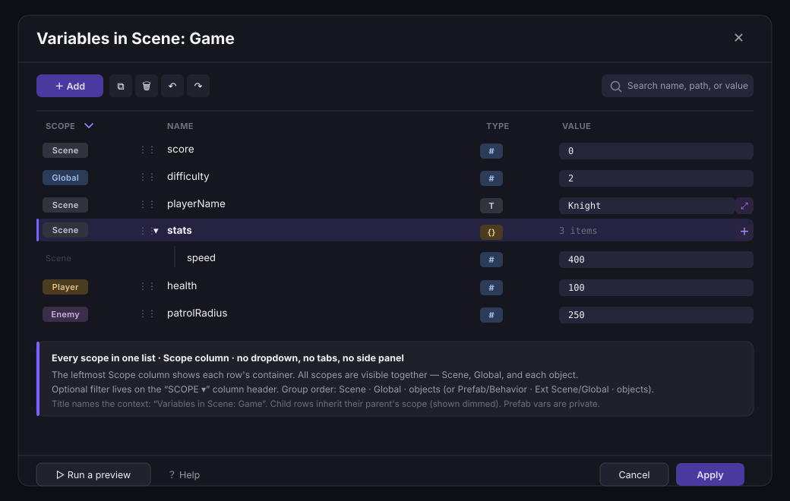
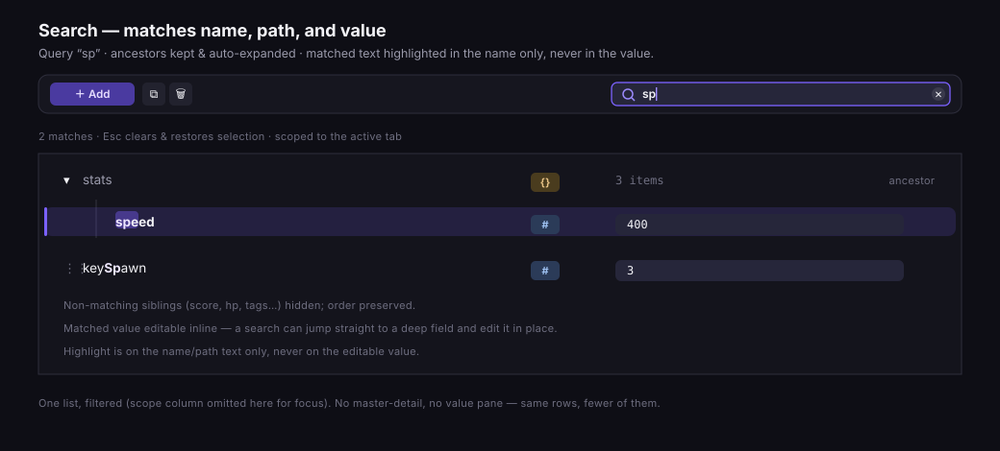

# Variables editor redesign

**Status:** implementation-oriented specification
**Audience:** GDevelop product, design, IDE, and QA teams
**Reference UI:** the **Variables** dialog opened from the events editor —
`UnifiedVariablesDialog` → `VariablesEditorDialog` → `VariablesList`
(scope tabs · toolbar · Apply/Cancel footer).
**Goal:** clean, compact, easy, robust, polished. Keep the dialog shell; make the
list itself dramatically simpler to read and edit.

> **Design principle: one full-width list, scope shown as a column.** There is no
> side panel, no tab bar, and no scope dropdown/selector. The window is a single,
> uniform variables list that fills the width and shows **every scope at once**;
> a leftmost **Scope column** tells you which container each row belongs to
> (`Scene`, `Global`, `Player`, `Prefab`, …). Optional filtering lives on that
> column's header, not in a separate control. The **title is dynamic** and names
> the editing context — `Variables in Scene: Game`, `Variables in prefab:
> Player`. In the list each variable is one row you edit in place — name, type,
> value — and structures/arrays **expand inline** underneath their parent. There
> is **no** per-variable master-detail, no value pane, no breadcrumb, and **no
> inheritance/override** concept. Rich values (long text, enum options) use a
> small inline popover that opens from the row and closes on commit — never a
> second modal, never a side panel. This is a deliberate step back from earlier,
> more elaborate proposals (tabs, then a rail, then a dropdown): the winning move
> for "easy" is *fewer surfaces*, not more.

## 0. Scope of the change

- **Kept, unchanged:** the dialog shell — the Apply/Cancel footer and its
  Apply-time refactoring (`VariablesEditorDialog.js:149-212`), the toolbar, and
  project serialization. The **scope source set** (Behavior / Prefab / Scene /
  Global / per-object, `UnifiedVariablesDialog.js:126-224`) is kept as data, but
  presented differently (see next).
- **Rebuilt:** (a) the scope **tabs → a Scope column** on one all-scopes list +
  dynamic title (§7); no tabs, rail, or dropdown; (b) the list body — from a
  non-virtualized recursive tree with pop-up value dialogs into one **full-width,
  virtualized, inline-editable list**.
- **Removed:** the inherited-variables display and the override lifecycle.
  **Prefab variables are private** — a prefab never shows or inherits another
  container's variables, so there is nothing to display as "Inherited." The
  `inheritedVariablesContainer` code path (`VariablesList.js:2308-2311`,
  `366-407`) is dropped from this editor.

## 1. What exists today (verified)

| Concern | Where |
| --- | --- |
| Multi-scope modal (the reference) | `VariablesList/UnifiedVariablesDialog.js:126-224` |
| Dialog shell: tabs, Apply/Cancel, refactor-on-apply | `VariablesList/VariablesEditorDialog.js:259-273, 149-212` |
| The list | `VariablesList/VariablesList.js` (2338 lines) |
| Toolbar | `VariablesList/VariablesListToolbar.js` |
| **Non-virtualized** recursive render | `VariablesList.js:2170-2200, 2307-2325` |
| Row anatomy + per-type value chain | `VariablesList.js:153-189, 440-620` |
| Type selector (icon + `SelectField`) | `VariablesList/VariableTypeSelector.js` |
| Long-text / enum editing as **pop-up dialogs** | `MultilineVariableEditorDialog.js`, `EnumVariableEditorDialog.js` (`VariablesList.js:604-611`) |
| Inherited tree + italic override (**to remove**) | `VariablesList.js:2308-2311, 366-407` |
| Name-only search | `VariablesList.js:803-895` |
| Node ↔ path mapping | `VariableToTreeNodeHandling.js` |
| Rename refactoring | `useVariablesContainerRefactoring.js` |

### What makes it feel complex today

- Non-virtualized (`:2307`) — big structures render every row and stutter.
- Editing a long string or enum opens **another modal** on top of the dialog.
- Deep nesting runs the indentation off the right edge; wide rows overflow.
- A full type **dropdown on every row** adds visual noise.
- The inherited section (screenshot) adds a whole second concept for something
  prefabs don't even have.

## 2. The one-list layout

A single scrollable, virtualized list. One variable = one row. Children of a
structure/array are rows too, indented one step and shown/hidden by their
parent's chevron. Nothing leaves the list to be edited.

```text
┌ Variables in Scene: Game ───────────────────────────────────────┐
│ [+ Add]  ⧉ 🗑 ↶ ↷                                  [ search ]    │
│ ─────────────────────────────────────────────────────────────── │
│ scope ▾   name            type  value                            │
│ [Scene]   score            #    [ 0            ]                  │
│ [Global]  difficulty       #    [ 2            ]                  │
│ [Scene]   playerName       T    [ Knight       ]             ⤢    │
│ [Scene] ▾ stats            {}   3 items                      +    │
│ [Scene]     speed          #    [ 400          ]                  │
│ [Scene]     hp             #    [ 100          ]                  │
│ [Player]  health           #    [ 100          ]                 │
│ [Enemy]   patrolRadius     #    [ 250          ]                 │
└───────────────────────────────────────────────────────────────────┘
```

The leftmost **Scope** column shows each row's owning container, and the list
shows **all scopes together** — no dropdown, no tabs. A filter menu on the
`scope ▾` header narrows to one or more scopes when needed. Every value is
editable **right in the row**; collapsed collections show a count; expand to edit
children inline. That's the whole model.



## 3. The row (compact, single line)

Fixed-height row. The columns, left to right, are **Scope · name · type ·
value**:

- **Scope column** — a compact badge showing which container the variable
  belongs to (`Scene`, `Global`, `Player`, `Enemy`, `Prefab`, `Behavior`, …).
  This is the leftmost column so a row's origin is always visible. The list shows
  all scopes together, so this column is what keeps the merged list readable; its
  header (`scope ▾`) carries an optional filter menu to narrow to one or more
  scopes (§7). Child rows of a structure/array inherit their parent's scope and
  show it dimmed (or blank), since a child's scope always equals its parent's.
- **Drag handle** `⋮⋮` — reorder within the same parent; Alt/Opt-drag copies.
  Reuses `makeDragSourceAndDropTarget` + `DropIndicator`. Drag is constrained to
  the row's own scope (you can't drag a Scene variable into an object).
- **Expand chevron** `▸/▾` — only on structure/array rows.
- **Name** — inline text field, commit on blur/Enter, live duplicate check.
  Rename runs the existing refactoring (`useVariablesContainerRefactoring`).
- **Type** — a small **icon-only** chip (`#` number, `T` text, `◐` boolean,
  `≡` enum, `{}` structure, `[]` array). Click opens a 6-item menu. No per-row
  `SelectField` taking horizontal space; the icon + menu replaces
  `VariableTypeSelector`'s inline dropdown.
- **Value** — inline and type-appropriate:
  - Number → number field · Boolean → toggle · Text → single-line field.
  - Structure/Array → a muted `N items` count and a trailing **`+`** to add a
    child; no value field (the children hold the values).
- **Overflow affordances** appear only on hover/focus, so a resting row is quiet:
  - `⤢` expand-to-popover for long text / enum options (§4).
  - a `⋯` menu for Duplicate / Delete.

Indentation is a fixed step per depth with a guide line; depth never pushes the
value field off-screen because the value column is right-aligned to a fixed
position.

## 4. Rich values — inline popover, not a modal

Long text and enum options are the only values that don't fit a single row. They
open a **small popover anchored to the row's `⤢` button**, not a full dialog and
not a side pane:

- **Long text:** a multi-line field in the popover; commit on blur or Ctrl/Enter.
  Replaces `MultilineVariableEditorDialog`. The row shows a truncated preview.
- **Enum:** an editable option list in the popover (add / reorder / remove
  options, pick current). Replaces `EnumVariableEditorDialog`.

The popover closes on commit or `Escape` and returns focus to the row. Nothing
else on screen moves. This keeps the "everything in the list" feel while giving
the two large value types room.

## 5. Structures and arrays — expand in place

- A collection row shows `▾`/`▸` and a count (`3 items`, `12 items`).
- Expanding reveals its children as indented rows directly beneath it; the `+` on
  the collection row adds a child (a new key for structures, an appended index
  for arrays).
- Arrays show read-only `0 · 1 · 2` index gutters on their children; structures
  show editable child names.
- **No breadcrumb, no focus-into, no re-rooting.** Depth is handled purely by
  inline indentation + collapse. If a structure is very deep, collapse the
  branches you're not using — the same gesture users already know from the tree.

This is the key simplification versus the earlier draft: one list that expands,
instead of a list that *navigates into* sub-editors.

## 6. Toolbar (kept, minimal)

Keep `VariablesListToolbar`; trim to what's used:

- **`+ Add`** (primary, left) — adds a top-level variable and focuses its name.
- **Search** (right) — persistent, with clear; scope widened to name + path +
  value (§8).
- Copy / Paste / Delete and Undo / Redo stay, enabled/disabled exactly as today
  (`VariablesListToolbar.js:22-33`). Delete/Copy/Paste act on the selected rows.

No other chrome. The row-level `⋯` menu covers Duplicate/Delete so the toolbar
stays short.

## 7. Scope column + dynamic title (replaces the tabs)

The scope tabs, the earlier left rail, **and** the header scope dropdown are all
**removed**. There is no side panel and no scope selector control. The window is
one full-width list that shows **every scope at once**, with a leftmost **Scope
column** (§3) identifying each row's container. The **title names the editing
context**.

```text
┌ Variables in Scene: Game ─────────────────────────────────── ✕ ┐
│ [ + Add ]  ⧉ 🗑 ↶ ↷                             [ search     ] │
│ ─────────────────────────────────────────────────────────────  │
│ scope ▾   name            type  value                           │
│ [Scene]   score            #    [ 0            ]                 │
│ [Global]  difficulty       #    [ 2            ]                 │
│ [Scene]   playerName       T    [ Knight       ]            ⤢    │
│ [Scene] ▾ stats            {}   3 items                     +    │
│ [Scene]     speed          #    [ 400          ]                │
│ [Player]  health           #    [ 100          ]                │
│ [Enemy]   patrolRadius     #    [ 250          ]                │
├───────────────────────────────────────────────────────────────┤
│ ▷ Run a preview   ? Help                        Cancel  Apply  │
└───────────────────────────────────────────────────────────────┘
```

### Dynamic title

The dialog title is `Variables in {context}`, naming where the editor was opened:

- Scene → `Variables in Scene: Game`
- Prefab → `Variables in prefab: Player`
- Behavior → `Variables in behavior: ThirdPersonCamera`
- Extension → `Variables in extension: {Extension}`

The title reflects the **editing context**, not a selection — there is nothing to
select. All relevant scopes are already in the list.

### Scope grouping and order

All scopes appear in one list, grouped and ordered by the Scope column so related
rows sit together. Group order **top to bottom**:

**When editing a scene (the common case):**

1. `Scene` — the current scene's variables (e.g. `Game`)
2. `Global` — the project's global variables
3. Objects in the current scene — one group per object (`Player`, `Enemy`, …)

**When editing inside an extension (events-based prefab/behavior):**

1. `Prefab` **or** `Behavior` — whichever the extension defines
2. `{Extension} Scene`
3. `{Extension} Global`
4. Objects in the prefab — one group per child object

Notes:

- The scope set is exactly what `UnifiedVariablesDialog` already builds
  (`:126-224`) — Scene / Global / Behavior / Prefab / per-object — now merged
  into one list and distinguished by the Scope column instead of tabs. The
  scene/extension context that today drives the `[Name]` prefix (`:153`, `:169`)
  now drives the group order and each row's scope badge.
- **Optional filter** on the `scope ▾` column header: a small menu to show/hide
  scopes (e.g. only `Scene`, or hide object scopes) for a large project. Default
  is everything visible. This is the *only* scope control, and it lives on the
  column — no separate selector.
- **Prefab scope shows only the prefab's own variables** — no inherited section,
  because prefab variables are private (§0).
- **`+ Add`** adds to the primary scope for the context (Scene when editing a
  scene, Prefab/Behavior in an extension); a row's `⋯` menu can move it to
  another scope where that's valid. Empty scopes still show their group header
  with a one-line "no variables yet" hint so the scope is discoverable.
- Initial scroll position uses the current `initiallyOpenTabId` logic
  (`:226-276`) — scroll to the scope that owns the initially-selected variable.
- The list is **uniform**: the same columns (Scope · name · type · value) and
  interactions for every scope.

Scope-badge mapping (one merged list, distinguished by the Scope column):

| Today (`UnifiedVariablesDialog.js`) | Scope badge | Group header |
| --- | --- | --- |
| `[Name] Scene variables` (`:153`) | `Scene` | `{SceneName} — Scene` |
| `[Name] Global variables` (`:169`) | `Global` | `Project — Global` |
| `{objectName}` (`:186`) | `{objectName}` | under "Objects" |
| `Prefab variables` (`:143`) | `Prefab` | `{Prefab} — Prefab` |
| `Behavior variables` (`:131`) | `Behavior` | `{Behavior} — Behavior` |

## 8. Search

Extend the toolbar search beyond names:

- Match variable **name, full path, and scalar value** — `sp` finds
  `stats.speed`; `100` finds rows whose value is 100.
- Matching rows stay visible with their ancestors (auto-expanded); non-matching
  siblings hide. Highlight the matched text in the name/path only, never in the
  editable value.
- Match count; `Escape` clears and restores selection. Scoped to the selected
  whole list (all scopes); the Scope column stays visible so matches keep their
  origin. The `scope ▾` filter, if set, further narrows the searched set.



## 9. Editing model — Apply/Cancel stays in the dialog

The reference dialog is staged; keep it.

- **Cancel** reverts; **Apply** commits and runs the existing changeset
  refactoring (`VariablesEditorDialog.js:149-212`), preserving the persistent-UUID
  lifecycle (`:102`, `:190`).
- Undo/Redo operate within the open session; Apply is the commit boundary.
- The same list component is embedded live elsewhere (compact scene panel) via
  `directlyStoreValueChangesWhileEditing` — identical UI, direct commit. That
  prop remains the only difference between the staged dialog and the live embed.

## 10. Performance

- **Virtualize the list** (fixed row height; render only visible rows). Removes
  the non-virtualized recursive render (`:2307`) and the fragile
  selection-after-move recompute (`:1301`).
- Target: a structure with 5,000 leaf children scrolls at 60 fps, opens <150 ms.

## 11. Empty state (compact, instructive)

Replace the large blank (reference screenshot) with a compact state in the list:

- One line of scope-specific purpose text (reuse `emptyPlaceholderDescription`,
  `UnifiedVariablesDialog.js:136`).
- A single **Add a variable** button.
- One greyed **example row** (`score  #  0`) showing a variable's shape; it
  disappears on first add.
- `Read the doc` link retained.

## 12. Keyboard and accessibility

- The list is a single-selection (Shift/Ctrl multi-select) tree-grid: Up/Down
  move, Left/Right collapse/expand, Enter/`F2` rename, Tab moves name → type →
  value within a row.
- `Ctrl/Cmd+C/V/X` copy/paste/cut; `Delete` deletes; `Ctrl/Cmd+D` duplicates;
  `Ctrl/Cmd+F` focuses search.
- The type chip menu and the value popover are keyboard-operable and dismiss with
  `Escape`.
- The Scope column is a labeled column; its `scope ▾` header filter is a menu
  button (Enter/Space opens, Escape closes). Tab order is toolbar → list.
- Visible focus ring, ≥40 px targets; selection by shape + contrast, not color
  alone; usable at 200% zoom.

## 13. Component composition

```text
VariablesEditorDialog        (kept: shell, footer, Apply/Cancel + refactor)
                              (dynamic title: "Variables in {context}")
`-- VariablesList            (kept public API; body rebuilt, inheritance removed)
    |-- VariablesToolbar      (reuse VariablesListToolbar; Add primary, Search persistent)
    `-- VirtualizedRows        (NEW — all scopes merged; replaces renderTree/allRows)
        `-- VariableRow         (extracted from VariablesList.js:200-700)
            |-- ScopeBadge       (NEW — leftmost column; scope ▾ header holds the filter)
            |-- TypeChipMenu     (icon-only; reuses VariableTypeSelector icons)
            |-- InlineValue      (number / boolean / short-text)
            `-- ValuePopover     (NEW — long text + enum; absorbs the two dialogs)
```

The `Tabs` in `VariablesEditorDialog` (`:259-273`) are removed entirely; there is
no replacement selector. The same `tabs` data
(`UnifiedVariablesDialog.js:126-224`) is merged into one full-width
`VariablesList` and rendered as scope-grouped rows with a `ScopeBadge` column
(§7), plus the dynamic title. There is no side panel. Footer, Apply/Cancel, and
refactor-on-apply are untouched.

Reuse, verified:

- Dialog shell, scope tabs, Apply/Cancel, refactor-on-apply:
  `VariablesEditorDialog.js` + `UnifiedVariablesDialog.js` — unchanged.
- Node ↔ path mapping: `VariableToTreeNodeHandling.js`.
- Rename refactoring: `useVariablesContainerRefactoring.js`.
- Drag/drop: `makeDragSourceAndDropTarget`, `DropIndicator`.
- Type icons: `VariableTypeSelector.js` (`getVariableTypeToIcon`).
- Clipboard/selection/keyboard logic lifted from `VariablesList.js:809-1032` into
  hooks.

Public props preserved so callers compile unchanged: `size`, `areObjectVariables`,
`isListLocked`, `historyHandler`, `onVariablesUpdated`,
`initiallySelectedVariableName`, `directlyStoreValueChangesWhileEditing`,
loop-index props. **`inheritedVariablesContainer` is removed** — it has no
consumers once inheritance is dropped; confirm no external caller passes it
before deletion.

## 14. Migration sequence (by risk)

1. **Extract `VariableRow`** + the per-type value chain (`:454-588`) behind the
   current API — no behavior change.
2. **Remove the inherited path** (`:2308-2311`, `366-407`) and drop
   `inheritedVariablesContainer`; delete the override styling. Update specs.
3. **Remove the `Tabs`; merge all scopes into one list with a `ScopeBadge`
   column** + dynamic title, fed by the existing `tabs` data (§7). No selector
   control. Footer/Apply/Cancel untouched.
4. **Virtualize** the list; verify drag/drop, selection, search still pass
   (`VariableToTreeNodeHandling.spec.js`, `UnifiedVariablesDialogTabs.spec.js`).
5. **Icon-only type chip** replacing the per-row `SelectField`.
6. **Value popover** — move Multiline + Enum dialog contents into the anchored
   popover; keep dialogs behind a flag until parity, then remove.
7. **Polish** the scope column + filter, toolbar, empty state (§7, §6, §11).
8. **Extend search** to path + value.

Non-regression: footer, Apply/Cancel, and serialization untouched; every caller
keeps working. Merging scope tabs → one scope-badged list is presentation-only.

## 15. Acceptance criteria

- One full-width inline list: name, type, and value all editable in the row; no
  side panel, no master-detail pane, no breadcrumb. The list is uniform across
  every scope.
- **No tabs, rail, or scope dropdown/selector.** The list shows every scope at
  once, grouped Scene → Global → objects (or Prefab/Behavior → extension
  Scene/Global → prefab objects in an extension). The **title is dynamic**
  (`Variables in Scene: Game`, `Variables in prefab: Player`, …).
- The list has a leftmost **Scope column** showing each row's owning container;
  an optional filter menu on the `scope ▾` header narrows to chosen scopes.
- **No inherited/override UI anywhere**; the Prefab scope shows only the prefab's
  own variables.
- Structures/arrays expand inline with a count and a `+`; depth never pushes the
  value column off-screen.
- Long text and enum edit in an anchored popover, not a separate modal or panel.
- Type is an icon-only chip with a menu; no per-row dropdown control.
- The list is virtualized: 5,000-child structure scrolls at 60 fps, opens <150 ms.
- Toolbar and Apply/Cancel are unchanged; Apply still runs rename refactoring and
  a no-op open/Apply serializes identically.
- Search matches name, path, and value; highlights labels only.
- Keyboard-operable at 200% zoom; existing specs pass (minus the removed
  inheritance specs).
- Callers compile unchanged against the preserved API; `size: 'compact'` renders
  the same list and commits directly.

## 16. Deliberately deferred / out of scope

- Inheritance, overrides, prefab-variable exposure — **removed, not deferred**;
  prefab variables are private by design.
- Master-detail / value-pane / breadcrumb navigation — rejected as too complex.
- Type-aware validation beyond number + duplicate-name.
- Cross-scope search (search stays within the selected source).

## Appendix: code map (verified references)

| Concern | File:line |
| --- | --- |
| Multi-scope modal | `VariablesList/UnifiedVariablesDialog.js:126-224` |
| Dialog shell / Apply / refactor | `VariablesList/VariablesEditorDialog.js:259-273, 149-212` |
| Cancelable-editor + UUID lifecycle | `VariablesList/VariablesEditorDialog.js:95-103, 190` |
| Non-virtualized render | `VariablesList/VariablesList.js:2170-2200, 2307-2325` |
| Row props / per-type value chain | `VariablesList/VariablesList.js:153-189, 454-588` |
| Pop-up editors launched from a row | `VariablesList/VariablesList.js:604-611` |
| Inherited path / override (to remove) | `VariablesList/VariablesList.js:2308-2311, 366-407` |
| Selection / multi-select | `VariablesList/VariablesList.js:809-945` |
| Name-only search | `VariablesList/VariablesList.js:803-895` |
| Move-selection / Alt-drag TODOs | `VariablesList/VariablesList.js:1301, 1379` |
| Type selector | `VariablesList/VariableTypeSelector.js` |
| Toolbar | `VariablesList/VariablesListToolbar.js` |
| Pop-up dialogs to fold into popover | `VariablesList/MultilineVariableEditorDialog.js`, `EnumVariableEditorDialog.js` |
| Rename refactoring | `VariablesList/useVariablesContainerRefactoring.js` |
