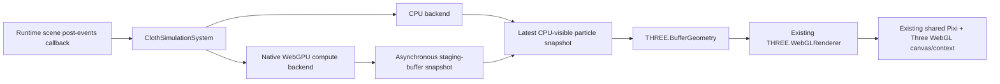

# Cloth Simulation System Extension Specification

Status: **Approved**

Date: 2026-08-07

Baseline:

- Repository branch: `merge-upstream-0806`
- Investigated commit: `7d86db77c2c5c700146b86f42bc412d294bd1e9b`
- Three.js runtime and editor version: `0.160.0`
- Reference: [three.js WebGPU compute cloth example](https://threejs.org/examples/webgpu_compute_cloth.html)
- Reference source audited on 2026-08-07:
  [webgpu_compute_cloth.html](https://raw.githubusercontent.com/mrdoob/three.js/dev/examples/webgpu_compute_cloth.html)

## 1. Approval gate

This document is the focused specification required by `AGENT.md` for a new,
cross-cutting runtime feature. It deliberately does not approve its own
implementation.

No production code, dependency change, generated file, or asset described by
this document may be added until a reviewer explicitly changes the status to
**Approved** and records the approval below.

| Field | Value |
| --- | --- |
| Approver | User, via explicit implementation request |
| Approval date | 2026-08-09 |
| Approved scope | Full specification as written |

Approval of the separate scene lifecycle-functions specification does not
approve this feature.

## 2. Executive decision

GDevelop will implement cloth as an isolated built-in JavaScript **system
extension** named `ClothSimulation`. The public authoring surface is a new
rendered-in-3D object, `ClothSimulation::Cloth3DObject`, while an internal
scene-owned system schedules and resources all cloth instances.

The existing renderer is not replaced or upgraded. Pixi and Three.js continue
to share GDevelop's existing WebGL canvas and context, and every cloth is
rendered by the existing Three.js `WebGLRenderer` as an ordinary
`THREE.BufferGeometry` and `THREE.MeshStandardMaterial`.

Simulation has two interchangeable backends:

1. `CpuClothSimulationBackend` is always available and is the immediate,
   synchronous baseline.
2. `WebGpuClothSimulationBackend` uses the browser's native WebGPU API and
   static WGSL compute shaders on a separate `GPUDevice`. It does not create a
   WebGPU canvas or WebGPU renderer. Completed state is copied asynchronously
   to CPU-visible staging buffers and then uploaded to the existing WebGL
   geometry.

The default backend preference is `Auto`. WebGPU is used when it is supported
and worthwhile for the configured topology; otherwise the CPU backend is used.
An author can force CPU or prefer WebGPU, but WebGPU is never required for a
game to run. Adapter denial, device creation failure, device loss, validation
errors, buffer-map failure, and exhausted device limits all fall back to CPU
without breaking the scene.

This is deliberately **WebGPU compute plus WebGL rendering**, not a migration
to `THREE.WebGPURenderer`. It lets WebGPU and WebGL coexist without changing
the renderer contract used by existing projects.

## 3. Why the reference cannot be integrated verbatim

The official example is valuable as a solver and data-layout reference:

- it builds a rectangular Verlet grid;
- connects structural and diagonal springs;
- pins selected particles;
- computes all spring corrections before accumulating per-particle movement;
- advances with a fixed timestep; and
- demonstrates gravity, wind, and sphere collision.

It is not a compatible renderer integration for GDevelop:

- the current source imports `three/webgpu` and `three/tsl` and creates a
  `THREE.WebGPURenderer`;
- the source contains `TODO: Fix example with WebGL backend`, rejects a missing
  WebGPU implementation, and throws `No WebGPU support`;
- GDevelop is pinned to Three.js `0.160.0`, while this example was introduced
  into the Three.js `dev` branch for milestone r177;
- GDevelop's Pixi renderer and Three.js renderer share one WebGL canvas and
  context;
- GDevelop interleaves Pixi layers, Three.js layers, legacy
  `EffectComposer`, and XR rendering;
- the 2D/3D layer bridge assigns Pixi-owned WebGL textures through Three.js
  WebGL renderer properties; and
- `WebGPURenderer` uses a different build, asynchronous initialization, node
  materials, and a different post-processing stack.

Replacing the main renderer would therefore be a renderer migration affecting
all 2D and 3D projects, not an isolated cloth feature.

The implementation must also not copy a likely rectangular-grid defect from
the audited example: its cloth-mesh inner loop uses `clothNumSegmentsX` for
both axes. GDevelop's topology and render-index tests must always include
`segmentsX != segmentsY`.

## 4. Confirmed repository seams

The design relies on these existing contracts:

- `GDJS/Runtime/pixi-renderers/runtimegame-pixi-renderer.ts` creates the
  `THREE.WebGLRenderer`, then gives its WebGL context and canvas to Pixi.
- `GDJS/Runtime/pixi-renderers/runtimescene-pixi-renderer.ts` interleaves
  Pixi, Three.js, post-processing, and XR renders.
- `GDJS/Runtime/pixi-renderers/layer-pixi-renderer.ts` owns each Three.js
  layer group and the WebGL texture bridge.
- `Extensions/3D/A_RuntimeObject3D.ts` provides standard 3D position, size,
  rotation, scale, flip, and networking behavior.
- `Extensions/3D/A_RuntimeObject3DRenderer.ts` attaches a Three.js root to the
  default 3D layer of a `RuntimeInstanceContainer`.
- `gdjs.registerRuntimeScenePostEventsCallback` runs after scene events and
  before rendering, so event changes can affect the same rendered frame.
- `gdjs.registerRuntimeSceneUnloadedCallback` is the final scene-level
  disposal hook used by extensions such as Physics3D.
- `RuntimeInstanceContainer.getScene()` lets cloth instances inside custom
  objects use the owning scene system.
- `.markAsRenderedIn3D()` causes the existing exporter path to include the
  Three.js runtime for a project using the object.

No new core renderer hook is required.

## 5. Goals

1. Provide a native, event-driven 3D cloth object that works without custom
   JavaScript.
2. Preserve every existing 2D, 3D, effect, XR, and mixed-layer rendering path.
3. Use WebGPU compute when suitable without making WebGPU a runtime
   requirement.
4. Provide a complete CPU implementation with the same topology, solver order,
   configuration, and public behavior.
5. Keep backend selection and backend failure invisible to game logic unless
   the author explicitly reads diagnostic conditions or expressions.
6. Start every cloth immediately in a valid rest pose while asynchronous GPU
   initialization occurs.
7. Advance cloth after events and before render so same-frame actions take
   effect predictably.
8. Work for scene objects and child objects inside custom objects or Prefabs.
9. Normalize all authored and hot-reloaded data before allocating memory or
   dispatching work.
10. Bound topology, substeps, scene totals, GPU allocations, and asynchronous
    readbacks.
11. Dispose Three.js, CPU, and GPU resources deterministically on deletion,
    scene unload, backend replacement, and hot reload.
12. Leave a testable backend seam so normal CI does not depend on physical GPU
    availability.
13. Retain required Three.js and WebGPU type-package license notices.

## 6. Non-goals

The first version does not include:

- replacing `THREE.WebGLRenderer` with `THREE.WebGPURenderer`;
- upgrading Three.js or adding a second `three/webgpu` runtime bundle;
- using TSL, node materials, `Inspector`, `OrbitControls`, or the HDR assets
  from the reference example;
- zero-copy WebGPU-buffer-to-WebGL-buffer sharing, which has no portable web
  platform contract;
- a WebGL compute or transform-feedback backend;
- cloth tearing, cutting, sewing, self-collision, thickness, volume, bending
  constraints, or fixed-point atomics;
- collision against arbitrary meshes, Physics3D bodies, or other cloths;
- automatic binding to a moving external sphere object;
- texture resources or normal maps in the first version;
- per-vertex position expressions, because WebGPU readback is asynchronous and
  exposing them would give backend-dependent freshness;
- dynamic mesh collision masks or a hitbox that follows every simulated
  particle;
- deterministic lockstep equivalence across CPU, GPU vendors, browsers, or
  machines;
- replication of deformation in multiplayer network-sync data;
- saving an in-progress deformation in project files, save states, or hot
  reload state;
- simulation in the scene editor; and
- a general-purpose compute-shader API for user-authored WGSL.

These omissions are explicit product boundaries, not placeholder fields in the
serialized object format.

## 7. Terminology

- **cloth object**: one runtime instance of
  `ClothSimulation::Cloth3DObject`.
- **particle**: one simulated point in the rectangular grid. A render vertex
  uses the same index in version 1.
- **spring**: a structural or diagonal relationship between two particles and
  a fixed rest length.
- **snapshot**: a complete CPU-visible copy of current and previous particle
  positions for one monotonically increasing simulation sequence.
- **backend preference**: serialized author intent (`Auto`, `CPU`, or
  `WebGPUPreferred`).
- **active backend**: the backend currently advancing an instance (`CPU` or
  `WebGPU`).
- **fallback**: migration from a requested or active WebGPU backend to CPU
  after an unavailable or failed WebGPU operation.
- **budget-paused**: an instance rendered at rest but not advanced because the
  scene's hard simulation budget is already assigned to earlier instances.
- **system**: the scene-owned scheduler that admits, advances, migrates, and
  disposes cloth instances.

`IsUsingWebGPU` always means the **compute backend**. Rendering remains WebGL.

## 8. Public object and editor surface

### 8.1 Extension and object identity

| Item | Stable value |
| --- | --- |
| Built-in extension name | `ClothSimulation` |
| Object type | `ClothSimulation::Cloth3DObject` |
| English label | `3D cloth` |
| Category | `General` |
| Asset-store tag | `3d cloth` |
| Runtime class | `gdjs.Cloth3DRuntimeObject` |
| Base class | `gdjs.RuntimeObject3D` |
| Renderer base class | `gdjs.RuntimeObject3DRenderer` |

The object is marked rendered in 3D and receives the same default capability
behaviors as the 3D Box: Resizable, Scalable, Flippable, and
`Scene3D::Base3DBehavior`. Pixi effects remain unsupported because the object
is rendered by Three.js.

The feature is an object rather than a behavior on an arbitrary 3D object
because the cloth owns its topology, dynamic geometry, material, backend
state, and disposal. A behavior that replaced another object's mesh would
violate renderer ownership and conflict with object-specific size semantics.

### 8.2 Serialized object properties

The following fields live in the ordinary object `content`. Property names and
choice values are stable serialization identifiers; labels are localized.

| Field | Type | Default | Valid range or choices | Editor group |
| --- | --- | ---: | --- | --- |
| `width` | number | `200` | finite, `> 0` | Default size |
| `height` | number | `200` | finite, `> 0` | Default size |
| `depth` | number | `100` | finite, `> 0` | Default size |
| `segmentsX` | integer | `30` | `2..64` | Mesh |
| `segmentsY` | integer | `30` | `2..64` | Mesh |
| `backendPreference` | choice | `Auto` | `Auto`, `CPU`, `WebGPUPreferred` | Backend |
| `simulationFrequency` | integer | `360` | `30..360` Hz | Advanced simulation |
| `maxSubsteps` | integer | `8` | `1..12` | Advanced simulation |
| `stiffness` | number | `0.2` | `0..1` | Fabric |
| `damping` | number | `0.99` | `0..1` | Fabric |
| `gravityX` | number | `0` | finite, clamped to `[-100000, 100000]` | Forces |
| `gravityY` | number | `0` | finite, clamped to `[-100000, 100000]` | Forces |
| `gravityZ` | number | `-600` | finite, clamped to `[-100000, 100000]` | Forces |
| `windX` | number | `0` | finite, clamped to `[-100000, 100000]` | Forces |
| `windY` | number | `0` | finite, clamped to `[-100000, 100000]` | Forces |
| `windZ` | number | `0` | finite, clamped to `[-100000, 100000]` | Forces |
| `pinMode` | choice | `TopEveryN` | `None`, `TopCorners`, `TopEdge`, `TopEveryN` | Pinning |
| `pinInterval` | integer | `5` | `1..segmentsX + 1` | Pinning |
| `sphereColliderEnabled` | boolean | `false` | boolean | Sphere collider |
| `sphereCenterX` | number | `0` | finite | Sphere collider |
| `sphereCenterY` | number | `0` | finite | Sphere collider |
| `sphereCenterZ` | number | `0` | finite | Sphere collider |
| `sphereRadius` | number | `25` | finite, `0..1000000` | Sphere collider |
| `color` | color string | `32;64;128` | valid GDevelop RGB/hex color | Appearance |
| `opacity` | number | `0.85` | `0..1` | Appearance |
| `roughness` | number | `0.8` | `0..1` | Appearance |
| `metalness` | number | `0` | `0..1` | Appearance |
| `doubleSided` | boolean | `true` | boolean | Appearance |
| `isCastingShadow` | boolean | `false` | boolean | Appearance |
| `isReceivingShadow` | boolean | `true` | boolean | Appearance |

The rest mesh is centered in the object's local XY plane at local Z `0`.
`width` and `height` define its authored rest dimensions. `depth` remains the
ordinary logical Z size and gives authors a useful selection/bounds volume; it
does not constrain how far simulated particles may move. Object rotation can
orient the rest plane anywhere in the scene.

Gravity and wind are scene-coordinate accelerations in GDevelop distance units
per second squared. Before a step, the current object rotation and flips
transform them into cloth-local coordinates. Translation has no effect. Since
the renderer bakes the current width and height into particle positions rather
than applying a non-uniform root scale, this conversion does not introduce a
non-uniform-scale ambiguity.

The optional sphere center is relative to the cloth object's center in local
coordinates, and its radius is in GDevelop distance units. It provides the
bounded primitive demonstrated by the reference without claiming general
collision support.

### 8.3 Normalization rules

One pure `normalizeCloth3DObjectData` function is used by construction, editor
property updates, deserialization, hot reload, CPU allocation, and WebGPU
allocation.

- Missing fields receive the defaults above.
- Non-finite numeric fields receive their individual default.
- Integer fields are truncated and then clamped.
- Unknown choice strings receive their default.
- Width, height, and depth reuse `RuntimeObject3D`'s positive-dimension rule.
- `pinInterval` is clamped again after `segmentsX` is normalized.
- A disabled or zero-radius sphere produces no collision work.
- Color parsing falls back to the default color and never reaches a material
  as `NaN`.
- Counts are calculated only after the segment caps are applied.

Normalization returns a new data object and never mutates untrusted serialized
input while validating it.

### 8.4 Backend choice labels

The editor copy must make fallback explicit:

```text
Automatic (recommended)
Use WebGPU compute for suitable cloth sizes when available, otherwise use CPU.

CPU
Always simulate on the CPU. Rendering still uses WebGL.

Prefer WebGPU compute
Try WebGPU compute for this cloth and fall back to CPU if unavailable or lost.
Rendering still uses WebGL.
```

The editor must not report the editor machine's WebGPU support as project
support; exported games may run on different devices and origins.

### 8.5 Event API

All instructions are scoped to `Cloth3DObject` and use ordinary object picking.
Numeric setters apply finite-value normalization before changing state.
Instruction metadata uses the stable names shown below and lower-camel runtime
function names (`setSimulationEnabled`, `resetSimulation`, `resetPinning`,
`setStiffness`, `setDamping`, `setGravity`, `setWind`, `pinVertex`,
`unpinVertex`, `setSphereColliderEnabled`, and `setSphereCollider`). Conditions
and expressions follow the same convention (`isSimulationEnabled`,
`isSimulationRunning`, `isVertexPinned`, `isUsingWebGPU`,
`hasWebGPUFallbackOccurred`, `isBudgetPaused`, `getActiveBackend`,
`getActualSegmentsX`, `getActualSegmentsY`, and
`getDroppedSimulationTime`).

#### Actions

| Stable name | Sentence and behavior |
| --- | --- |
| `SetSimulationEnabled` | Enable or disable simulation. Disabling freezes current state and clears the accumulator; enabling resumes without catch-up. |
| `ResetSimulation` | Put every particle and every retained pin target in the authored rest pose, clear previous displacement, clear dropped-time diagnostics, and keep the current authored/runtime pin mask. |
| `ResetPinning` | Restore the authored `pinMode` and `pinInterval`; authored pins return to their rest targets. |
| `SetStiffness` | Set stiffness, clamped to `0..1`, without resetting topology. |
| `SetDamping` | Set damping, clamped to `0..1`, without resetting topology. |
| `SetGravity` | Set scene-coordinate gravity X, Y, and Z. |
| `SetWind` | Set scene-coordinate wind X, Y, and Z. Wind is constant in version 1. |
| `PinVertex` | Pin the vertex at integer column and row. A valid newly pinned vertex captures its authoritative current position and has zero release velocity. Invalid indices do nothing. |
| `UnpinVertex` | Unpin the vertex at integer column and row and clear its previous displacement so it cannot jump. Authored pinning may be restored later with `ResetPinning`. |
| `SetSphereColliderEnabled` | Enable or disable the local sphere collider. |
| `SetSphereCollider` | Set local center X/Y/Z and non-negative radius transactionally. |

The first version intentionally has no action that repeatedly switches backend
preference. Backend preference is object metadata and may change through hot
reload. This prevents an every-frame event from creating adapter-request or
device-recreation storms.

#### Conditions

| Stable name | Meaning |
| --- | --- |
| `IsSimulationEnabled` | The author has enabled simulation. |
| `IsSimulationRunning` | The instance is enabled, admitted to the scene budget, and has a valid active backend. |
| `IsVertexPinned` | The normalized column/row identifies a currently pinned vertex. |
| `IsUsingWebGPU` | The active compute backend is WebGPU. Rendering remains WebGL. |
| `HasWebGPUFallbackOccurred` | This instance requested or used WebGPU and migrated to CPU because it was unavailable or failed. |
| `IsBudgetPaused` | The instance is currently outside the scene simulation budget. |

#### Expressions

| Stable name | Return value |
| --- | --- |
| `ActiveBackend` | String: `CPU` or `WebGPU`; `CPU` is returned during asynchronous WebGPU initialization because CPU is actively simulating. |
| `ActualSegmentsX` | Normalized X segment count. |
| `ActualSegmentsY` | Normalized Y segment count. |
| `DroppedSimulationTime` | Total seconds discarded by the frame-delta/substep cap since the last reset. |

No public instruction exposes `GPUDevice`, adapter information, buffers,
Three.js objects, WGSL, promises, or renderer internals.

### 8.6 Scene-editor representation

The extension registers an editor configuration and instance renderer through
the normal `registerEditorConfigurations` and `registerInstanceRenderers`
exports in `JsExtension.js`.

The scene editor displays a static rectangular grid using the object's width,
height, transform, tint, opacity, and segment aspect ratio. It does not request
a GPU adapter and does not simulate. A small pin marker on authored pinned
vertices is optional; it must be capped to avoid drawing thousands of editor
primitives. The preview must remain usable in both 2D and 3D scene-editor
modes.

## 9. Serialization, copy, hot reload, and networking

### 9.1 Project serialization

`Cloth3DObjectData` extends the ordinary `Object3DData` shape. All fields from
section 8.2 are object-definition content and therefore use the existing JSON
and multi-file object serialization paths. There is no custom binary or sidecar
simulation file.

Only authored configuration is serialized. These runtime values are never
serialized:

- current or previous particle positions;
- spring corrections;
- the fixed-step accumulator;
- the per-instance simulation-enabled flag, which starts as `true`;
- runtime pin overrides;
- active backend and fallback reason;
- adapter/device identity;
- GPU buffers or readback state; and
- dropped-time or budget diagnostics.

Copying an object definition copies authored properties. Creating an instance
always starts from rest pose. Existing projects that do not use this new object
have no new fields and no behavior change.

### 9.2 Hot reload and object-data updates

`updateFromObjectData` applies a normalized, transactional update:

- appearance-only changes update material state without resetting simulation;
- stiffness, damping, gravity, wind, collider, frequency, and max-substep
  changes update the active backend at the next frame boundary; a frequency
  change also clears the accumulator so time from two step sizes is not mixed;
- pin-mode changes rebuild the pin mask and reset only affected pin targets;
- width, height, segments, or topology changes rebuild topology and reset to
  rest pose;
- depth changes update the ordinary logical size without rebuilding topology;
- backend-preference changes migrate at a frame boundary; and
- a failed replacement leaves the previous valid backend and geometry active.

The new topology and all CPU/GPU resources are prepared before the old
generation is retired. Every asynchronous completion carries an object
generation number; stale completions dispose their own resources and cannot
write into the new generation.

### 9.3 Network synchronization and save states

The object inherits ordinary `RuntimeObject3D` transform/network data. It adds
no deformation payload in version 1. Backend floating-point results are not a
lockstep networking contract. A multiplayer project that needs authoritative
cloth must synchronize higher-level game state or use a future deformation
replication feature.

Save-state restoration recreates rest state from object configuration. Saving
the current deformation is explicitly deferred.

## 10. Canonical topology and solver

### 10.1 Grid indexing

For normalized segment counts `sx` and `sy`:

```text
columns       = sx + 1
rows          = sy + 1
particleCount = columns * rows
index(x, y)   = y * columns + x
```

Particles are created for `0 <= x <= sx` and `0 <= y <= sy`. Their rest
positions span the centered local XY rectangle. UVs are `(x / sx, 1 - y / sy)`.

Each cell produces two consistently wound triangles. The render geometry uses
the particle positions directly instead of the reference example's cell-center
node-material geometry, because GDevelop reads the result back for ordinary
WebGL rendering.

### 10.2 Springs and adjacency

Springs are emitted once in deterministic order:

1. horizontal structural springs;
2. vertical structural springs;
3. one descending diagonal per cell; and
4. one ascending diagonal per cell.

Counts are:

```text
horizontal = sx * (sy + 1)
vertical   = (sx + 1) * sy
diagonal   = 2 * sx * sy
total      = horizontal + vertical + diagonal
```

For `30 x 30`, there are 961 particles and 3,660 springs. An adjacency list
contains exactly two entries for every spring. Each particle stores a fixed
flag, adjacency count, and adjacency offset.

Rest lengths are calculated from the normalized authored rest positions, not
hardcoded per spring type.

### 10.3 Pin modes

`row = 0` is the authored top edge.

- `None`: no authored pin.
- `TopCorners`: `(0, 0)` and `(sx, 0)`.
- `TopEdge`: every particle in row `0`.
- `TopEveryN`: columns `0, N, 2N, ...`, and always `sx` so the far corner is
  not accidentally omitted.

A fixed particle keeps an explicit pin target. Runtime pin and unpin operations
are backend commands applied before the next solver pass. They also synchronize
the previous position so unpinning cannot create stored velocity.

### 10.4 Per-substep algorithm

CPU and WebGPU implement the same two-phase, order-independent recurrence. Let
`p` be current position, `q` previous position, `dt` the fixed timestep, and
`epsilon = 1e-6` in local distance units.

**Pass A — spring corrections**

For every spring `(a, b)`:

```text
delta      = p[b] - p[a]
distance   = max(length(delta), epsilon)
correction = 0.5 * stiffness * (distance - restLength)
             * delta / distance
```

The correction is written to a spring buffer. Particle positions are not
mutated in this pass.

**Pass B — particle integration**

For every non-fixed particle:

```text
velocity     = (p - q) * damping
springDelta  = signed sum of adjacent spring corrections
acceleration = localGravity + localWind
predicted    = p + velocity + springDelta + acceleration * dt * dt
```

The optional sphere collision projects `predicted` to the sphere surface when
it lies inside the radius. If distance to the sphere center is below epsilon,
the projection uses the normalized previous displacement, or local `+Z` if
that is also degenerate. This prevents division by zero and `NaN`.

Finally, `q = p` and `p = predicted`. Fixed particles set both positions to
their pin target. CPU writes results through `Float32Array`/`Math.fround` at
state boundaries so its precision model is close to WGSL `f32`; bit-identical
cross-backend results are not promised.

The exact procedural `triNoise3D` wind implementation from the reference is
not copied. Version 1 wind is a constant authored acceleration, making CPU/GPU
parity and attribution simpler. Authors can animate it with events.

### 10.5 Fixed timestep

The scene system reads the scene's scaled elapsed time once in the post-events
callback. For each active instance:

1. clamp contributed frame time to `1 / 15` second;
2. add it to the instance accumulator;
3. run at most `maxSubsteps` iterations of `1 / simulationFrequency`;
4. subtract each completed fixed step; and
5. discard remaining whole steps beyond the cap and add that duration to
   `DroppedSimulationTime`.

Disabling, budget-pausing, scene pausing, or rebuilding clears the accumulator
instead of accumulating a later catch-up burst. A long hidden-tab interval can
never create an unbounded loop.

## 11. Runtime architecture



### 11.1 `ClothSimulationSystem`

The extension augments the runtime type without changing core construction:

```ts
declare namespace gdjs {
  interface RuntimeScene {
    clothSimulationSystem: gdjs.ClothSimulationSystem | null;
  }
}
```

`ClothSimulationSystem.get(runtimeScene)` lazily initializes the field. It
owns:

- deterministic registration order;
- per-scene admission budgets;
- active cloth records;
- one fixed-step scheduling pass per scene frame;
- backend initialization and frame-boundary migration;
- WebGPU command batching and readback completion delivery;
- warning de-duplication and bounded diagnostics; and
- scene disposal.

The system never owns a canvas, Three.js renderer, camera, layer, or Pixi
object.

### 11.2 Runtime object

`Cloth3DRuntimeObject` owns normalized authored/runtime properties, the pin
mask, enabled state, accumulator diagnostics, a generation number, its system
registration, and its renderer.

Construction order is:

1. call the `RuntimeObject3D` constructor;
2. normalize content;
3. synchronously build topology and an initial CPU rest state;
4. construct and attach the Three.js renderer;
5. register with the owning scene system; and
6. begin asynchronous WebGPU selection if required.

The rest mesh is visible even if all backend initialization later fails.

`onDeletedFromScene` unregisters from the system, calls the base implementation
so the layer removes the Three.js root, and disposes renderer resources.
`onDestroyed` repeats disposal defensively; all paths are idempotent.

### 11.3 Three.js renderer

`Cloth3DRuntimeObjectRenderer` creates:

- one `THREE.BufferGeometry`;
- a dynamic `position` attribute using `THREE.DynamicDrawUsage`;
- static UV and index buffers;
- one dynamic normal attribute; and
- one `THREE.MeshStandardMaterial` and `THREE.Mesh`.

It extends `RuntimeObject3DRenderer` for ordinary layer ownership and transform
updates. Unlike the generic normalized 3D renderer, its `updateSize` keeps the
root scale at sign-only flip values and asks the runtime object to rebuild when
width or height changes. Particle positions are already expressed in GDevelop
local distance units. This prevents a second non-uniform scale from changing
solver rest lengths.

When the system publishes a newer snapshot, the renderer copies positions,
marks the position attribute dirty, recomputes finite vertex normals from the
static triangle index, marks normals dirty, and records the sequence. Older or
duplicate snapshot sequences are ignored.

The mesh has `frustumCulled = false` because authored logical bounds do not
contain every possible deformation. Cast/receive shadow, side, transparency,
roughness, metalness, and tint update without replacing geometry.

Geometry and material are disposed exactly once. No material, geometry, or
Three.js root is shared between cloth instances in version 1.

## 12. Backend contract

The backend interface is internal and dependency-injected for tests. Its
conceptual contract is:

```ts
type ClothBackendKind = 'CPU' | 'WebGPU';

interface ClothSimulationBackend {
  readonly kind: ClothBackendKind;
  readonly generation: number;
  applyParameters(parameters: ClothStepParameters): void;
  applyPinCommands(commands: readonly ClothPinCommand[]): void;
  step(fixedDeltaSeconds: number): void;
  requestSnapshot(sequence: number): void;
  getLatestSnapshot(): ClothSimulationSnapshot | null;
  exportLatestRecoverableState(): ClothSimulationState;
  dispose(): void;
}
```

No simulation frame awaits a promise. Asynchronous setup and readback publish
messages back to the system, which applies them only at a frame boundary and
only if scene, object, and generation are still current.

### 12.1 CPU backend

The CPU backend uses preallocated typed arrays for current positions, previous
positions, spring endpoints/rest lengths/corrections, adjacency, fixed flags,
and pin targets. It allocates nothing inside a substep. It is the normative
implementation for algorithm tests and the immediate backend while WebGPU is
pending.

### 12.2 Native WebGPU backend

The WebGPU backend uses browser WebGPU directly. It must not import
`three/webgpu`, TSL, or any new rendering library.

WGSL is a static TypeScript string owned by the extension. Storage structures
use explicit 16-byte-friendly layouts:

- positions and previous positions: `array<vec4<f32>>`;
- spring endpoint/rest data: a 16-byte struct;
- spring corrections: `array<vec4<f32>>`;
- per-particle fixed/count/offset data: `array<vec4<u32>>`;
- adjacency: `array<u32>`; and
- uniforms: a padded struct whose size is a multiple of 16 bytes.

Simulation uses two compute pipelines matching section 10.4. Pin maintenance
may use a small additional pipeline or an equivalent queued buffer operation,
but it must preserve current position and clear release velocity. Workgroup
size is a fixed reviewed constant, initially `64`; dispatch counts use ceiling
division and shaders guard `global_invocation_id` against the logical count.

The backend requests no optional GPU feature. It requests only limits that are
both necessary and no greater than adapter limits. Before allocation it checks
`maxBufferSize`, `maxStorageBufferBindingSize`, workgroup limits, and binding
counts. A limit mismatch is a normal CPU-fallback reason.

### 12.3 Device manager

A `WeakMap<RuntimeGame, WebGpuClothDeviceManager>` shares one lazily requested
adapter/device and compiled pipelines across cloth scenes in the same game.
The manager is reference-counted by active WebGPU-capable scene systems. When
the final reference is released, it destroys owned resources and removes its
entry. A CPU-only project never reads `navigator.gpu`. Capability detection
begins with `typeof navigator !== 'undefined'` so generated-code tests and
non-browser hosts take the ordinary CPU path.

The manager:

- coalesces concurrent adapter/device requests;
- catches synchronous throws and every rejected promise;
- uses WebGPU error scopes around validation-prone setup/submission where
  available and consumes every `popErrorScope` promise;
- labels resources only with generic fixed strings;
- exposes no adapter identity or `adapterInfo`;
- batches all cloth compute/copy commands for one scene frame into as few queue
  submissions as practical;
- listens to `device.lost`; and
- marks a failed device generation terminal so no every-frame retry occurs.

After device loss, active cloths immediately migrate to CPU. Automatic
reacquisition is deferred; a new scene/game or an approved future retry policy
may request a new device.

### 12.4 Readback ring

Each WebGPU cloth owns a ring of three staging slots when device limits and the
scene staging budget permit, with a minimum usable ring of two. Each completed
simulation frame attempts to copy both current and previous positions into a
free `COPY_DST | MAP_READ` slot.

- A slot is never reused while copying, mapping, or mapped.
- If every slot is busy, the visual readback is skipped; compute continues.
- `mapAsync` completion validates scene, object, backend generation, and
  sequence before publishing.
- A published snapshot is copied out before unmapping, so render code never
  retains a mapped GPU range.
- An older completion cannot replace a newer snapshot.
- Map failure triggers CPU fallback and a once-only warning.
- Disposal increments generation and makes every later completion a no-op
  except for safe unmap/destruction.

Rendering may trail WebGPU simulation by one or more frames under load. This is
an explicit consequence of portable WebGPU/WebGL coexistence and must not be
hidden by a synchronous stall.

### 12.5 Backend selection and migration

| Preference/state | Decision |
| --- | --- |
| `CPU` | Create CPU only; never request WebGPU. |
| `Auto`, fewer than 512 particles | Keep CPU; avoid GPU/readback overhead. |
| `Auto`, at least 512 particles | Start CPU immediately and request WebGPU lazily. |
| `WebGPUPreferred` | Start CPU immediately and request WebGPU regardless of topology size. |
| WebGPU becomes ready | Import the newest complete CPU state at a frame boundary, then switch. |
| Adapter/device/pipeline/allocation failure | Keep CPU, set fallback diagnostic, warn once. |
| Device lost or map/submit failure after switch | Import the newest complete recoverable snapshot into CPU and switch at a frame boundary. |
| Hot reload to `CPU` | Export newest recoverable state and switch to CPU. |
| Hot reload to a WebGPU-eligible preference | Start/keep CPU until a new GPU generation is ready. |

A recoverable GPU snapshot includes current and previous positions. Runtime
pin masks and scalar parameters are mirrored by the system, so they need not
wait for GPU readback. A failure may visually rewind to the newest complete
snapshot by a small number of frames; it must never produce a blank mesh,
non-finite data, or an uncaught exception.

### 12.6 Coexistence guarantee

The implementation must not change any of these files for renderer migration:

- `GDJS/Runtime/pixi-renderers/runtimegame-pixi-renderer.ts`;
- `GDJS/Runtime/pixi-renderers/runtimescene-pixi-renderer.ts`;
- `GDJS/Runtime/pixi-renderers/layer-pixi-renderer.ts`;
- `SharedLibs/ThreeAddons/src/three.ts`; or
- the Three.js version pins.

WebGPU never receives GDevelop's visible canvas. WebGL never receives a WebGPU
buffer. The CPU snapshot is the explicit ownership boundary.

## 13. Lifecycle and execution order

For each logical scene frame:

```text
objects and behaviors pre-events
scene pre-events callbacks
generated scene events
behaviors post-events
scene post-events callbacks
  -> ClothSimulationSystem reads final parameters
  -> fixed CPU steps and/or WebGPU command encoding
  -> latest completed snapshot is uploaded to Three geometry
objects pre-render and layer rendering
  -> existing Three WebGL render
  -> existing Pixi/Three layer interleave
```

The extension registers one global post-events callback, not one callback per
object. It does no work for a scene without a lazily created cloth system.

Lifecycle rules:

- Construction registers the object after it has a valid rest mesh.
- Event setters only mutate/queue state; the system consumes it once after all
  events.
- Deleting an object unregisters it before its backend can be stepped again.
- Moving an object between compatible 3D layers retains simulation and uses
  the existing `RuntimeObject` layer path for the root.
- A cloth inside a custom object registers with `instanceContainer.getScene()`
  while its Three root remains owned by the custom object's default layer.
- Scene pause contributes no catch-up time.
- Scene unload disposes all remaining backends, readback slots, registrations,
  and the system, then sets `runtimeScene.clothSimulationSystem = null`.
- Disposal does not await GPU promises.

## 14. Performance and hard budgets

These are safety limits, not recommended authoring targets:

| Limit | Value |
| --- | ---: |
| Segments per axis | `2..64` |
| Particles per cloth | at most `4,225` |
| Springs per cloth | at most `16,512` |
| Fixed frequency | `30..360` Hz |
| Substeps per frame | `1..12` |
| Contributed frame delta | at most `1/15` second |
| Simultaneously admitted cloths per scene | `16` |
| Admitted particles per scene | `16,384` |
| Admitted springs per scene | `65,536` |
| Staging slots per WebGPU cloth | `2..3` |

Admission is deterministic in runtime-object registration order. An instance
that would cross any scene cap becomes budget-paused, remains visible at its
latest/rest pose, sets `IsBudgetPaused`, and causes one bounded warning per
scene. When an earlier object unregisters or reduces topology, the system
retries paused instances in the same stable order at a frame boundary.

The caps apply identically before choosing CPU or WebGPU, so fallback cannot
turn an unbounded GPU scene into unbounded CPU work. They also keep all count
products within safe JavaScript integer and WebGPU buffer ranges.

The implementation must avoid:

- per-substep JavaScript allocations;
- normal recomputation when no newer snapshot exists;
- more than one requested snapshot per cloth per rendered frame;
- repeated adapter requests after a terminal device failure; and
- WebGPU submission per individual substep when the steps can be encoded into
  one frame command stream.

Timing-based assertions are informational benchmarks, not flaky pass/fail unit
tests. Structural caps and allocation counts are tested deterministically.

## 15. Safety, security, and privacy

1. WGSL is a reviewed static literal. Project data cannot inject shader source,
   entry-point names, workgroup sizes, bind layouts, URLs, or GPU features.
2. Every serialized number is normalized before it participates in allocation,
   typed-array construction, buffer size, loop bound, or dispatch count.
3. Count multiplication is checked against the hard caps before allocating.
4. The extension requests no network resource and never uses dynamic code
   evaluation.
5. WebGPU normally requires a secure context; an absent `navigator.gpu` is an
   ordinary capability miss, not an error dialog.
6. Adapter vendor, architecture, device, driver, limits, and descriptive
   failure strings are not exposed to events, analytics, or ordinary logs.
7. Public diagnostics reveal only backend class, fallback occurrence, and a
   stable generic reason code.
8. All async calls have rejection handlers. No device-lost, map, or
   initialization promise may become unhandled.
9. Generation checks prevent use-after-delete, use-after-unload, and stale hot
   reload completion.
10. Buffer destruction and Three.js disposal are idempotent.
11. A non-finite simulation result is treated as backend corruption: reject
    the snapshot, reset/fallback to a finite rest or recoverable state, and
    warn once.
12. GPU debug labels contain no project, scene, object, or player-controlled
    text.

## 16. Diagnostics and failure reasons

Internal stable reason codes are bounded strings:

```text
webgpu-unavailable
webgpu-adapter-unavailable
webgpu-device-failed
webgpu-limit-insufficient
webgpu-pipeline-failed
webgpu-allocation-failed
webgpu-device-lost
webgpu-submit-failed
webgpu-map-failed
webgpu-invalid-snapshot
scene-budget-exceeded
```

Warnings are de-duplicated per scene and reason. They include the generic
reason and object type but no adapter identity or arbitrary exception text in
release builds. The debugger may expose a JSON-safe summary per cloth:

```js
{
  activeBackend: 'CPU' | 'WebGPU',
  preference: 'Auto' | 'CPU' | 'WebGPUPreferred',
  simulationEnabled: boolean,
  budgetPaused: boolean,
  segmentsX: number,
  segmentsY: number,
  latestSnapshotSequence: number,
  droppedSimulationTime: number,
  fallbackReason: string | null,
}
```

Raw buffers, typed-array contents, WGSL, promises, device objects, and Three.js
objects are excluded.

## 17. Dependencies and licensing

### 17.1 Dependency decision

The implementation keeps all existing `three` and `@types/three` pins at
`0.160.0`. It adds no production dependency.

`GDJS` should add `@webgpu/types` as a development-only dependency compatible
with TypeScript 5.4 (version `0.1.71` was current at investigation time) and
commit the resulting lockfile. The root `tsconfig.json` currently restricts
`typeRoots` to `GDJS/node_modules/@types/`, while `@webgpu/types` is deliberately
published outside DefinitelyTyped. Its package directory must therefore be
added to `typeRoots` and verified with `npm run check-types`; the implementation
must not assume that installing the package alone makes it visible. The WebGPU
backend should also carry a file-local reference as explicit documentation:

```ts
/// <reference types="@webgpu/types" />
```

No WebGPU library is added to the JavaScript bundle, and the compiled runtime
has no dependency on the type package. Adding ambient compile-time declarations
must not be confused with enabling or requiring WebGPU at runtime.

WGSL stays embedded in TypeScript. No `.wgsl` runtime-file/exporter rule is
added.

### 17.2 Three.js attribution

Three.js and its example are MIT licensed. Pull request
[mrdoob/three.js#31123](https://github.com/mrdoob/three.js/pull/31123) merged the
example as commit `cd3aa0d` on 2025-05-18 for milestone r177. The mutable `dev`
source was also audited on the date at the top of this specification.

Even though the solver will be reimplemented against GDevelop's backend
interface rather than copied verbatim, source files containing materially
adapted topology or solver logic must carry a concise header such as:

```text
Adapted from the three.js webgpu_compute_cloth example:
https://github.com/mrdoob/three.js/blob/cd3aa0d/examples/webgpu_compute_cloth.html
Copyright 2010-2026 three.js authors
SPDX-License-Identifier: MIT
```

`Extensions/ClothSimulation/THIRD_PARTY_NOTICES.md` must retain the applicable
MIT notice and describe which ideas/code were adapted. The implementation must
not copy the example's HDR image, GUI, inspector, controls, or TSL noise code.

### 17.3 WebGPU types attribution

`@webgpu/types` is BSD-3-Clause licensed. The dependency and license must be
recorded by the repository's normal lockfile/license audit. If its source or
license is redistributed beyond ordinary development dependency handling, its
copyright and conditions must be preserved in the distributed notices.

Authoritative license sources:

- [Three.js LICENSE](https://raw.githubusercontent.com/mrdoob/three.js/dev/LICENSE)
- [gpuweb/types LICENSE](https://raw.githubusercontent.com/gpuweb/types/main/LICENSE)

## 18. Exact file layout

### 18.1 New files

```text
docs/
  cloth-simulation-system-extension-spec.md

Extensions/ClothSimulation/
  JsExtension.js
  ClothSimulationTypes.ts
  ClothSimulationTopology.ts
  ClothSimulationBackend.ts
  CpuClothSimulationBackend.ts
  WebGpuClothSimulationBackend.ts
  WebGpuClothDeviceManager.ts
  ClothSimulationSystem.ts
  Cloth3DRuntimeObject.ts
  Cloth3DRuntimeObjectRenderer.ts
  THIRD_PARTY_NOTICES.md
  tests/
    ClothSimulationTopology.spec.js
    CpuClothSimulationBackend.spec.js
    WebGpuClothSimulationBackend.spec.js
    ClothSimulationSystem.spec.js
    Cloth3DRuntimeObject.spec.js
    ClothSimulationSerialization.spec.js

newIDE/app/public/JsPlatform/Extensions/
  cloth_simulation.svg

GDJS/tests/webgpu/
  ClothSimulationWebGpuSmoke.spec.js

GDJS/tests/
  karma.webgpu.conf.js
```

The runtime include order declared by `JsExtension.js` is:

```text
Extensions/3D/A_RuntimeObject3D.js
Extensions/3D/A_RuntimeObject3DRenderer.js
Extensions/ClothSimulation/ClothSimulationTypes.js
Extensions/ClothSimulation/ClothSimulationTopology.js
Extensions/ClothSimulation/ClothSimulationBackend.js
Extensions/ClothSimulation/CpuClothSimulationBackend.js
Extensions/ClothSimulation/WebGpuClothDeviceManager.js
Extensions/ClothSimulation/WebGpuClothSimulationBackend.js
Extensions/ClothSimulation/ClothSimulationSystem.js
Extensions/ClothSimulation/Cloth3DRuntimeObject.js
Extensions/ClothSimulation/Cloth3DRuntimeObjectRenderer.js
```

If implementation dependencies require a different order, both extension
metadata and Karma must use the same topologically valid order. Source-file
renaming requires a spec amendment rather than silently collapsing the tested
seams.

### 18.2 Modified files

```text
GDJS/package.json
GDJS/package-lock.json
GDJS/tests/karma.conf.js
GDJS/tests/package.json
GDJS/tests/package-lock.json                 # only if the script update changes it
newIDE/app/src/JsExtensionsLoader/BrowserJsExtensionsLoader.js
newIDE/app/src/JsExtensionsLoader/LocalJsExtensionsLoader.js
tsconfig.json
```

Changes are:

- add the development-only WebGPU types package;
- make that non-DefinitelyTyped package visible through the existing explicit
  TypeScript `typeRoots` configuration;
- list compiled cloth runtime files in normal Karma in dependency order;
- add a dedicated `test-webgpu` script/configuration without making normal
  unit tests depend on physical WebGPU;
- add `ClothSimulation` to the web-app extension bundle; and
- increment the local expected JS-extension count from `30` to `31` excluding
  the example extension.

### 18.3 Files intentionally unchanged

No implementation is expected in:

```text
GDJS/Runtime/pixi-renderers/runtimegame-pixi-renderer.ts
GDJS/Runtime/pixi-renderers/runtimescene-pixi-renderer.ts
GDJS/Runtime/pixi-renderers/layer-pixi-renderer.ts
GDJS/scripts/lib/runtime-files-list.js
SharedLibs/ThreeAddons/
Core/GDCore/IDE/Events/UsedExtensionsFinder.cpp
GDJS/GDJS/IDE/ExporterHelper.cpp
```

The existing rendered-in-3D metadata and `.js` runtime export support cover the
new object. A need to modify any file in this list is an architecture change
that requires returning to specification review.

## 19. Phased implementation plan

### Compatibility, rollout, and rollback

The extension is additive. Projects without the object do not include its
runtime files, allocate its system, or inspect WebGPU. Projects with the object
run on CPU in browsers, preview wrappers, test hosts, insecure origins, or
devices without WebGPU. The compiled JavaScript must not reference an
unguarded WebGPU global at module evaluation time.

The feature should ship only after both the CPU path and failure-injected
WebGPU path meet all acceptance criteria. A release-candidate matrix should
cover desktop Chrome/Edge plus representative Firefox/Safari and mobile
browsers; an unavailable WebGPU implementation is a successful CPU-fallback
case, not a skipped product case.

Once a released project can serialize `Cloth3DObject`, rollback must never
remove the object type or its CPU implementation. The safe emergency rollback
is to route `Auto` and `WebGPUPreferred` to CPU while retaining the same schema,
event API, visuals, and diagnostics. Re-enabling WebGPU later requires the same
hardware smoke and failure-injection gates. No remote kill switch, telemetry
lookup, or network dependency is introduced.

### Phase 0 — approval

- Review this document.
- Resolve requested scope changes in the document.
- Record explicit approval and change status to **Approved**.

No later phase begins before Phase 0 completes.

### Phase 1 — pure data model and CPU solver

- Add normalized data types, topology builder, state snapshot, and backend
  interface.
- Implement the allocation-free CPU solver, pins, sphere collision, fixed
  timestep helpers, and disposal.
- Add exhaustive topology and CPU unit tests before renderer integration.

### Phase 2 — object, renderer, metadata, and serialization

- Register the built-in extension and 3D object.
- Add properties, event instructions, editor preview, icon, runtime object, and
  WebGL-rendered dynamic geometry.
- Implement update/copy/hot-reload rules.
- Add serialization, metadata, editor-loader, and CPU renderer integration
  tests.

### Phase 3 — scene system and budgets

- Add one scene-owned scheduler and lifecycle callbacks.
- Add registration, custom-object support, frame-boundary commands, admission
  budgets, warnings, deletion, and unload disposal.
- Test ordering, multiple cloths, paused scenes, deletion, hot reload, and
  budget retry.

### Phase 4 — WebGPU compute backend

- Add the WebGPU type dependency, static WGSL, device manager, buffers,
  pipelines, batching, state migration, readback ring, and failure handling.
- Land fake-device tests for every success and failure transition.
- Verify that CPU remains active during asynchronous setup.

### Phase 5 — integration and hardware verification

- Run targeted GDJS, editor, serialization, and fake-WebGPU tests.
- Run the complete GDJS integration suite.
- Run the dedicated real-WebGPU smoke on an enabled environment.
- Launch the Windows app detached as required by `AGENT.md` and perform a
  mixed 2D/3D preview smoke test.

### Phase 6 — documentation and release readiness

- Finalize user-facing help copy and backend/fallback explanation.
- Verify license notices and dependency audit.
- Record measured informational CPU/GPU profiles for representative 10x10,
  30x30, and 64x64 cloths without converting wall-clock thresholds into flaky
  tests.

## 20. Test matrix

### 20.1 Topology and normalization unit tests

| Case | Required assertion |
| --- | --- |
| `2x2`, `30x30`, `64x64` | Exact particle, spring, adjacency, UV, and triangle counts. |
| `3x5` and `5x3` | Every index is in range; both last rows/columns render; no X/Y substitution. |
| Spring order | Stable structural/diagonal endpoints and exact rest lengths. |
| Adjacency | Every spring appears exactly twice with the correct sign endpoint. |
| Pin modes | Exact masks, far top corner included for `TopEveryN`. |
| Invalid segments | Missing, fractional, negative, huge, and non-finite values normalize before count calculation. |
| Invalid scalar data | Each field falls back or clamps independently; no valid sibling field is lost. |
| Count limits | Maximum topology remains inside declared caps and safe typed-array sizes. |

### 20.2 CPU solver unit tests

| Case | Required assertion |
| --- | --- |
| Rest state, zero forces | Positions remain finite and unchanged within tolerance. |
| Fixed particles | Current and previous positions remain exactly at pin targets. |
| Gravity/wind | An unpinned particle moves in the expected direction. |
| Extended spring | Endpoints receive equal/opposite correction before pin constraints. |
| Solver order | Reversing particle iteration does not change a step; Pass A never mutates positions. |
| Damping | Previous displacement decays by the configured factor. |
| Pin/unpin | Pin captures current state; unpin has no release spike. |
| Sphere surface | Penetrating particles project outside/on radius. |
| Sphere center degeneracy | No division by zero or non-finite state. |
| Coincident spring endpoints | Epsilon guard prevents `NaN`. |
| Frame partitioning | Equal elapsed time split across normal frame partitions gives equivalent fixed-step state. |
| Long frame | Substep count is capped and discarded time is reported exactly. |
| Reset | Rest state, previous state, accumulator, and diagnostics follow the specified reset rules. |
| No allocation loop | Typed-array identities remain stable across repeated substeps. |

### 20.3 WebGPU backend tests with injected fakes

Normal CI uses a dependency-injected fake `navigator`/adapter/device/queue and
does not skip these tests.

| Case | Required assertion |
| --- | --- |
| Buffer layout | Sizes, usage flags, offsets, and 16-byte struct strides are correct. |
| Limits | Insufficient limits reject before allocation and choose CPU. |
| Dispatch | Ceiling workgroup counts and logical-count guards are used. |
| Pass ordering | All spring passes precede their particle pass for each substep. |
| Batch submission | Multiple substeps/cloths are encoded without one submission per substep. |
| Pin maintenance | Commands are applied before simulation and clear release velocity. |
| Readback ring | Busy slots are never reused; all-busy skips without blocking. |
| Out-of-order map | Only the greatest valid sequence is published. |
| Adapter missing/rejected | CPU stays active, fallback code is stable, warning occurs once. |
| Device creation/pipeline failure | Partial resources are destroyed and CPU stays active. |
| `device.lost` | Latest recoverable state migrates to CPU at a frame boundary. |
| Submit/map failure | No unhandled rejection; CPU fallback and once-only warning. |
| Delete/unload during async work | Late completion cannot touch object/scene and resources are released. |
| Double disposal | Safe and no resource is destroyed more than once. |
| Static WGSL | Project strings cannot alter shader source or workgroup size. |

### 20.4 System and lifecycle tests

| Case | Required assertion |
| --- | --- |
| Empty scene | Global callback performs only the lazy-null branch. |
| Event change | A setter in scene events affects the following post-events step and same rendered frame. |
| One step per scene frame | Multiple cloth objects do not register duplicate global callbacks. |
| CPU during GPU init | Cloth moves/renders before adapter/device promise resolves. |
| Frame-boundary migration | No backend is stepped twice for the same fixed substep. |
| Custom object child | It uses owning scene system and its own container layer root. |
| Delete before post-events | Deleted cloth is not stepped or uploaded. |
| Scene pause/resume | No accumulated catch-up burst. |
| Scene unload | System field is cleared; CPU/GPU/Three resources and callbacks are safe. |
| Admission caps | Stable creation-order admission and deterministic budget-paused status. |
| Budget release | A paused cloth is admitted after earlier capacity is released. |
| Hot reload generation | Old async backend cannot overwrite rebuilt state. |

### 20.5 Renderer and coexistence integration tests

Use the existing `gdjs.getPixiRuntimeGameWithAssets()` test helpers where
possible.

1. Create a scene with an ordinary 2D Pixi object, a 3D layer, and a CPU cloth.
2. Assert `runtimeGame.getRenderer().getThreeRenderer()` remains an instance of
   `THREE.WebGLRenderer`.
3. Assert the cloth mesh is attached to the expected Three.js layer group.
4. Advance events/frames and assert a newer snapshot updates finite position
   and normal attributes.
5. Render the mixed scene and existing EffectComposer path without exception.
6. Exercise hide/show, flip, rotation, layer change, object deletion, scene
   unload, and object-data hot reload.
7. Assert geometry/material disposal and no orphan Three.js child.
8. Repeat with an injected successful WebGPU backend and delayed readback to
   verify stale visual frames remain valid.

### 20.6 Metadata, serialization, and export tests

- The extension loads in local and browser loaders, and expected counts match.
- The object is marked rendered in 3D and has all four capability behaviors.
- Property descriptors expose correct defaults, groups, choices, advanced
  flags, units, and localized strings.
- Event instruction metadata has correct object scoping and function names.
- JSON and multi-file round trips preserve every stable field.
- Missing/old content receives defaults; malformed content normalizes.
- Copying definitions does not copy runtime state.
- Generated runtime includes contain existing `three.js`, 3D base files, and
  cloth files in order, but no `three.webgpu.js` or second Three.js bundle.
- An unused project exports no cloth runtime file and does not touch WebGPU.

### 20.7 Real WebGPU smoke test

`GDJS/tests/karma.webgpu.conf.js` is a dedicated launcher/configuration, not a
silent branch inside normal Karma. It must run in a secure environment with
WebGPU deliberately enabled and fail clearly when used as a required CI job but
`navigator.gpu` is unavailable.

The smoke test:

1. creates an existing WebGL renderer/canvas;
2. creates a small `4x4` WebGPU cloth without a WebGPU canvas;
3. submits several compute steps and maps a snapshot;
4. asserts pinned particles are unchanged and an unpinned particle is finite
   and moved;
5. uploads the snapshot to a Three.js WebGL geometry;
6. renders it through the WebGL renderer; and
7. destroys every GPU and Three.js resource.

This proves actual WebGPU-compute/WebGL-render coexistence. The fake-device
suite remains the authoritative CI coverage for failure transitions.

### 20.8 Regression and application verification

After implementation, at minimum run:

```text
cd GDJS
npm run check-types
npm run build
npm run check-format

cd GDJS/tests
npm test
npm run test-webgpu       # only in a deliberately WebGPU-enabled environment

cd newIDE/app
npm run flow
npm run lint
npm run check-format
```

Use the repository's actual script names if they differ at implementation
time, and record substitutions. Run the relevant editor loader/unit tests and
the full integration suite, not only the new specs.

Per `AGENT.md`, after code changes and successful automated checks, launch the
Windows app in a detached non-blocking process and manually verify:

- an existing 2D project;
- an existing mixed 2D/3D project with effects;
- one CPU-forced cloth;
- one Auto cloth on a WebGPU-capable origin; and
- forced unavailable/device-loss behavior where the harness supports it.

## 21. Acceptance criteria

Implementation is complete only when all statements below are true:

1. Existing projects that do not use `Cloth3DObject` serialize, export, and run
   without changed renderer behavior or new runtime WebGPU work.
2. A new 3D cloth object is available in both desktop and web editors with the
   specified metadata, properties, icon, and static preview.
3. CPU cloth simulation renders and remains interactive in a browser with no
   WebGPU support.
4. On a supported device, an eligible Auto or WebGPU-preferred cloth uses
   native WebGPU compute while the visible GDevelop renderer remains
   `THREE.WebGLRenderer`.
5. A scene may contain CPU and WebGPU cloths simultaneously, plus ordinary 2D
   and 3D objects and existing effects.
6. Every WebGPU initialization, limit, device-loss, submit, and map failure
   path preserves a finite visible cloth and migrates to CPU without an
   unhandled rejection.
7. Fixed pins do not move, invalid/collocated configurations do not produce
   `NaN`, and non-square grids are correct.
8. Same-frame event changes are consumed after events and before render exactly
   once per scene frame.
9. Object deletion, scene unload, hot reload, and stale asynchronous completion
   leak no owned CPU, GPU, geometry, material, or scene registration resource.
10. Hard topology, substep, scene, and readback budgets are enforced before
    allocation or dispatch and are visible through bounded diagnostics.
11. Project serialization contains authored configuration only and round trips
    every stable property.
12. Normal unit/integration tests pass without physical WebGPU by testing a
    fake device; the dedicated real-WebGPU coexistence smoke also passes in its
    supported environment.
13. Full GDJS integration tests and relevant newIDE checks pass.
14. Three.js remains at `0.160.0`, no `three/webgpu` runtime is bundled, and
    the existing Pixi/Three renderer files listed in section 18.3 are unchanged.
15. Third-party notices and the development-only WebGPU type dependency satisfy
    section 17.

## 22. Explicitly deferred follow-up work

Any of the following requires a new or amended approved specification:

- migrating GDevelop's renderer to `WebGPURenderer`;
- direct GPU rendering from the compute buffer;
- WebGL2 compute fallback;
- cloth texture resources and advanced fabric materials;
- arbitrary/multiple colliders and Physics3D integration;
- self-collision, bending constraints, tearing, sewing, or thickness;
- external-object collider binding;
- vertex queries with a defined asynchronous freshness model;
- save-state or multiplayer deformation serialization;
- scene-editor live simulation;
- user-authored compute kernels; and
- automatic WebGPU device reacquisition after device loss.

The initial implementation must not add dormant serialization fields or empty
event instructions for these features.

## 23. Final review checklist

Before approving this specification, reviewers should explicitly confirm:

- the product choice of a new 3D cloth object rather than an arbitrary-object
  behavior;
- the native WebGPU-compute/ordinary-WebGL-render boundary;
- CPU as mandatory fallback and immediate initialization backend;
- asynchronous readback and permitted visual latency;
- the public properties, pin model, and one local sphere collider;
- hard topology and scene budgets;
- no deformation serialization or network replication;
- the exact file/touch boundary; and
- the complete test and licensing obligations.

Approval authorizes only this boundary. Discovering that implementation needs
a main renderer migration, a new production dependency, or changes to an
intentionally unchanged file returns the work to specification review.
