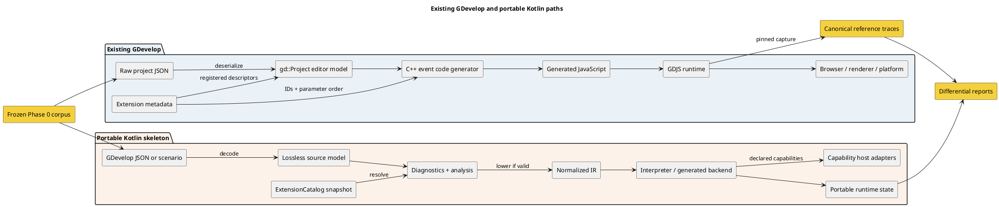
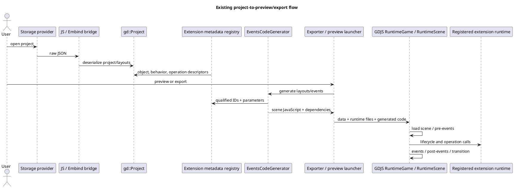
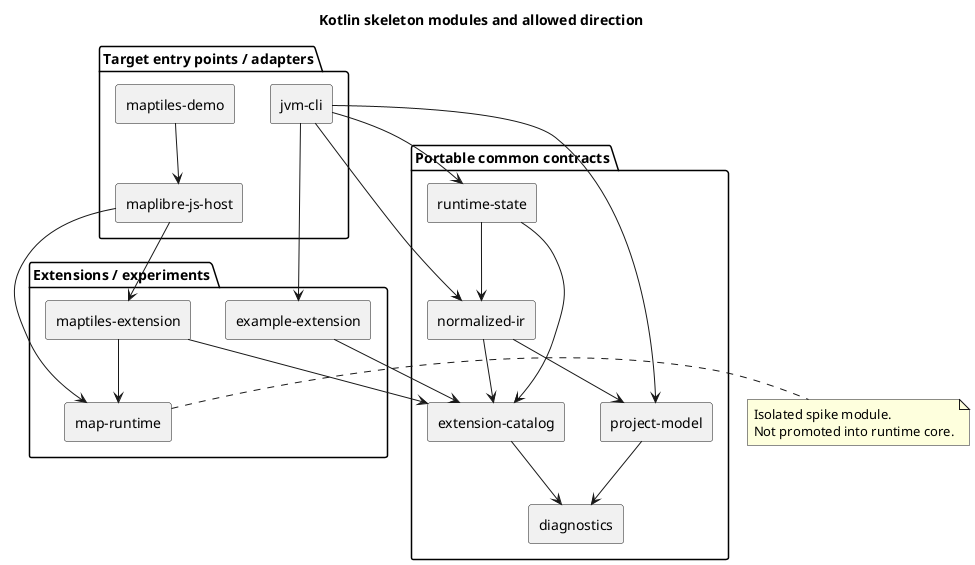
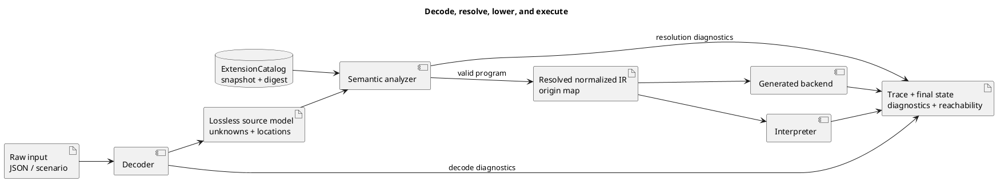
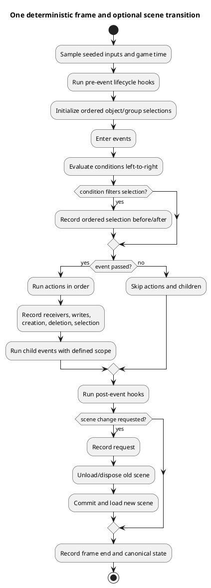
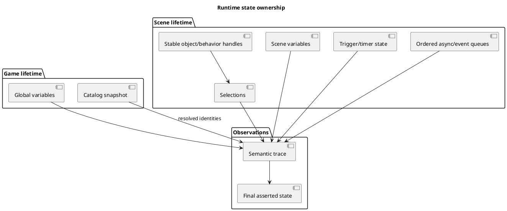
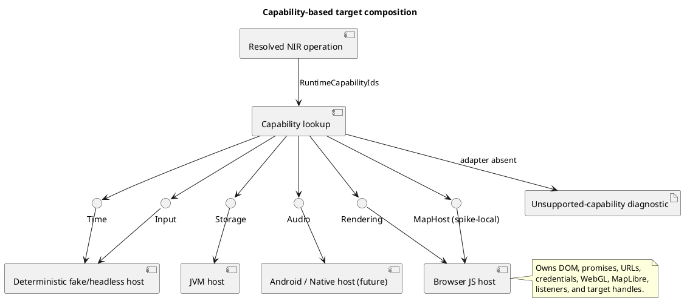
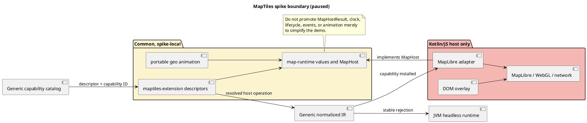
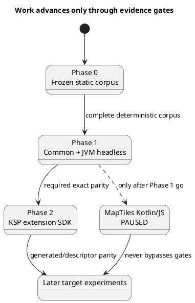

# Kotlin port diagrams and concept guide

This is the visual entry point to the existing GDevelop pipeline, the portable
Kotlin skeleton, and the evidence model connecting them. Diagrams show both
implemented and intended boundaries; they do not turn a proposal into
compatibility evidence. Check the [evidence index](evidence-index.md) for current
claims and the [target strategy](target-strategy.md) for authoritative gates.

PlantUML blocks are renderable source diagrams. Names are shortened in diagrams;
tables and surrounding text link to detailed documentation.

## Reading map

| Question | Diagram | Detail |
|---|---|---|
| How does GDevelop work today? | [Existing pipeline](#existing-gdevelop-pipeline) | [Pipeline trace](gdevelop-pipeline.md) |
| How is the Kotlin skeleton divided? | [Systems and modules](#systems-at-a-glance) | [Portable architecture](portable-architecture.md) |
| Who owns project JSON, source model, and NIR? | [Representation ownership](#representation-ownership-and-lowering) | [ADR-0001](decisions/0001-ir-ownership.md) |
| How do extension IDs and parameters reach runtime? | [Extension resolution](#extension-resolution-and-dispatch) | [Extensions and types](extensions-and-types.md), [ADR-0002](decisions/0002-extension-identity.md) |
| Which runtime behavior must match? | [Runtime lifecycle](#runtime-semantics-and-lifecycle) | [Compatibility roadmap](compatibility-roadmap.md) |
| Where do platform services live? | [Host capabilities](#host-capabilities-and-targets) | [ADR-0003](decisions/0003-runtime-host-boundary.md) |
| How is compatibility earned? | [Evidence loop](#corpus-evidence-and-phase-gates) | [Phase 0 corpus](corpus/README.md) |
| Where does MapTiles fit? | [MapTiles isolation](#maptiles-isolation) | [Prototype](maptiles-prototype.md), [API audit](maptiles-api-audit.md) |

## Systems at a glance

GDevelop and the Kotlin skeleton are not file-for-file translations. The goal is
to reproduce a bounded set of observable semantics through explicit portable
contracts.



The current stages are traced in [the pipeline investigation](gdevelop-pipeline.md).
The portable boundaries are specified in [the architecture](portable-architecture.md).
The corpus—not either implementation's unit tests—is the shared oracle; see the
[Phase 0 corpus guide](corpus/README.md).

## Existing GDevelop pipeline

Persisted IDs, registered metadata, generated calls, and runtime registrations
join the existing system. Extension metadata and runtime implementation can take
separate routes.



| Existing concept | Compatibility consequence | Read more |
|---|---|---|
| Raw project JSON | Persistence input is not normalized semantics. | [Pipeline](gdevelop-pipeline.md), [ADR-0001](decisions/0001-ir-ownership.md) |
| `gd::Project` | Mutable editor state must not become cross-target IR. | [Portable architecture](portable-architecture.md) |
| Qualified type/member strings | Identities and aliases require explicit resolution. | [ADR-0002](decisions/0002-extension-identity.md) |
| Ordered parameters | Position, value type, receiver, and behavior ownership are compatibility data. | [Extension matrix](extensions-and-types.md) |
| Generated JavaScript | It is one backend artifact, not portable truth. | [ADR-0004](decisions/0004-generated-code-vs-interpreter.md) |
| GDJS lifecycle | Order must be demonstrated through traces, not similar APIs. | [Phase 1 gate](target-strategy.md) |

## Kotlin skeleton module overview

Arrows mean intended dependency direction, not that every planned interface is
complete.



| Module/layer | Owns | Must not own | Detail |
|---|---|---|---|
| `project-model` | Decoded declarations, unknown fields, source locations. | Runtime state or renderer handles. | [Source-model boundary](portable-architecture.md) |
| `diagnostics` | Stable codes, severity, normalized paths, related locations. | Target exceptions as compatibility output. | [Diagnostic metric](target-strategy.md) |
| `extension-catalog` | Identities, descriptors, parameters, dependencies, capabilities. | Reflection discovery or renderer instances. | [Extension model](extensions-and-types.md) |
| `normalized-ir` | Resolved control flow, operations, origins, selection/lifecycle semantics. | Raw editor JSON or platform handles. | [ADR-0001](decisions/0001-ir-ownership.md) |
| `runtime-state` | Variables, objects, selections, triggers, queues, lifecycle, traces. | DOM, MapLibre, Android, or target APIs. | [Runtime design](portable-architecture.md) |
| `jvm-cli` | Headless fixture entry point and report emission. | JVM-only semantic rules. | [Prototype README](../../KotlinPlatform/README.md) |
| Host modules | Capability implementations and platform resources. | Portable semantic authority. | [ADR-0003](decisions/0003-runtime-host-boundary.md) |

## Representation ownership and lowering



Each representation has one purpose. The source model remains lossless; only
semantic lowering creates NIR; both interpreter and generated backends consume
that same NIR. This ownership is mandated by [ADR-0001](decisions/0001-ir-ownership.md).

### Canonical NIR

Canonical NIR is a deterministic serialization of resolved target-neutral IR—not
raw JSON, a Kotlin `toString()`, generated JavaScript, or runtime state. Its
digest asks whether lowering produced the same program; trace/state hashes ask
whether execution behaved the same. Canonical-output requirements are in the
[target strategy](target-strategy.md).

## Extension resolution and dispatch

```plantuml
@startuml
title Extension member resolution and execution
skinparam sequenceMessageAlign center
participant "Source operation" as Source
participant ExtensionCatalog as Catalog
participant "Analyzer / lowerer" as Lowerer
participant "Normalized IR" as NIR
participant "Portable runtime" as Runtime
participant "Extension runtime" as Extension
participant "Capability host" as Host
Source -> Catalog : qualified member/type ID
Catalog --> Lowerer : identity + descriptor
Lowerer -> Lowerer : bind ordered arguments
Lowerer -> Lowerer : validate receiver, types, dependencies,
capabilities, and source location
alt portable operation
  Lowerer -> NIR : resolved extension call
  NIR -> Runtime
  Runtime -> Extension : stable entry + arguments
else host capability operation
  Lowerer -> NIR : ExtensionHostOperation
  NIR -> Runtime
  Runtime -> Host : only if capability installed
else unsupported / invalid
  Lowerer --> Source : structured located diagnostic
end
@enduml
```

Read [ADR-0002](decisions/0002-extension-identity.md) for identity/versioning and
[extensions-and-types.md](extensions-and-types.md) for built-in, events-based,
and JavaScript-declared extension routes. The frozen descriptor oracle is part
of the [corpus](corpus/README.md).

## Runtime semantics and lifecycle

Compatibility requires more than Boolean calls. Selections, nested events,
mutation during iteration, triggers, and scene lifecycle have observable order.





See the [target strategy](target-strategy.md) for required trace records and the
[compatibility roadmap](compatibility-roadmap.md) for promotion rules.

## Host capabilities and targets



| Rule | Reason | Authority |
|---|---|---|
| NIR declares capabilities but holds no host instance. | Programs stay target-neutral and analyzable. | [ADR-0003](decisions/0003-runtime-host-boundary.md) |
| Async completions enter ordered runtime queues. | Callback timing must not reorder semantics silently. | [Portable architecture](portable-architecture.md) |
| Target handles stay in adapters and are disposed by owners. | Prevents platform lifetimes leaking into portable state. | [ADR-0003](decisions/0003-runtime-host-boundary.md) |
| Missing capabilities produce stable diagnostics. | Silent skipping is false compatibility. | [Target strategy](target-strategy.md) |
| A fake host is a test instrument, not production conformance. | Determinism and host conformance are separate metrics. | [Evidence index](evidence-index.md) |

## Corpus evidence and phase gates

A compile or unit test can establish implementation health, but cannot alone
promote a feature to `partial` or `compatible`.

```plantuml
@startuml
title Evidence production and gate decision
left to right direction
folder "Phase 0 corpus" as corpus {
  artifact manifest
  artifact projects
  artifact "catalog snapshot" as snapshot
  artifact "reviewed reference traces" as refs
}
component "Corpus validator" as validator
component "Pinned GDJS capture" as capture
component "Portable corpus runner" as runner
artifact "Per-fixture report" as fixture
artifact "Metric summary" as summary
diamond "All gates pass?" as gate
artifact "Compatibility ledger" as ledger
artifact "Stop/revise record" as stop
manifest --> validator
projects --> validator
snapshot --> validator
refs --> validator
projects --> capture
capture --> refs : reviewed/frozen only
manifest --> runner
projects --> runner
snapshot --> runner
refs --> runner : oracle
runner --> fixture
fixture --> summary
summary --> gate
gate --> ledger : yes; evidence-linked promotion
gate --> stop : no; no promotion
@enduml
```

| Metric | Question answered | Gate failure example |
|---|---|---|
| Decode coverage | Did declared-supported documents decode and retain unknowns? | Fatal decode or silent field loss. |
| Resolution accuracy | Were symbols, IDs, types, dependencies, and bindings correct? | Wrong member or parameter owner. |
| Trace parity | Did ordered behavior match the reference? | Different selection, action, mutation, or lifecycle order. |
| State parity | Did final variables, objects, behaviors, selections, and scene match? | Divergent final state. |
| Diagnostic fidelity | Did code, severity, and normalized location match? | Unexpected or missing diagnostic. |
| Reachability precision | Were required items retained and known-unused items removed? | Any reachability false negative. |
| Determinism | Were NIR, trace, and state hashes stable across seeded runs? | Any canonical hash divergence. |
| Host conformance | Did a concrete adapter satisfy applicable behavior tests? | Lifecycle, ordering, failure, or disposal mismatch. |

Fixture definitions and repeated-run counts are in the
[target strategy](target-strategy.md). Frozen inputs, schemas, validation, and
capture commands are in the [corpus guide](corpus/README.md). Reviewed claims
and current gaps belong in the [evidence index](evidence-index.md).

## MapTiles isolation

MapTiles is a downstream Kotlin/JS experiment, not a headless-milestone
dependency. Its feature work is paused until the Phase 1 go criterion passes.



The exhaustive ownership/leak review is in the [MapTiles API audit](maptiles-api-audit.md),
and experiment gates are in the [prototype charter](maptiles-prototype.md).

## Phase and dependency overview



The [target strategy](target-strategy.md) is authoritative for phases and gates.
The [compatibility roadmap](compatibility-roadmap.md) owns the feature ledger.
Where a diagram conflicts with an ADR or gate, the ADR/gate is authoritative.

## Compact glossary

| Term | Meaning | Not the same as |
|---|---|---|
| Source model | Lossless versioned decoded input with unknowns and locations. | `gd::Project`, NIR, or runtime state. |
| Extension catalog | Frozen resolved descriptors and capability requirements. | Reflection or executing `JsExtension.js` as an oracle. |
| NIR | Immutable resolved target-neutral intermediate representation. | Raw JSON, Kotlin `toString()`, or generated JavaScript. |
| Semantic trace | Ordered canonical event/selection/action/lifecycle observations. | Debug logs or host callback timing. |
| Runtime state | Variables, instances, selections, triggers, scenes, and queues. | Renderer or editor state. |
| Host capability | Narrow versioned target service. | Arbitrary browser/JVM/native globals. |
| Reference oracle | Reviewed pinned GDJS observations from frozen fixtures. | Portable output defining its own expectations. |
| Compatibility | Scoped evidence against named metrics. | Compilation, API similarity, demo success, or test presence. |
