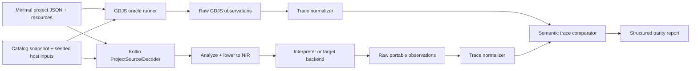

# Compatibility roadmap

> **Status: proposed baseline.** Compatibility is an observable claim about a
> documented feature set, not a count of parsed fields, ported extensions, or
> generated classes. A level is earned only when its fixture manifest, evidence,
> and acceptance criteria are checked in and passing. Higher levels include the
> accepted guarantees of lower levels unless they explicitly publish a target
> limitation.

This roadmap turns the architecture in
[`portable-architecture.md`](portable-architecture.md) and the experiments in
[`target-strategy.md`](target-strategy.md) into user-visible compatibility
claims. Extension identifiers and runtime contracts follow
[`extensions-and-types.md`](extensions-and-types.md). The levels are intentionally
orthogonal to release numbers and targets: JVM, JavaScript, and Android report
their highest independently demonstrated level.

## Status vocabulary and evidence rules

Every feature-ledger entry uses exactly one status:

| Status | Meaning |
|---|---|
| `unknown` | No repository-backed investigation has established the required source or runtime semantics. |
| `investigated` | Relevant GDevelop/GDJS paths and observable behavior have been traced, but no portable implementation is claimed. |
| `planned` | Scope, fixtures, owner/milestone, and acceptance assertions are defined; execution is not yet compatible. |
| `partial` | Some declared fixtures pass, but the entry's documented boundary or target matrix is incomplete. Evidence must name both passing and failing/unsupported cases. |
| `compatible` | All acceptance fixtures for the declared scope pass differential and determinism gates on named target/version combinations. It never means all GDevelop behavior. |
| `incompatible` | Evidence demonstrates that the implementation diverges or the target cannot support the declared contract. The reason and any compatibility-host option are recorded. |

Evidence is a link or stable repository path to at least one of: a source trace,
fixture and expected result, differential report, conformance test, diagnostic
snapshot, benchmark, target capability report, or decision record. A pull request,
implementation file, or “works for me” note alone is not compatibility evidence.
Each evidence record includes the GDevelop revision, portable implementation
revision, target/toolchain, catalog snapshot, host configuration, and corpus
manifest hash.

The ledger below describes the state **before implementation begins**. Most
entries are `investigated` where the existing trace documents establish a source
contract, `planned` where the Phase 0 corpus already names a concrete acceptance
fixture, and `unknown` elsewhere. Nothing is marked `partial` or `compatible`
without executable evidence.

## Compatibility levels

### Level 0 — parse and inspect a documented JSON subset

**Claim.** The implementation can read, preserve provenance for, validate the
shape of, and inspect a versioned subset of raw GDevelop project JSON without
constructing `gd::Project` or executing events.

**Supported project features**

* Top-level project identity/version, properties needed by later decoding,
  global variables, resources as declarations, scenes/layouts, scene variables,
  object and group declarations, instances, event tree structure, and
  `eventsFunctionsExtensions` records in the subset manifest.
* Instruction/expression type strings and positional raw arguments, including
  unknown types as lossless unresolved nodes.
* Source locations as JSON Pointer plus an optional byte/line range, ordered
  arrays, unknown-field retention, and source/resource hashes.
* Static catalog inspection for the built-ins and extension snapshots required
  by the Level 0 fixtures.

**Explicit non-goals**

* Type resolution, event execution, object picking, lifecycle scheduling,
  resource loading, rendering, extension runtime execution, arbitrary JavaScript,
  and full round-trip support for JSON versions outside the declared subset.
* Accepting malformed or unknown input by silently dropping it.

**Observable outputs**

* Canonical source-model JSON, source-location index, unresolved-node list,
  structured diagnostics, resource inventory, and canonical model digest.

**Acceptance criteria**

1. All Level 0 corpus documents decode with the expected diagnostics and no
   unreported data loss; unknown members round-trip through the source model.
2. Two clean runs produce identical canonical output and digest.
3. Every decoded declaration and event operation maps back to the expected JSON
   Pointer; invalid fixtures match diagnostic code, severity, and location.
4. Unsupported versions/types remain inspectable or fail explicitly—never as a
   crash or coerced known type.

### Level 1 — reproduce headless event and variable semantics

**Claim.** A deterministic headless runtime reproduces the accepted subset of
GDevelop event control flow, object selection, variables, and scene transitions.

**Supported project features**

* Primitive constants/expressions and declared numeric, string, and Boolean
  coercions; global, scene, object, parameter, and local event variable scopes.
* Standard and nested events; ordered conditions and actions; object groups;
  condition-driven picking; empty selections; once/trigger state; timers driven
  by a seeded host clock.
* Object handles sufficient for creation, selection, state mutation, and deletion
  during an event; basic scene replacement and deterministic lifecycle trace
  points without target rendering.
* Structured unsupported-operation diagnostics with source locations.

**Explicit non-goals**

* General object render/runtime implementations, behavior libraries, real input,
  audio, storage, networking, asynchronous host work, shaders/effects, arbitrary
  JavaScript, and pixel output.

**Observable outputs**

* Canonical NIR, ordered semantic trace, final variable/object/selection/scene
  state, diagnostics, and deterministic hashes.

**Acceptance criteria**

1. The `variables-and-branches`, `object-picking-and-deletion`, and
   `scene-change-lifecycle` corpus fixtures have exact normalized trace and state
   parity with pinned GDJS runs.
2. Required semantic edge fixtures listed below pass; no false-negative item is
   removed by reachability analysis.
3. One hundred seeded executions have identical NIR, trace, state, and diagnostic
   hashes.
4. Unsupported instructions stop analysis/execution at their declared boundary
   with the expected diagnostic rather than becoming no-ops.

### Level 2 — selected objects, behaviors, and lifecycle hooks

**Claim.** Named object and behavior types execute against target-neutral runtime
state with their documented ownership, serialization, and lifecycle semantics.

**Supported project features**

* The corpus's built-in Text object semantic subset, one deterministic built-in
  behavior, an events-based behavior/function subset, and the headless subset of
  `MyDummyExtension`.
* Object configuration/instance state, behavior instance/shared data, qualified
  type identity, object/behavior parameter ownership, property defaults, and
  selected serialization migrations.
* Application/scene load, pre-events, generated events, post-events, pause,
  resume, unloading, object create/delete, and behavior activate/deactivate hooks
  that apply to the selected types.

**Explicit non-goals**

* All built-in types, rendering fidelity, effects, physics, dynamic extension
  discovery, extension editor UI, arbitrary JS object implementations, and
  lifecycle hooks absent from the declared subset.

**Observable outputs**

* Level 1 outputs plus object/behavior property and shared-data state, factory and
  lifecycle registrations, callback order, serialization diagnostics, and
  resolved extension/capability inventory.

**Acceptance criteria**

1. `builtin-text-object`, `builtin-behavior`, `events-extension`, and
   `javascript-declared-extension` meet their declared headless differential
   assertions with exact lifecycle order.
2. Wrong-owner behavior calls, unknown qualified types, and incompatible
   serialized versions produce the expected source-located diagnostics.
3. Create/delete/activate/deactivate callbacks fire exactly once, and repeated
   seeded runs are deterministic.
4. The supported-type manifest names every property, method/lowering, hook, and
   known omission; passing one method does not qualify an entire type.

### Level 3 — resources and a minimal renderer/host

**Claim.** A named target host loads a documented resource subset and presents a
minimal visual/audio/input-capable application while preserving Level 1–2
semantics.

**Supported project features**

* Content-addressed image and font/text resources required by the Text fixture,
  target manifest/resource lookup, deterministic loading success/failure, and
  lifecycle-safe disposal.
* A minimal 2D renderer for clear/background, transforms, visibility, opacity,
  ordering, and the selected Text object; input/time host adapters required by
  a small interaction fixture.
* Explicit no-op or unavailable capability adapters for features outside scope;
  a platform may add a minimal audio clip only after the headless gate remains
  unchanged.

**Explicit non-goals**

* PixiJS pixel identity, complete font rasterization parity, all resource kinds,
  complex effects/shaders, 3D, physics, production audio mixing, editor rendering,
  or cross-device visual equality not bounded by a tolerance policy.

**Observable outputs**

* Semantic trace/state, resource resolution/load/disposal trace, host capability
  report, rendered frame or golden image, input trace, artifact manifest, and
  target-specific diagnostics.

**Acceptance criteria**

1. Headless semantic traces remain byte-for-byte equal to Level 2 for the same
   fixture when rendering is enabled.
2. `builtin-text-object` meets approved geometry/order/state assertions and the
   target's documented image-difference threshold across its device matrix.
3. Missing/corrupt resources and unsupported capabilities produce expected
   diagnostics; lifecycle stress does not leak or double-dispose host objects.
4. Artifact/resource hashes and ordering are reproducible from a clean build.

### Level 4 — author Kotlin extensions through the portable SDK

**Claim.** Kotlin authors can declare extensions whose compile-time-generated
metadata, lowering, serialization, runtime adapters, and capability requirements
are consumed through the portable contracts.

**Supported project features**

* `@GDevelopExtension`, `@Action`, `@Condition`, `@Expression`, `@ObjectType`,
  `@BehaviorType`, `@LifecycleHook`, and `@RequiresHostCapability` within the
  versioned SDK subset.
* KSP-generated descriptors, lowering bindings, serializers, factory registries,
  and capability manifests linked explicitly at compile time.
* Intrinsic/expanded lowering and selection-filtering conditions as well as
  runtime entry points; no assumption that annotations identify direct methods.

**Explicit non-goals**

* Runtime classpath scanning, arbitrary reflection, post-build JAR discovery,
  automatic conversion of JavaScript bodies, editor UI plugins, and undeclared
  host/global access.

**Observable outputs**

* Generated registry/descriptors, descriptor diff, compile-time diagnostics,
  capability manifest, NIR/trace/state report, and reproducible generated-file
  hashes.

**Acceptance criteria**

1. A Kotlin-authored `MyDummyExtension` subset is descriptor-equivalent to the
   frozen portable catalog snapshot and preserves stable IDs/parameter order.
2. Positive and negative SDK compile fixtures produce their exact generated
   artifacts or diagnostic codes/locations.
3. Snapshot-backed and generated-registry execution have exact NIR/trace/state
   parity with zero runtime-discovered registrations.
4. Two clean builds generate byte-identical registries, and lower levels do not
   regress.

### Level 5 — map a documented subset of existing GDJS extensions

**Claim.** Selected existing extension contracts have explicit portable mappings;
the claim is per extension member and target, not a count of extension folders.

**Supported project features**

* Catalog adapters for selected `JsExtension.cpp`, `JsExtension.js`, and
  events-based extension metadata; aliases, dependencies, value types,
  serialization, include/source order, and host capability declarations.
* One of three recorded runtime dispositions per member: reusable through a JS
  compatibility host, adapted to portable host services, or independently
  implemented for the target.
* Differential execution of the selected deterministic conditions, expressions,
  actions, objects, behaviors, and lifecycle hooks.

**Explicit non-goals**

* Claiming all members because an extension loads; arbitrary inline JavaScript,
  undocumented dynamic global access, automatic shader translation, browser APIs
  on non-browser targets, and unmeasured delegation to GDJS.

**Observable outputs**

* Member-level mapping manifest, catalog diff, runtime-disposition/reuse ledger,
  capability gaps, unsupported diagnostics, and differential traces/state.

**Acceptance criteria**

1. Every claimed member has a stable identity, supported target list, mapping
   disposition, fixture, and exact semantic assertions.
2. Descriptor/catalog equality is exact for mapped fields; dependency and source
   ordering match the pinned export oracle.
3. Differential traces pass for mapped semantics, while unmapped members fail
   with a precise capability/member diagnostic.
4. Kotlin/JS reports GDJS delegation separately from independent implementation;
   delegated coverage cannot qualify independent-runtime compatibility.

### Level 6 — consume selected unmodified GDevelop projects

**Claim.** Named, unmodified project files created by supported GDevelop versions
can be consumed directly and reproduce a documented behavior envelope.

**Supported project features**

* A published project allowlist/capability profile composed only of compatible
  ledger entries from lower levels, including its resource and extension locks.
* Direct source/resource loading, complete analysis, reachability, artifact
  assembly, and execution on each claimed target without hand-editing project
  JSON or substituting fixture-specific IR.
* Stable rejection reports for projects outside the supported profile.

**Explicit non-goals**

* “Open any GDevelop project,” projects with undeclared external code or missing
  dependencies, editor-perfect rendering, unsupported extension members, and
  silent downgrade of project settings.

**Observable outputs**

* Project compatibility report, source-located diagnostics, resolved lock and
  capability profile, artifact manifest, runtime trace/state, resource report,
  and target output.

**Acceptance criteria**

1. Each allowlisted project is byte-for-byte unmodified, identified by hash, and
   passes its behavior/resource/lifecycle differential assertions on every
   claimed target.
2. No fixture-specific decoder or backend branch is permitted; deleting the
   allowlist metadata does not alter semantics.
3. Unsupported projects fail before packaging/execution with complete actionable
   diagnostics and no missing-capability null failures.
4. Repeated clean builds and seeded runs are deterministic within the documented
   rendering/audio tolerance envelope.

### Level 7 — editor or tooling integration

**Claim.** A documented editor/tooling surface can inspect, diagnose, run, and/or
author projects using the same portable source model, catalog, and runtime—not a
second semantic implementation.

**Supported project features**

* At minimum: project/extension inspection, diagnostics navigable to JSON or
  scenario source, compatibility reports, corpus/trace comparison, and launch of
  a supported backend. Optional authoring/hot reload is claimed only when its
  round-trip and state-migration fixtures pass.
* Generated SDK descriptor browsing and capability/unsupported-feature display.
* Stable tooling protocol/schema version and machine-readable diagnostics.

**Explicit non-goals**

* Full GDevelop editor parity, importing every editor plugin, using Cucumber as a
  project database, or declaring runtime compatibility from syntax highlighting
  and inspection alone.

**Observable outputs**

* Versioned tooling messages, source-linked diagnostics, catalog and capability
  views, trace diff, backend launch result, edit/round-trip report when applicable,
  and telemetry-free reproducible tooling fixtures.

**Acceptance criteria**

1. Tool output for the compatibility corpus matches golden protocol/diagnostic
   snapshots and navigates to exact source locations.
2. Tool-launched execution produces the same artifact and semantic hashes as the
   command-line path.
3. Any claimed edits preserve unknown fields and pass canonical round-trip plus
   runtime differential checks; unsupported edits are blocked explicitly.
4. Tooling protocol compatibility and migration policy are documented and tested
   independently of a particular UI framework.

## Fixture-based differential testing

Differential testing is designed now even if its complete runner arrives after
the first decoder. The oracle is a pinned GDJS revision plus reviewed fixture
expectations—not whichever implementation ran most recently.

### Test topology

### Controlled inputs

Each manifest entry pins project/resource hashes, GDevelop/GDJS revision,
extension catalog snapshot, initial scene, frame count, time deltas, random seed,
input samples, async completion schedule, locale, and relevant renderer/host
settings. Stable fixture IDs—not memory addresses or generated symbol names—name
scenes, events, object instances, behaviors, and callbacks.

The GDJS harness instruments observable boundaries without changing control flow.
The Kotlin harness emits through the same trace schema from NIR/runtime hooks.
Raw traces remain available for debugging; comparison uses canonical normalized
traces.

### Normalized trace schema

Every record contains `sequence`, `frame`, `phase`, stable `sourceLocation`,
`eventId`, `kind`, and a typed payload. The required record kinds are:

| Trace family | Minimum payload |
|---|---|
| Scene transitions | Requested operation, source/target scene, request point, commit point, load/unload phase. |
| Event order | Enter/exit, parent event, condition/action ordinal, disabled/skipped reason, function/link frame. |
| Object selections | Object/group type, ordered stable instance IDs before and after each condition, inversion, empty-selection state. |
| Variables | Scope/owner, canonical path, value type, before/after value, coercion performed, writer operation. |
| Object state | Stable instance/type/owner, creation/deletion, selected property/transform before/after, behavior attachment state. |
| Lifecycle callbacks | Hook identity, target object/behavior/scene/extension, phase, registration/source order, completion/failure. |
| Diagnostics | Stable code, severity, normalized source location, related IDs, pipeline/runtime phase. |

Numbers use one documented canonical representation, structured values have
stable key order, and platform-only data is either normalized by an approved
rule or excluded with a reason. Timestamps, heap addresses, generated JS/Kotlin
names, stack formatting, renderer handles, and untranslated message prose are not
semantic equality fields.

### Comparison and triage

The comparator first checks diagnostic sets, then exact record order and payload,
then final state/reachability. It reports the first divergence with surrounding
records and all later differences; it never sorts event or selection records to
make a test pass. Approved tolerances are field-specific (for example a documented
floating-point or rendered-pixel bound), versioned, and forbidden for identities,
ordering, selection membership, lifecycle count, or diagnostic codes.

A divergence is classified as portable defect, oracle-instrumentation defect,
fixture ambiguity, intentional incompatibility, or pinned-version difference.
Changing a golden trace requires the raw before/after traces, upstream source
evidence, reviewer approval, and a ledger update. A portable trace is never
promoted to oracle merely because GDJS is inconvenient to run.

## Optional Cucumber acceptance layer

Cucumber is a human-readable acceptance layer over fixtures and portable public
APIs. It is not the application representation, source model, NIR serialization,
compiler test language, or runtime dispatcher.

A scenario may state:

* the project fixture or small source document to load;
* catalog/target/host inputs such as seeded time and input;
* actions visible to a user or host, such as advancing a frame or requesting a
  scene transition; and
* observable results such as active scene, selected-object effects, variable or
  object state, lifecycle order, diagnostics, or trace parity.

Step definitions build or load the portable IR only through stable public entry
points: normally they load source through `ProjectSource`/`ProjectDecoder` and
analyze/lower it; focused scenarios may use a public fixture builder or load a
versioned NIR fixture. In every case they use the same portable IR and validation
path as normal applications. They call public runtime/backend APIs and inspect the
normalized report. Steps must not name private analyzer classes, NIR opcodes,
generated symbol names, optimization passes, internal collections, or
backend-specific call sequences.

Good: “Given the `object-picking-and-deletion` project; when one frame runs; then
only instance `enemy-2` remains selected and deletion callback `enemy-1` occurs
once.” Bad: “When lowering emits `FilterSelectionOp(7)` at instruction index 12.”

Feature files may link requirements to several fixtures, but raw project JSON and
the portable source model remain the primary representations. The same acceptance
assertions must also be runnable without Cucumber so build tools, differential
runners, and other test frameworks do not depend on natural-language parsing.

## Semantic-edge priority

Compatibility work is ordered by semantic risk, not by extension count or lines
ported. Before mapping a second large extension family, implement and differentially
test these edges:

| Priority | Edge | Required fixture observation | Gate |
|---:|---|---|---|
| 1 | Nested conditions/events | Left-to-right condition effects, child inheritance, sibling reset, action-before-child order. | Level 1 |
| 2 | Condition-driven object picking | Ordered before/after selections, inversion semantics, group/type partitioning. | Level 1 |
| 3 | Empty selections | Truth result and action/child behavior with zero picked instances; no accidental repopulation. | Level 1 |
| 4 | Creation/deletion during events | Visibility of new objects, deletion of current/other instance, stable survivor iteration, callback count. | Level 1 |
| 5 | Timers and seeded time | Scene/object timer scope, pause/time-scale behavior in declared subset, boundary comparisons. | Level 1 |
| 6 | Once and triggers | Per-event/context state, transition edge, reset behavior, stable state through supported reload. | Level 1 |
| 7 | Scene replacement | Request/commit boundary, remaining old-scene events, variable lifetime, callback order, first new frame. | Level 1–2 |
| 8 | Inheritance of groups | Global/scene group resolution, member type union, shadowing/ambiguity diagnostics, selection inheritance. | Level 1 |
| 9 | Variable coercion | Number/string/Boolean conversions, missing child/default behavior, comparison and assignment result. | Level 1 |
| 10 | Asynchronous actions | Suspension/resumption point, selection/event frame lifetime, ordered completion, cancellation on unload. | Post-Level 2, before claiming the first async extension. |
| 11 | Lifecycle callback order | Registration order and application/scene/object/behavior pre/post/pause/resume/unload/delete sequence. | Level 2 |

Each row becomes a dedicated fixture or isolated variant. A feature depending on
an unpassed edge cannot be marked `compatible`, even when its happy-path example
works.

## Feature-support ledger

The ledger is a versioned data set presented here as its initial human-readable
snapshot. When implementation begins, move the same fields to a machine-readable
file and generate this table. Required fields are `category`, `feature`, `scope`,
`status`, `evidence`, `targets`, `lastVerified`, and `notes/gaps`. The evidence
paths below establish investigation or plans only; they do not claim executable
compatibility.

| Category | Feature / declared scope | Status | Evidence and next proof |
|---|---|---|---|
| Events | Standard and nested condition/action blocks | `planned` | Phase 0 `variables-and-branches` plan in `target-strategy.md`; needs normalized GDJS trace and Level 1 runner. |
| Events | Condition-driven picking and empty selections | `planned` | `portable-architecture.md` object-picking invariant and `object-picking-and-deletion` plan; needs inversion/empty variants. |
| Events | Once/triggers | `investigated` | `portable-architecture.md` state invariant; needs pinned transition/reset fixtures. |
| Events | Creation/deletion during iteration | `planned` | `portable-architecture.md` mutation invariant and Phase 0 gate fixture; needs differential survivor trace. |
| Events | Asynchronous actions | `unknown` | No minimal oracle fixture yet; define scheduling/cancellation observations before planning. |
| Expressions | Primitive constants/operators and parameter order | `planned` | `variables-and-branches` and extension parameter traces in `extensions-and-types.md`; needs coercion cases. |
| Expressions | Extension number/string expressions | `planned` | `javascript-declared-extension` snapshot plan; needs exact descriptor and result traces. |
| Expressions | Dynamic/opaque JavaScript expressions | `investigated` | JS-specific classification in `extensions-and-types.md`; portable support scope remains undecided. |
| Variables | Global and scene scopes | `planned` | `variables-and-branches` and `scene-change-lifecycle`; needs scope lifetime traces. |
| Variables | Object/local/parameter scopes and structured paths | `investigated` | Immutable model and scoping invariants in `portable-architecture.md`; fixtures not frozen. |
| Variables | Coercion and missing-child/default semantics | `unknown` | Add focused numeric/string/Boolean/structure oracle probes. |
| Scene lifecycle | First scene and replacement | `planned` | `scene-change-lifecycle` corpus plan; needs request/commit and first-new-frame trace. |
| Scene lifecycle | Pause/resume/unloading callback order | `investigated` | Runtime order traced in `gdevelop-pipeline.md`; needs minimal fixture and differential report. |
| Scene lifecycle | Timers/time scale | `unknown` | No frozen minimal timer fixture; investigate runtime clock ownership and boundaries. |
| Objects | Built-in Text semantic subset | `planned` | `builtin-text-object` corpus plan from `GDJS/tests/games/Text.json`; needs configuration/state trace. |
| Objects | Groups, global/scene inheritance, and ambiguity | `investigated` | Group and selection invariants in `portable-architecture.md`; needs shadowing/member fixtures. |
| Objects | Custom/events-based objects | `investigated` | Generator trace in `gdevelop-pipeline.md`; no minimal custom-object acceptance fixture yet. |
| Behaviors | Ownership and object/behavior parameter binding | `planned` | `builtin-behavior` and `events-extension` plans; needs wrong-owner negative fixture. |
| Behaviors | Shared data/properties | `planned` | `Basic EventsBasedBehavior test.json` minimization plan and `extensions-and-types.md`; needs state trace. |
| Behaviors | Activation/pre/post/deactivation order | `investigated` | Lifecycle contracts in architecture and extension trace; needs deterministic behavior fixture. |
| Resources | Declaration, logical identity, hash, and reachability | `investigated` | Project/export trace and immutable resource model; needs missing/unused resource fixtures. |
| Resources | Image/font loading and disposal | `planned` | Level 3 Text host plan; needs content-addressed resources and failure variants. |
| Resources | Other GDevelop resource kinds | `unknown` | Inventory exists in `gdevelop-pipeline.md`; select kinds only after Level 3 gate. |
| Rendering | Minimal 2D Text/background/transform/order | `planned` | Phase 3 renderer evaluation and Level 3 criteria; renderer intentionally unselected. |
| Rendering | Direct reuse of PixiJS on non-JS targets | `incompatible` | `extensions-and-types.md` classifies PixiJS off-JS as requiring implementation; a target-neutral renderer could be a separate planned feature. |
| Rendering | Three.js/3D | `investigated` | Host/reimplementation classification in `extensions-and-types.md`; target capability and renderer unknown. |
| Audio | Deterministic capability interface | `investigated` | `RuntimeHost` boundary in ADR-0003; needs host conformance fixture. |
| Audio | Playback/mixing/effects | `unknown` | No selected corpus or cross-target tolerance contract. |
| Input | Seeded headless input | `planned` | Phase 1 deterministic host metric; needs input fixture. |
| Input | Android touch/key/gamepad adapters | `planned` | Phase 3 deliverables; proof begins only after Android headless gate. |
| Input | Browser/native platform input breadth | `unknown` | Await Kotlin/JS and Native host reports. |
| Persistence | Source-model unknown-field preservation | `planned` | Level 0 acceptance; needs canonical round-trip fixtures. |
| Persistence | Runtime variable/save-state storage | `investigated` | Host storage boundary defined; format, migration, and fixture scope unresolved. |
| Persistence | Cloud/platform save services | `unknown` | Requires capability, security, and dependency investigation. |
| Networking | Host networking capability | `investigated` | Capability boundary only; no request/order semantics selected. |
| Networking | Multiplayer/P2P synchronization | `unknown` | No portable state/transport contract or deterministic oracle fixture. |
| Effects | Effect descriptors/properties/include identity | `planned` | `javascript-declared-extension` metadata snapshot and exporter trace. |
| Effects | Direct Pixi shader/filter execution on non-JS targets | `incompatible` | Existing implementation directly requires PixiJS; portable targets need a distinct renderer/effect mapping rather than claiming direct reuse. |
| Effects | Target-neutral shader/effect subset | `unknown` | Define capability and numeric/pixel tolerances after renderer selection. |
| Extension mechanisms | Built-in C++ metadata adapters | `investigated` | Declaration comparison in `extensions-and-types.md`; catalog snapshot tooling not implemented. |
| Extension mechanisms | `JsExtension.cpp` metadata/runtime mapping | `investigated` | AnchorBehavior trace in `extensions-and-types.md`; member fixture required. |
| Extension mechanisms | `JsExtension.js` metadata snapshot and headless subset | `planned` | `javascript-declared-extension` corpus plan based on ExampleJsExtension. |
| Extension mechanisms | Events-based extension synthesis/lowering | `planned` | `events-extension` corpus plan and metadata/generator traces. |
| Extension mechanisms | Kotlin KSP-authored extensions | `planned` | Phase 2 annotations, generated registry, and descriptor parity gate in `target-strategy.md`. |
| Extension mechanisms | Arbitrary JS code events/external scripts | `investigated` | Classified as JS-host or migration-only in `extensions-and-types.md`; no independent portable support claimed. |

### Ledger promotion rules

* `unknown` → `investigated`: link a source/runtime trace and list unresolved
  semantics.
* `investigated` → `planned`: add bounded target/scope, fixture, expected trace or
  diagnostic, owner/milestone, and acceptance metric.
* `planned` → `partial`: check in executable evidence and enumerate exact passing
  and nonpassing cases.
* `partial` → `compatible`: all declared assertions and target matrices pass at
  the pinned revisions, including semantic-edge dependencies and determinism.
* Any status → `incompatible`: attach a reproducer/differential report and explain
  whether the result is fundamental, deferred, or available through a compatibility
  host. `incompatible` is evidence, not a failure to document.

## Reporting a release or target

A release report states: target, highest accepted level, exceptions to cumulative
lower levels, supported GDevelop revisions, corpus/catalog hashes, compatible and
incompatible ledger slices, differential summary, deterministic-run count,
renderer/host tolerances, and links to evidence. It must not advertise “Level 5”
from the number of extensions recognized, or “Level 6” from successfully parsing
an unmodified project that was not executed against observable assertions.

The immediate sequence is therefore semantic: freeze the Level 0 corpus, obtain
Level 1 parity on the risky event edges, add selected Level 2 types/lifecycle,
then choose host/rendering work. Extension SDK breadth and existing-extension
mapping build on those guarantees rather than substituting for them.

## Experimental Kotlin/JS MapTiles evidence

The repository contains an experimental browser-map vertical slice: portable
camera/overlay/event contracts, MapTiles descriptor lowering, deterministic
common tests backed by a fake `MapHost`, focused fixtures under
`KotlinPlatform/fixtures/maptiles/`, and a separate MapLibre Kotlin/JS adapter.
The JS-host conformance surface is listener cleanup, projection conversion,
camera command mapping, resize, and stable error translation. Browser evidence
must remain independent of live services; future automation uses a local fixed
style and fixture tiles, never live network tiles as an oracle.

Ledger status remains `planned` for conformance of this explicitly bounded,
implemented Kotlin/JS experiment: source, fixtures, and tests are checked in,
but no dated, revision-pinned execution report meeting this roadmap's evidence
record is checked in. JVM/headless rendering is deliberately unsupported by the
experiment; the checked-in diagnostic fixture is a test subject, not by itself
an executed incompatibility report. This is not evidence for general GDevelop
MapTiles behavior, Kotlin/JS runtime compatibility, broad GDJS compatibility, or
cross-target compatibility.

### Capability version-negotiation ledger update

| Slice | Status | Implemented behavior and fixture evidence |
|---|---|---|
| Reachable NIR capability collection | `partial` | The analyzer starts at the first scene, follows statically named scene replacements, includes nested events, and retains operation source locations. Synthetic NIR fixtures in `CapabilityAnalysisTest` cover negotiation; dynamic scene names remain outside the represented NIR subset. |
| Required/optional and range negotiation | `partial` | Required missing contract emits `GDKP_SEM_MISSING_CAPABILITY`; a provided version outside the inclusive range emits `GDKP_SEM_INCOMPATIBLE_CAPABILITY`; optional absence is recorded without an error. Fixtures prove missing `2..3`, incompatible provider version 1, and accepted provider version 3. |
| JVM headless manifest | `partial` | Provider `jvm-headless:deterministic-runtime:1` publishes deterministic-execution contract 1 and explicit lack of rendering/browser-map contracts. `KotlinPlatform/fixtures/maptiles/unsupported-headless-capability.json` plus the runtime dispatch guard are the negative artifact fixture; no rendering compatibility is claimed. |
| MapLibre browser-map manifest | `partial` | Provider `browser:maplibre-js:1` publishes exactly browser-map contract 1 when a map host is installed. MapTiles descriptors request exact range `1..1`; existing MapTiles lowering and host conformance fixtures bound the claim. No generic renderer capability is published. |
| Execution/artifact reporting | `partial` | Execution schema 4 records the host manifest and every resolved/unresolved capability; the same data is exposed as `ArtifactCapabilityReport`. Reproducible exporter integration remains future evidence. |

Runtime dispatch deliberately repeats ID, scope, and version-range checks. A
report produced from an incorrectly selected or assembled host therefore cannot
turn a semantic-analysis omission into an unchecked target call.
