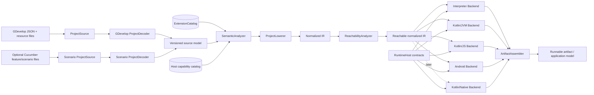

# Portable architecture and language-neutral model

> **Status: proposed.** This document defines the conceptual boundary for the
> portable implementation. It intentionally uses language-neutral records,
> tagged unions, and interfaces. Target-language classes must implement this
> model rather than allowing Kotlin, GDevelop C++, GDJS globals, or a particular
> renderer to define it accidentally.

The current pipeline and extension traces are documented in
[`gdevelop-pipeline.md`](gdevelop-pipeline.md) and
[`extensions-and-types.md`](extensions-and-types.md). This proposal preserves
their observed semantics while making source decoding, analysis, execution, and
packaging independently replaceable.

## Goals and non-goals

The architecture must:

* accept GDevelop projects without making `gd::Project` the portable model;
* optionally accept scenario/Cucumber input through a separate front end;
* resolve extension-defined concepts without assuming that an instruction is a
  runtime method call;
* support both generated and interpreted execution;
* make source provenance, compatibility versions, target capabilities, and
  deterministic ordering explicit; and
* share semantics across JVM, JavaScript, Android, and a later Native target.

It does not promise that arbitrary JavaScript, PixiJS/Three.js implementations,
or browser APIs become portable automatically. Those require a compatible host,
an extension-specific lowering, or a target implementation.

## End-to-end architecture



Both front ends produce the same versioned source model and normalized IR. A
scenario decoder may construct scenes, events, variables, and extension calls
from steps, but it receives no privileged execution path: normal name
resolution, diagnostics, lowering, reachability, and backend rules still apply.

## Pipeline boundaries

Each boundary consumes immutable values and returns a new value plus diagnostics.
No stage may depend on mutation performed by a later stage.

### 1. `ProjectSource`

Reads source documents and resources, without interpreting their domain meaning.
It resolves project-relative identifiers, canonicalizes paths/URIs, records
content hashes and media types, and returns bytes or text with provenance.
Implementations include local directory, archive, cloud/document store, and
scenario sources. Access is capability-based; decoders never open arbitrary
files directly.

**Output:** `SourceBundle(rootDocument, documents, resources, sourceRevision)`.
Duplicate logical names, missing content, path traversal, encoding failures, and
unavailable resources are source diagnostics.

### 2. `ProjectDecoder`

Converts a `SourceBundle` into a **versioned source model**. The GDevelop decoder
accepts current and supported legacy JSON shapes, preserves unknown members, and
records the exact source location of every decoded construct. A Cucumber decoder
maps feature/scenario constructs into equivalent source declarations and event
blocks while retaining step locations.

Decoding establishes syntax and shape, not semantic validity. An unknown
instruction type or object reference is therefore representable and diagnosed
later. Migrations are explicit, ordered transforms between source-model versions;
they never silently rewrite the original source bundle.

### 3. `ExtensionCatalog`

Resolves immutable descriptors for instructions, expressions, objects,
behaviors, effects, properties, parameters, value types, lifecycle hooks, and
extension dependencies. Lookup uses stable `ExtensionIdentity` and qualified
member identity, not translated labels or runtime class names. Catalog snapshots
are versioned and deterministic: analysis records the exact resolved extension
versions and descriptor digests.

Catalog providers may decode declarative packages, adapt a legacy
`gd.PlatformExtension`, synthesize descriptors from an events-based extension,
or provide built-ins. Conflicting identities are errors unless an explicit
selection/compatibility rule chooses one.

### 4. `SemanticAnalyzer`

Resolves scene, object, group, behavior, function, variable, resource, and
extension names; checks expression and parameter value types; verifies object
and behavior constraints; validates dependency versions and host capabilities;
and reports structured diagnostics. It also annotates calls with resolved
descriptor identities and inserts only compatibility conversions defined by the
value-type catalog.

The analyzer returns `AnalyzedProject(sourceModel, symbolTable, resolutions,
diagnostics, catalogSnapshot)`. It does not emit target code. Fatal diagnostics
prevent lowering; warnings and compatibility notes remain attached to the
affected source locations.

### 5. `ProjectLowerer`

Transforms a successfully analyzed project into normalized IR (NIR) independent
of GDevelop C++ objects, JSON layout, generated JavaScript names, and target
runtime classes. It makes implicit semantics explicit: selection sets, trigger
state, lexical event nesting, variable scopes, behavior receivers, lifecycle
entry points, ordered side effects, and deletion-safe iteration.

An extension call lowers according to its **compile-time lowering contract**. It
may become a primitive NIR operation, a host-service operation, a call to an
extension runtime entry point, an interpreter intrinsic, or a target-restricted
opaque operation. There is no default rule that converts metadata function names
to runtime method calls.

### 6. `ReachabilityAnalyzer`

Starting from the first scene, configured previews/entry points, lifecycle hooks,
and externally callable functions, computes required scenes, event functions,
custom objects and behaviors, extension members, runtime implementations,
resources, and host capabilities. It follows instruction/expression descriptors,
extension dependencies, object defaults, effects, scene transitions, dynamically
declared roots, and conservative edges for opaque code.

The result retains stable source ordering while marking why each item is
reachable. Unknown dynamic access either keeps the declared compatibility unit
or produces a target error; it must not cause an unsound deletion.

### 7. `Backend`

Lowers reachable NIR to a target product: target source, bytecode/compiler
inputs, or an interpreter program model. Backends declare supported NIR version,
host capabilities, extension runtime formats, and diagnostic limitations. They
must preserve NIR ordering and lifecycle semantics, but may optimize when the
observable result is unchanged.

The interpreter backend produces immutable executable tables/opcodes. Generated
backends may produce Kotlin/JVM, Kotlin/JS, Android-specific source/assets, and
later Kotlin/Native inputs. Backend output is not yet a distributable artifact.

### 8. `ArtifactAssembler`

Combines backend output with selected runtime libraries, extension runtime
implementations, resources, manifests, icons, dependency lock data, permissions,
and target configuration. It validates hashes and deterministic ordering,
materializes source-file `first`/`last` compatibility where required, and emits
an artifact manifest recording all inputs.

Compilation, bundling, signing, and packaging are assembler strategies. They may
invoke target tools, but must not redo semantic resolution or infer missing
extension dependencies.

### 9. `RuntimeHost`

Supplies the executable program with lifecycle scheduling, scenes, objects,
behaviors, variables, input, time, storage, rendering, audio, resources, logging,
networking, and platform services. Services are narrow interfaces with explicit
availability, threading, determinism, and disposal rules. A backend binds NIR
operations and extension runtime contracts to these interfaces.

The host owns target facilities; the portable program owns game state and
semantic ordering. An extension receives only declared capabilities. A browser
global, Android `Context`, graphics engine object, or filesystem handle must not
leak into portable NIR.

## Immutable conceptual data model

The following notation is descriptive, not Kotlin: `record` is an immutable
product, `union` is a closed tagged choice for a particular model version,
`List<T>` is ordered, `Map<K,V>` has a specified stable key order, and `Id<T>` is
an opaque identity rather than a display string.

### Provenance, identities, and diagnostics

```text
record SourceLocation {
  sourceId: SourceId
  jsonPointerOrScenarioPath: String
  range: optional SourceRange       // byte/line/column start and end
  generatedFrom: optional SourceLocation
}

record Diagnostic {
  code: String                      // stable machine-readable code
  severity: Error | Warning | Info
  message: String
  primary: SourceLocation
  related: List<RelatedLocation>
  notes: List<String>
  suggestedFixes: List<SourceEdit>
}

record ExtensionIdentity { namespace: String; version: Version; origin: String }
record QualifiedMemberId { extension: ExtensionIdentity; path: List<String> }
```

Every source declaration and operation has `id` and `location`. Lowered nodes
also keep an `origins: NonEmptyList<SourceLocation>` so diagnostics from analysis,
backends, runtime traps, and scenario assertions can point to JSON pointers or
feature/step ranges.

### Values, variables, and resources

```text
union ValueTypeRef = BuiltinValueType(name) | ExtensionValueType(memberId)
union ConstantValue = Null | Boolean | Number | String | StructuredValue
record VariableDecl { id; name; scope: Global | Scene | Object; initialValue; location }
record VariableRef { declarationId; accessPath: List<Expression>; location }
record ResourceDecl { id; name; kind; sourceId; metadata; contentHash; location }
record ExtensionDependency { identityRange; optional; reason; sourceOrder; location }
```

Variables preserve scope and hierarchical access rather than collapsing all
names into strings. Resources distinguish logical identity from storage URI and
content hash. Unknown metadata fields survive source-model round trips even when
they are not copied into normalized runtime data.

### Expressions and instructions

```text
union Expression =
  Constant(value, valueType, location)
  | VariableRead(ref, valueType, location)
  | CallExpression(descriptorId, arguments: List<Argument>, valueType, location)
  | Operator(operatorId, operands: List<Expression>, valueType, location)

record Argument {
  parameterId: ParameterDescriptorId
  sourcePosition: Integer
  value: Expression | ObjectSelectionRef | BehaviorRef | ResourceRef
  location: SourceLocation
}

record Instruction {
  id: InstructionId
  descriptorId: QualifiedMemberId
  arguments: List<Argument>
  nestedInstructions: List<Instruction>
  location: SourceLocation
}

record Condition {
  instruction: Instruction
  inverted: Boolean
  triggerMode: Continuous | Once | Trigger
  location: SourceLocation
}
```

Arguments retain source position even after being bound to descriptor parameter
IDs. This permits exact compatibility diagnostics for positional GDevelop calls.
`nestedInstructions` represents instruction-owned subinstructions, not event
children.

### Events and lifecycle

```text
union EventBlock =
  StandardEvent(conditions, actions, children, disabled, location)
  | ForEachEvent(selection, actions, children, location)
  | RepeatEvent(count, actions, children, location)
  | WhileEvent(conditions, actions, children, location)
  | LinkEvent(targetEventList, location)
  | CommentEvent(text, location)
  | OpaqueSourceEvent(language, source, declaredEffects, location)

record EventList { id; parameters; localVariables; blocks: List<EventBlock>; location }
record LifecycleHook { phase: LifecyclePhase; body: EventList; sourceOrder; location }
```

`LifecyclePhase` includes application start/stop, scene load/pre-events/
post-events/pause/resume/unloading, object create/delete, behavior activate/
deactivate, and render/effect phases. Backends need not expose all phases to user
extensions, but they must not alias phases whose timing differs.

### Objects, behaviors, effects, and scenes

```text
record ObjectDecl {
  id; name; objectType: QualifiedMemberId; configuration
  variables: List<VariableDecl>; behaviors: List<BehaviorAttachment>
  effects: List<EffectAttachment>; location
}

record BehaviorDecl {
  id; memberId: QualifiedMemberId; requiredObjectType
  properties; sharedProperties; functions; lifecycleHooks; location
}

record BehaviorAttachment {
  id; name; behaviorType: QualifiedMemberId; ownerObjectId
  enabledInitially; properties; location
}

record EffectDecl { id; memberId; propertyDescriptors; requiredCapabilities; location }
record ObjectGroupDecl { id; name; memberObjectIds: List<ObjectDeclId>; location }

record SceneDecl {
  id; name; variables: List<VariableDecl>; objects: List<ObjectDecl>
  objectGroups: List<ObjectGroupDecl>; instances: List<InstanceDecl>
  layers; eventList: EventList; lifecycleHooks: List<LifecycleHook>
  sourceOrder; location
}

record ProjectModel {
  modelVersion; projectIdentity; globalVariables; globalObjects; globalGroups
  scenes: List<SceneDecl>; functions; extensions; resources
  firstSceneId; sourceCompatibility; unknownSourceFields
}
```

Configuration/property values are typed immutable trees associated with schema
descriptors, plus a lossless unknown-field bag in the source model. A behavior
attachment always identifies its owning object. A scene's lists and
`sourceOrder` are semantic; unordered host maps cannot determine execution.

## Extension contracts

An extension package may supply any applicable contracts below. They are
separate artifacts joined by stable identity and compatibility ranges.

| Contract | Responsibility | Must not assume |
|---|---|---|
| **Metadata contract** | Descriptors, display metadata, parameter/value types, properties, dependencies, deprecations, capabilities, and compatibility aliases. | That a function name is executable, that the editor and runtime share a language, or that labels are identities. |
| **Compile-time lowering contract** | Validated transformation from a resolved extension operation into NIR, host operations, intrinsics, runtime entry-point calls, or a declared opaque operation. Reports unsupported target/capability diagnostics. | That every instruction maps one-to-one to a callable method; a condition may transform selection state, an expression may be intrinsic, and an action may expand to multiple operations. |
| **Runtime implementation contract** | Factories/entry points and lifecycle behavior for a declared runtime format and target, against specific `RuntimeHost` capabilities. | Access to undeclared globals or services; availability on every target; metadata object layout. |
| **Serialization contract** | Versioned decoding, defaults, migrations, unknown-field handling, and encoding for object/behavior/effect configuration and shared data. | That runtime fields equal editor labels, or that changing a default migrates persisted data. |
| **Host capability contract** | Named, versioned requirements such as 2D/3D rendering, shaders, audio, input, storage, network, browser DOM, sensors, or native services. | That capability presence implies a particular implementation such as PixiJS, Three.js, or Android framework classes. |

A catalog entry is valid without a runtime method when its lowering is intrinsic
(for example selection or variable manipulation), when it expands into other
NIR, or when it is editor-only. Conversely, a runtime implementation is not
discoverable until matching metadata and serialization contracts identify how a
project refers to it.

## Semantic invariants inherited from GDevelop

These are compatibility requirements for analysis, NIR, interpreter, and every
generated backend—not optional optimizer details.

### Object picking and conditions

* Each event evaluates against ordered object-selection sets scoped to the event
  and its children. A condition may both return truth and filter one or more
  selections; inversion must preserve GDevelop's selection semantics rather than
  merely negate a final Boolean.
* Actions consume the selection produced by all preceding conditions. Child
  events inherit the parent's selection, then refine a child-local view. Sibling
  events start from the selection state defined by their enclosing event rules,
  not mutations leaked from a previous sibling.
* Object groups operate as typed unions of their members. Pairing/multi-object
  conditions and creation must retain per-type identity and deterministic order.

### Once, triggers, and event state

* “Once” and trigger conditions are stateful per event identity and appropriate
  runtime context. They fire on the defined transition/frame and reset according
  to GDevelop rules; they are not compile-time deduplication or global flags.
* Stable event IDs survive harmless formatting and backend changes so hot reload
  and persisted trigger state do not become dependent on generated line numbers.

### Nesting and deterministic ordering

* Event blocks, conditions, actions, subinstructions, child events, functions,
  and lifecycle callbacks execute in deterministic source/catalog order unless a
  construct explicitly defines another order. Backends may not depend on hash-map
  iteration.
* Conditions execute left-to-right with their selection side effects. Actions
  execute after successful conditions and before child events. Event links and
  function calls establish an explicit frame for parameters, local variables,
  selection state, and recursion diagnostics.

### Variables and names

* Global, scene, object, function-parameter, and local event variables are
  distinct scopes with specified lookup and lifetime. Hierarchical variable
  paths and dynamic child expressions must not be flattened into ambiguous names.
* Scene/global objects and object groups resolve by the compatibility precedence
  rules of the source model. Ambiguity is diagnosed rather than resolved through
  host collection order.

### Behavior ownership and lifecycle

* A behavior instance belongs to exactly one runtime object; shared behavior data
  belongs to the declared scene/container scope. Object and behavior parameters
  are validated together, and a behavior call cannot be rebound to an unrelated
  object merely because names match.
* Application/scene loading, object construction and `onCreated`, behavior
  construction/activation, pre-events, generated events, post-events, rendering,
  pause/resume, unloading, deletion, and disposal retain their defined relative
  order. Extension callbacks are ordered deterministically within their phase.

### Mutation and deletion during iteration

* Creation and deletion during an event must follow GDevelop visibility rules.
  Iteration uses stable handles or snapshots so deletion of the current or another
  object neither skips an unrelated survivor nor dereferences freed storage.
* A deleted object is excluded from subsequent applicable selections and actions,
  but physical reclamation may be deferred until no event frame holds a handle.
  Deletion callbacks fire exactly once in the correct lifecycle phase.
* Backends must preserve these observations even when their native collections,
  garbage collectors, or render threads behave differently.

## Cross-cutting rules

### Versioning

Source model, normalized IR, extension contracts, host capabilities, and artifact
manifest have independent versions. Each boundary checks a supported version
range and emits a diagnostic instead of guessing. Cache keys include source
hashes, catalog snapshot, NIR/backend versions, target, and capability versions.

### Determinism and concurrency

Analysis and asset processing may run concurrently, but their outputs are sorted
by explicit source/dependency order before lowering. Runtime concurrency enters
through host services and rejoins the deterministic event loop through queued,
ordered completions. Wall-clock time, random values, and input are host-provided
so tests and scenario execution can substitute deterministic implementations.

### Failure model

All pre-runtime stages return structured diagnostics. Runtime failures use a
portable trap containing diagnostic code, source origins, scene/event/object
context, and a host cause. A backend must not reduce an unresolved extension or
missing capability to a null method call.

## Initial decision records

Material compatibility assumptions are recorded separately:

* [ADR-0001: Portable layer owns the normalized IR](decisions/0001-ir-ownership.md)
* [ADR-0002: Extension identity is explicit and versioned](decisions/0002-extension-identity.md)
* [ADR-0003: Runtime facilities cross a capability-based host boundary](decisions/0003-runtime-host-boundary.md)
* [ADR-0004: Support interpreter and generated execution from one IR](decisions/0004-generated-code-vs-interpreter.md)
